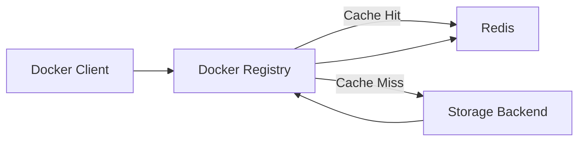

# How to Set Up Docker Registry with Redis Cache

Author: [nawazdhandala](https://github.com/nawazdhandala)

Tags: Docker, Docker Registry, Redis, Caching, Performance, Self-Hosted, Container Registry

Description: Speed up your private Docker registry by adding a Redis caching layer for faster image pulls and reduced storage backend load.

---

A Docker registry serves image manifests and layers to clients during pull operations. When multiple developers or CI runners pull the same images repeatedly, the registry hits its storage backend for every request. Adding a Redis cache in front of the storage layer dramatically reduces latency and backend load. Manifest lookups, layer existence checks, and metadata queries all benefit from caching.

This guide shows you how to configure a Docker registry with Redis caching using Docker Compose, including tuning options for different workloads.

## Why Cache the Registry?

Every `docker pull` triggers multiple API calls to the registry. First, it fetches the manifest to determine which layers make up the image. Then it checks each layer, downloading only the ones not already present locally. For a registry serving dozens of CI pipelines, that adds up fast.

Redis caching helps in three key areas:

1. **Manifest caching** - The most frequently accessed resource. Caching manifests means the registry does not hit the storage backend for every pull.
2. **Blob metadata caching** - Layer existence checks become near-instant.
3. **Descriptor caching** - Internal registry lookups for tags and digests resolve faster.

## Architecture



The registry checks Redis first for any cacheable data. On a hit, it returns the cached result immediately. On a miss, it fetches from the storage backend and populates the cache for future requests.

## Docker Compose Configuration

```yaml
# Docker Registry with Redis cache
version: "3.8"

services:
  # Docker Registry with Redis caching enabled
  registry:
    image: registry:2
    ports:
      - "5000:5000"
    environment:
      # Enable Redis caching for blob descriptors
      REGISTRY_STORAGE_CACHE_BLOBDESCRIPTOR: redis
      # Redis connection settings
      REGISTRY_REDIS_ADDR: redis:6379
      REGISTRY_REDIS_DB: 0
      REGISTRY_REDIS_DIALTIMEOUT: 10ms
      REGISTRY_REDIS_READTIMEOUT: 10ms
      REGISTRY_REDIS_WRITETIMEOUT: 10ms
      # Pool settings for concurrent connections
      REGISTRY_REDIS_POOL_MAXIDLE: 16
      REGISTRY_REDIS_POOL_MAXACTIVE: 64
      REGISTRY_REDIS_POOL_IDLETIMEOUT: 300s
      # Storage settings
      REGISTRY_STORAGE_DELETE_ENABLED: "true"
      REGISTRY_STORAGE_FILESYSTEM_ROOTDIRECTORY: /var/lib/registry
    volumes:
      - registry-data:/var/lib/registry
    depends_on:
      redis:
        condition: service_healthy
    restart: unless-stopped
    networks:
      - registry-network

  # Redis - caching layer for the registry
  redis:
    image: redis:7-alpine
    volumes:
      - redis-data:/data
    healthcheck:
      test: ["CMD", "redis-cli", "ping"]
      interval: 10s
      timeout: 5s
      retries: 5
    command: >
      redis-server
      --maxmemory 256mb
      --maxmemory-policy allkeys-lru
      --appendonly no
      --save ""
      --tcp-keepalive 300
    restart: unless-stopped
    networks:
      - registry-network

volumes:
  registry-data:
  redis-data:

networks:
  registry-network:
    driver: bridge
```

Note the Redis command line arguments. Since this is a pure cache (the registry can always re-fetch from storage), we disable persistence with `--appendonly no` and `--save ""`. This makes Redis faster because it never writes to disk. The `allkeys-lru` eviction policy automatically removes the least recently used keys when memory fills up.

## Understanding the Registry Cache Configuration

The registry cache works at the blob descriptor level. Let's break down the key settings.

### Blob Descriptor Cache

```yaml
# This tells the registry to cache blob descriptors in Redis
REGISTRY_STORAGE_CACHE_BLOBDESCRIPTOR: redis
```

A blob descriptor contains metadata about a layer or manifest, including its digest, size, and media type. Caching these means the registry does not need to stat the storage backend for every layer check.

### Connection Pool

```yaml
# Connection pool prevents creating new connections for every request
REGISTRY_REDIS_POOL_MAXIDLE: 16
REGISTRY_REDIS_POOL_MAXACTIVE: 64
REGISTRY_REDIS_POOL_IDLETIMEOUT: 300s
```

The pool keeps connections open and ready. `MAXIDLE` is the number of idle connections to keep, and `MAXACTIVE` is the maximum total connections. For a registry serving 10-20 concurrent pulls, these defaults work well.

### Timeout Settings

```yaml
# Low timeouts ensure the registry falls back to storage quickly
REGISTRY_REDIS_DIALTIMEOUT: 10ms
REGISTRY_REDIS_READTIMEOUT: 10ms
REGISTRY_REDIS_WRITETIMEOUT: 10ms
```

Keep these timeouts low. If Redis is down or slow, the registry should fall back to reading from storage directly rather than waiting. A 10ms timeout is generous for a local Redis instance.

## Using a Configuration File

For more advanced setups, use a registry configuration file instead of environment variables:

```yaml
# config.yml - Registry configuration with Redis cache
version: 0.1

storage:
  filesystem:
    rootdirectory: /var/lib/registry
  cache:
    blobdescriptor: redis
  delete:
    enabled: true

redis:
  addr: redis:6379
  db: 0
  dialtimeout: 10ms
  readtimeout: 10ms
  writetimeout: 10ms
  pool:
    maxidle: 16
    maxactive: 64
    idletimeout: 300s

http:
  addr: :5000
  headers:
    X-Content-Type-Options: [nosniff]

health:
  storagedriver:
    enabled: true
    interval: 10s
    threshold: 3
```

Mount it in the compose file:

```yaml
# Mount the config file instead of using environment variables
registry:
  image: registry:2
  ports:
    - "5000:5000"
  volumes:
    - ./config.yml:/etc/docker/registry/config.yml:ro
    - registry-data:/var/lib/registry
```

## Testing the Cache

Push an image and then pull it to verify caching works:

```bash
# Tag and push an image to the registry
docker tag alpine:latest localhost:5000/alpine:latest
docker push localhost:5000/alpine:latest

# Remove the local image
docker rmi localhost:5000/alpine:latest

# Pull it back - this should be faster on the second pull
time docker pull localhost:5000/alpine:latest
```

Inspect what Redis is caching:

```bash
# Connect to Redis and check cached keys
docker compose exec redis redis-cli

# Inside redis-cli:
# List all keys (use with caution on large registries)
KEYS *

# Check memory usage
INFO memory

# Count the number of cached keys
DBSIZE
```

## Monitoring Cache Performance

Check Redis hit rates to see how effective the cache is:

```bash
# Get Redis statistics including hit/miss ratio
docker compose exec redis redis-cli INFO stats | grep keyspace
```

The `keyspace_hits` and `keyspace_misses` values tell you your cache hit ratio. A healthy registry cache should have a hit ratio above 80% after warming up.

```bash
# Calculate hit ratio
docker compose exec redis redis-cli INFO stats | grep -E "keyspace_hits|keyspace_misses"
```

## Tuning Redis Memory

The right amount of memory depends on how many unique images your registry serves.

```yaml
# Small registry (< 100 images): 64MB is plenty
command: redis-server --maxmemory 64mb --maxmemory-policy allkeys-lru

# Medium registry (100-1000 images): 256MB
command: redis-server --maxmemory 256mb --maxmemory-policy allkeys-lru

# Large registry (1000+ images): 512MB to 1GB
command: redis-server --maxmemory 1gb --maxmemory-policy allkeys-lru
```

The LRU eviction policy means Redis automatically drops the least recently used keys when it hits the memory limit. This is exactly what you want for a cache: keep the hot data, evict the cold data.

## Adding Redis Authentication

For production, add a password to Redis:

```yaml
# Redis with password authentication
redis:
  image: redis:7-alpine
  command: redis-server --requirepass your-redis-password --maxmemory 256mb --maxmemory-policy allkeys-lru

# Registry with Redis password
registry:
  environment:
    REGISTRY_REDIS_PASSWORD: your-redis-password
```

## High Availability with Redis Sentinel

For production registries that need high availability, consider Redis Sentinel:

```yaml
# Registry configured for Redis Sentinel
registry:
  environment:
    REGISTRY_REDIS_SENTINEL_MASTERNAME: mymaster
    REGISTRY_REDIS_SENTINEL_ADDRS: "sentinel1:26379,sentinel2:26379,sentinel3:26379"
```

## Troubleshooting

```bash
# Test Redis connectivity from the registry container
docker compose exec registry sh -c "nc -z redis 6379 && echo OK || echo FAIL"

# Check registry logs for Redis connection errors
docker compose logs registry | grep -i redis

# Monitor Redis in real-time
docker compose exec redis redis-cli monitor

# Flush the cache if you suspect stale data
docker compose exec redis redis-cli FLUSHDB
```

## Summary

Adding Redis to your Docker registry is one of the simplest performance improvements you can make. The configuration is minimal, Redis runs efficiently with just a few hundred megabytes of memory, and the improvement is immediate. Repeated pulls become faster, storage backend load drops, and CI pipelines that pull the same base images hundreds of times a day will see a noticeable speedup.
