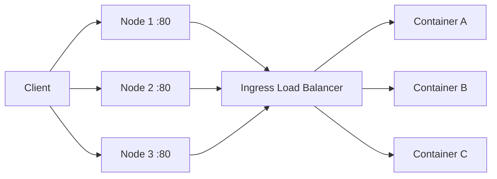

# How to Set Up Docker Swarm Ingress Networking

Author: [nawazdhandala](https://github.com/nawazdhandala)

Tags: Docker, Docker Swarm, Ingress, Networking, Load Balancing, Routing Mesh, DevOps

Description: Configure Docker Swarm ingress networking with the routing mesh, overlay networks, and external load balancers.

---

Docker Swarm's ingress networking is what makes services accessible from outside the cluster. When you publish a port on a Swarm service, every node in the cluster listens on that port and routes traffic to a healthy container, even if the container is running on a different node. This built-in routing mesh means you can point a load balancer at any node and traffic reaches the right place.

This guide explains how the ingress network works, how to configure it for production, and when to bypass it with host mode publishing.

## How the Routing Mesh Works

When you create a service with a published port, Swarm does three things:

1. Creates an ingress overlay network that spans all nodes
2. Assigns a virtual IP (VIP) to the service on that network
3. Configures each node to listen on the published port and forward traffic through the ingress network to a healthy container

The critical insight is that every node participates, not just the nodes running your containers. If your service has 3 replicas across a 5-node cluster, all 5 nodes accept traffic on the published port and route it to one of the 3 containers.



The internal load balancing uses IPVS (IP Virtual Server) for efficient layer-4 traffic distribution.

## Creating Services with Published Ports

The basic syntax publishes a port using the ingress routing mesh:

```bash
# Create a service with an ingress-published port
docker service create \
  --name webapp \
  --replicas 3 \
  --publish published=80,target=8080 \
  myapp:v1.0
```

This maps port 80 on every node to port 8080 inside the containers. Test it by hitting any node's IP on port 80:

```bash
# Test from any machine - all nodes respond
curl http://10.0.1.10:80
curl http://10.0.1.11:80
curl http://10.0.1.12:80
```

All three requests reach a container, regardless of which node runs it.

## Inspecting the Ingress Network

The ingress network is created automatically when you initialize a swarm. Inspect it to see its configuration:

```bash
# View the default ingress network details
docker network inspect ingress
```

The output shows all nodes connected to the network and the subnet range used for container-to-container communication.

## Using Custom Overlay Networks

While the ingress network handles external traffic, services should communicate with each other over custom overlay networks. This provides isolation between different application stacks.

```bash
# Create a custom overlay network for your application
docker network create \
  --driver overlay \
  --attachable \
  --subnet 10.10.0.0/24 \
  app-network
```

The `--attachable` flag allows standalone containers to join the network, which is useful for debugging.

Deploy services on the custom network:

```bash
# Create a backend service on the custom network (no published port)
docker service create \
  --name api \
  --replicas 3 \
  --network app-network \
  myapi:v1.0

# Create a frontend that connects to the backend through the overlay
docker service create \
  --name frontend \
  --replicas 2 \
  --network app-network \
  --publish published=80,target=3000 \
  myfrontend:v1.0
```

The `api` service has no published port - it is only reachable from other services on `app-network`. The `frontend` service is exposed via the ingress mesh on port 80 and can reach the API using the DNS name `api`.

## Service Discovery on Overlay Networks

Swarm provides built-in DNS-based service discovery. Every service gets a DNS entry matching its name, resolving to the service's virtual IP.

```bash
# From inside a container on app-network, these DNS lookups work
nslookup api
# Returns the VIP for the api service

nslookup tasks.api
# Returns individual container IPs (useful for debugging)
```

The VIP approach means connections are load-balanced at the network level. When a container connects to `api:8080`, the traffic is distributed across all healthy replicas of the api service.

## Host Mode Publishing

Sometimes you need to bypass the routing mesh. Host mode publishing binds the container port directly to the host's port, without the ingress overlay.

```bash
# Publish port in host mode - bypasses the routing mesh
docker service create \
  --name webapp \
  --replicas 3 \
  --publish published=80,target=8080,mode=host \
  myapp:v1.0
```

With host mode:

- Only nodes running a container listen on port 80
- There is no internal load balancing - traffic goes directly to the local container
- You cannot run more replicas than nodes (each host port can only be bound once)
- You get better performance since there is one less hop

Host mode makes sense when:

- You need to preserve the client's source IP address (the routing mesh performs SNAT)
- You want an external load balancer to health-check individual nodes
- Low latency is critical and you want to avoid the overlay network hop

When using host mode, set a placement constraint to ensure only one replica per node:

```bash
# Deploy with host mode and a global constraint
docker service create \
  --name webapp \
  --mode global \
  --publish published=80,target=8080,mode=host \
  myapp:v1.0
```

The `--mode global` option runs exactly one replica on every node.

## Setting Up an External Load Balancer

For production, place an external load balancer in front of your Swarm nodes. The load balancer health-checks each node and distributes traffic only to healthy ones.

Here is an Nginx configuration as an external load balancer:

```nginx
# /etc/nginx/nginx.conf - External load balancer for Docker Swarm
upstream swarm_nodes {
    # List all Swarm nodes
    server 10.0.1.10:80;
    server 10.0.1.11:80;
    server 10.0.1.12:80;
    server 10.0.1.20:80;
    server 10.0.1.21:80;
}

server {
    listen 80;
    server_name myapp.example.com;

    location / {
        proxy_pass http://swarm_nodes;
        proxy_set_header Host $host;
        proxy_set_header X-Real-IP $remote_addr;
        proxy_set_header X-Forwarded-For $proxy_add_x_forwarded_for;
        proxy_set_header X-Forwarded-Proto $scheme;
    }
}
```

With the routing mesh, you can list all nodes as upstream servers. Even nodes not running the service will correctly route the traffic.

For HAProxy:

```haproxy
# /etc/haproxy/haproxy.cfg - HAProxy configuration for Swarm
frontend http_front
    bind *:80
    default_backend swarm_backend

backend swarm_backend
    balance roundrobin
    option httpchk GET /health
    http-check expect status 200
    server node1 10.0.1.10:80 check
    server node2 10.0.1.11:80 check
    server node3 10.0.1.12:80 check
    server node4 10.0.1.20:80 check
    server node5 10.0.1.21:80 check
```

## Encrypted Overlay Networks

By default, overlay network traffic between nodes is not encrypted. For sensitive data, enable encryption:

```bash
# Create an encrypted overlay network
docker network create \
  --driver overlay \
  --opt encrypted \
  secure-network
```

This adds IPsec encryption to all traffic between nodes on this network. There is a performance cost, roughly 10-20% throughput reduction, so only enable it when needed.

## Troubleshooting Ingress Networking

Common issues and how to diagnose them:

```bash
# Check if the ingress network is healthy
docker network inspect ingress

# Verify published ports are configured correctly
docker service inspect webapp --format '{{json .Endpoint.Ports}}' | jq .

# Test connectivity from inside a container
docker run --rm --network app-network alpine ping -c 3 api

# Check if iptables rules are set correctly for the published port
sudo iptables -t nat -L -n | grep 80

# Verify the IPVS load balancer entries
sudo ipvsadm -Ln
```

**Port conflicts**: If another process on a node is using port 80, the service creation succeeds but traffic to that node fails. Check with `ss -tlnp | grep :80`.

**DNS resolution failures**: If a service cannot resolve another service's name, verify both services are on the same overlay network.

**Stale ingress network**: Occasionally the ingress network gets corrupted. Recreate it:

```bash
# Remove and recreate the ingress network (causes brief disruption)
docker network rm ingress
docker network create \
  --driver overlay \
  --ingress \
  --subnet 10.0.0.0/24 \
  --gateway 10.0.0.1 \
  ingress
```

## Conclusion

Docker Swarm's ingress networking provides a powerful routing mesh that distributes traffic across your cluster with minimal configuration. Publishing a port makes your service reachable through any node, which simplifies external load balancer configuration. Custom overlay networks provide isolation between application stacks, and built-in DNS-based service discovery eliminates the need for external service registries. Use the routing mesh for simplicity, switch to host mode when you need source IP preservation or minimal latency, and always place an external load balancer in front of your Swarm for production deployments.
