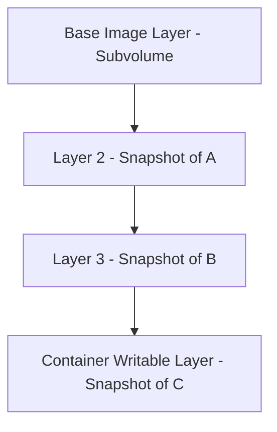

# How to Set Up Docker with Btrfs Storage Driver

Author: [nawazdhandala](https://github.com/nawazdhandala)

Tags: Docker, Btrfs, Storage Driver, DevOps, Linux, Filesystem

Description: Step-by-step instructions for configuring Docker with the Btrfs storage driver for efficient copy-on-write container storage.

---

Btrfs (B-tree filesystem) is a modern copy-on-write filesystem for Linux that pairs well with Docker's layered storage model. When Docker uses the Btrfs storage driver, each image layer and container layer gets its own Btrfs subvolume. This makes snapshotting fast, space efficient, and well suited for container workloads.

This guide covers how to prepare a Btrfs filesystem, configure Docker to use the Btrfs storage driver, and optimize the setup for reliable container operations.

## Why Choose Btrfs for Docker?

Btrfs has been in the Linux kernel since version 3.10 and offers features that align naturally with container storage:

- **Copy-on-write**: New container layers only consume space for the data that has actually changed, not for an entire copy
- **Subvolumes**: Each Docker layer becomes a Btrfs subvolume, giving clean isolation between layers
- **Snapshots**: Creating a new container from an image is essentially a Btrfs snapshot operation, which is nearly instantaneous
- **Built-in compression**: Transparent compression with zstd or lzo saves disk space
- **Online defragmentation**: You can defragment the filesystem without unmounting
- **Checksumming**: Btrfs checksums all data to detect corruption

Compared to the default overlay2 driver, Btrfs can offer better performance for workloads that involve many small writes, particularly databases running inside containers. However, overlay2 is generally simpler to set up and has broader compatibility.

## Prerequisites

You will need:

- A Linux system running a distribution that supports Btrfs (Ubuntu, Fedora, openSUSE, Arch)
- A dedicated partition or disk for the Btrfs filesystem
- Docker Engine installed
- Root or sudo access

## Step 1: Install Btrfs Tools

Most modern Linux distributions include Btrfs support in the kernel, but you need the userspace tools.

Install Btrfs utilities on Ubuntu or Debian:

```bash
# Install Btrfs filesystem tools
sudo apt update
sudo apt install -y btrfs-progs
```

On Fedora or CentOS:

```bash
# Install Btrfs tools on Fedora/CentOS
sudo dnf install -y btrfs-progs
```

Verify that Btrfs is available:

```bash
# Check that the btrfs command is installed
btrfs --version
```

## Step 2: Create a Btrfs Filesystem

Format your dedicated disk or partition with Btrfs. Replace `/dev/sdb` with your actual device.

```bash
# Format the disk with Btrfs
sudo mkfs.btrfs -f /dev/sdb
```

The `-f` flag forces formatting, overwriting any existing filesystem. Be careful to specify the correct device.

Create a mount point and mount the filesystem:

```bash
# Create the mount point
sudo mkdir -p /var/lib/docker

# Mount the Btrfs filesystem at Docker's data directory
sudo mount /dev/sdb /var/lib/docker
```

Add an entry to `/etc/fstab` so the filesystem mounts on boot:

```bash
# Get the UUID of the Btrfs filesystem
sudo blkid /dev/sdb

# Add to fstab (replace UUID with your value)
echo "UUID=your-uuid-here /var/lib/docker btrfs defaults 0 0" | sudo tee -a /etc/fstab
```

## Step 3: Stop Docker and Migrate Data

If Docker is already running with a different storage driver, stop it and back up your data.

```bash
# Stop Docker
sudo systemctl stop docker
sudo systemctl stop containerd
```

If you have existing Docker data you want to preserve, copy it before mounting the new filesystem:

```bash
# Back up existing Docker data (do this BEFORE mounting Btrfs at /var/lib/docker)
sudo cp -au /var/lib/docker /var/lib/docker.backup

# Mount the Btrfs filesystem
sudo mount /dev/sdb /var/lib/docker

# Copy the backup into the new filesystem
sudo rsync -aP /var/lib/docker.backup/ /var/lib/docker/
```

Note that changing storage drivers means Docker cannot read images and containers created with the previous driver. You will need to pull images again and recreate containers.

## Step 4: Configure Docker to Use Btrfs

Edit the Docker daemon configuration to specify the Btrfs storage driver:

```bash
# Create or update the daemon configuration
sudo tee /etc/docker/daemon.json <<EOF
{
  "storage-driver": "btrfs"
}
EOF
```

If you already have a `daemon.json` with other settings, add `"storage-driver": "btrfs"` to the existing JSON object.

## Step 5: Start Docker and Verify

Start Docker and confirm the storage driver:

```bash
# Start Docker
sudo systemctl start docker

# Verify the storage driver
docker info | grep "Storage Driver"
```

Expected output:

```
 Storage Driver: btrfs
```

Test with a container:

```bash
# Run a quick test
docker run --rm alpine echo "Btrfs storage driver is working"
```

Check that Docker created Btrfs subvolumes:

```bash
# List Btrfs subvolumes under Docker's directory
sudo btrfs subvolume list /var/lib/docker
```

You should see subvolumes for each image layer that was pulled.

## Understanding How Docker Uses Btrfs

When you pull an image, Docker creates a Btrfs subvolume for each layer. When you start a container, Docker creates a snapshot of the final image layer as the container's writable layer.

Here is the flow visualized:



Because Btrfs snapshots are copy-on-write, the container's writable layer initially consumes zero additional space. Space is allocated only when the container writes new data or modifies existing files.

## Enabling Compression

Btrfs supports transparent compression. Enabling it reduces disk usage, often significantly. The zstd algorithm provides the best balance of compression ratio and speed.

```bash
# Enable zstd compression on the Docker filesystem
sudo btrfs property set /var/lib/docker compression zstd
```

You can also set compression as a mount option in `/etc/fstab`:

```bash
# Updated fstab entry with compression
# UUID=your-uuid-here /var/lib/docker btrfs defaults,compress=zstd 0 0
```

Check compression statistics after running some containers:

```bash
# Show compression ratio for the filesystem
sudo btrfs filesystem df /var/lib/docker
sudo compsize /var/lib/docker
```

The `compsize` tool (install with `apt install btrfs-compsize`) gives detailed compression statistics.

## Performance Tuning

### Disabling Copy-on-Write for Databases

If you run databases inside containers, the copy-on-write behavior can cause performance issues with random write workloads. You can disable CoW for specific directories:

```bash
# Disable copy-on-write for a specific directory (useful for database volumes)
sudo chattr +C /path/to/database/volume
```

This must be done on an empty directory before writing data to it.

### SSD Optimization

If your Btrfs filesystem is on an SSD, add the `ssd` mount option:

```bash
# Mount with SSD optimization
sudo mount -o ssd,compress=zstd /dev/sdb /var/lib/docker
```

### Autodefragmentation

For workloads that create many small files (common with containers), enable automatic defragmentation:

```bash
# Mount with autodefrag
sudo mount -o autodefrag /dev/sdb /var/lib/docker
```

## Maintenance Tasks

### Balancing the Filesystem

Btrfs can become unbalanced over time, especially after many container create and destroy cycles. Run a balance operation periodically:

```bash
# Balance the filesystem (this may take a while)
sudo btrfs balance start -dusage=50 -musage=50 /var/lib/docker
```

The `-dusage=50` flag tells Btrfs to only rebalance block groups that are less than 50% full, which is faster than a full rebalance.

### Scrubbing for Data Integrity

Run scrub operations to detect and fix corruption:

```bash
# Start a scrub operation
sudo btrfs scrub start /var/lib/docker

# Check scrub status
sudo btrfs scrub status /var/lib/docker
```

### Monitoring Space Usage

Btrfs has its own space reporting that differs from standard `df` output:

```bash
# Show Btrfs-specific space usage
sudo btrfs filesystem usage /var/lib/docker

# Show per-subvolume space usage
sudo btrfs filesystem du -s /var/lib/docker/btrfs/subvolumes/*
```

## Troubleshooting

**"No space left" errors when df shows free space**: Btrfs can run out of metadata space even when data space is available. Run `sudo btrfs balance start -musage=0 /var/lib/docker` to reclaim metadata chunks.

**Docker fails to start**: Check that the Btrfs filesystem is mounted at `/var/lib/docker` with `mount | grep docker`. Also verify the daemon.json is valid JSON with `python3 -m json.tool /etc/docker/daemon.json`.

**Slow container operations**: Disable autodefrag if it causes too much background I/O. Check if the filesystem needs a balance with `sudo btrfs filesystem usage /var/lib/docker`.

## Summary

Btrfs is a capable storage driver for Docker that takes advantage of native copy-on-write semantics, compression, and subvolume isolation. Setting it up requires formatting a dedicated partition with Btrfs, mounting it at Docker's data directory, and updating the daemon configuration. For best results, enable zstd compression, run periodic balance and scrub operations, and disable CoW for database volumes. While overlay2 remains the more common choice, Btrfs is worth considering when you need its advanced filesystem features.
