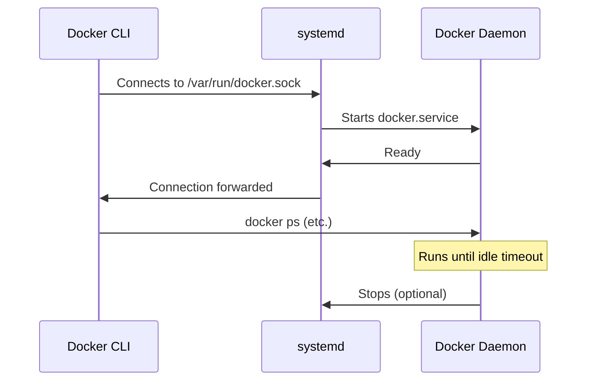

# How to Set Up Docker with Systemd Socket Activation

Author: [nawazdhandala](https://github.com/nawazdhandala)

Tags: Docker, Systemd, Linux, Socket Activation, DevOps, Containers, System Administration, Performance

Description: How to configure Docker Engine with systemd socket activation for on-demand daemon startup, reduced resource usage, and better system integration.

---

Systemd socket activation is a mechanism where a service starts only when something connects to its socket. For Docker, this means the Docker daemon does not need to run continuously. It starts on demand when you run your first Docker command and stops after a period of inactivity. This saves resources on development machines, CI/CD runners, and systems where Docker is used intermittently.

## How Socket Activation Works

Traditional Docker setup: the Docker daemon starts at boot and runs continuously, consuming memory and CPU even when no containers are running.

Socket activation setup: systemd listens on Docker's Unix socket. When a client connects (by running `docker ps`, for example), systemd starts the Docker daemon, hands off the connection, and Docker takes over. The daemon can then stop itself when idle.



## Prerequisites

- A Linux system with systemd (Ubuntu, Debian, Fedora, CentOS, Arch, etc.)
- Docker Engine installed
- Root or sudo access

## Understanding Docker's Systemd Units

Docker installs two systemd units:

1. **docker.service** - The Docker daemon itself
2. **docker.socket** - The socket that listens for connections

Check both units.

```bash
# Check the Docker socket unit
systemctl status docker.socket

# Check the Docker service unit
systemctl status docker.service
```

On most installations, both are enabled by default. The socket unit tells systemd to listen on `/var/run/docker.sock` and start `docker.service` when a connection arrives.

## Step 1: Examine the Default Socket Unit

```bash
# View the Docker socket unit file
systemctl cat docker.socket
```

The default content looks something like this:

```ini
[Unit]
Description=Docker Socket for the API

[Socket]
ListenStream=/var/run/docker.sock
SocketMode=0660
SocketUser=root
SocketGroup=docker

[Install]
WantedBy=sockets.target
```

This tells systemd to create a Unix socket at `/var/run/docker.sock`, owned by root with group `docker`, and permissions `0660`.

## Step 2: Configure Socket-Only Activation

To use pure socket activation (daemon starts on demand instead of at boot), disable the Docker service but enable the socket.

```bash
# Stop the Docker daemon if it is running
sudo systemctl stop docker.service

# Disable the Docker service from starting at boot
sudo systemctl disable docker.service

# Enable the Docker socket to listen at boot
sudo systemctl enable docker.socket

# Start the socket now
sudo systemctl start docker.socket
```

Verify the socket is listening.

```bash
# Check the socket status
systemctl status docker.socket
```

You should see `Active: active (listening)`.

Now verify that the Docker service is not running.

```bash
# Confirm Docker daemon is not running yet
systemctl status docker.service
```

It should show `inactive (dead)`.

## Step 3: Test Socket Activation

Run any Docker command. The daemon will start automatically.

```bash
# This triggers the Docker daemon to start via socket activation
docker ps
```

The first command may take a second or two longer than usual because the daemon needs to start. Subsequent commands are fast.

Check the service status again.

```bash
# Docker daemon should now be active
systemctl status docker.service
```

It should show `active (running)`.

## Step 4: Customize the Socket Configuration

You can customize the socket unit with a drop-in file (do not edit the original unit file directly, as package updates will overwrite it).

### Add a TCP Socket

If you want Docker to also listen on a TCP port (for remote access):

```bash
# Create a drop-in directory
sudo mkdir -p /etc/systemd/system/docker.socket.d

# Add a TCP listener
sudo tee /etc/systemd/system/docker.socket.d/tcp.conf <<'EOF'
[Socket]
ListenStream=0.0.0.0:2375
EOF

# Reload systemd and restart the socket
sudo systemctl daemon-reload
sudo systemctl restart docker.socket
```

**Security warning**: This exposes the Docker daemon without authentication. Only use this on trusted networks or add TLS. See the section on TLS below.

### Change the Socket Path

To use a non-standard socket path:

```bash
# Create a drop-in to change the socket path
sudo tee /etc/systemd/system/docker.socket.d/custom-path.conf <<'EOF'
[Socket]
ListenStream=
ListenStream=/run/docker-custom.sock
EOF

sudo systemctl daemon-reload
sudo systemctl restart docker.socket
```

The first empty `ListenStream=` line clears the default, and the second line sets the new path.

Update the Docker client to use the new path.

```bash
# Set the Docker host to the custom socket
export DOCKER_HOST=unix:///run/docker-custom.sock
docker ps
```

## Step 5: Configure Socket Activation with TLS

For secure remote access via socket activation:

First, generate TLS certificates (see the headless server guide for detailed certificate generation steps). Then configure both the socket and the service.

```bash
# Configure the socket with TLS on port 2376
sudo mkdir -p /etc/systemd/system/docker.socket.d
sudo tee /etc/systemd/system/docker.socket.d/tls.conf <<'EOF'
[Socket]
ListenStream=0.0.0.0:2376
EOF

# Configure the Docker daemon for TLS
sudo tee /etc/docker/daemon.json <<'EOF'
{
  "tlsverify": true,
  "tlscacert": "/etc/docker/tls/ca.pem",
  "tlscert": "/etc/docker/tls/server-cert.pem",
  "tlskey": "/etc/docker/tls/server-key.pem"
}
EOF

sudo systemctl daemon-reload
sudo systemctl restart docker.socket
```

## Step 6: Set Up Idle Timeout (Optional)

By default, once started, the Docker daemon runs indefinitely. You can configure an idle timeout using systemd's `StopWhenUnneeded` directive. However, Docker does not natively support idle stopping, so this requires a wrapper approach.

A simpler alternative is to use a systemd timer to check for idle Docker daemons.

```bash
# Create a Docker idle check script
sudo tee /usr/local/bin/docker-idle-check.sh <<'SCRIPT'
#!/bin/bash
# Stop Docker if no containers are running and no recent API activity

RUNNING=$(docker ps -q 2>/dev/null | wc -l)
if [ "$RUNNING" -eq 0 ]; then
  # Check if any Docker API calls happened in the last 10 minutes
  LAST_EVENT=$(docker events --since 10m --until "$(date +%Y-%m-%dT%H:%M:%S)" 2>/dev/null | wc -l)
  if [ "$LAST_EVENT" -eq 0 ]; then
    echo "Docker is idle, stopping daemon"
    systemctl stop docker.service
  fi
fi
SCRIPT

sudo chmod +x /usr/local/bin/docker-idle-check.sh

# Create a systemd timer to run the check every 15 minutes
sudo tee /etc/systemd/system/docker-idle-check.timer <<'EOF'
[Unit]
Description=Check if Docker is idle and stop it

[Timer]
OnCalendar=*:0/15
Persistent=true

[Install]
WantedBy=timers.target
EOF

sudo tee /etc/systemd/system/docker-idle-check.service <<'EOF'
[Unit]
Description=Docker idle check

[Service]
Type=oneshot
ExecStart=/usr/local/bin/docker-idle-check.sh
EOF

# Enable the timer
sudo systemctl daemon-reload
sudo systemctl enable docker-idle-check.timer
sudo systemctl start docker-idle-check.timer
```

This stops the Docker daemon after 15 minutes of inactivity (no running containers and no API calls). Socket activation will restart it when needed.

## Use Cases for Socket Activation

### CI/CD Runners

On CI/CD machines, Docker is only used during build jobs. Socket activation prevents the daemon from consuming memory between builds.

```bash
# Example: GitLab Runner machine
# Docker starts when a job needs it, stops when idle
sudo systemctl disable docker.service
sudo systemctl enable docker.socket
```

### Development Machines

Developers do not use Docker constantly. Socket activation means Docker only uses resources when you are actively working with containers.

### Multi-Service Servers

On servers running many services, freeing Docker's memory when it is not in use benefits other workloads.

## Monitoring Socket Activation

Track how often Docker starts via socket activation.

```bash
# View Docker service start/stop events
journalctl -u docker.service --no-pager | grep -E "Started|Stopped"

# Count activations today
journalctl -u docker.service --since today | grep "Started" | wc -l
```

## Troubleshooting

### "Cannot connect to the Docker daemon" even with socket active

Check that the socket is actually listening.

```bash
# Verify socket status
systemctl status docker.socket
ls -la /var/run/docker.sock
```

If the socket file exists but Docker fails to start, check the service logs.

```bash
# Check why Docker failed to start
journalctl -u docker.service --no-pager -n 30
```

### Docker starts but then stops immediately

This can happen if `docker.service` has `BindsTo=` or `PartOf=` directives that conflict with socket activation. Check the service unit.

```bash
# View the Docker service unit
systemctl cat docker.service
```

### Socket permissions prevent non-root access

Ensure the socket group is `docker` and your user is in that group.

```bash
# Check socket permissions
ls -la /var/run/docker.sock

# Verify your group membership
groups $USER
```

### First Docker command is slow

The initial delay (1-3 seconds) is the Docker daemon starting up. This is expected behavior with socket activation. Subsequent commands run at normal speed.

## Summary

Systemd socket activation turns Docker into an on-demand service. The daemon starts when you need it and can stop when idle, saving system resources. The setup is simple: disable `docker.service`, enable `docker.socket`, and Docker starts automatically when any client connects to the socket. This is particularly valuable on development machines and CI/CD runners where Docker usage is intermittent. Combined with an idle timeout check, you get a Docker installation that scales its resource usage to match actual demand.
