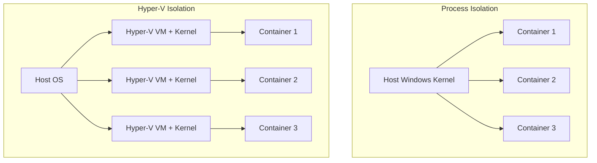
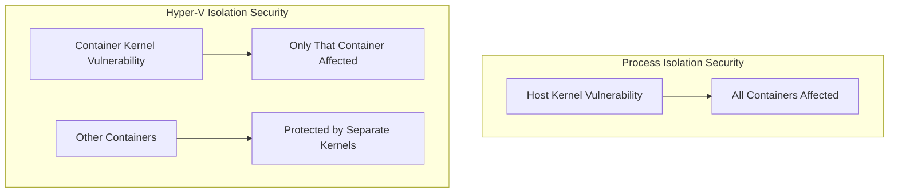

# How to Set Up Hyper-V Isolation for Windows Containers

Author: [nawazdhandala](https://github.com/nawazdhandala)

Tags: docker, hyper-v, windows containers, isolation, security, Windows Server, virtualization

Description: Configure Hyper-V isolation for Windows containers to run different Windows versions and achieve stronger security boundaries than process isolation.

---

Windows containers support two isolation modes: process isolation and Hyper-V isolation. Process isolation shares the host kernel directly, similar to how Linux containers work. Hyper-V isolation goes further by running each container inside a lightweight virtual machine with its own kernel. This provides stronger security boundaries and, critically, lets you run containers built for different Windows versions on the same host.

This guide explains when to use Hyper-V isolation, how to configure it, and the performance trade-offs involved.

## Process Isolation vs Hyper-V Isolation

Understanding the difference between these two modes is essential for making the right choice.

### Process Isolation

Process isolation is the default on Windows Server. Containers share the host's Windows kernel through namespace and resource control mechanisms similar to Linux cgroups and namespaces.

- Fast startup (1-2 seconds)
- Low memory overhead
- Direct kernel sharing with the host
- Container OS version must match the host OS version exactly
- Weaker security boundary (kernel is shared)

### Hyper-V Isolation

Hyper-V isolation wraps each container in a lightweight Hyper-V virtual machine. The container gets its own kernel instance.

- Slower startup (5-10 seconds)
- Higher memory overhead (each container needs its own kernel memory)
- Strong security boundary (separate kernel per container)
- Can run different Windows versions on the same host
- Required on Windows 10/11 for Windows containers



## Prerequisites

Hyper-V isolation requires:

- Windows 10/11 Pro, Enterprise, or Education (with Hyper-V enabled)
- Windows Server 2019 or 2022 (with Hyper-V role installed)
- Docker Desktop (for Windows 10/11) or Docker Engine (for Windows Server)
- Hardware virtualization support (Intel VT-x or AMD-V) enabled in BIOS

### Enable Hyper-V on Windows 10/11

```powershell
# Check if Hyper-V is available
Get-WindowsOptionalFeature -Online -FeatureName Microsoft-Hyper-V

# Enable Hyper-V (requires restart)
Enable-WindowsOptionalFeature -Online -FeatureName Microsoft-Hyper-V -All

# Verify after restart
Get-WindowsOptionalFeature -Online -FeatureName Microsoft-Hyper-V | Select-Object State
```

### Enable Hyper-V on Windows Server

```powershell
# Install the Hyper-V role on Windows Server
Install-WindowsFeature -Name Hyper-V -IncludeManagementTools -Restart

# After restart, verify the installation
Get-WindowsFeature Hyper-V
```

## Running Containers with Hyper-V Isolation

Add the `--isolation=hyperv` flag to run a container in Hyper-V isolation mode.

```powershell
# Run a container with Hyper-V isolation
docker run -d --isolation=hyperv --name secure-container \
  mcr.microsoft.com/windows/servercore:ltsc2022 \
  ping -t localhost

# Verify the isolation mode
docker inspect --format '{{.HostConfig.Isolation}}' secure-container
# Should output: hyperv
```

Compare startup times between the two modes.

```powershell
# Time a process-isolated container start
Measure-Command { docker run --rm --isolation=process mcr.microsoft.com/windows/nanoserver:ltsc2022 cmd /c echo done }

# Time a Hyper-V isolated container start
Measure-Command { docker run --rm --isolation=hyperv mcr.microsoft.com/windows/nanoserver:ltsc2022 cmd /c echo done }
```

## Setting the Default Isolation Mode

You can configure Docker to use Hyper-V isolation by default, eliminating the need to specify it on every run command.

```powershell
# Edit the Docker daemon configuration
# Location: C:\ProgramData\docker\config\daemon.json (Windows Server)
# Location: Docker Desktop Settings > Docker Engine (Windows 10/11)
```

```json
{
  "exec-opts": ["isolation=hyperv"]
}
```

```powershell
# Restart Docker after changing the configuration
Restart-Service docker

# Verify the default isolation mode
docker info --format '{{.Isolation}}'
```

Now all containers run with Hyper-V isolation unless you explicitly override with `--isolation=process`.

## Cross-Version Container Compatibility

The primary practical benefit of Hyper-V isolation is running containers built for different Windows versions on the same host. With process isolation, the container OS version must match the host exactly. Hyper-V removes this restriction.

```powershell
# On a Windows Server 2022 host, run a container built for 2019
docker run --isolation=hyperv \
  mcr.microsoft.com/windows/servercore:ltsc2019 \
  powershell -Command "[System.Environment]::OSVersion"

# Run a container built for 2022 on the same host
docker run --isolation=hyperv \
  mcr.microsoft.com/windows/servercore:ltsc2022 \
  powershell -Command "[System.Environment]::OSVersion"
```

This is invaluable when you support applications targeting different Windows Server versions and want to consolidate them onto fewer hosts.

## Docker Compose with Hyper-V Isolation

Specify the isolation mode in your Docker Compose file.

```yaml
# docker-compose.yml - Services with Hyper-V isolation
version: "3.8"

services:
  web:
    image: mcr.microsoft.com/dotnet/framework/aspnet:4.8-windowsservercore-ltsc2022
    isolation: hyperv
    ports:
      - "80:80"
    volumes:
      - ./webapp:/inetpub/wwwroot
    deploy:
      resources:
        limits:
          memory: 2G
          cpus: "1.0"

  api:
    image: mcr.microsoft.com/dotnet/aspnet:8.0-nanoserver-ltsc2022
    isolation: hyperv
    ports:
      - "8080:8080"
    deploy:
      resources:
        limits:
          memory: 1G
          cpus: "0.5"

  legacy-service:
    # Run a 2019-based container alongside 2022 containers
    image: my-legacy-app:ltsc2019
    isolation: hyperv
    ports:
      - "9090:9090"
```

## Resource Management

Hyper-V isolated containers consume more resources because each one runs its own kernel. Manage resources carefully.

```powershell
# Run with explicit memory and CPU limits
docker run -d --isolation=hyperv \
  --memory 2g \
  --cpus 1.5 \
  --name resource-limited \
  mcr.microsoft.com/windows/servercore:ltsc2022 \
  ping -t localhost

# Monitor resource usage
docker stats resource-limited
```

### Memory Planning

Each Hyper-V isolated container needs memory for:
- The container kernel (approximately 200-300 MB)
- The container's application workload
- Any shared libraries loaded into the kernel

Plan for roughly 300 MB of overhead per container compared to process isolation.

```powershell
# Check how much memory each container is using
docker stats --no-stream --format "table {{.Name}}\t{{.MemUsage}}\t{{.MemPerc}}"
```

## Security Benefits

Hyper-V isolation provides defense-in-depth for multi-tenant scenarios and sensitive workloads.



Key security advantages:

- **Kernel isolation** - a vulnerability in one container's kernel cannot affect others
- **Separate address spaces** - no risk of container escape through shared kernel memory
- **Different patch levels** - containers can run different kernel patch levels
- **Compliance** - meets stricter isolation requirements for regulated industries

## Troubleshooting Common Issues

**Container fails to start with virtualization error.**

```powershell
# Verify Hyper-V is enabled and running
Get-Service vmms
Get-Service vmcompute

# Restart the Hyper-V services
Restart-Service vmms
Restart-Service vmcompute
```

**Performance is significantly degraded.**

```powershell
# Check if the host is over-committed on memory
Get-Counter '\Memory\Available MBytes'

# Reduce the number of Hyper-V containers or increase host resources
docker ps --format "table {{.Names}}\t{{.Status}}" | Measure-Object -Line
```

**Container cannot access the network.**

```powershell
# Check the Hyper-V virtual switch configuration
Get-VMSwitch

# Verify Docker networking is configured
docker network ls
docker network inspect nat
```

**Nested virtualization not available.** If running Docker inside a VM, the hypervisor must expose virtualization extensions to the guest.

```powershell
# On the Hyper-V host, enable nested virtualization for the VM
Set-VMProcessor -VMName "DockerHost" -ExposeVirtualizationExtensions $true
```

## Performance Comparison

Here is what to expect when switching from process isolation to Hyper-V isolation.

| Metric | Process Isolation | Hyper-V Isolation |
|--------|------------------|-------------------|
| Container start time | 1-2 seconds | 5-10 seconds |
| Memory overhead per container | ~50 MB | ~300 MB |
| CPU overhead | Negligible | 2-5% |
| Storage overhead | None | ~200 MB per container |
| Maximum containers per host | Limited by host resources | Fewer due to overhead |

## Best Practices

1. **Use process isolation when you can.** It is faster and lighter. Default to process isolation on Windows Server where the versions match.

2. **Use Hyper-V isolation when you must.** Specifically for cross-version compatibility, multi-tenant security, or compliance requirements.

3. **Set resource limits.** Without limits, Hyper-V containers can consume more resources than expected.

4. **Plan capacity differently.** Account for the per-container overhead when calculating how many containers a host can run.

5. **Monitor the Hyper-V host.** Use Hyper-V manager and performance counters to track virtualization resource usage.

```powershell
# Monitor Hyper-V performance counters
Get-Counter '\Hyper-V Hypervisor Logical Processor(_Total)\% Total Run Time'
Get-Counter '\Hyper-V Dynamic Memory Balancer(*)\Available Memory'
```

## Conclusion

Hyper-V isolation gives Windows containers the security and version flexibility that process isolation lacks. Each container gets its own kernel, providing strong boundaries between workloads and enabling containers built for different Windows versions to coexist on the same host. The trade-off is additional resource overhead and slower startup times, which matter at scale. Use process isolation as your default for performance-sensitive workloads where version matching is not an issue, and reserve Hyper-V isolation for scenarios that demand its unique capabilities: multi-tenant environments, mixed Windows version support, and compliance-sensitive deployments.
