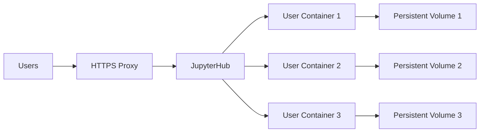

# How to Set Up JupyterHub in Docker for Teams

Author: [nawazdhandala](https://github.com/nawazdhandala)

Tags: docker, jupyterhub, jupyter, data science, teams, docker-compose, python, collaboration

Description: Deploy JupyterHub in Docker for team collaboration with user authentication, persistent storage, custom environments, and resource management.

---

JupyterHub lets multiple users access their own Jupyter notebook servers from a single entry point. Instead of everyone installing Python and Jupyter locally, your team logs into a shared JupyterHub instance and gets an isolated notebook environment. Running JupyterHub in Docker makes the setup reproducible and keeps each user's environment contained.

This guide walks you through setting up a production-ready JupyterHub with Docker, including user authentication, persistent storage, and custom notebook images.

## Architecture Overview

JupyterHub has three main components:

1. **Hub** - The central service that handles authentication and spawns user servers
2. **Proxy** - Routes traffic from users to their individual notebook servers
3. **Spawner** - Creates and manages individual notebook containers for each user

When a user logs in, JupyterHub spawns a new Docker container specifically for that user. Each user gets their own isolated environment with their own notebooks and packages.



## Prerequisites

Make sure Docker and Docker Compose are installed:

```bash
# Check Docker version (need 20.10+)
docker version

# Check Docker Compose version (need v2+)
docker compose version
```

## Step 1: Create the JupyterHub Configuration

Create a project directory and the main configuration file:

```bash
# Create the project directory structure
mkdir -p jupyterhub-docker/{config,secrets}
cd jupyterhub-docker
```

Create the JupyterHub configuration file:

```python
# config/jupyterhub_config.py
import os

# --- Spawner Configuration ---
# Use DockerSpawner to create a container for each user
c.JupyterHub.spawner_class = 'dockerspawner.DockerSpawner'

# The Docker image each user gets
c.DockerSpawner.image = 'jupyter/scipy-notebook:latest'

# Connect containers to the JupyterHub network
c.DockerSpawner.network_name = 'jupyterhub-network'

# Mount a persistent volume for each user's work
notebook_dir = '/home/jovyan/work'
c.DockerSpawner.notebook_dir = notebook_dir
c.DockerSpawner.volumes = {
    'jupyterhub-user-{username}': notebook_dir
}

# Remove containers when users stop their servers
c.DockerSpawner.remove = True

# Set resource limits per user
c.DockerSpawner.mem_limit = '2G'
c.DockerSpawner.cpu_limit = 1.0

# --- Hub Configuration ---
# The Hub must be accessible from the spawned containers
c.JupyterHub.hub_ip = '0.0.0.0'
c.JupyterHub.hub_connect_ip = 'jupyterhub'

# --- Authentication ---
# Use native authenticator for simple username/password auth
c.JupyterHub.authenticator_class = 'nativeauthenticator.NativeAuthenticator'
c.NativeAuthenticator.minimum_password_length = 8
c.NativeAuthenticator.open_signup = False

# Admin users who can manage the hub
c.Authenticator.admin_users = {'admin'}

# --- Proxy Configuration ---
c.ConfigurableHTTPProxy.should_start = True

# --- Misc Settings ---
c.JupyterHub.cleanup_servers = True
c.JupyterHub.shutdown_on_logout = False
```

## Step 2: Build the JupyterHub Image

Create a custom Dockerfile for the Hub:

```dockerfile
# Dockerfile.hub - Custom JupyterHub image with DockerSpawner
FROM jupyterhub/jupyterhub:4

# Install DockerSpawner and Native Authenticator
RUN pip install --no-cache-dir \
    dockerspawner \
    jupyterhub-nativeauthenticator

# Copy the configuration file
COPY config/jupyterhub_config.py /srv/jupyterhub/jupyterhub_config.py

# Expose the Hub port
EXPOSE 8000

CMD ["jupyterhub", "-f", "/srv/jupyterhub/jupyterhub_config.py"]
```

## Step 3: Create the Docker Compose Configuration

```yaml
# docker-compose.yml - JupyterHub deployment
services:
  jupyterhub:
    build:
      context: .
      dockerfile: Dockerfile.hub
    container_name: jupyterhub
    ports:
      - "8000:8000"
    volumes:
      # Mount the Docker socket so JupyterHub can spawn containers
      - /var/run/docker.sock:/var/run/docker.sock:rw
      # Persist JupyterHub's database (user accounts, server states)
      - jupyterhub-data:/srv/jupyterhub/data
    environment:
      - DOCKER_NETWORK_NAME=jupyterhub-network
    networks:
      - jupyterhub-network
    restart: unless-stopped

networks:
  jupyterhub-network:
    name: jupyterhub-network

volumes:
  jupyterhub-data:
```

## Step 4: Pull the User Notebook Image

Before starting JupyterHub, pull the notebook image that users will get:

```bash
# Pull the default notebook image
docker pull jupyter/scipy-notebook:latest
```

## Step 5: Start JupyterHub

```bash
# Build and start JupyterHub
docker compose up -d --build

# Check that it is running
docker compose ps

# View the logs
docker compose logs -f jupyterhub
```

Access JupyterHub at `http://your-server:8000`.

## Step 6: Create the Admin User

The first time you access JupyterHub with the native authenticator, you need to create the admin user:

```bash
# Create the admin user from the command line
docker exec -it jupyterhub python3 -c "
from nativeauthenticator import NativeAuthenticator
from jupyterhub.orm import User
from jupyterhub.app import JupyterHub
import sqlalchemy
# The admin user needs to be created through the signup page first
print('Visit http://your-server:8000/hub/signup to create the admin account')
"
```

Or enable open signup temporarily, create the admin account, then disable it:

```python
# Temporarily set in jupyterhub_config.py
c.NativeAuthenticator.open_signup = True
# After creating admin, set back to False
```

## Step 7: Create a Custom Notebook Image

Customize the notebook image with your team's packages and tools:

```dockerfile
# Dockerfile.notebook - Custom notebook image for your team
FROM jupyter/scipy-notebook:latest

USER root

# Install system-level dependencies
RUN apt-get update && apt-get install -y --no-install-recommends \
    graphviz \
    libpq-dev \
    && apt-get clean \
    && rm -rf /var/lib/apt/lists/*

USER ${NB_UID}

# Install Python packages your team needs
RUN pip install --no-cache-dir \
    pandas==2.1.0 \
    scikit-learn==1.3.0 \
    matplotlib==3.7.2 \
    seaborn==0.12.2 \
    sqlalchemy==2.0.20 \
    psycopg2-binary==2.9.7 \
    plotly==5.16.1 \
    jupyterlab-git==0.50.0 \
    black==23.7.0 \
    nbconvert==7.8.0

# Install JupyterLab extensions
RUN pip install --no-cache-dir \
    jupyterlab-code-formatter==2.2.1

# Copy shared notebooks or templates
COPY --chown=${NB_UID}:${NB_GID} notebooks/ /home/jovyan/templates/
```

Build and update the configuration:

```bash
# Build the custom notebook image
docker build -f Dockerfile.notebook -t team-notebook:latest .
```

Update `jupyterhub_config.py` to use the custom image:

```python
# Use your custom notebook image instead of the default
c.DockerSpawner.image = 'team-notebook:latest'
```

## Step 8: Add Shared Data Access

Give all users access to shared datasets:

```python
# Add to jupyterhub_config.py - mount shared data
c.DockerSpawner.volumes = {
    'jupyterhub-user-{username}': '/home/jovyan/work',
    '/data/shared-datasets': {
        'bind': '/home/jovyan/shared-data',
        'mode': 'ro'  # Read-only access to shared data
    }
}
```

## Step 9: Configure Resource Limits

Set per-user resource limits to prevent one user from consuming all resources:

```python
# Add to jupyterhub_config.py - resource management
c.DockerSpawner.mem_limit = '4G'
c.DockerSpawner.mem_guarantee = '1G'
c.DockerSpawner.cpu_limit = 2.0
c.DockerSpawner.cpu_guarantee = 0.5

# Set environment variables for the notebook containers
c.DockerSpawner.environment = {
    'GRANT_SUDO': 'no',
    'MEM_LIMIT': '4G',
}

# Auto-shutdown idle servers after 1 hour
c.JupyterHub.services = [
    {
        'name': 'idle-culler',
        'command': [
            'python3', '-m', 'jupyterhub_idle_culler',
            '--timeout=3600',
            '--max-age=0',
            '--cull-every=300',
        ],
    }
]
```

Install the idle culler in the Hub image:

```dockerfile
# Add to Dockerfile.hub
RUN pip install --no-cache-dir jupyterhub-idle-culler
```

## Step 10: Add HTTPS with a Reverse Proxy

For production, put JupyterHub behind an HTTPS reverse proxy:

```yaml
# docker-compose.yml with Nginx reverse proxy
services:
  nginx:
    image: nginx:alpine
    ports:
      - "443:443"
      - "80:80"
    volumes:
      - ./nginx/nginx.conf:/etc/nginx/nginx.conf:ro
      - ./nginx/certs:/etc/nginx/certs:ro
    depends_on:
      - jupyterhub
    networks:
      - jupyterhub-network
    restart: unless-stopped

  jupyterhub:
    build:
      context: .
      dockerfile: Dockerfile.hub
    container_name: jupyterhub
    volumes:
      - /var/run/docker.sock:/var/run/docker.sock:rw
      - jupyterhub-data:/srv/jupyterhub/data
    networks:
      - jupyterhub-network
    restart: unless-stopped

networks:
  jupyterhub-network:
    name: jupyterhub-network

volumes:
  jupyterhub-data:
```

Create the Nginx configuration:

```nginx
# nginx/nginx.conf
events {
    worker_connections 1024;
}

http {
    # Redirect HTTP to HTTPS
    server {
        listen 80;
        return 301 https://$host$request_uri;
    }

    server {
        listen 443 ssl;

        ssl_certificate /etc/nginx/certs/fullchain.pem;
        ssl_certificate_key /etc/nginx/certs/privkey.pem;

        location / {
            proxy_pass http://jupyterhub:8000;
            proxy_set_header X-Real-IP $remote_addr;
            proxy_set_header Host $host;
            proxy_set_header X-Forwarded-For $proxy_add_x_forwarded_for;
            proxy_set_header X-Forwarded-Proto $scheme;
        }

        # WebSocket support for Jupyter kernels
        location ~* /(api/kernels/[^/]+/(channels|iopub|shell|stdin)|terminals/websocket)/? {
            proxy_pass http://jupyterhub:8000;
            proxy_set_header X-Real-IP $remote_addr;
            proxy_set_header Host $host;
            proxy_set_header X-Forwarded-For $proxy_add_x_forwarded_for;
            proxy_set_header X-Forwarded-Proto $scheme;
            proxy_http_version 1.1;
            proxy_set_header Upgrade $http_upgrade;
            proxy_set_header Connection "upgrade";
        }
    }
}
```

## Backup and Maintenance

Back up user data regularly:

```bash
#!/bin/bash
# backup-jupyterhub.sh - Back up all JupyterHub user volumes
BACKUP_DIR="/backups/jupyterhub/$(date +%Y%m%d)"
mkdir -p "$BACKUP_DIR"

# Find all user volumes
for vol in $(docker volume ls -q | grep jupyterhub-user); do
    username=$(echo "$vol" | sed 's/jupyterhub-user-//')
    echo "Backing up $username..."
    docker run --rm \
        -v "$vol":/data:ro \
        -v "$BACKUP_DIR":/backup \
        alpine tar czf "/backup/${username}.tar.gz" -C /data .
done

echo "Backup complete: $BACKUP_DIR"
```

## Summary

JupyterHub in Docker gives your team a shared, managed notebook environment where each user gets an isolated container with persistent storage. The key components are the Hub (which handles authentication and spawning), DockerSpawner (which creates user containers), and a custom notebook image (which includes your team's packages). For production, add HTTPS through a reverse proxy, configure resource limits to prevent one user from consuming all resources, and set up the idle culler to shut down unused servers. Mount shared data volumes as read-only so the entire team can access common datasets without duplicating them.
