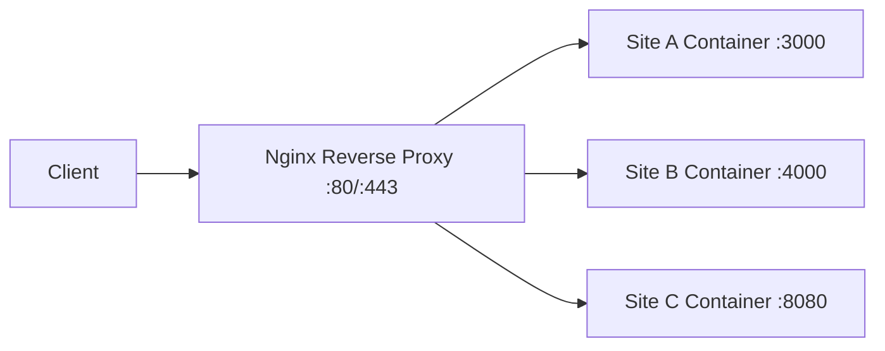

# How to Set Up Multiple Websites on One Docker Host with Nginx

Author: [nawazdhandala](https://github.com/nawazdhandala)

Tags: Docker, Nginx, Web Servers, Reverse Proxy, DevOps, Hosting

Description: Host multiple websites on a single Docker server using Nginx as a reverse proxy with automatic SSL certificate management.

---

Running multiple websites on a single server is one of the most cost-effective hosting strategies. With Docker, each site runs in its own isolated container while Nginx acts as the front door, routing incoming requests to the correct container based on the domain name. This setup keeps sites isolated from each other while sharing the same server resources efficiently.

This guide covers setting up Nginx as a reverse proxy for multiple Docker-based websites, complete with automatic SSL certificates.

## Architecture Overview

The architecture is straightforward. Nginx listens on ports 80 and 443 on the host machine. When a request arrives for `site-a.com`, Nginx routes it to the container running site A. A request for `site-b.com` goes to site B's container. Each site can use a completely different tech stack since Nginx only cares about forwarding HTTP traffic.



## Setting Up the Reverse Proxy Network

First, create a Docker network that all services will share. This allows Nginx to communicate with each site's container by name.

```bash
# Create a shared network for the reverse proxy and all site containers
docker network create web-proxy
```

## Nginx Reverse Proxy Configuration

Create the directory structure for the Nginx reverse proxy:

```bash
# Set up the Nginx proxy directory structure
mkdir -p nginx-proxy/{conf.d,certs,html}
```

Create the main Nginx configuration:

```nginx
# nginx-proxy/nginx.conf - Main Nginx configuration
worker_processes auto;
error_log /var/log/nginx/error.log warn;
pid /var/run/nginx.pid;

events {
    worker_connections 1024;
}

http {
    include /etc/nginx/mime.types;
    default_type application/octet-stream;

    # Logging format with upstream response time
    log_format main '$remote_addr - $remote_user [$time_local] "$request" '
                    '$status $body_bytes_sent "$http_referer" '
                    '"$http_user_agent" "$upstream_response_time"';

    access_log /var/log/nginx/access.log main;
    sendfile on;
    keepalive_timeout 65;

    # Include all site configurations
    include /etc/nginx/conf.d/*.conf;
}
```

Create configuration files for each site. Here is site A, a Node.js application:

```nginx
# nginx-proxy/conf.d/site-a.conf - Configuration for site-a.com
server {
    listen 80;
    server_name site-a.com www.site-a.com;

    location / {
        proxy_pass http://site-a:3000;
        proxy_set_header Host $host;
        proxy_set_header X-Real-IP $remote_addr;
        proxy_set_header X-Forwarded-For $proxy_add_x_forwarded_for;
        proxy_set_header X-Forwarded-Proto $scheme;
    }
}
```

And site B, a Python Flask application:

```nginx
# nginx-proxy/conf.d/site-b.conf - Configuration for site-b.com
server {
    listen 80;
    server_name site-b.com www.site-b.com;

    location / {
        proxy_pass http://site-b:5000;
        proxy_set_header Host $host;
        proxy_set_header X-Real-IP $remote_addr;
        proxy_set_header X-Forwarded-For $proxy_add_x_forwarded_for;
        proxy_set_header X-Forwarded-Proto $scheme;
    }
}
```

And site C, a static website:

```nginx
# nginx-proxy/conf.d/site-c.conf - Configuration for site-c.com (static files)
server {
    listen 80;
    server_name site-c.com www.site-c.com;

    location / {
        proxy_pass http://site-c:80;
        proxy_set_header Host $host;
        proxy_set_header X-Real-IP $remote_addr;
        proxy_set_header X-Forwarded-For $proxy_add_x_forwarded_for;
        proxy_set_header X-Forwarded-Proto $scheme;
    }
}
```

## Docker Compose for the Complete Stack

Now bring everything together in a single Docker Compose file:

```yaml
# docker-compose.yml - Multi-site hosting with Nginx reverse proxy
version: "3.8"

services:
  # Nginx reverse proxy - the traffic router
  nginx-proxy:
    image: nginx:alpine
    ports:
      - "80:80"
      - "443:443"
    volumes:
      - ./nginx-proxy/nginx.conf:/etc/nginx/nginx.conf:ro
      - ./nginx-proxy/conf.d:/etc/nginx/conf.d:ro
      - ./nginx-proxy/certs:/etc/nginx/certs:ro
    networks:
      - web-proxy
    restart: unless-stopped
    depends_on:
      - site-a
      - site-b
      - site-c

  # Site A - Node.js application
  site-a:
    build: ./sites/site-a
    expose:
      - "3000"
    environment:
      NODE_ENV: production
    networks:
      - web-proxy
    restart: unless-stopped

  # Site B - Python Flask application
  site-b:
    build: ./sites/site-b
    expose:
      - "5000"
    environment:
      FLASK_ENV: production
    networks:
      - web-proxy
    restart: unless-stopped

  # Site C - Static website served with Nginx
  site-c:
    image: nginx:alpine
    volumes:
      - ./sites/site-c/html:/usr/share/nginx/html:ro
    expose:
      - "80"
    networks:
      - web-proxy
    restart: unless-stopped

networks:
  web-proxy:
    external: true
```

Notice that the site containers use `expose` instead of `ports`. This makes the port available to other containers on the same network without binding to the host machine. Only the Nginx proxy binds to host ports 80 and 443.

## Adding SSL with Certbot

For production, you need HTTPS. Add a Certbot container that works alongside Nginx:

```yaml
# docker-compose.yml - Updated with SSL support
services:
  nginx-proxy:
    image: nginx:alpine
    ports:
      - "80:80"
      - "443:443"
    volumes:
      - ./nginx-proxy/nginx.conf:/etc/nginx/nginx.conf:ro
      - ./nginx-proxy/conf.d:/etc/nginx/conf.d:ro
      # Mount Let's Encrypt certificates
      - certbot_certs:/etc/letsencrypt:ro
      # Mount the ACME challenge directory
      - certbot_www:/var/www/certbot:ro
    networks:
      - web-proxy
    restart: unless-stopped

  certbot:
    image: certbot/certbot
    volumes:
      - certbot_certs:/etc/letsencrypt
      - certbot_www:/var/www/certbot
    # Renew certificates every 12 hours
    entrypoint: "/bin/sh -c 'trap exit TERM; while :; do certbot renew; sleep 12h & wait $${!}; done'"

volumes:
  certbot_certs:
  certbot_www:
```

Update the Nginx site configurations to handle SSL:

```nginx
# nginx-proxy/conf.d/site-a.conf - With SSL termination
server {
    listen 80;
    server_name site-a.com www.site-a.com;

    # ACME challenge location for certificate renewal
    location /.well-known/acme-challenge/ {
        root /var/www/certbot;
    }

    # Redirect all HTTP traffic to HTTPS
    location / {
        return 301 https://$host$request_uri;
    }
}

server {
    listen 443 ssl;
    server_name site-a.com www.site-a.com;

    ssl_certificate /etc/letsencrypt/live/site-a.com/fullchain.pem;
    ssl_certificate_key /etc/letsencrypt/live/site-a.com/privkey.pem;

    # Strong SSL configuration
    ssl_protocols TLSv1.2 TLSv1.3;
    ssl_ciphers HIGH:!aNULL:!MD5;

    location / {
        proxy_pass http://site-a:3000;
        proxy_set_header Host $host;
        proxy_set_header X-Real-IP $remote_addr;
        proxy_set_header X-Forwarded-For $proxy_add_x_forwarded_for;
        proxy_set_header X-Forwarded-Proto $scheme;
    }
}
```

Obtain the initial certificates:

```bash
# Request certificates for each domain
docker compose run --rm certbot certonly --webroot --webroot-path=/var/www/certbot \
  -d site-a.com -d www.site-a.com --email admin@site-a.com --agree-tos

docker compose run --rm certbot certonly --webroot --webroot-path=/var/www/certbot \
  -d site-b.com -d www.site-b.com --email admin@site-b.com --agree-tos

# Reload Nginx to pick up the new certificates
docker compose exec nginx-proxy nginx -s reload
```

## Separating Compose Files for Each Site

For larger deployments, you might want each site in its own Compose file. This lets different teams manage their own sites independently.

The proxy gets its own compose file:

```yaml
# proxy/docker-compose.yml - Standalone reverse proxy
version: "3.8"

services:
  nginx-proxy:
    image: nginx:alpine
    ports:
      - "80:80"
      - "443:443"
    volumes:
      - ./conf.d:/etc/nginx/conf.d:ro
      - ./nginx.conf:/etc/nginx/nginx.conf:ro
    networks:
      - web-proxy
    restart: unless-stopped

networks:
  web-proxy:
    external: true
```

Each site gets its own compose file and connects to the shared network:

```yaml
# sites/site-a/docker-compose.yml - Independent site deployment
version: "3.8"

services:
  site-a:
    build: .
    expose:
      - "3000"
    networks:
      - web-proxy
    restart: unless-stopped

networks:
  web-proxy:
    external: true
```

## Adding New Sites

Adding a new site to this setup involves three steps:

1. Create the site's container configuration
2. Add an Nginx configuration file for the new domain
3. Reload Nginx

```bash
# Create a new Nginx config for the new site
cat > nginx-proxy/conf.d/site-d.conf << 'EOF'
server {
    listen 80;
    server_name site-d.com;
    location / {
        proxy_pass http://site-d:8080;
        proxy_set_header Host $host;
        proxy_set_header X-Real-IP $remote_addr;
        proxy_set_header X-Forwarded-For $proxy_add_x_forwarded_for;
        proxy_set_header X-Forwarded-Proto $scheme;
    }
}
EOF

# Reload Nginx to pick up the new configuration without downtime
docker compose exec nginx-proxy nginx -s reload
```

## Monitoring and Logs

Keep track of traffic across all your sites:

```bash
# View real-time logs from the proxy
docker compose logs -f nginx-proxy

# Check which sites are getting the most traffic
docker compose exec nginx-proxy cat /var/log/nginx/access.log | awk '{print $1}' | sort | uniq -c | sort -rn | head

# Test Nginx configuration for syntax errors before reloading
docker compose exec nginx-proxy nginx -t
```

## Summary

Hosting multiple websites on a single Docker host with Nginx as a reverse proxy is a clean, scalable approach. Each site runs in its own container with full isolation, while Nginx handles routing based on domain names. You can mix different technologies, scale individual sites independently, and add new sites by simply dropping in a configuration file and reloading Nginx. Combined with Certbot for automatic SSL, this setup is production-ready and costs a fraction of running separate servers for each site.
