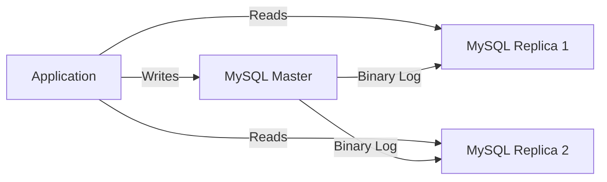

# How to Set Up MySQL Master-Slave Replication in Docker

Author: [nawazdhandala](https://github.com/nawazdhandala)

Tags: Docker, MySQL, Replication, Master-Slave, Database, High Availability, Docker Compose

Description: Configure MySQL master-slave replication in Docker containers for database high availability and read scaling.

---

MySQL replication copies data from a master (primary) server to one or more slave (replica) servers. Reads can be distributed across replicas to reduce load on the primary, and replicas serve as hot standby copies for disaster recovery. Setting this up on bare metal involves configuring multiple servers, opening firewall ports, and managing SSH keys. Docker reduces the whole thing to a compose file and a few configuration files.

This guide sets up a MySQL master with two read replicas, all running in Docker, with proper configuration for binary log replication.

## How MySQL Replication Works

MySQL replication uses binary logs (binlogs). The master records all data-modifying statements in its binary log. Each replica connects to the master, reads the binary log, and replays the events on its own data. This process is asynchronous by default, meaning there is a small delay between a write on the master and its appearance on replicas.



## Project Structure

Create the necessary directories and configuration files.

```bash
# Create the project structure
mkdir -p mysql-replication/master mysql-replication/replica
```

## Master Configuration

The master needs binary logging enabled and a unique server ID.

```ini
# master/my.cnf - MySQL master configuration
[mysqld]
# Unique server ID (must be different on each server)
server-id = 1

# Enable binary logging for replication
log-bin = mysql-bin
binlog-format = ROW

# Which databases to replicate (optional, replicates all if not set)
# binlog-do-db = myapp

# Binary log expiration (days)
binlog_expire_logs_seconds = 604800

# Performance settings
innodb_flush_log_at_trx_commit = 1
sync_binlog = 1

# Network
bind-address = 0.0.0.0
```

## Replica Configuration

Each replica needs a unique server ID and read-only mode enabled.

```ini
# replica/my.cnf - MySQL replica configuration
[mysqld]
# Unique server ID (must differ from master and other replicas)
server-id = 2

# Enable relay log for replication
relay-log = mysql-relay-bin
log-bin = mysql-bin
binlog-format = ROW

# Read-only mode prevents accidental writes to replicas
read-only = 1
super-read-only = 1

# Network
bind-address = 0.0.0.0
```

## Docker Compose Setup

Define the master and two replicas in a Docker Compose file.

```yaml
# docker-compose.yml - MySQL master-slave replication
version: "3.8"

services:
  mysql-master:
    image: mysql:8.0
    container_name: mysql-master
    environment:
      - MYSQL_ROOT_PASSWORD=masterpass
      - MYSQL_DATABASE=myapp
      - MYSQL_USER=app
      - MYSQL_PASSWORD=apppass
    ports:
      - "3306:3306"
    volumes:
      - ./master/my.cnf:/etc/mysql/conf.d/replication.cnf
      - master_data:/var/lib/mysql
    networks:
      - mysql-net
    healthcheck:
      test: ["CMD", "mysqladmin", "ping", "-h", "localhost", "-uroot", "-pmasterpass"]
      interval: 5s
      timeout: 3s
      retries: 10

  mysql-replica-1:
    image: mysql:8.0
    container_name: mysql-replica-1
    environment:
      - MYSQL_ROOT_PASSWORD=replicapass
    ports:
      - "3307:3306"
    volumes:
      - ./replica/my.cnf:/etc/mysql/conf.d/replication.cnf
      - replica1_data:/var/lib/mysql
    depends_on:
      mysql-master:
        condition: service_healthy
    networks:
      - mysql-net
    healthcheck:
      test: ["CMD", "mysqladmin", "ping", "-h", "localhost", "-uroot", "-preplicapass"]
      interval: 5s
      timeout: 3s
      retries: 10

  mysql-replica-2:
    image: mysql:8.0
    container_name: mysql-replica-2
    environment:
      - MYSQL_ROOT_PASSWORD=replicapass
    ports:
      - "3308:3306"
    volumes:
      - ./replica/replica2.cnf:/etc/mysql/conf.d/replication.cnf
      - replica2_data:/var/lib/mysql
    depends_on:
      mysql-master:
        condition: service_healthy
    networks:
      - mysql-net
    healthcheck:
      test: ["CMD", "mysqladmin", "ping", "-h", "localhost", "-uroot", "-preplicapass"]
      interval: 5s
      timeout: 3s
      retries: 10

volumes:
  master_data:
  replica1_data:
  replica2_data:

networks:
  mysql-net:
    driver: bridge
```

Create the second replica config with a unique server ID.

```ini
# replica/replica2.cnf - Second replica configuration
[mysqld]
server-id = 3
relay-log = mysql-relay-bin
log-bin = mysql-bin
binlog-format = ROW
read-only = 1
super-read-only = 1
bind-address = 0.0.0.0
```

## Starting the Cluster

```bash
# Start all MySQL instances
docker compose up -d

# Wait for all instances to be healthy
docker compose ps
```

## Configuring Replication

Now configure the replicas to connect to the master. This requires creating a replication user on the master and pointing each replica to the master's binary log.

```bash
# Step 1: Create a replication user on the master
docker exec mysql-master mysql -uroot -pmasterpass -e "
  CREATE USER 'replicator'@'%' IDENTIFIED WITH mysql_native_password BY 'repl_password';
  GRANT REPLICATION SLAVE ON *.* TO 'replicator'@'%';
  FLUSH PRIVILEGES;
"

# Step 2: Get the master's binary log position
docker exec mysql-master mysql -uroot -pmasterpass -e "SHOW MASTER STATUS\G"
```

The output will show something like:

```
File: mysql-bin.000003
Position: 785
```

Note these values. You need them for the replica configuration.

```bash
# Step 3: Configure replica 1 to follow the master
docker exec mysql-replica-1 mysql -uroot -preplicapass -e "
  CHANGE REPLICATION SOURCE TO
    SOURCE_HOST='mysql-master',
    SOURCE_USER='replicator',
    SOURCE_PASSWORD='repl_password',
    SOURCE_LOG_FILE='mysql-bin.000003',
    SOURCE_LOG_POS=785;
  START REPLICA;
"

# Step 4: Configure replica 2 to follow the master
docker exec mysql-replica-2 mysql -uroot -preplicapass -e "
  CHANGE REPLICATION SOURCE TO
    SOURCE_HOST='mysql-master',
    SOURCE_USER='replicator',
    SOURCE_PASSWORD='repl_password',
    SOURCE_LOG_FILE='mysql-bin.000003',
    SOURCE_LOG_POS=785;
  START REPLICA;
"
```

## Automating Replication Setup

Manual steps are error-prone. Automate the entire process with a setup script.

```bash
#!/bin/bash
# setup-replication.sh - Automate MySQL master-slave replication setup
set -e

MASTER_PASS="masterpass"
REPLICA_PASS="replicapass"
REPL_USER="replicator"
REPL_PASS="repl_password"

echo "Starting MySQL cluster..."
docker compose up -d
sleep 15

echo "Creating replication user on master..."
docker exec mysql-master mysql -uroot -p${MASTER_PASS} -e "
  CREATE USER IF NOT EXISTS '${REPL_USER}'@'%' IDENTIFIED WITH mysql_native_password BY '${REPL_PASS}';
  GRANT REPLICATION SLAVE ON *.* TO '${REPL_USER}'@'%';
  FLUSH PRIVILEGES;
"

echo "Getting master status..."
MASTER_STATUS=$(docker exec mysql-master mysql -uroot -p${MASTER_PASS} -e "SHOW MASTER STATUS\G")
LOG_FILE=$(echo "$MASTER_STATUS" | grep "File:" | awk '{print $2}')
LOG_POS=$(echo "$MASTER_STATUS" | grep "Position:" | awk '{print $2}')

echo "Master log file: $LOG_FILE, position: $LOG_POS"

# Configure each replica
for REPLICA in mysql-replica-1 mysql-replica-2; do
    echo "Configuring $REPLICA..."
    docker exec "$REPLICA" mysql -uroot -p${REPLICA_PASS} -e "
      STOP REPLICA;
      CHANGE REPLICATION SOURCE TO
        SOURCE_HOST='mysql-master',
        SOURCE_USER='${REPL_USER}',
        SOURCE_PASSWORD='${REPL_PASS}',
        SOURCE_LOG_FILE='${LOG_FILE}',
        SOURCE_LOG_POS=${LOG_POS};
      START REPLICA;
    "
done

echo "Checking replication status..."
sleep 5
for REPLICA in mysql-replica-1 mysql-replica-2; do
    echo ""
    echo "=== $REPLICA ==="
    docker exec "$REPLICA" mysql -uroot -p${REPLICA_PASS} -e "SHOW REPLICA STATUS\G" | grep -E "Replica_IO_Running|Replica_SQL_Running|Seconds_Behind"
done

echo ""
echo "Replication setup complete!"
```

```bash
chmod +x setup-replication.sh
./setup-replication.sh
```

## Verifying Replication

Verify that data written to the master appears on the replicas.

```bash
# Write data to the master
docker exec mysql-master mysql -uroot -pmasterpass -e "
  USE myapp;
  CREATE TABLE IF NOT EXISTS test_replication (
    id INT AUTO_INCREMENT PRIMARY KEY,
    message VARCHAR(255),
    created_at TIMESTAMP DEFAULT CURRENT_TIMESTAMP
  );
  INSERT INTO test_replication (message) VALUES ('Hello from master');
  INSERT INTO test_replication (message) VALUES ('Replication test');
"

# Read from replica 1
docker exec mysql-replica-1 mysql -uroot -preplicapass -e "
  SELECT * FROM myapp.test_replication;
"

# Read from replica 2
docker exec mysql-replica-2 mysql -uroot -preplicapass -e "
  SELECT * FROM myapp.test_replication;
"
```

Both replicas should show the same data.

## Monitoring Replication Health

```bash
# Check replication lag on replica 1
docker exec mysql-replica-1 mysql -uroot -preplicapass -e "
  SHOW REPLICA STATUS\G
" | grep -E "Replica_IO_Running|Replica_SQL_Running|Seconds_Behind_Source|Last_Error"
```

The key fields to watch are `Replica_IO_Running` (should be Yes), `Replica_SQL_Running` (should be Yes), and `Seconds_Behind_Source` (should be 0 or close to it).

Create a monitoring script.

```bash
#!/bin/bash
# monitor-replication.sh - Watch replication status continuously

while true; do
    clear
    echo "MySQL Replication Status - $(date)"
    echo "======================================"

    for REPLICA in mysql-replica-1 mysql-replica-2; do
        echo ""
        echo "--- $REPLICA ---"
        docker exec "$REPLICA" mysql -uroot -preplicapass -N -e "
          SHOW REPLICA STATUS\G
        " 2>/dev/null | grep -E "Replica_IO_Running|Replica_SQL_Running|Seconds_Behind_Source|Last_Error"
    done

    sleep 5
done
```

## Handling Replication Failures

If a replica falls behind or stops replicating, you can reset it.

```bash
# Reset a replica and re-sync from master
docker exec mysql-replica-1 mysql -uroot -preplicapass -e "
  STOP REPLICA;
  RESET REPLICA ALL;
"

# Get fresh master coordinates and reconfigure
# (Follow the same steps from the setup script)
```

## Wrapping Up

MySQL master-slave replication in Docker gives you a production-like database cluster on your laptop. You can test application code against a replicated setup, verify that read scaling works correctly, and practice failover procedures. The automation script makes the setup repeatable, and monitoring scripts help you understand replication behavior. This setup also works well for CI testing when you need to verify that your application handles read replicas correctly.
