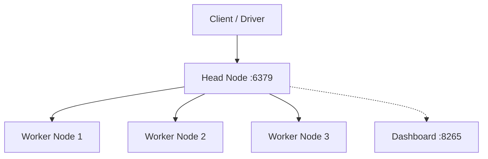

# How to Set Up Ray Cluster in Docker

Author: [nawazdhandala](https://github.com/nawazdhandala)

Tags: Docker, Ray, Distributed Computing, Machine Learning, Python, Docker Compose, AI

Description: Complete guide to deploying Ray clusters in Docker for distributed machine learning and Python workloads

---

Ray is a distributed computing framework built for scaling Python applications. Originally developed at UC Berkeley, it has become the backbone for many production machine learning systems. Ray handles task scheduling, actor management, and distributed object storage transparently. You write normal Python functions, decorate them, and Ray distributes the execution across a cluster. Docker makes deploying Ray clusters straightforward, whether you are running on a single machine during development or across multiple nodes in production.

This guide covers setting up Ray in Docker from scratch, including head nodes, worker nodes, the Ray Dashboard, and practical examples for parallel processing and model training.

## Ray Architecture

A Ray cluster consists of a head node and zero or more worker nodes:

- **Head node**: Runs the Global Control Store (GCS), the autoscaler, and the dashboard. It also executes tasks like any other node.
- **Worker nodes**: Connect to the head node and execute tasks and actors.
- **Dashboard**: A web interface for monitoring cluster health, job status, and resource usage.



## Quick Start with a Single Container

The simplest way to use Ray is in a single container:

```bash
# Start Ray in single-node mode with the dashboard
docker run -it --rm \
  --name ray-single \
  --shm-size=2g \
  -p 8265:8265 \
  rayproject/ray:2.40.0 \
  bash -c "ray start --head --dashboard-host=0.0.0.0 && python -c '
import ray
ray.init()
print(ray.cluster_resources())

@ray.remote
def square(x):
    return x * x

futures = [square.remote(i) for i in range(10)]
print(ray.get(futures))
' && sleep infinity"
```

The `--shm-size=2g` flag is important. Ray uses shared memory (`/dev/shm`) extensively for its object store. The default Docker shared memory size of 64 MB is far too small and will cause crashes.

## Multi-Node Cluster with Docker Compose

For a proper distributed setup, use Docker Compose to create a head node and multiple workers:

```yaml
# docker-compose.yml - Ray cluster with head node and workers
version: "3.8"

services:
  ray-head:
    image: rayproject/ray:2.40.0
    container_name: ray-head
    shm_size: "4g"
    ports:
      - "8265:8265"   # Ray Dashboard
      - "6379:6379"   # Ray GCS
      - "10001:10001" # Ray Client
    command: >
      ray start --head
      --port=6379
      --dashboard-host=0.0.0.0
      --dashboard-port=8265
      --num-cpus=4
      --block
    environment:
      - RAY_GRAFANA_HOST=http://grafana:3000
    volumes:
      - ray-data:/tmp/ray

  ray-worker-1:
    image: rayproject/ray:2.40.0
    container_name: ray-worker-1
    shm_size: "4g"
    depends_on:
      - ray-head
    command: >
      ray start
      --address=ray-head:6379
      --num-cpus=4
      --block
    volumes:
      - ray-data:/tmp/ray

  ray-worker-2:
    image: rayproject/ray:2.40.0
    container_name: ray-worker-2
    shm_size: "4g"
    depends_on:
      - ray-head
    command: >
      ray start
      --address=ray-head:6379
      --num-cpus=4
      --block
    volumes:
      - ray-data:/tmp/ray

volumes:
  ray-data:
```

Launch the cluster:

```bash
# Start the Ray cluster
docker compose up -d

# Check cluster status through the head node
docker exec ray-head ray status
```

Visit http://localhost:8265 for the Ray Dashboard.

## Connecting from Outside the Cluster

You can connect to the Ray cluster from your host machine or another container using the Ray client:

```python
# connect_client.py - connect to the Ray cluster from outside Docker
import ray

# Connect to the head node's client server
ray.init("ray://localhost:10001")

# Verify the connection
print(ray.cluster_resources())

@ray.remote
def cpu_intensive_task(n):
    """Simulate a CPU-intensive computation."""
    total = 0
    for i in range(n):
        total += i ** 2
    return total

# Submit 100 tasks that will be distributed across all workers
futures = [cpu_intensive_task.remote(1_000_000) for _ in range(100)]
results = ray.get(futures)
print(f"Completed {len(results)} tasks")
```

## Distributed Data Processing with Ray Data

Ray Data provides a distributed data processing API similar to Spark:

```python
# data_processing.py - process large datasets with Ray Data
import ray

ray.init("ray://localhost:10001")

# Read a large CSV directory in parallel
ds = ray.data.read_csv("/data/logs/")

# Apply transformations distributed across the cluster
processed = ds.map(lambda row: {
    "timestamp": row["timestamp"],
    "level": row["level"].upper(),
    "message_length": len(row["message"]),
})

# Filter and aggregate
errors = processed.filter(lambda row: row["level"] == "ERROR")
print(f"Total error count: {errors.count()}")

# Write results back
errors.write_parquet("/data/output/errors/")
```

## Distributed Machine Learning with Ray Train

Ray Train integrates with PyTorch, TensorFlow, and other frameworks for distributed training:

```python
# distributed_training.py - distributed PyTorch training with Ray Train
import ray
from ray.train import ScalingConfig
from ray.train.torch import TorchTrainer
import torch

ray.init("ray://localhost:10001")

def train_func(config):
    """Training function that runs on each worker."""
    import torch
    from torch import nn, optim
    from torch.utils.data import DataLoader, TensorDataset
    from ray.train import report

    # Create a simple model
    model = nn.Sequential(nn.Linear(10, 64), nn.ReLU(), nn.Linear(64, 1))

    # Generate synthetic training data
    X = torch.randn(1000, 10)
    y = torch.randn(1000, 1)
    dataset = TensorDataset(X, y)
    loader = DataLoader(dataset, batch_size=32, shuffle=True)

    optimizer = optim.Adam(model.parameters(), lr=0.001)
    loss_fn = nn.MSELoss()

    for epoch in range(config["epochs"]):
        total_loss = 0
        for batch_X, batch_y in loader:
            pred = model(batch_X)
            loss = loss_fn(pred, batch_y)
            optimizer.zero_grad()
            loss.backward()
            optimizer.step()
            total_loss += loss.item()
        report({"loss": total_loss / len(loader), "epoch": epoch})

# Configure distributed training across 2 workers
trainer = TorchTrainer(
    train_func,
    train_loop_config={"epochs": 10},
    scaling_config=ScalingConfig(num_workers=2, use_gpu=False),
)

result = trainer.fit()
print(f"Final loss: {result.metrics['loss']:.4f}")
```

## Ray Serve for Model Deployment

Ray Serve lets you deploy ML models as scalable REST APIs:

```python
# serve_model.py - deploy a model with Ray Serve
import ray
from ray import serve
from starlette.requests import Request

ray.init("ray://localhost:10001")

@serve.deployment(num_replicas=2, ray_actor_options={"num_cpus": 1})
class SentimentAnalyzer:
    def __init__(self):
        # Load model at startup (runs once per replica)
        from transformers import pipeline
        self.model = pipeline("sentiment-analysis")

    async def __call__(self, request: Request):
        data = await request.json()
        text = data.get("text", "")
        result = self.model(text)
        return {"sentiment": result[0]["label"], "score": result[0]["score"]}

# Deploy the model
app = SentimentAnalyzer.bind()
serve.run(app, host="0.0.0.0", port=8000)
```

## Custom Ray Image with Dependencies

Build a custom image when your workloads need additional packages:

```dockerfile
# Dockerfile - Ray with ML dependencies
FROM rayproject/ray:2.40.0

# Install ML libraries
RUN pip install --no-cache-dir \
    torch \
    transformers \
    scikit-learn \
    pandas \
    pyarrow \
    xgboost-ray

WORKDIR /app
COPY . /app
```

Use the same custom image for both head and worker nodes to avoid dependency mismatches.

## GPU Support

For GPU workloads, use the Ray GPU image and configure GPU passthrough:

```yaml
# GPU-enabled Ray worker configuration
  ray-gpu-worker:
    image: rayproject/ray-ml:2.40.0-gpu
    shm_size: "8g"
    depends_on:
      - ray-head
    command: >
      ray start
      --address=ray-head:6379
      --num-gpus=1
      --block
    deploy:
      resources:
        reservations:
          devices:
            - driver: nvidia
              count: 1
              capabilities: [gpu]
```

## Monitoring and Observability

The Ray Dashboard provides built-in monitoring, but you can also integrate with Prometheus and Grafana:

```bash
# Check cluster resource utilization from the CLI
docker exec ray-head ray status

# View logs from a specific worker
docker logs ray-worker-1 --tail 50
```

Key metrics to monitor include CPU and memory utilization per node, object store memory usage, task queue depth, and the number of pending and running tasks.

## Conclusion

Ray in Docker provides a flexible platform for distributed Python computing. The framework handles the complexity of task scheduling, data movement, and fault tolerance, while Docker handles environment consistency and deployment. Start with a single-container setup for development, scale to multiple workers with Compose, and use Ray's built-in libraries (Ray Data, Ray Train, Ray Serve) for common distributed computing patterns. The shared memory configuration is the most common gotcha, so always set `shm_size` to at least 2 GB for any Ray container.
