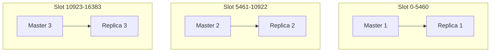

# How to Set Up Redis Cluster Mode in Docker

Author: [nawazdhandala](https://github.com/nawazdhandala)

Tags: Docker, Redis, Cluster, High Availability, Caching, Docker Compose, Distributed Systems, Sharding

Description: Set up a Redis cluster with multiple nodes in Docker for data sharding, high availability, and fault tolerance.

---

Redis Cluster distributes data across multiple Redis nodes using hash slots. Instead of storing everything on a single server, data is automatically partitioned across the cluster. Each node owns a subset of the 16384 hash slots, and clients route requests to the correct node based on the key's hash. The cluster also handles failover: if a master node goes down, its replica promotes itself automatically.

Setting up a Redis Cluster on bare metal requires provisioning multiple servers and careful network configuration. Docker lets you run the entire cluster on a single machine, which is ideal for development, testing, and learning how Redis Cluster behaves.

## Redis Cluster Architecture

A minimum Redis Cluster requires 6 nodes: 3 masters and 3 replicas. Each master handles a portion of the hash slot range, and each replica copies data from its assigned master. If a master fails, its replica takes over.



## Creating the Redis Cluster Configuration

Each node needs a configuration file that enables cluster mode.

```bash
# Create the project structure
mkdir -p redis-cluster
```

```conf
# redis-cluster/redis.conf - Shared Redis cluster node configuration
# Enable cluster mode
cluster-enabled yes

# Cluster configuration file (auto-managed by Redis)
cluster-config-file nodes.conf

# Node timeout in milliseconds (how long before a node is considered failed)
cluster-node-timeout 5000

# Enable AOF persistence
appendonly yes

# Allow connections from any interface
bind 0.0.0.0

# Disable protected mode for Docker networking
protected-mode no
```

## Docker Compose Setup

Define six Redis nodes in Docker Compose.

```yaml
# docker-compose.yml - Redis Cluster with 6 nodes
version: "3.8"

services:
  redis-node-1:
    image: redis:7-alpine
    container_name: redis-node-1
    ports:
      - "7001:6379"
      - "17001:16379"
    volumes:
      - ./redis.conf:/usr/local/etc/redis/redis.conf
      - redis-data-1:/data
    command: redis-server /usr/local/etc/redis/redis.conf --port 6379
    networks:
      redis-cluster:
        ipv4_address: 172.30.0.11
    healthcheck:
      test: ["CMD", "redis-cli", "ping"]
      interval: 3s
      timeout: 3s
      retries: 10

  redis-node-2:
    image: redis:7-alpine
    container_name: redis-node-2
    ports:
      - "7002:6379"
      - "17002:16379"
    volumes:
      - ./redis.conf:/usr/local/etc/redis/redis.conf
      - redis-data-2:/data
    command: redis-server /usr/local/etc/redis/redis.conf --port 6379
    networks:
      redis-cluster:
        ipv4_address: 172.30.0.12
    healthcheck:
      test: ["CMD", "redis-cli", "ping"]
      interval: 3s
      timeout: 3s
      retries: 10

  redis-node-3:
    image: redis:7-alpine
    container_name: redis-node-3
    ports:
      - "7003:6379"
      - "17003:16379"
    volumes:
      - ./redis.conf:/usr/local/etc/redis/redis.conf
      - redis-data-3:/data
    command: redis-server /usr/local/etc/redis/redis.conf --port 6379
    networks:
      redis-cluster:
        ipv4_address: 172.30.0.13
    healthcheck:
      test: ["CMD", "redis-cli", "ping"]
      interval: 3s
      timeout: 3s
      retries: 10

  redis-node-4:
    image: redis:7-alpine
    container_name: redis-node-4
    ports:
      - "7004:6379"
      - "17004:16379"
    volumes:
      - ./redis.conf:/usr/local/etc/redis/redis.conf
      - redis-data-4:/data
    command: redis-server /usr/local/etc/redis/redis.conf --port 6379
    networks:
      redis-cluster:
        ipv4_address: 172.30.0.14
    healthcheck:
      test: ["CMD", "redis-cli", "ping"]
      interval: 3s
      timeout: 3s
      retries: 10

  redis-node-5:
    image: redis:7-alpine
    container_name: redis-node-5
    ports:
      - "7005:6379"
      - "17005:16379"
    volumes:
      - ./redis.conf:/usr/local/etc/redis/redis.conf
      - redis-data-5:/data
    command: redis-server /usr/local/etc/redis/redis.conf --port 6379
    networks:
      redis-cluster:
        ipv4_address: 172.30.0.15
    healthcheck:
      test: ["CMD", "redis-cli", "ping"]
      interval: 3s
      timeout: 3s
      retries: 10

  redis-node-6:
    image: redis:7-alpine
    container_name: redis-node-6
    ports:
      - "7006:6379"
      - "17006:16379"
    volumes:
      - ./redis.conf:/usr/local/etc/redis/redis.conf
      - redis-data-6:/data
    command: redis-server /usr/local/etc/redis/redis.conf --port 6379
    networks:
      redis-cluster:
        ipv4_address: 172.30.0.16
    healthcheck:
      test: ["CMD", "redis-cli", "ping"]
      interval: 3s
      timeout: 3s
      retries: 10

volumes:
  redis-data-1:
  redis-data-2:
  redis-data-3:
  redis-data-4:
  redis-data-5:
  redis-data-6:

networks:
  redis-cluster:
    driver: bridge
    ipam:
      config:
        - subnet: 172.30.0.0/24
```

We assign static IPs because Redis Cluster nodes need to know each other's addresses. Dynamic IPs would break the cluster when containers restart.

## Starting the Cluster

```bash
# Start all 6 nodes
docker compose up -d

# Verify all nodes are running
docker compose ps
```

## Creating the Cluster

With all nodes running, use the `redis-cli` cluster create command to form the cluster.

```bash
# Create the cluster with 3 masters and 3 replicas
docker exec redis-node-1 redis-cli --cluster create \
  172.30.0.11:6379 \
  172.30.0.12:6379 \
  172.30.0.13:6379 \
  172.30.0.14:6379 \
  172.30.0.15:6379 \
  172.30.0.16:6379 \
  --cluster-replicas 1 \
  --cluster-yes
```

The `--cluster-replicas 1` flag tells Redis to assign one replica per master. Redis automatically distributes the hash slots across the three masters.

## Verifying the Cluster

```bash
# Check cluster information
docker exec redis-node-1 redis-cli cluster info

# View the cluster topology (which node has which slots)
docker exec redis-node-1 redis-cli cluster nodes

# Check cluster slots distribution
docker exec redis-node-1 redis-cli cluster slots
```

The `cluster nodes` output shows each node's ID, role (master or slave), the master it replicates (for replicas), and its hash slot range (for masters).

## Testing the Cluster

Write and read data to verify the cluster distributes keys correctly. Use the `-c` flag for cluster mode, which automatically follows redirections.

```bash
# Write data to the cluster (use -c for cluster mode)
docker exec redis-node-1 redis-cli -c SET user:1 "Alice"
docker exec redis-node-1 redis-cli -c SET user:2 "Bob"
docker exec redis-node-1 redis-cli -c SET user:3 "Charlie"
docker exec redis-node-1 redis-cli -c SET order:100 "Order for Alice"
docker exec redis-node-1 redis-cli -c SET order:200 "Order for Bob"

# Read data back (can read from any node - cluster handles routing)
docker exec redis-node-3 redis-cli -c GET user:1
docker exec redis-node-2 redis-cli -c GET order:100

# See which node holds a specific key
docker exec redis-node-1 redis-cli cluster keyslot user:1
docker exec redis-node-1 redis-cli cluster keyslot order:100
```

## Connecting from an Application

Use a Redis client library that supports cluster mode. Here is a Python example.

```python
# app.py - Connect to Redis Cluster from Python
from redis.cluster import RedisCluster

# Connect to the cluster (provide at least one node)
rc = RedisCluster(
    startup_nodes=[
        {"host": "172.30.0.11", "port": 6379},
        {"host": "172.30.0.12", "port": 6379},
        {"host": "172.30.0.13", "port": 6379},
    ],
    decode_responses=True
)

# Write data - the client routes to the correct node automatically
rc.set("session:abc123", "user_data_here")
rc.set("cache:homepage", "cached_html_content")
rc.set("counter:pageviews", "0")

# Read data
print(rc.get("session:abc123"))
print(rc.get("cache:homepage"))

# Increment a counter
rc.incr("counter:pageviews")
print(f"Page views: {rc.get('counter:pageviews')}")

# Get cluster info from the client
print(f"Cluster nodes: {len(rc.get_nodes())}")
for node in rc.get_nodes():
    print(f"  {node.host}:{node.port} - {node.server_type}")
```

```bash
# Install the Redis Python client and run
pip install redis
python app.py
```

## Testing Failover

One of the main reasons to use Redis Cluster is automatic failover. Test it by killing a master node.

```bash
# Identify which node is master for a key
docker exec redis-node-1 redis-cli cluster nodes | grep master

# Kill one of the master nodes
docker stop redis-node-2

# Wait a few seconds for failover
sleep 10

# Check the cluster state - a replica should have been promoted
docker exec redis-node-1 redis-cli cluster nodes

# Verify data is still accessible
docker exec redis-node-1 redis-cli -c GET user:2

# Bring the node back - it rejoins as a replica
docker start redis-node-2
sleep 10
docker exec redis-node-1 redis-cli cluster nodes
```

When node 2 comes back, it rejoins the cluster as a replica of the node that was promoted during the failover.

## Automated Cluster Setup Script

Automate the entire process with a single script.

```bash
#!/bin/bash
# setup-cluster.sh - One-command Redis Cluster setup
set -e

echo "Starting Redis nodes..."
docker compose up -d

echo "Waiting for all nodes to be ready..."
for i in $(seq 1 6); do
    until docker exec "redis-node-$i" redis-cli ping | grep -q PONG; do
        sleep 1
    done
    echo "  redis-node-$i is ready"
done

echo "Creating Redis Cluster..."
docker exec redis-node-1 redis-cli --cluster create \
  172.30.0.11:6379 \
  172.30.0.12:6379 \
  172.30.0.13:6379 \
  172.30.0.14:6379 \
  172.30.0.15:6379 \
  172.30.0.16:6379 \
  --cluster-replicas 1 \
  --cluster-yes

echo ""
echo "Cluster status:"
docker exec redis-node-1 redis-cli cluster info | grep -E "cluster_state|cluster_slots|cluster_known_nodes|cluster_size"

echo ""
echo "Node roles:"
docker exec redis-node-1 redis-cli cluster nodes | awk '{print $1, $2, $3, $4}'

echo ""
echo "Redis Cluster is ready!"
echo "Connect from applications using: 172.30.0.11:6379 (or any node)"
```

## Monitoring the Cluster

```bash
#!/bin/bash
# monitor-cluster.sh - Continuous cluster health monitoring

while true; do
    clear
    echo "Redis Cluster Health - $(date)"
    echo "====================================="

    # Cluster state
    STATE=$(docker exec redis-node-1 redis-cli cluster info 2>/dev/null | grep cluster_state | tr -d '\r')
    echo "State: $STATE"

    # Node status
    echo ""
    echo "Nodes:"
    docker exec redis-node-1 redis-cli cluster nodes 2>/dev/null | while read -r line; do
        ID=$(echo "$line" | awk '{print substr($1,1,8)}')
        ADDR=$(echo "$line" | awk '{print $2}' | cut -d@ -f1)
        FLAGS=$(echo "$line" | awk '{print $3}')
        SLOTS=$(echo "$line" | awk '{for(i=9;i<=NF;i++) printf "%s ",$i}')
        echo "  $ID | $ADDR | $FLAGS | $SLOTS"
    done

    # Memory usage per node
    echo ""
    echo "Memory usage:"
    for i in $(seq 1 6); do
        MEM=$(docker exec "redis-node-$i" redis-cli info memory 2>/dev/null | grep used_memory_human | tr -d '\r')
        echo "  redis-node-$i: $MEM"
    done

    sleep 5
done
```

## Scaling the Cluster

Add new nodes to an existing cluster to increase capacity.

```bash
# Start a new Redis node (redis-node-7)
docker run -d \
  --name redis-node-7 \
  --network redis-cluster_redis-cluster \
  --ip 172.30.0.17 \
  -v $(pwd)/redis.conf:/usr/local/etc/redis/redis.conf \
  redis:7-alpine \
  redis-server /usr/local/etc/redis/redis.conf --port 6379

# Add the new node to the cluster as a master
docker exec redis-node-1 redis-cli --cluster add-node \
  172.30.0.17:6379 \
  172.30.0.11:6379

# Rebalance hash slots to include the new node
docker exec redis-node-1 redis-cli --cluster rebalance \
  172.30.0.11:6379 \
  --cluster-use-empty-masters
```

## Wrapping Up

Redis Cluster in Docker gives you a fully functional distributed cache and data store on a single machine. The static IP approach ensures stability across container restarts, and the automated setup script makes the process repeatable. Use this setup for development, testing failover scenarios, and validating your application's cluster-mode client configuration. The skills you build here transfer directly to production Redis Cluster deployments, where the architecture is the same but the nodes run on separate servers.
