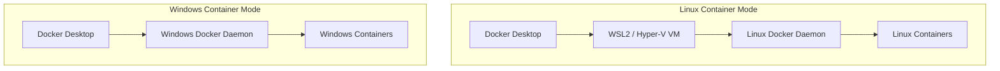

# How to Switch Between Linux and Windows Containers on Docker Desktop

Author: [nawazdhandala](https://github.com/nawazdhandala)

Tags: docker, docker desktop, windows containers, linux containers, container switching, DevOps, development

Description: Learn how to switch between Linux and Windows container modes on Docker Desktop, understand when to use each, and manage mixed workloads.

---

Docker Desktop on Windows supports two distinct modes: Linux containers and Windows containers. Each mode runs a different type of container with different base images, capabilities, and use cases. Developers working with both .NET Framework applications (which require Windows containers) and modern microservices (typically Linux containers) need to switch between these modes regularly. Understanding how this switching works, and its limitations, saves time and prevents confusion.

This guide explains both container modes, shows how to switch between them, and covers strategies for working with mixed workloads.

## Understanding the Two Modes

When Docker Desktop runs in Linux container mode, it creates a lightweight Linux virtual machine (using WSL2 or Hyper-V) and runs the Docker daemon inside it. All containers are Linux containers. This is the default mode and what most developers use.

When Docker Desktop runs in Windows container mode, it uses the Windows Docker daemon that runs natively on the Windows host. All containers are Windows containers that share the Windows kernel.



The key limitation: you can only run one mode at a time. You cannot run Linux and Windows containers simultaneously through Docker Desktop alone (though there are workarounds covered later in this guide).

## Switching via the System Tray

The quickest way to switch is through the Docker Desktop system tray icon.

1. Right-click the Docker icon in the Windows system tray (bottom-right corner of the taskbar)
2. Click "Switch to Windows containers..." or "Switch to Linux containers..."
3. Docker Desktop restarts the Docker daemon in the new mode
4. Wait for the Docker icon to stop animating, indicating the switch is complete

The switch takes about 10 to 30 seconds. Any running containers in the current mode will be stopped.

## Switching via the Command Line

You can also switch from PowerShell or Command Prompt.

```powershell
# Switch to Windows containers
& "$Env:ProgramFiles\Docker\Docker\DockerCli.exe" -SwitchDaemon

# Switch to Linux containers
& "$Env:ProgramFiles\Docker\Docker\DockerCli.exe" -SwitchLinuxEngine

# Switch to Windows containers explicitly
& "$Env:ProgramFiles\Docker\Docker\DockerCli.exe" -SwitchWindowsEngine
```

## Checking the Current Mode

Before pulling images or running containers, verify which mode you are in.

```powershell
# Check the current container OS type
docker info --format '{{.OSType}}'
# Returns either "linux" or "windows"

# More detailed version info showing the mode
docker version --format '{{.Server.Os}}'
```

You can also check from the Docker Desktop dashboard. The bottom-left corner shows either "Linux" or "Windows" as the current engine.

## When to Use Linux Containers

Linux containers are the default choice for most workloads. Use them when:

- Building applications with Node.js, Python, Go, Java, Ruby, or Rust
- Running databases like PostgreSQL, MySQL, MongoDB, or Redis
- Deploying modern .NET (6, 7, 8) applications
- Running Kubernetes locally with Docker Desktop's built-in cluster
- Working with container images from Docker Hub (most are Linux-only)
- Using Docker Compose for multi-service development environments

```powershell
# Verify you are in Linux mode
docker info --format '{{.OSType}}'

# Pull and run a typical Linux container
docker run --rm alpine cat /etc/os-release
```

## When to Use Windows Containers

Switch to Windows containers when your workload specifically requires Windows.

- Running .NET Framework 3.5 or 4.x applications
- Hosting IIS web servers with ASP.NET Web Forms or MVC
- Running SQL Server in a Windows container
- Using WCF services
- Applications that depend on Windows-specific APIs, COM components, or registry settings
- Testing Windows Server deployments locally

```powershell
# Switch to Windows mode
& "$Env:ProgramFiles\Docker\Docker\DockerCli.exe" -SwitchWindowsEngine

# Verify the switch
docker info --format '{{.OSType}}'

# Run a Windows container
docker run --rm mcr.microsoft.com/windows/nanoserver:ltsc2022 cmd /c "echo Hello from Windows"
```

## What Happens During the Switch

When you switch modes, Docker Desktop performs these steps:

1. Stops all running containers in the current mode
2. Shuts down the current Docker daemon
3. Starts the Docker daemon for the target mode
4. Makes the Docker CLI point to the new daemon

Containers from the previous mode are not deleted. They are still stored and will be available when you switch back. However, they cannot run while the other mode is active.

```powershell
# Before switching, list containers in the current mode
docker ps -a

# Switch modes
& "$Env:ProgramFiles\Docker\Docker\DockerCli.exe" -SwitchDaemon

# List containers in the new mode - different set of containers
docker ps -a
```

## Images and Volumes Are Mode-Specific

Each mode has its own separate storage for images, containers, volumes, and networks.

```powershell
# In Linux mode
docker images  # Shows Linux images
docker volume ls  # Shows Linux volumes

# Switch to Windows mode
# docker images  # Shows Windows images (completely separate list)
# docker volume ls  # Shows Windows volumes (completely separate list)
```

This means pulling the same image name in both modes gives you different images. For example, `mcr.microsoft.com/mssql/server:2022-latest` pulls a Linux image in Linux mode and is not available in Windows mode (SQL Server uses different image names for Windows containers).

## Running Both Modes Simultaneously

Docker Desktop's switch mechanism is either/or, but there are workarounds for running both container types at the same time.

### Option 1: WSL2 Backend with Windows Containers

Run Docker Desktop in Windows container mode for Windows containers, and use a Docker daemon inside WSL2 for Linux containers.

```powershell
# Switch Docker Desktop to Windows containers
& "$Env:ProgramFiles\Docker\Docker\DockerCli.exe" -SwitchWindowsEngine
```

```bash
# In a WSL2 terminal (Ubuntu), install Docker Engine directly
sudo apt update
sudo apt install docker.io

# Start the Docker daemon
sudo dockerd &

# Run Linux containers from WSL2
docker run --rm alpine echo "Linux container running alongside Windows containers"
```

### Option 2: LCOW (Linux Containers on Windows)

Linux Containers on Windows (LCOW) is an experimental feature that runs Linux containers through Hyper-V isolation while in Windows container mode.

```powershell
# Enable LCOW (experimental, requires Hyper-V)
# Edit Docker daemon.json and add:
# { "experimental": true }

# Run a Linux container while in Windows mode using the platform flag
docker run --rm --platform linux alpine echo "Linux on Windows"
```

Note that LCOW has been deprecated in favor of the WSL2 backend. It is not recommended for production use.

## Scripting Mode Switches

Automate mode switching in build scripts when you need to build both Linux and Windows images.

```powershell
# build-all.ps1 - Build both Linux and Windows images

# Save the current mode
$currentMode = docker info --format '{{.OSType}}'
Write-Host "Current mode: $currentMode"

# Build Linux images
if ($currentMode -ne "linux") {
    Write-Host "Switching to Linux containers..."
    & "$Env:ProgramFiles\Docker\Docker\DockerCli.exe" -SwitchLinuxEngine
    Start-Sleep -Seconds 15  # Wait for the switch to complete
}

Write-Host "Building Linux images..."
docker build -t myapp-api:latest -f Dockerfile.linux .

# Switch to Windows containers
Write-Host "Switching to Windows containers..."
& "$Env:ProgramFiles\Docker\Docker\DockerCli.exe" -SwitchWindowsEngine
Start-Sleep -Seconds 15

Write-Host "Building Windows images..."
docker build -t myapp-legacy:latest -f Dockerfile.windows .

# Switch back to original mode
if ($currentMode -eq "linux") {
    Write-Host "Switching back to Linux containers..."
    & "$Env:ProgramFiles\Docker\Docker\DockerCli.exe" -SwitchLinuxEngine
}

Write-Host "Build complete for both platforms."
```

## Docker Compose and Mixed Workloads

Docker Compose files must target a single container mode. You cannot mix Linux and Windows services in one compose file.

```yaml
# docker-compose.linux.yml - Linux services
version: "3.8"
services:
  api:
    image: node:20-alpine
    ports:
      - "3000:3000"
  redis:
    image: redis:7-alpine
```

```yaml
# docker-compose.windows.yml - Windows services
version: "3.8"
services:
  legacy-web:
    image: mcr.microsoft.com/dotnet/framework/aspnet:4.8-windowsservercore-ltsc2022
    ports:
      - "80:80"
```

```powershell
# Run Linux services
docker compose -f docker-compose.linux.yml up -d

# When you need Windows services, switch and run
& "$Env:ProgramFiles\Docker\Docker\DockerCli.exe" -SwitchWindowsEngine
docker compose -f docker-compose.windows.yml up -d
```

## Troubleshooting Mode Switching

**Switch hangs or fails.** Restart Docker Desktop completely.

```powershell
# Kill Docker Desktop processes and restart
Stop-Process -Name "Docker Desktop" -Force -ErrorAction SilentlyContinue
Stop-Process -Name "com.docker.backend" -Force -ErrorAction SilentlyContinue
Start-Sleep -Seconds 5
Start-Process "$Env:ProgramFiles\Docker\Docker\Docker Desktop.exe"
```

**Cannot switch to Windows containers.** Verify the Containers feature is enabled.

```powershell
# Check if the Containers feature is installed
Get-WindowsOptionalFeature -Online -FeatureName Containers

# Enable it if needed (requires admin and reboot)
Enable-WindowsOptionalFeature -Online -FeatureName Containers -All
```

**WSL2 errors after switching.** Reset the WSL2 backend.

```powershell
# Restart WSL
wsl --shutdown
# Then restart Docker Desktop
```

## Conclusion

Switching between Linux and Windows containers on Docker Desktop is a straightforward process, but understanding the implications matters. Each mode has separate storage, separate running containers, and separate capabilities. For teams working with both modern and legacy Windows applications, plan your workflows around the mode switch. Use Linux containers as your default for most development work, and switch to Windows containers only when building or testing Windows-specific workloads. If you frequently need both running simultaneously, the WSL2 approach of running a separate Docker daemon gives you that flexibility without constant switching.
