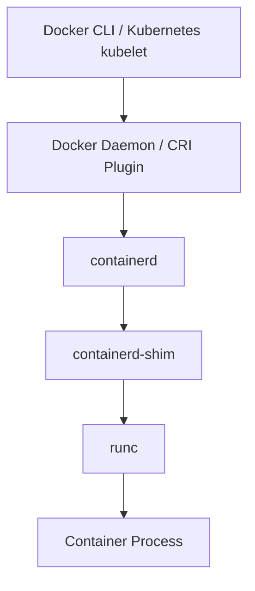
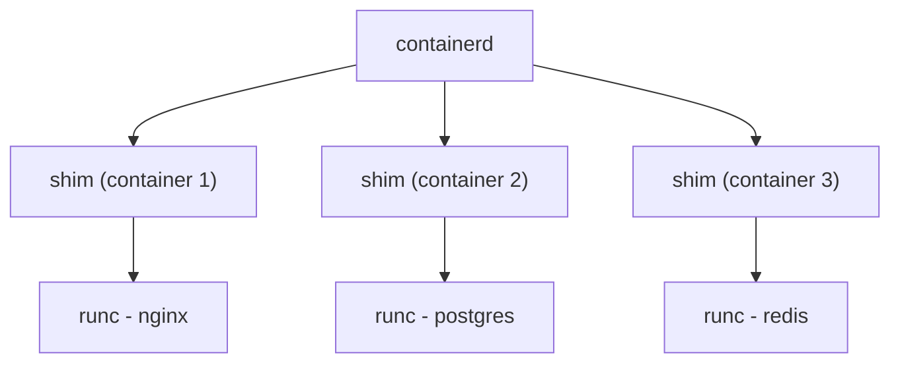

# How to Understand Docker containerd Architecture

Author: [nawazdhandala](https://github.com/nawazdhandala)

Tags: docker, containerd, container runtime, architecture, kubernetes, containers, CRI

Description: Explore the containerd architecture that powers Docker's container management, including its role as an industry-standard container runtime.

---

When Docker Inc. decided to break Docker into smaller, modular components, containerd emerged as the core container runtime. It sits between the Docker daemon and the low-level runtime (runc), managing the full container lifecycle: image pulling, storage, container execution, networking setup, and supervision. Understanding containerd is critical because it is now the default container runtime for both Docker and Kubernetes.

## Where containerd Fits

containerd is not a replacement for Docker. It is a component that Docker uses internally. Here is the full stack from top to bottom:



The Docker daemon (dockerd) handles the user-facing API, image building, and Docker Compose. It delegates actual container operations to containerd. Kubernetes can also talk to containerd directly through the CRI (Container Runtime Interface), bypassing Docker entirely.

## Installing and Checking containerd

On systems with Docker installed, containerd is already running as a separate process.

```bash
# Check if containerd is running as a system service
systemctl status containerd

# View the containerd process
ps aux | grep containerd
```

You should see two separate processes: `dockerd` and `containerd`. They communicate over a gRPC connection.

```bash
# Check the containerd version
containerd --version

# View the containerd configuration
containerd config dump | head -40
```

## containerd Architecture Overview

containerd is built around a plugin-based architecture. Everything in containerd is a plugin, from the content store to the snapshotter to the runtime.

The main subsystems include:

- **Content Store**: Stores image layers and manifests as content-addressable blobs
- **Snapshotter**: Manages filesystem snapshots (similar to Docker's storage driver)
- **Image Service**: Handles pulling, pushing, and managing container images
- **Container Service**: Creates and manages container metadata
- **Task Service**: Manages the lifecycle of running containers (start, stop, signal)
- **Events Service**: Publishes events about container lifecycle changes

```bash
# List all containerd plugins and their types
ctr plugins ls
```

## Using the ctr Command-Line Tool

containerd comes with `ctr`, a low-level CLI for interacting with containerd directly (bypassing Docker).

```bash
# Pull an image using containerd directly
sudo ctr images pull docker.io/library/nginx:latest

# List images managed by containerd
sudo ctr images ls

# Check the content store
sudo ctr content ls | head -10
```

Creating and running a container with ctr:

```bash
# Create a container from the nginx image
sudo ctr containers create docker.io/library/nginx:latest my-nginx

# Start the container (creates a "task")
sudo ctr tasks start -d my-nginx

# List running tasks
sudo ctr tasks ls

# Execute a command inside the running container
sudo ctr tasks exec --exec-id shell1 my-nginx /bin/sh

# Stop the container
sudo ctr tasks kill my-nginx

# Delete the task and container
sudo ctr tasks delete my-nginx
sudo ctr containers delete my-nginx
```

## Namespaces in containerd

containerd supports namespaces to isolate different clients. Docker uses the `moby` namespace, while Kubernetes uses the `k8s.io` namespace. This prevents them from interfering with each other.

```bash
# List all namespaces
sudo ctr namespaces ls

# List images in the Docker (moby) namespace
sudo ctr -n moby images ls

# List images in the Kubernetes namespace
sudo ctr -n k8s.io images ls

# List containers in the default namespace
sudo ctr -n default containers ls
```

This is why images pulled by Docker are not visible to Kubernetes and vice versa, even though both use the same containerd instance.

## The containerd-shim

Each running container has an associated containerd-shim process. The shim serves several important purposes:

1. It allows containerd to restart without killing running containers
2. It collects the exit status of the container process
3. It handles stdin/stdout/stderr forwarding
4. It reports the container's exit code back to containerd

```bash
# View containerd-shim processes for running containers
ps aux | grep containerd-shim

# Each shim manages exactly one container
# The --bundle flag shows which container directory it manages
```

The shim architecture means that even if containerd crashes and restarts, all running containers continue uninterrupted. The shims keep them alive.



## containerd Configuration

The containerd configuration file is typically at `/etc/containerd/config.toml`.

```toml
# /etc/containerd/config.toml
# Main containerd configuration

# Set the containerd root directory for persistent data
root = "/var/lib/containerd"

# Set the state directory for runtime state
state = "/run/containerd"

# gRPC socket configuration
[grpc]
  address = "/run/containerd/containerd.sock"
  max_recv_message_size = 16777216
  max_send_message_size = 16777216

# Plugin configuration
[plugins]
  # CRI plugin for Kubernetes integration
  [plugins."io.containerd.grpc.v1.cri"]
    sandbox_image = "registry.k8s.io/pause:3.9"

    # Container runtime configuration
    [plugins."io.containerd.grpc.v1.cri".containerd]
      default_runtime_name = "runc"

      [plugins."io.containerd.grpc.v1.cri".containerd.runtimes]
        [plugins."io.containerd.grpc.v1.cri".containerd.runtimes.runc]
          runtime_type = "io.containerd.runc.v2"
          [plugins."io.containerd.grpc.v1.cri".containerd.runtimes.runc.options]
            SystemdCgroup = true

    # Registry configuration for pulling images
    [plugins."io.containerd.grpc.v1.cri".registry]
      [plugins."io.containerd.grpc.v1.cri".registry.mirrors]
        [plugins."io.containerd.grpc.v1.cri".registry.mirrors."docker.io"]
          endpoint = ["https://registry-1.docker.io"]
```

After modifying the configuration:

```bash
# Restart containerd to apply configuration changes
sudo systemctl restart containerd

# Verify the new configuration is active
sudo containerd config dump | grep -A 5 "grpc"
```

## containerd with Kubernetes

Kubernetes adopted containerd as its preferred container runtime after deprecating the Docker shim in Kubernetes 1.24. The CRI (Container Runtime Interface) plugin in containerd translates Kubernetes requests into containerd operations.

```bash
# On a Kubernetes node, verify the container runtime
kubectl get nodes -o wide

# The CONTAINER-RUNTIME column shows "containerd://x.x.x"

# Use crictl to interact with the CRI directly
sudo crictl --runtime-endpoint unix:///run/containerd/containerd.sock ps

# List images available to Kubernetes
sudo crictl images

# View container details
sudo crictl inspect <container-id>
```

## Snapshotters

Snapshotters in containerd are equivalent to Docker's storage drivers. They manage the filesystem layers that make up container images.

```bash
# List available snapshotters
sudo ctr plugins ls | grep snapshot

# The default snapshotter is typically overlayfs
# Check which snapshotter is in use
sudo containerd config dump | grep snapshotter
```

Supported snapshotters include:
- **overlayfs** - The default, uses Linux OverlayFS
- **native** - Simple copy-based approach
- **btrfs** - For Btrfs filesystems
- **zfs** - For ZFS filesystems
- **devmapper** - Block-level thin provisioning

## Content Store

The content store is where containerd keeps all content-addressable data: image manifests, config blobs, and layer data.

```bash
# Browse the content store
sudo ctr content ls

# Fetch specific content by digest
sudo ctr content get sha256:<digest> | python3 -m json.tool

# Check the size of the content store
sudo du -sh /var/lib/containerd/io.containerd.content.v1.content/
```

## Monitoring containerd

For production environments, monitoring containerd health and performance matters.

```bash
# containerd exposes Prometheus metrics
# Check if the metrics endpoint is accessible
curl -s http://localhost:10257/v1/metrics 2>/dev/null || echo "Metrics not enabled on default port"

# Enable metrics in the config
# Add to /etc/containerd/config.toml:
# [metrics]
#   address = "127.0.0.1:10257"

# Check containerd logs for issues
sudo journalctl -u containerd -f --no-pager | head -50
```

## Troubleshooting containerd

Common issues and their solutions:

```bash
# Check containerd status and recent logs
sudo systemctl status containerd
sudo journalctl -u containerd --since "1 hour ago" --no-pager

# Verify the containerd socket is accessible
ls -la /run/containerd/containerd.sock

# Check disk usage for containerd storage
sudo du -sh /var/lib/containerd/

# Clean up unused images and snapshots
sudo ctr images ls -q | xargs -I{} sudo ctr images rm {}

# If containerd won't start, validate the configuration
sudo containerd config dump > /dev/null && echo "Config valid" || echo "Config invalid"
```

## Summary

containerd is the core container runtime that powers both Docker and Kubernetes. Its plugin-based architecture makes it extensible, while the shim model ensures container resilience. The namespace separation keeps Docker and Kubernetes containers isolated even when they share the same containerd instance. Whether you are debugging container issues, tuning Kubernetes performance, or building custom container tooling, understanding containerd gives you visibility into the layer that actually manages your containers.
