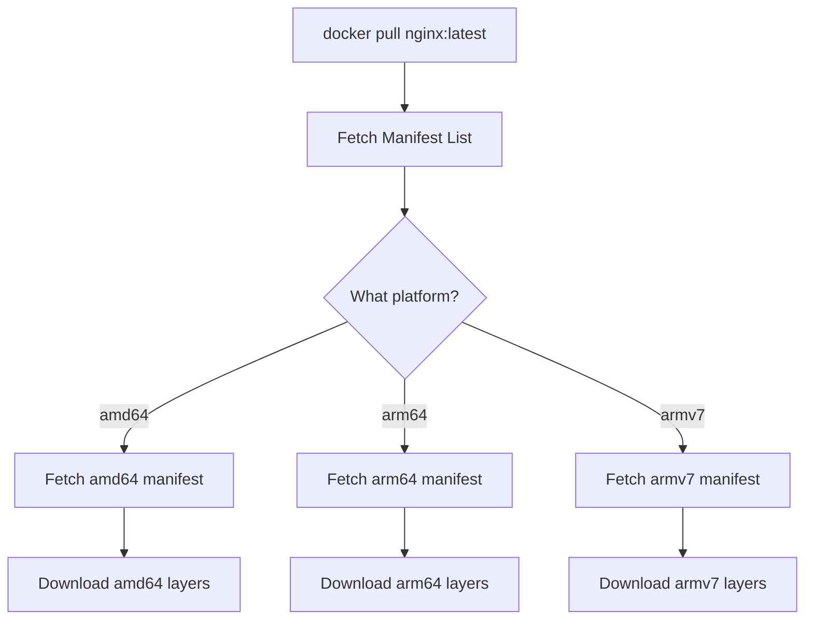

# How to Understand Docker Image Manifest Specification

Author: [nawazdhandala](https://github.com/nawazdhandala)

Tags: docker, image manifest, container registry, docker hub, OCI, image specification, multi-arch

Description: A deep dive into Docker image manifest specification, how manifests describe image layers and configuration, and how multi-architecture images work.

---

Every Docker image you pull from a registry is described by a manifest. This manifest is a JSON document that tells the Docker daemon exactly what layers to download, what configuration to use, and which platforms the image supports. Understanding manifests gives you the ability to debug image pull failures, build multi-architecture images, and interact with container registries at a low level.

## What Is an Image Manifest?

An image manifest is a JSON file that describes the contents of a Docker image. It contains references to the image configuration and an ordered list of filesystem layers. When Docker pulls an image, it first fetches the manifest, then uses the information inside to download only the layers it needs.

There are two main manifest formats in use today:

- **Docker Image Manifest V2, Schema 2** - Docker's own format
- **OCI Image Manifest** - The standardized format from the Open Container Initiative

Both serve the same purpose, and modern Docker handles both seamlessly.

## Inspecting a Manifest

You can view the manifest for any image using the `docker manifest inspect` command.

```bash
# Inspect the manifest of the official nginx image
docker manifest inspect nginx:latest
```

For more detail, use the `--verbose` flag:

```bash
# Get verbose manifest output including platform information
docker manifest inspect --verbose nginx:latest
```

You can also use `curl` to fetch a manifest directly from Docker Hub:

```bash
# First, get an authentication token from Docker Hub
TOKEN=$(curl -s "https://auth.docker.io/token?service=registry.docker.io&scope=repository:library/nginx:pull" | python3 -c "import sys,json; print(json.load(sys.stdin)['token'])")

# Fetch the manifest using the token
curl -s -H "Authorization: Bearer $TOKEN" \
  -H "Accept: application/vnd.docker.distribution.manifest.v2+json" \
  https://registry-1.docker.io/v2/library/nginx/manifests/latest | python3 -m json.tool
```

## Anatomy of a Manifest

A typical Docker Image Manifest V2 Schema 2 looks like this:

```json
{
  "schemaVersion": 2,
  "mediaType": "application/vnd.docker.distribution.manifest.v2+json",
  "config": {
    "mediaType": "application/vnd.docker.container.image.v1+json",
    "size": 7023,
    "digest": "sha256:abc123..."
  },
  "layers": [
    {
      "mediaType": "application/vnd.docker.image.rootfs.diff.tar.gzip",
      "size": 32654321,
      "digest": "sha256:def456..."
    },
    {
      "mediaType": "application/vnd.docker.image.rootfs.diff.tar.gzip",
      "size": 16724567,
      "digest": "sha256:ghi789..."
    }
  ]
}
```

Let's break down each field:

- **schemaVersion**: Always `2` for this format
- **mediaType**: Identifies this as a Docker V2 Schema 2 manifest
- **config**: Points to the image configuration blob (environment variables, entrypoint, CMD, etc.)
- **layers**: An ordered list of filesystem layer diffs, from bottom to top

Each layer entry has a digest (content-addressable hash), a size in bytes, and a media type indicating the compression format.

## The Image Configuration Blob

The config blob referenced in the manifest holds the image metadata. You can fetch it separately.

```bash
# Fetch the image config blob using its digest
# Replace the digest with the actual value from the manifest
curl -s -H "Authorization: Bearer $TOKEN" \
  -H "Accept: application/vnd.docker.container.image.v1+json" \
  https://registry-1.docker.io/v2/library/nginx/blobs/sha256:abc123... | python3 -m json.tool
```

You can also inspect it locally:

```bash
# Inspect the image configuration locally
docker inspect nginx:latest --format '{{json .Config}}' | python3 -m json.tool
```

The configuration includes environment variables, exposed ports, volumes, the entrypoint and CMD, working directory, labels, and the diff IDs for each layer.

## Multi-Architecture Manifest Lists

Modern Docker images often support multiple CPU architectures (amd64, arm64, armv7, etc.). This is handled through a manifest list (also called a "fat manifest" or OCI image index).

A manifest list is a JSON document that contains references to platform-specific manifests:

```json
{
  "schemaVersion": 2,
  "mediaType": "application/vnd.docker.distribution.manifest.list.v2+json",
  "manifests": [
    {
      "mediaType": "application/vnd.docker.distribution.manifest.v2+json",
      "size": 1570,
      "digest": "sha256:amd64manifest...",
      "platform": {
        "architecture": "amd64",
        "os": "linux"
      }
    },
    {
      "mediaType": "application/vnd.docker.distribution.manifest.v2+json",
      "size": 1570,
      "digest": "sha256:arm64manifest...",
      "platform": {
        "architecture": "arm64",
        "os": "linux"
      }
    }
  ]
}
```

When you run `docker pull nginx:latest` on an ARM Mac, Docker fetches the manifest list first, finds the entry matching `arm64/linux`, and then pulls only that platform-specific manifest and its layers.



## Creating Multi-Architecture Manifests

You can create your own multi-architecture images using `docker buildx`.

```bash
# Create a new builder that supports multi-platform builds
docker buildx create --name multiarch --driver docker-container --use

# Build and push an image for multiple architectures
docker buildx build \
  --platform linux/amd64,linux/arm64,linux/arm/v7 \
  --tag myregistry/myapp:latest \
  --push .
```

You can also manually assemble a manifest list from existing single-platform images:

```bash
# Create a manifest list from two platform-specific images
docker manifest create myregistry/myapp:latest \
  myregistry/myapp:amd64 \
  myregistry/myapp:arm64

# Annotate each image with its platform details
docker manifest annotate myregistry/myapp:latest \
  myregistry/myapp:arm64 --os linux --arch arm64

# Push the manifest list to the registry
docker manifest push myregistry/myapp:latest
```

## Content Addressability and Digests

Every manifest, config blob, and layer in Docker is identified by its content hash (digest). This gives you several guarantees:

- **Immutability**: A digest always refers to exactly the same content
- **Integrity**: You can verify that downloaded content matches its expected digest
- **Deduplication**: Identical layers across different images are stored only once

```bash
# Pull an image by its manifest digest for absolute reproducibility
docker pull nginx@sha256:abc123def456...

# Compare: pulling by tag can give different content over time
docker pull nginx:latest
```

Using digest-based references in production Dockerfiles and deployment manifests ensures you always get exactly the image you tested with.

## Inspecting Manifests with crane and skopeo

The `crane` and `skopeo` tools provide additional ways to work with manifests without pulling full images.

```bash
# Using crane to inspect a manifest (install: go install github.com/google/go-containerregistry/cmd/crane@latest)
crane manifest nginx:latest | python3 -m json.tool

# Using skopeo to inspect image details from a remote registry
skopeo inspect docker://docker.io/library/nginx:latest

# Copy an image between registries without pulling to local disk
skopeo copy docker://docker.io/library/nginx:latest docker://myregistry.com/nginx:latest
```

## Manifest Media Types Reference

Here is a reference table of the common media types you will encounter:

| Media Type | Description |
|-----------|-------------|
| `application/vnd.docker.distribution.manifest.v2+json` | Docker V2 Schema 2 manifest |
| `application/vnd.docker.distribution.manifest.list.v2+json` | Docker manifest list |
| `application/vnd.oci.image.manifest.v1+json` | OCI image manifest |
| `application/vnd.oci.image.index.v1+json` | OCI image index |
| `application/vnd.docker.container.image.v1+json` | Image config blob |
| `application/vnd.docker.image.rootfs.diff.tar.gzip` | Gzipped layer diff |

## Debugging Manifest Issues

When image pulls fail, manifest problems are often the cause. Common issues include:

```bash
# Check if an image exists in a registry
crane ls nginx | head -20

# Verify a specific tag exists
crane digest nginx:latest

# Check platform support for an image
docker manifest inspect --verbose nginx:latest | python3 -c "
import sys, json
data = json.load(sys.stdin)
if isinstance(data, list):
    for entry in data:
        p = entry.get('Descriptor', {}).get('platform', {})
        print(f\"{p.get('os')}/{p.get('architecture')}\")
"
```

## Summary

Docker image manifests are the glue between tags and actual image content. They describe which layers to download, which configuration to apply, and which platforms are supported. Whether you are debugging a failed pull, building multi-architecture images, or automating registry operations, a solid understanding of manifests is essential. The manifest specification is straightforward JSON, and the tools to inspect and manipulate manifests are readily available.
