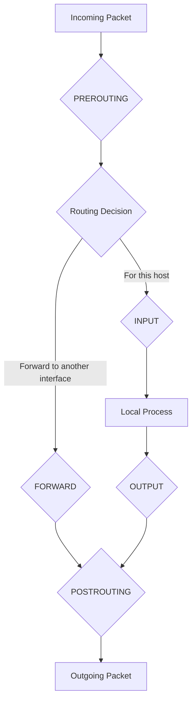

# How to Understand Docker iptables Rules

Author: [nawazdhandala](https://github.com/nawazdhandala)

Tags: Docker, iptables, Networking, Firewall, Linux, Security, Containers

Description: Understand how Docker uses iptables to manage container networking, port publishing, and traffic filtering.

---

Docker relies heavily on iptables to implement container networking. Every time you publish a port, create a network, or start a container, Docker inserts iptables rules behind the scenes. These rules handle NAT (Network Address Translation), packet forwarding, and traffic isolation. If you manage Docker on a Linux host, understanding these rules is essential for troubleshooting network issues and securing your infrastructure.

This guide walks through every iptables chain Docker creates, explains what each rule does, and shows you how to read and interpret the full rule set.

## How iptables Works (Quick Refresher)

iptables organizes rules into tables and chains. Docker uses three tables:

- **filter** - Decides whether to accept or drop packets
- **nat** - Rewrites source or destination addresses
- **mangle** - Modifies packet headers (rarely used by Docker)

Each table contains chains that process packets at different stages:



## Docker's iptables Chains

Docker creates several custom chains. List them all:

```bash
# Show all Docker-related chains in the filter table
sudo iptables -L -n | grep -E "^Chain (DOCKER|FORWARD)"

# Show all Docker-related chains in the nat table
sudo iptables -t nat -L -n | grep "^Chain"
```

The main chains Docker uses:

- **DOCKER** (filter) - Container-specific allow rules
- **DOCKER-ISOLATION-STAGE-1** and **DOCKER-ISOLATION-STAGE-2** (filter) - Network isolation rules
- **DOCKER** (nat) - DNAT rules for published ports
- **DOCKER-USER** (filter) - User-defined rules that Docker respects

## The NAT Table: Port Publishing

When you run `docker run -p 8080:80 nginx`, Docker adds a DNAT rule:

```bash
# View the DNAT rules in the nat table
sudo iptables -t nat -L DOCKER -n -v --line-numbers
```

Typical output:

```
Chain DOCKER (2 references)
num   pkts bytes target     prot opt in     out     source       destination
1     0    0     RETURN     all  --  docker0 *       0.0.0.0/0    0.0.0.0/0
2     45   2700  DNAT       tcp  --  !docker0 *      0.0.0.0/0    0.0.0.0/0    tcp dpt:8080 to:172.17.0.2:80
```

Breaking down rule 2:

- `DNAT` - Destination NAT, rewrites the destination address
- `tcp` - Only applies to TCP packets
- `!docker0` - Matches packets NOT coming from the docker0 bridge (external traffic)
- `dpt:8080` - Matches packets destined for port 8080 on the host
- `to:172.17.0.2:80` - Rewrites the destination to the container's IP and port

## The PREROUTING Chain

The PREROUTING chain in the nat table is where Docker hooks in:

```bash
# View the PREROUTING chain to see how Docker integrates
sudo iptables -t nat -L PREROUTING -n -v
```

You will see a jump to the DOCKER chain:

```
Chain PREROUTING (policy ACCEPT)
target     prot opt in     out     source       destination
DOCKER     all  --  *      *       0.0.0.0/0    0.0.0.0/0    ADDRTYPE match dst-type LOCAL
```

This means: for any packet whose destination is a local address, jump to the DOCKER chain for potential DNAT processing.

## The POSTROUTING Chain: Masquerading

Containers need their outbound traffic to appear as if it comes from the host. Docker adds masquerade rules:

```bash
# View POSTROUTING rules for source NAT (masquerading)
sudo iptables -t nat -L POSTROUTING -n -v
```

```
Chain POSTROUTING (policy ACCEPT)
target      prot opt in     out     source          destination
MASQUERADE  all  --  *      !docker0 172.17.0.0/16  0.0.0.0/0
MASQUERADE  tcp  --  *      *       172.17.0.2      172.17.0.2   tcp dpt:80
```

The first rule: any packet from the Docker subnet (172.17.0.0/16) leaving through any interface except docker0 gets its source address rewritten to the host's address. This is how containers access the internet.

The second rule handles hairpin NAT, where a container accesses its own published port.

## The FORWARD Chain: Packet Forwarding

The filter table's FORWARD chain controls whether packets can traverse between interfaces:

```bash
# View the FORWARD chain rules
sudo iptables -L FORWARD -n -v --line-numbers
```

```
Chain FORWARD (policy DROP)
num   pkts bytes target                    prot opt in      out      source       destination
1     0    0     DOCKER-USER               all  --  *       *        0.0.0.0/0    0.0.0.0/0
2     0    0     DOCKER-ISOLATION-STAGE-1  all  --  *       *        0.0.0.0/0    0.0.0.0/0
3     234  14040 ACCEPT                    all  --  *       docker0  0.0.0.0/0    0.0.0.0/0    ctstate RELATED,ESTABLISHED
4     45   2700  DOCKER                    all  --  *       docker0  0.0.0.0/0    0.0.0.0/0
5     312  18720 ACCEPT                    all  --  docker0 !docker0 0.0.0.0/0    0.0.0.0/0
6     0    0     ACCEPT                    all  --  docker0 docker0  0.0.0.0/0    0.0.0.0/0
```

Reading these rules in order:

1. First, check DOCKER-USER for user-defined rules
2. Then, check isolation rules between Docker networks
3. Allow established connections into docker0
4. Jump to DOCKER chain for new connections to published ports
5. Allow outbound traffic from docker0 to other interfaces
6. Allow traffic within docker0 (container-to-container)

## Network Isolation Rules

Docker prevents containers on different networks from communicating:

```bash
# View isolation rules
sudo iptables -L DOCKER-ISOLATION-STAGE-1 -n -v
sudo iptables -L DOCKER-ISOLATION-STAGE-2 -n -v
```

```
Chain DOCKER-ISOLATION-STAGE-1 (1 references)
target                    prot opt in      out     source       destination
DOCKER-ISOLATION-STAGE-2  all  --  docker0 !docker0 0.0.0.0/0  0.0.0.0/0
RETURN                    all  --  *       *       0.0.0.0/0    0.0.0.0/0

Chain DOCKER-ISOLATION-STAGE-2 (1 references)
target  prot opt in     out     source       destination
DROP    all  --  *      docker0 0.0.0.0/0    0.0.0.0/0
RETURN  all  --  *      *       0.0.0.0/0    0.0.0.0/0
```

These two stages work together: if a packet enters from one bridge and is headed for a different bridge, drop it. This prevents cross-network traffic between Docker networks.

## The DOCKER-USER Chain

This is where you should add your own rules. Docker never modifies DOCKER-USER:

```bash
# View the DOCKER-USER chain (initially just a RETURN rule)
sudo iptables -L DOCKER-USER -n -v
```

```
Chain DOCKER-USER (1 references)
target  prot opt in     out     source       destination
RETURN  all  --  *      *       0.0.0.0/0    0.0.0.0/0
```

Add custom rules before the RETURN:

```bash
# Block external access to published ports from a specific IP range
sudo iptables -I DOCKER-USER -s 10.0.0.0/8 -j DROP

# Allow only specific IPs to access a published port
sudo iptables -I DOCKER-USER -p tcp --dport 8080 -s 192.168.1.0/24 -j ACCEPT
sudo iptables -I DOCKER-USER -p tcp --dport 8080 -j DROP
```

## Tracing a Packet Through the Rules

Let's trace what happens when an external client connects to a published port:

```bash
# Enable iptables logging for the DOCKER chain to trace packet flow
sudo iptables -t nat -I DOCKER -p tcp --dport 8080 -j LOG --log-prefix "DOCKER-NAT: "
sudo iptables -I FORWARD -p tcp --dport 80 -d 172.17.0.2 -j LOG --log-prefix "DOCKER-FWD: "

# Watch the logs while making a request
sudo journalctl -f -k | grep DOCKER &
curl http://localhost:8080

# Clean up the logging rules when done
sudo iptables -t nat -D DOCKER -p tcp --dport 8080 -j LOG --log-prefix "DOCKER-NAT: "
sudo iptables -D FORWARD -p tcp --dport 80 -d 172.17.0.2 -j LOG --log-prefix "DOCKER-FWD: "
```

## Saving and Persisting Rules

Docker regenerates its iptables rules on restart. Your custom rules in DOCKER-USER need to be persisted separately:

```bash
# Save current iptables rules including Docker-generated ones
sudo iptables-save > /tmp/iptables-backup.txt

# To persist only your DOCKER-USER rules, save them separately
sudo iptables-save -t filter | grep DOCKER-USER > /etc/iptables/docker-user.rules
```

## Common Troubleshooting

When containers cannot reach the internet:

```bash
# Check if IP forwarding is enabled (must be 1)
cat /proc/sys/net/ipv4/ip_forward

# Check if the MASQUERADE rule exists
sudo iptables -t nat -L POSTROUTING -n | grep MASQUERADE

# Verify the FORWARD chain default policy
sudo iptables -L FORWARD -n | head -1
```

When published ports are not accessible:

```bash
# Verify the DNAT rule exists for your port
sudo iptables -t nat -L DOCKER -n | grep 8080

# Check that no DOCKER-USER rule is blocking traffic
sudo iptables -L DOCKER-USER -n -v

# Make sure the container is running and listening
docker exec <container> ss -tlnp
```

## Conclusion

Docker's iptables rules implement the container networking stack. They handle port publishing through DNAT, outbound access through masquerading, cross-network isolation through the two-stage isolation chains, and user customization through DOCKER-USER. When networking problems arise, reading these rules line by line reveals exactly where packets are being accepted, rejected, or rewritten. Keep `iptables -L -n -v` and `iptables -t nat -L -n -v` in your debugging toolkit.
