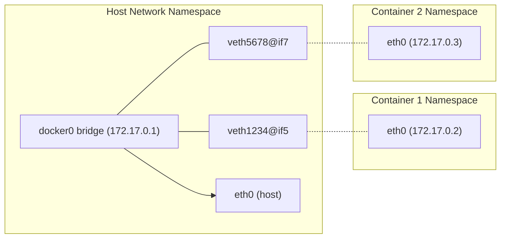

# How to Understand Docker Networking Internals (veth pairs, bridges)

Author: [nawazdhandala](https://github.com/nawazdhandala)

Tags: docker, networking, veth, bridge, iptables, container networking, linux networking

Description: A hands-on guide to Docker networking internals covering veth pairs, Linux bridges, iptables rules, and how containers communicate with each other.

---

Docker networking looks simple from the outside. You run a container with `-p 8080:80` and it works. But beneath that simplicity is a sophisticated setup involving Linux bridges, virtual ethernet pairs, iptables rules, and network namespaces. Understanding these internals helps you debug connectivity issues, optimize network performance, and design better container architectures.

## Docker's Default Bridge Network

When Docker installs, it creates a Linux bridge called `docker0`. This bridge acts as a virtual switch that connects all containers on the default bridge network.

```bash
# View the docker0 bridge interface
ip addr show docker0

# See the bridge details
bridge link show

# Check Docker's network list
docker network ls
```

The `docker0` bridge typically gets an IP address like `172.17.0.1`. Each container on this network gets an IP from the `172.17.0.0/16` subnet.

## Virtual Ethernet (veth) Pairs

When Docker starts a container, it creates a virtual ethernet pair. A veth pair is like a virtual cable with two ends. One end goes into the container's network namespace, and the other end connects to the `docker0` bridge on the host.

```bash
# Start a container so we can examine the networking
docker run -d --name net-demo nginx:latest

# List all veth interfaces on the host
ip link show type veth

# Show the bridge and its connected interfaces
bridge link show docker0
```

Let's trace the connection from container to host:

```bash
# Get the container's PID
CONTAINER_PID=$(docker inspect --format '{{.State.Pid}}' net-demo)

# Look at the network interfaces inside the container's namespace
sudo nsenter --target $CONTAINER_PID --net ip addr

# The eth0 interface inside the container is one end of the veth pair
# The other end is attached to docker0 on the host
```

Here is how the pieces connect:



## How Container-to-Container Communication Works

Containers on the same bridge network can communicate directly through the bridge. The packet flow looks like this:

1. Container A sends a packet to Container B's IP
2. The packet leaves Container A through its `eth0` (one end of the veth pair)
3. The packet arrives at the host side of the veth pair
4. The docker0 bridge forwards the packet to Container B's veth pair
5. The packet arrives at Container B's `eth0`

```bash
# Start a second container
docker run -d --name net-demo2 alpine sleep 3600

# Get Container B's IP
CONTAINER_B_IP=$(docker inspect --format '{{.NetworkSettings.IPAddress}}' net-demo2)

# Ping Container B from Container A
docker exec net-demo apt-get update && docker exec net-demo apt-get install -y iputils-ping
docker exec net-demo ping -c 3 $CONTAINER_B_IP
```

## Tracing Packets with tcpdump

You can observe the actual packet flow using tcpdump.

```bash
# Capture packets on the docker0 bridge
# Run this in one terminal
sudo tcpdump -i docker0 -n icmp

# In another terminal, generate traffic between containers
docker exec net-demo ping -c 3 $CONTAINER_B_IP
```

You can also capture packets on the veth interface:

```bash
# Find the veth interface for a specific container
VETH=$(ip link show | grep -A1 "$(docker exec net-demo cat /sys/class/net/eth0/iflink)" | head -1 | awk -F: '{print $2}' | tr -d ' ')

# Capture packets on that specific veth interface
sudo tcpdump -i $VETH -n
```

## iptables Rules for Port Publishing

When you publish a port with `-p 8080:80`, Docker creates iptables rules to forward traffic from the host port to the container port.

```bash
# View the NAT table rules Docker creates for port mapping
sudo iptables -t nat -L -n -v | head -30

# Look specifically at the DOCKER chain
sudo iptables -t nat -L DOCKER -n -v

# View the filter table rules
sudo iptables -L DOCKER -n -v
```

The key iptables chains Docker uses:

- **DOCKER (nat table)**: DNAT rules that redirect incoming traffic to container IPs
- **DOCKER (filter table)**: Rules that allow or deny container communication
- **DOCKER-ISOLATION-STAGE-1/2**: Rules that prevent traffic between different Docker networks

```bash
# Start a container with port mapping and observe the iptables rules
docker run -d --name web -p 8080:80 nginx:latest

# Check the DNAT rule that redirects host:8080 to container:80
sudo iptables -t nat -L DOCKER -n -v
```

You will see a rule like:

```
DNAT tcp -- 0.0.0.0/0 0.0.0.0/0 tcp dpt:8080 to:172.17.0.4:80
```

## User-Defined Bridge Networks

Docker's default bridge has limitations. User-defined bridge networks offer better features.

```bash
# Create a custom bridge network
docker network create --driver bridge --subnet 10.10.0.0/24 my-network

# A new bridge interface appears on the host
ip link show type bridge

# Start containers on the custom network
docker run -d --name app1 --network my-network nginx:latest
docker run -d --name app2 --network my-network alpine sleep 3600

# Containers on user-defined networks get automatic DNS resolution
docker exec app2 ping -c 3 app1
```

User-defined bridges provide DNS-based service discovery. You can reach containers by name instead of IP address. The default bridge does not provide this feature.

## Network Namespaces Under the Hood

Each container gets its own network namespace. You can list and inspect them.

```bash
# Docker does not register namespaces in /var/run/netns by default
# Create a symbolic link to make them visible to the ip command
CONTAINER_PID=$(docker inspect --format '{{.State.Pid}}' net-demo)
sudo mkdir -p /var/run/netns
sudo ln -sf /proc/$CONTAINER_PID/ns/net /var/run/netns/net-demo

# Now you can use standard ip netns commands
sudo ip netns exec net-demo ip addr
sudo ip netns exec net-demo ip route
sudo ip netns exec net-demo ss -tlnp

# Clean up the symlink
sudo rm /var/run/netns/net-demo
```

## Host Network Mode

When you use `--network host`, the container shares the host's network namespace directly. No veth pairs or bridges are involved.

```bash
# Run a container in host network mode
docker run -d --name host-mode --network host nginx:latest

# The nginx process binds directly to the host's port 80
ss -tlnp | grep :80

# No veth pair is created for this container
docker inspect --format '{{.NetworkSettings.Networks}}' host-mode
```

Host mode gives the best network performance because there is no virtual networking overhead. The tradeoff is that you lose network isolation.

## Macvlan and IPvlan

For scenarios where containers need to appear as physical devices on the network, Docker supports macvlan and ipvlan drivers.

```bash
# Create a macvlan network that assigns containers real IPs from your LAN
docker network create -d macvlan \
  --subnet=192.168.1.0/24 \
  --gateway=192.168.1.1 \
  -o parent=eth0 \
  my-macvlan

# Containers on this network get IPs that are routable on your LAN
docker run -d --name macvlan-demo --network my-macvlan --ip 192.168.1.200 nginx:latest
```

## DNS Resolution Inside Containers

Docker runs an embedded DNS server at `127.0.0.11` for user-defined networks.

```bash
# Check DNS configuration inside a container on a user-defined network
docker exec app1 cat /etc/resolv.conf

# You should see:
# nameserver 127.0.0.11
```

This embedded DNS server resolves container names to their IP addresses and forwards other queries to the host's configured DNS servers.

## Troubleshooting Network Issues

When container networking breaks, here are the diagnostic commands to use:

```bash
# Check if the docker0 bridge exists and has an IP
ip addr show docker0

# Verify iptables forwarding is enabled
cat /proc/sys/net/ipv4/ip_forward

# Check if Docker's iptables rules are in place
sudo iptables -t nat -L DOCKER -n
sudo iptables -L DOCKER-ISOLATION-STAGE-1 -n

# Test connectivity from inside a container
docker exec net-demo ping -c 1 8.8.8.8
docker exec net-demo nslookup google.com

# Check for port conflicts on the host
ss -tlnp | grep :8080
```

## Clean Up

```bash
# Remove all demo containers and networks
docker rm -f net-demo net-demo2 web app1 app2 host-mode macvlan-demo 2>/dev/null
docker network rm my-network my-macvlan 2>/dev/null
```

## Summary

Docker networking is built on standard Linux networking primitives. veth pairs create the virtual cables, Linux bridges act as virtual switches, network namespaces provide isolation, and iptables handles port forwarding and access control. Knowing these internals transforms network debugging from guesswork into systematic investigation. When a container cannot reach the internet, you can check the bridge, trace the veth pair, inspect the iptables rules, and verify DNS resolution, all using standard Linux networking tools.
