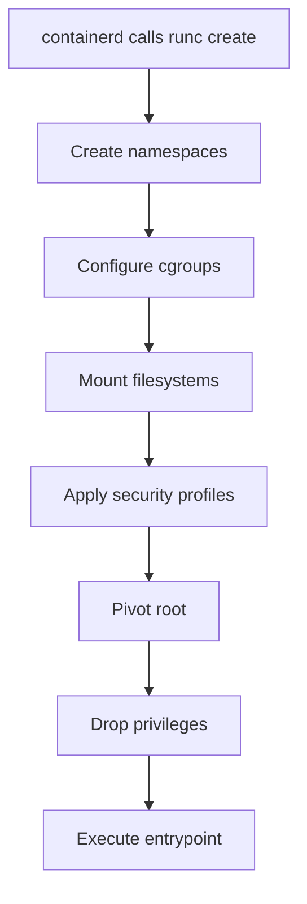

# How to Understand Docker runc and Container Runtimes

Author: [nawazdhandala](https://github.com/nawazdhandala)

Tags: docker, runc, container runtime, OCI, namespaces, cgroups, containers, linux

Description: Learn how runc works as the low-level OCI container runtime that actually creates and runs containers using Linux kernel primitives.

---

runc is the tool that actually creates and runs containers. While Docker and containerd handle the high-level orchestration, image management, and networking, runc is the component that interacts with the Linux kernel to set up namespaces, configure cgroups, and launch the container process. It is the reference implementation of the OCI Runtime Specification, and nearly every container you have ever run was started by runc.

## What runc Actually Does

When containerd needs to start a container, it prepares an OCI bundle (a root filesystem plus a config.json) and hands it to runc. runc then performs these steps:

1. Creates Linux namespaces for isolation (pid, network, mount, ipc, uts, user)
2. Sets up cgroups for resource limits (CPU, memory, I/O)
3. Mounts the root filesystem and special filesystems (proc, sysfs, etc.)
4. Applies security settings (seccomp, AppArmor, SELinux)
5. Pivots the root to the container filesystem
6. Drops privileges if configured
7. Executes the container's entrypoint process



## Installing runc Standalone

runc can be used independently of Docker. This is useful for learning and debugging.

```bash
# Check if runc is installed (it comes with Docker)
runc --version

# If you need to install it separately
# Download the latest release from GitHub
curl -LO https://github.com/opencontainers/runc/releases/download/v1.1.12/runc.amd64

# Install it
sudo install -m 755 runc.amd64 /usr/local/sbin/runc

# Verify the installation
runc --version
```

## Running a Container with runc

Let's create an OCI bundle from scratch and run it with runc.

```bash
# Create the bundle directory structure
mkdir -p /tmp/runc-demo/rootfs

# Export an Alpine filesystem to use as rootfs
docker export $(docker create alpine:latest) | tar -C /tmp/runc-demo/rootfs -xf -

# Generate the default OCI runtime configuration
cd /tmp/runc-demo
runc spec
```

The `runc spec` command creates a default `config.json`. Let's look at what it contains:

```bash
# View the key sections of the generated config
cat config.json | python3 -m json.tool
```

Now run the container:

```bash
# Run the container interactively
# The container ID "demo" is arbitrary
cd /tmp/runc-demo
sudo runc run demo
```

You are now inside a container created directly by runc, without Docker or containerd involved. Type `exit` to leave.

## The Container Lifecycle with runc

runc supports a multi-step lifecycle that allows for more control than a simple "run" command.

```bash
# Step 1: Create the container without starting the user process
cd /tmp/runc-demo
sudo runc create demo

# Step 2: Check the container state (should be "created")
sudo runc state demo

# Step 3: Start the user process
sudo runc start demo

# Step 4: List running containers
sudo runc list

# Step 5: Send a signal to the container
sudo runc kill demo SIGTERM

# Step 6: Delete the container
sudo runc delete demo
```

The separation between "create" and "start" exists because some systems need to perform additional setup (like network configuration) after the container environment is ready but before the user process begins.

## Linux Namespaces in Detail

Namespaces are the primary isolation mechanism. Each namespace type isolates a different aspect of the system.

### PID Namespace

The PID namespace gives the container its own process tree. The first process in the container gets PID 1.

```bash
# From inside a container, the process tree starts at PID 1
# From outside, the container processes have different PIDs

# Check the PID namespace of a Docker container
CONTAINER_PID=$(docker inspect --format '{{.State.Pid}}' my-container)
sudo ls -la /proc/$CONTAINER_PID/ns/pid
```

### Network Namespace

Each container gets its own network stack with its own interfaces, routing table, and iptables rules.

```bash
# List network namespaces on the system
sudo ip netns list

# Check the network namespace of a running container
sudo nsenter --target $CONTAINER_PID --net ip addr
```

### Mount Namespace

The mount namespace gives the container its own filesystem view. Mounts inside the container do not affect the host.

```bash
# View the mounts inside a container
sudo nsenter --target $CONTAINER_PID --mount cat /proc/mounts
```

## Cgroups for Resource Control

runc uses cgroups to enforce resource limits defined in config.json.

```bash
# Check which cgroup version your system uses
stat -fc %T /sys/fs/cgroup/

# For cgroup v2 (unified), the output is "cgroup2fs"
# For cgroup v1, it is "tmpfs"
```

Setting resource limits in the OCI config:

```json
{
  "linux": {
    "resources": {
      "memory": {
        "limit": 268435456,
        "reservation": 134217728
      },
      "cpu": {
        "shares": 512,
        "quota": 50000,
        "period": 100000
      },
      "pids": {
        "limit": 100
      }
    }
  }
}
```

This configuration limits the container to 256 MB of memory, 50% CPU time (50000/100000 microseconds), and 100 processes.

```bash
# Verify cgroup limits for a Docker container
CONTAINER_ID=$(docker inspect --format '{{.Id}}' my-container)

# On cgroup v2
cat /sys/fs/cgroup/system.slice/docker-${CONTAINER_ID}.scope/memory.max
cat /sys/fs/cgroup/system.slice/docker-${CONTAINER_ID}.scope/cpu.max
cat /sys/fs/cgroup/system.slice/docker-${CONTAINER_ID}.scope/pids.max
```

## Security Features

runc applies multiple security layers to harden containers.

### Seccomp

Seccomp filters restrict which system calls the container can make. Docker ships a default seccomp profile that blocks dangerous syscalls like `reboot`, `mount`, and `kexec_load`.

```bash
# View Docker's default seccomp profile
docker info --format '{{.SecurityOptions}}'

# Run a container with a custom seccomp profile
docker run --security-opt seccomp=/path/to/profile.json nginx:latest
```

### AppArmor and SELinux

runc supports both AppArmor (Debian/Ubuntu) and SELinux (RHEL/CentOS) for mandatory access control.

```bash
# Check which security modules are active
cat /sys/kernel/security/lsm

# View the AppArmor profile for a Docker container
docker inspect --format '{{.AppArmorProfile}}' my-container
```

### Capabilities

Linux capabilities allow fine-grained control over which privileged operations a container can perform.

```bash
# View the capabilities of a running container process
sudo cat /proc/$CONTAINER_PID/status | grep Cap

# Decode capability values
capsh --decode=00000000a80425fb
```

The OCI config.json allows you to specify exactly which capabilities to grant:

```json
{
  "process": {
    "capabilities": {
      "bounding": ["CAP_NET_BIND_SERVICE", "CAP_KILL"],
      "effective": ["CAP_NET_BIND_SERVICE"],
      "permitted": ["CAP_NET_BIND_SERVICE", "CAP_KILL"],
      "ambient": [],
      "inheritable": []
    }
  }
}
```

## Alternative OCI Runtimes

runc is the reference implementation, but several alternatives exist:

| Runtime | Language | Key Feature |
|---------|----------|-------------|
| runc | Go | Reference implementation, most widely used |
| crun | C | Faster startup, lower memory usage |
| youki | Rust | Memory safety, modern language |
| gVisor (runsc) | Go | Kernel-level sandboxing |
| Kata Containers | Go | Hardware virtualization for each container |

You can configure Docker or containerd to use an alternative runtime:

```bash
# Run a container with gVisor for extra isolation
docker run --runtime=runsc nginx:latest

# Or configure the default runtime in /etc/docker/daemon.json
# {
#   "default-runtime": "runc",
#   "runtimes": {
#     "runsc": {
#       "path": "/usr/local/bin/runsc"
#     },
#     "crun": {
#       "path": "/usr/local/bin/crun"
#     }
#   }
# }
```

## Debugging with runc

runc includes debugging capabilities that can help when containers behave unexpectedly.

```bash
# Run runc with debug logging enabled
sudo runc --debug run demo 2> /tmp/runc-debug.log

# View the debug output
cat /tmp/runc-debug.log

# Check the container's state in detail
sudo runc state demo

# View container events
sudo runc events demo
```

## Clean Up

```bash
# Remove the demo bundle
sudo rm -rf /tmp/runc-demo
```

## Summary

runc is the workhorse at the bottom of the container stack. It translates the OCI runtime specification into actual Linux kernel operations: namespaces for isolation, cgroups for resource limits, seccomp and capabilities for security. Every container you run through Docker, Kubernetes, or Podman ultimately goes through an OCI-compliant runtime like runc. Understanding runc gives you the ability to debug container issues at the lowest level and make informed decisions about security and performance.
