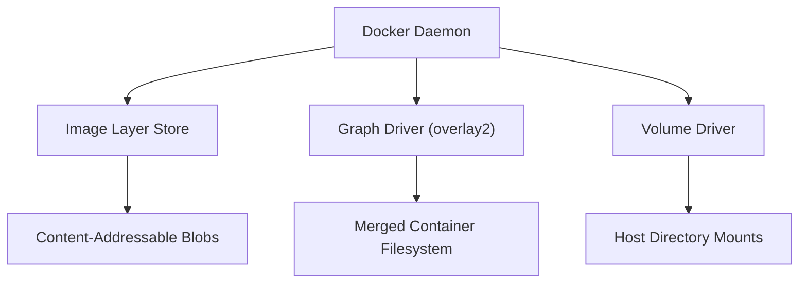

# How to Understand Docker Storage Internals (graph driver, layer store)

Author: [nawazdhandala](https://github.com/nawazdhandala)

Tags: docker, storage, graph driver, layer store, overlay2, volumes, containers

Description: Understand Docker's storage architecture including graph drivers, the layer store, content-addressable storage, and how volumes work under the hood.

---

Docker's storage system is more complex than it appears. When you pull an image, each layer gets stored in a content-addressable store. When you run a container, a writable layer gets stacked on top. When you create a volume, Docker manages a separate directory on the host filesystem. Understanding these internals lets you optimize disk usage, diagnose storage problems, and make better decisions about where to put your data.

## The Big Picture

Docker's storage system has three main components:

1. **Image Layer Store** - Stores read-only image layers
2. **Graph Driver (Snapshotter)** - Manages how layers are stacked and presented to containers
3. **Volume Driver** - Manages persistent data storage



## Content-Addressable Storage

Docker stores all image data using content-addressable storage. Every piece of data is identified by its SHA256 hash. This approach provides deduplication, integrity verification, and immutability.

```bash
# View where Docker stores its data
sudo ls /var/lib/docker/

# The image directory contains the layer metadata
sudo ls /var/lib/docker/image/overlay2/

# The layerdb stores information about each layer
sudo ls /var/lib/docker/image/overlay2/layerdb/sha256/ | head -10

# The imagedb stores image configuration
sudo ls /var/lib/docker/image/overlay2/imagedb/content/sha256/ | head -10
```

Each image layer has several identifiers:

- **diffID**: The SHA256 of the uncompressed layer content
- **chainID**: A hash computed from the diffID and the parent chainID (used to identify a layer in its stack context)
- **cacheID**: A randomly generated ID used to reference the layer data on disk

```bash
# View the diff IDs for an image
docker inspect nginx:latest --format '{{json .RootFS.Layers}}' | python3 -m json.tool

# Look up a specific layer's metadata
LAYER_CHAIN_ID=$(sudo ls /var/lib/docker/image/overlay2/layerdb/sha256/ | head -1)
sudo cat /var/lib/docker/image/overlay2/layerdb/sha256/$LAYER_CHAIN_ID/diff
sudo cat /var/lib/docker/image/overlay2/layerdb/sha256/$LAYER_CHAIN_ID/cache-id
sudo cat /var/lib/docker/image/overlay2/layerdb/sha256/$LAYER_CHAIN_ID/size
```

## The Graph Driver (overlay2)

The graph driver is responsible for assembling layers into a coherent filesystem. On modern Linux, overlay2 is the default.

```bash
# Confirm the active storage driver
docker info --format '{{.Driver}}'

# List all layer directories managed by overlay2
sudo ls /var/lib/docker/overlay2/ | head -20

# Count total layers
sudo ls /var/lib/docker/overlay2/ | wc -l
```

Each directory under `/var/lib/docker/overlay2/` corresponds to a layer. Let's examine one:

```bash
# Pick a layer directory and examine its contents
LAYER_DIR=$(sudo ls /var/lib/docker/overlay2/ | head -1)
sudo ls -la /var/lib/docker/overlay2/$LAYER_DIR/

# diff/ contains the actual filesystem changes
# link contains the shortened symlink name
# lower lists the layers below this one (if any)
# work/ is used by OverlayFS internally
```

## How Layers Get Mounted for Containers

When a container starts, Docker uses the graph driver to create a merged view of all layers.

```bash
# Start a container and examine its mount
docker run -d --name storage-demo nginx:latest

# Get the mount information for the container
docker inspect storage-demo --format '{{json .GraphDriver.Data}}' | python3 -m json.tool
```

The output shows four paths:

```json
{
  "LowerDir": "/var/lib/docker/overlay2/abc.../diff:/var/lib/docker/overlay2/def.../diff",
  "MergedDir": "/var/lib/docker/overlay2/xyz.../merged",
  "UpperDir": "/var/lib/docker/overlay2/xyz.../diff",
  "WorkDir": "/var/lib/docker/overlay2/xyz.../work"
}
```

You can verify the mount:

```bash
# Check the actual OverlayFS mount
mount | grep overlay | grep $(docker inspect storage-demo --format '{{.Id}}' | cut -c1-12)

# Or use findmnt for a cleaner view
findmnt -t overlay
```

## Container Writable Layer

Every running container gets a thin writable layer on top of the image layers. All file modifications, creations, and deletions happen in this layer.

```bash
# Check the size of the container's writable layer
docker inspect storage-demo --format '{{.SizeRw}}'

# Write some data inside the container
docker exec storage-demo bash -c "dd if=/dev/zero of=/tmp/testfile bs=1M count=50"

# Check the writable layer size again
docker inspect storage-demo --format '{{.SizeRw}}'

# View what changed in the container's filesystem
docker diff storage-demo
```

The `docker diff` output shows:
- `A` - Added files
- `C` - Changed files
- `D` - Deleted files

```bash
# Examine the actual files in the upper (writable) directory
UPPER_DIR=$(docker inspect storage-demo --format '{{.GraphDriver.Data.UpperDir}}')
sudo ls -la $UPPER_DIR/
sudo du -sh $UPPER_DIR/
```

## Docker Volumes

Volumes bypass the graph driver entirely. They are directories on the host filesystem that get bind-mounted into the container.

```bash
# Create a named volume
docker volume create my-data

# Inspect where it lives on disk
docker volume inspect my-data --format '{{.Mountpoint}}'
# Output: /var/lib/docker/volumes/my-data/_data

# List all volumes
docker volume ls

# Check disk usage of volumes
docker system df -v | grep -A 100 "VOLUME NAME"
```

### Volume Types

Docker supports several volume types:

```bash
# Named volume - managed by Docker
docker run -d -v my-data:/app/data nginx:latest

# Anonymous volume - Docker generates a random name
docker run -d -v /app/data nginx:latest

# Bind mount - maps a specific host path
docker run -d -v /host/path:/container/path nginx:latest

# tmpfs mount - stored in memory only
docker run -d --tmpfs /app/cache:rw,size=100m nginx:latest
```

### Volume Drivers

Docker supports pluggable volume drivers for remote storage.

```bash
# Install a volume driver plugin (example: local-persist)
docker plugin install cpuguy83/docker-volume-driver-local-persist

# Create a volume with a specific driver
docker volume create --driver local \
  --opt type=nfs \
  --opt o=addr=192.168.1.100,rw \
  --opt device=:/shared/data \
  nfs-volume
```

## Disk Usage Analysis

Docker provides built-in tools to analyze disk usage.

```bash
# Get an overview of Docker's disk usage
docker system df

# Get detailed breakdown
docker system df -v

# Check the total size of Docker's data directory
sudo du -sh /var/lib/docker/

# Break down by subdirectory
sudo du -sh /var/lib/docker/*/
```

Typical output categories:
- **Images** - Shared and unique layer data
- **Containers** - Writable layers and log files
- **Local Volumes** - Named and anonymous volumes
- **Build Cache** - Cached build layers from docker build

## Cleaning Up Storage

Docker provides several pruning commands to reclaim disk space.

```bash
# Remove all stopped containers
docker container prune -f

# Remove unused images (images not referenced by any container)
docker image prune -f

# Remove all images not used by running containers
docker image prune -a -f

# Remove unused volumes (careful - this deletes data)
docker volume prune -f

# Remove build cache
docker builder prune -f

# Nuclear option - remove everything unused
docker system prune -a --volumes -f
```

## Storage Performance Considerations

The graph driver affects I/O performance. Here are key considerations:

```bash
# Benchmark write performance inside a container (writable layer)
docker run --rm alpine sh -c "dd if=/dev/zero of=/tmp/test bs=1M count=100 conv=fdatasync"

# Compare with volume performance
docker run --rm -v test-vol:/data alpine sh -c "dd if=/dev/zero of=/data/test bs=1M count=100 conv=fdatasync"
```

Volumes consistently outperform the container writable layer because:
- Volumes bypass the graph driver overhead
- No copy-on-write penalty for large file modifications
- Direct filesystem access without OverlayFS indirection

For database workloads, always use volumes instead of writing to the container filesystem.

## Examining the Distribution Layer

When Docker pulls images from a registry, the layers arrive in compressed form and get processed by the distribution subsystem.

```bash
# View the distribution metadata
sudo ls /var/lib/docker/image/overlay2/distribution/

# diffid-by-digest maps compressed layer digests to diff IDs
sudo ls /var/lib/docker/image/overlay2/distribution/diffid-by-digest/sha256/ | head -5

# v2metadata-by-diffid maps diff IDs back to registry metadata
sudo ls /var/lib/docker/image/overlay2/distribution/v2metadata-by-diffid/sha256/ | head -5
```

This bidirectional mapping lets Docker know which layers it already has locally, avoiding redundant downloads.

## Clean Up

```bash
# Remove demo resources
docker rm -f storage-demo 2>/dev/null
docker volume rm my-data test-vol 2>/dev/null
```

## Summary

Docker's storage system is a layered architecture. The content-addressable store ensures integrity and deduplication. The graph driver (overlay2) assembles layers into a unified filesystem view using Linux OverlayFS. Volumes provide a way to persist data outside the container lifecycle with better performance than the writable layer. Understanding these internals helps you optimize image sizes, choose the right storage strategy for your workloads, and efficiently manage disk space across your Docker hosts.
