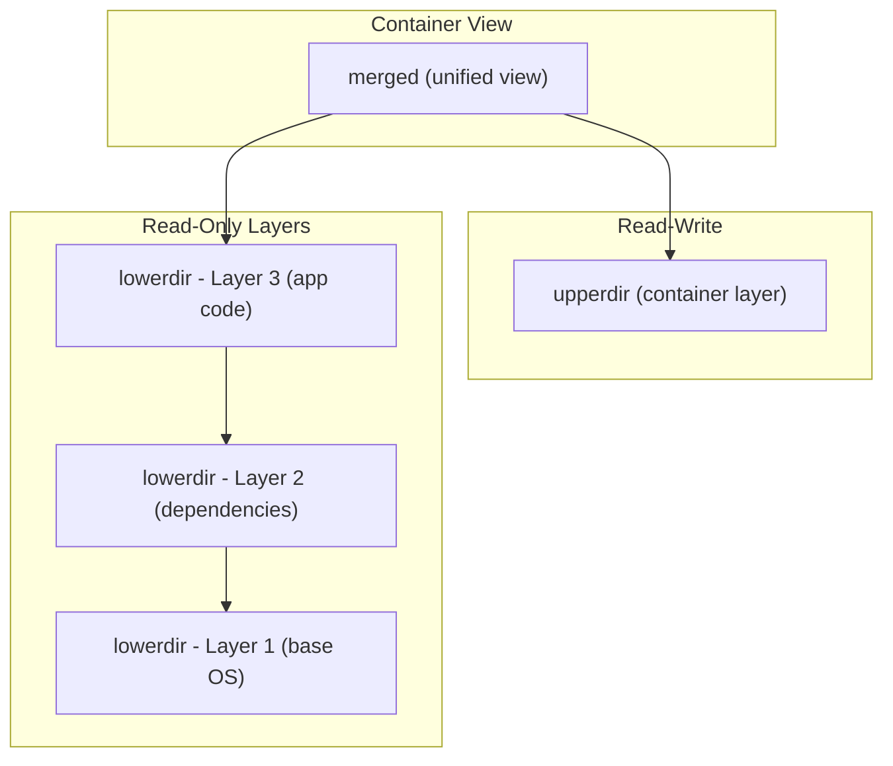

# How to Understand Docker UnionFS and Overlay2

Author: [nawazdhandala](https://github.com/nawazdhandala)

Tags: docker, unionfs, overlay2, storage driver, filesystem, containers, linux

Description: Learn how Docker uses UnionFS and Overlay2 storage drivers to create layered filesystems for efficient container image management.

---

Docker images are not monolithic blobs of data. They are built from layers, and these layers are managed by a special kind of filesystem called a Union Filesystem. Understanding how UnionFS and the Overlay2 storage driver work gives you a much deeper appreciation of why Docker images are so efficient, and why certain Dockerfile patterns lead to smaller, faster builds.

## What is a Union Filesystem?

A Union Filesystem (UnionFS) merges the contents of multiple directories into a single, unified view. Think of it as stacking transparent sheets on top of each other. Each sheet has some content on it, and when you look through the entire stack from the top, you see a composite picture. The key benefit: each individual sheet (layer) stays separate on disk.

Docker leverages this concept to build images from layers. Each instruction in a Dockerfile creates a new layer. When you run a container, Docker stacks those layers together and presents a single merged filesystem to the container process.

## How Overlay2 Works

Overlay2 is the default and recommended storage driver for Docker on modern Linux systems. It replaced the older AUFS and Overlay drivers. Overlay2 uses the Linux kernel's OverlayFS implementation, which was merged into the kernel starting at version 3.18.

OverlayFS operates with four key directories:

- **lowerdir**: One or more read-only layers (the image layers)
- **upperdir**: A single read-write layer (the container layer)
- **workdir**: A scratch directory used internally by OverlayFS
- **merged**: The unified view that the container process sees

Here is a diagram showing how these layers relate to each other:



## Checking Your Docker Storage Driver

You can verify which storage driver Docker is using with the following command.

```bash
# Display Docker system information, filtering for storage driver
docker info | grep "Storage Driver"
```

The output should show:

```
 Storage Driver: overlay2
```

## Inspecting Image Layers

Every Docker image is composed of layers. Let's inspect them with a concrete example.

```bash
# Pull a simple image and inspect its layers
docker pull nginx:latest

# Show the history of layers, including commands that created each one
docker history nginx:latest
```

You can also use `docker inspect` to see the layer details:

```bash
# Inspect the image and extract the layer information using Go templates
docker inspect nginx:latest --format '{{json .RootFS.Layers}}' | python3 -m json.tool
```

This outputs a list of SHA256 digests, one per layer. Each represents a diff applied on top of the previous layer.

## Where Layers Live on Disk

On a Linux host, Overlay2 stores its data under `/var/lib/docker/overlay2/`. Let's explore.

```bash
# List the overlay2 directory to see all layer directories
sudo ls /var/lib/docker/overlay2/
```

Each directory corresponds to a layer. Inside each layer directory you will find:

```bash
# Look at the contents of a specific layer directory
sudo ls /var/lib/docker/overlay2/<layer-id>/
```

Typical contents include:
- `diff/` - the actual filesystem changes for this layer
- `link` - a shortened identifier used for the mount options
- `lower` - references to the layers below this one
- `work/` - the OverlayFS work directory
- `merged/` - only present for running containers

## Copy-on-Write Explained

Overlay2 uses a copy-on-write (CoW) strategy. When a container reads a file that exists in a lower layer, OverlayFS serves it directly from that lower layer. No copy is made. Only when the container modifies a file does OverlayFS copy that file up to the upperdir before applying the changes.

This has real performance implications. Large files that get modified inside a container trigger a full copy from the lower layer to the upper layer on the first write. Subsequent writes to that same file happen entirely in the upper layer.

```bash
# Start a container and modify a file to observe copy-on-write
docker run -d --name cow-test nginx:latest

# Check the size of the container's writable layer before changes
docker inspect cow-test --format '{{.GraphDriver.Data.UpperDir}}'

# Execute a command inside the container that modifies a file
docker exec cow-test bash -c "echo 'modified' >> /etc/nginx/nginx.conf"

# Now check the upperdir to see the copied file
sudo ls $(docker inspect cow-test --format '{{.GraphDriver.Data.UpperDir}}')
```

## Whiteout Files and Deletions

When you delete a file inside a container, the original file still exists in the lower (read-only) layer. OverlayFS cannot modify lower layers. Instead, it creates a special "whiteout" file in the upper layer. This whiteout file signals to the merged view that the original file should be hidden.

```bash
# Delete a file inside a running container
docker exec cow-test rm /etc/nginx/mime.types

# Check the upperdir for whiteout files (character device with 0/0 major/minor)
sudo ls -la $(docker inspect cow-test --format '{{.GraphDriver.Data.UpperDir}}')/etc/nginx/
```

Whiteout files appear as character devices with 0/0 major/minor numbers. For directory deletions, OverlayFS uses "opaque whiteout" files named `.wh..wh..opq`.

## Optimizing Dockerfiles for Overlay2

Understanding layers helps you write better Dockerfiles. Each `RUN`, `COPY`, and `ADD` instruction creates a new layer.

A common mistake is installing packages and cleaning up in separate RUN instructions:

```dockerfile
# BAD: The cleanup happens in a new layer, so the package cache
# still exists in the previous layer, increasing total image size
FROM ubuntu:22.04
RUN apt-get update && apt-get install -y curl
RUN rm -rf /var/lib/apt/lists/*
```

The correct approach combines these into a single layer:

```dockerfile
# GOOD: Install and clean up in the same RUN instruction
# The package cache never persists into a committed layer
FROM ubuntu:22.04
RUN apt-get update && \
    apt-get install -y curl && \
    rm -rf /var/lib/apt/lists/*
```

## Measuring Layer Sizes

You can measure individual layer sizes to find bloated layers in your images.

```bash
# Show each layer along with its size
docker history --no-trunc --format "{{.Size}}\t{{.CreatedBy}}" nginx:latest
```

This helps you identify which Dockerfile instructions are contributing the most to your image size.

## Overlay2 vs Other Storage Drivers

Docker has supported several storage drivers over the years. Here is a comparison:

| Driver | Status | Performance | Stability |
|--------|--------|------------|-----------|
| overlay2 | Recommended | Excellent | Stable |
| overlay | Deprecated | Good | Stable |
| aufs | Deprecated | Good | Stable |
| devicemapper | Deprecated | Moderate | Complex |
| btrfs | Supported | Good | Requires btrfs |
| zfs | Supported | Good | Requires zfs |

Overlay2 wins on most fronts because it uses native kernel support, requires no extra kernel patches, and has lower memory usage than the older overlay driver (which required a separate mount per layer).

## Configuring Overlay2

If you need to explicitly configure Docker to use Overlay2, edit the daemon configuration file.

```json
// /etc/docker/daemon.json
// Set the storage driver and optional configuration
{
  "storage-driver": "overlay2",
  "storage-opts": [
    "overlay2.override_kernel_check=true"
  ]
}
```

After modifying the configuration, restart Docker:

```bash
# Restart the Docker daemon to apply storage driver changes
sudo systemctl restart docker
```

## Troubleshooting Overlay2

When you run into disk space issues, Overlay2 layers can pile up. Use the built-in cleanup commands:

```bash
# Remove all stopped containers, unused networks, dangling images, and build cache
docker system prune -a

# Check disk usage broken down by images, containers, and volumes
docker system df -v
```

You can also inspect the raw filesystem if something seems off:

```bash
# Count the number of layer directories
sudo ls /var/lib/docker/overlay2/ | wc -l

# Check total disk usage of the overlay2 directory
sudo du -sh /var/lib/docker/overlay2/
```

## Key Takeaways

Docker's use of UnionFS through the Overlay2 storage driver is what makes container images lightweight and shareable. Layers are deduplicated across images, meaning if ten images all share the same base Ubuntu layer, that layer is stored only once on disk. Copy-on-write keeps containers fast by deferring copies until writes actually occur. Understanding these internals helps you build smaller images, debug storage issues, and make better architectural decisions around your container workflows.

Clean up after the examples:

```bash
# Remove the test container
docker rm -f cow-test
```
