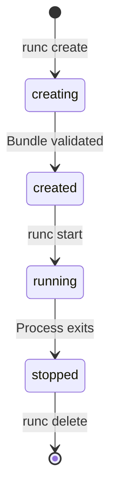

# How to Understand OCI Image and Runtime Specifications

Author: [nawazdhandala](https://github.com/nawazdhandala)

Tags: docker, OCI, open container initiative, runtime specification, image specification, containers, standards

Description: Understand the OCI image and runtime specifications that standardize how container images are built, distributed, and executed across different platforms.

---

The Open Container Initiative (OCI) was founded in 2015 to create open standards for container formats and runtimes. Before OCI, Docker's proprietary formats were the de facto standard, which made it difficult for alternative tools to interoperate. Today, the OCI specifications ensure that images built with Docker work with Podman, that images stored in any OCI-compliant registry can be pulled by any OCI-compliant runtime, and that container execution behaves consistently across implementations.

## The Two OCI Specifications

OCI maintains two primary specifications:

1. **OCI Image Specification** - Defines how container images are structured, packaged, and distributed
2. **OCI Runtime Specification** - Defines how containers are configured and executed

There is also a third specification, the OCI Distribution Specification, which standardizes how images are pushed to and pulled from registries.


## OCI Image Specification

The OCI Image Specification defines three main components:

### Image Manifest

The manifest describes the image content. It lists the layers and references the configuration.

```json
{
  "schemaVersion": 2,
  "mediaType": "application/vnd.oci.image.manifest.v1+json",
  "config": {
    "mediaType": "application/vnd.oci.image.config.v1+json",
    "digest": "sha256:config-digest-here",
    "size": 7023
  },
  "layers": [
    {
      "mediaType": "application/vnd.oci.image.layer.v1.tar+gzip",
      "digest": "sha256:layer1-digest-here",
      "size": 32654321
    },
    {
      "mediaType": "application/vnd.oci.image.layer.v1.tar+gzip",
      "digest": "sha256:layer2-digest-here",
      "size": 16724567
    }
  ]
}
```

### Image Index

An image index (similar to Docker's manifest list) allows a single tag to reference images for multiple platforms.

```json
{
  "schemaVersion": 2,
  "mediaType": "application/vnd.oci.image.index.v1+json",
  "manifests": [
    {
      "mediaType": "application/vnd.oci.image.manifest.v1+json",
      "digest": "sha256:amd64-manifest",
      "size": 1024,
      "platform": {
        "architecture": "amd64",
        "os": "linux"
      }
    },
    {
      "mediaType": "application/vnd.oci.image.manifest.v1+json",
      "digest": "sha256:arm64-manifest",
      "size": 1024,
      "platform": {
        "architecture": "arm64",
        "os": "linux"
      }
    }
  ]
}
```

### Image Configuration

The config object contains the runtime settings for the container, including environment variables, entrypoint, working directory, and the history of how the image was built.

```bash
# Export an image as an OCI-format tar archive to examine its structure
docker save nginx:latest -o nginx.tar
mkdir nginx-extracted && tar xf nginx.tar -C nginx-extracted

# List the contents to see the OCI layout
ls -la nginx-extracted/
```

Inside the extracted archive you will find:
- `oci-layout` - A JSON file declaring the OCI image layout version
- `index.json` - The root image index
- `blobs/` - Directory containing all content-addressable blobs (manifests, configs, layers)

## OCI Runtime Specification

The runtime specification defines how a container should be configured and started. The central concept is a "bundle" - a directory containing everything needed to run a container:

1. A `config.json` file with the runtime configuration
2. A root filesystem directory

### The config.json File

This is the heart of the runtime spec. It tells the runtime exactly how to create the container:

```json
{
  "ociVersion": "1.0.2",
  "process": {
    "terminal": false,
    "user": { "uid": 0, "gid": 0 },
    "args": ["nginx", "-g", "daemon off;"],
    "env": [
      "PATH=/usr/local/sbin:/usr/local/bin:/usr/sbin:/usr/bin",
      "NGINX_VERSION=1.25.0"
    ],
    "cwd": "/"
  },
  "root": {
    "path": "rootfs",
    "readonly": false
  },
  "hostname": "my-container",
  "mounts": [
    {
      "destination": "/proc",
      "type": "proc",
      "source": "proc"
    },
    {
      "destination": "/dev",
      "type": "tmpfs",
      "source": "tmpfs",
      "options": ["nosuid", "strictatime", "mode=755", "size=65536k"]
    }
  ],
  "linux": {
    "namespaces": [
      { "type": "pid" },
      { "type": "network" },
      { "type": "ipc" },
      { "type": "uts" },
      { "type": "mount" }
    ],
    "resources": {
      "memory": { "limit": 536870912 },
      "cpu": { "shares": 1024 }
    }
  }
}
```

Key sections include:

- **process**: Defines what to run, as which user, with what environment
- **root**: Points to the root filesystem
- **mounts**: Special filesystem mounts (proc, sysfs, tmpfs, etc.)
- **linux.namespaces**: Which Linux namespaces to create for isolation
- **linux.resources**: cgroup limits for CPU, memory, and I/O

## Creating an OCI Bundle Manually

You can create a minimal OCI bundle and run it with runc to see the specification in action.

```bash
# Create the bundle directory structure
mkdir -p my-bundle/rootfs

# Export a container filesystem to use as the rootfs
docker export $(docker create alpine:latest) | tar -C my-bundle/rootfs -xf -

# Generate a default OCI runtime config
cd my-bundle
runc spec

# The generated config.json contains sensible defaults
# Edit it to customize the container behavior
```

Now inspect and modify the generated config:

```bash
# View the generated configuration
cat config.json | python3 -m json.tool | head -30
```

Run the container with runc:

```bash
# Run the container using runc (requires root for full namespace support)
sudo runc run my-test-container
```

## Container Lifecycle in the OCI Runtime Spec

The runtime specification defines a clear container lifecycle with specific states:



Each state has specific semantics:

- **creating**: The runtime is setting up the container environment
- **created**: The container exists but the user process has not started
- **running**: The container's user process is executing
- **stopped**: The process has exited but the container resources still exist

```bash
# Demonstrate the lifecycle with runc
# Create a container (enters "created" state)
sudo runc create --bundle /path/to/bundle my-container

# Check the container state
sudo runc state my-container

# Start the container process (enters "running" state)
sudo runc start my-container

# List running containers
sudo runc list

# Send a signal to stop the container
sudo runc kill my-container SIGTERM

# Delete the container (cleanup)
sudo runc delete my-container
```

## Linux-Specific Features

The OCI runtime spec includes extensive Linux-specific configuration options:

### Namespaces

Namespaces provide isolation. The spec supports: pid, network, mount, ipc, uts, user, and cgroup namespaces.

```bash
# Check which namespaces a running container uses
# First get the PID of a Docker container's init process
PID=$(docker inspect --format '{{.State.Pid}}' my-container)

# List the namespaces for that process
sudo ls -la /proc/$PID/ns/
```

### Cgroups

Cgroups (control groups) limit resource usage. The runtime spec maps directly to cgroup settings.

```bash
# View cgroup limits for a running Docker container
# Memory limit
cat /sys/fs/cgroup/docker/<container-id>/memory.max

# CPU weight
cat /sys/fs/cgroup/docker/<container-id>/cpu.weight
```

### Seccomp

The runtime spec supports seccomp profiles to restrict which system calls a container can make.

```json
{
  "linux": {
    "seccomp": {
      "defaultAction": "SCMP_ACT_ERRNO",
      "architectures": ["SCMP_ARCH_X86_64"],
      "syscalls": [
        {
          "names": ["read", "write", "exit", "exit_group"],
          "action": "SCMP_ACT_ALLOW"
        }
      ]
    }
  }
}
```

## OCI Distribution Specification

The distribution spec standardizes the HTTP API used to push and pull images from registries.

```bash
# List tags available for an image in a registry
# This follows the OCI Distribution Spec API
curl -s -H "Authorization: Bearer $TOKEN" \
  https://registry-1.docker.io/v2/library/nginx/tags/list | python3 -m json.tool

# Check if a specific blob exists (HEAD request)
curl -s -I -H "Authorization: Bearer $TOKEN" \
  https://registry-1.docker.io/v2/library/nginx/blobs/sha256:abc123
```

## Why OCI Matters

Before OCI, you were locked into Docker's ecosystem. Now, a variety of tools implement the same specifications:

| Tool | Builds OCI Images | Runs OCI Containers | Registry Support |
|------|-------------------|---------------------|------------------|
| Docker | Yes | Yes | Yes |
| Podman | Yes | Yes | Yes |
| Buildah | Yes | No | Yes |
| containerd | No | Yes | Yes |
| CRI-O | No | Yes | Yes |
| runc | No | Yes | No |
| crun | No | Yes | No |

This interoperability means you can build an image with Buildah, push it to any registry, and run it with Podman or Docker, because they all speak OCI.

## Conclusion

The OCI specifications turned containers from a Docker-specific technology into an open standard. The image spec defines how images are structured and distributed. The runtime spec defines how containers are configured and executed. Together, they ensure interoperability across the container ecosystem. Whether you are building custom container tooling, debugging low-level container issues, or simply want to understand what happens under the hood, these specifications are the authoritative reference.
