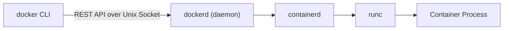

# How to Understand the Docker Client-Server Architecture

Author: [nawazdhandala](https://github.com/nawazdhandala)

Tags: docker, architecture, client-server, docker daemon, docker cli, containers, docker api

Description: A practical guide to understanding Docker's client-server architecture, how the CLI communicates with the daemon, and how to use the Docker API directly.

---

When you type `docker run nginx`, it seems like a single operation. In reality, multiple components coordinate behind the scenes. Docker follows a client-server architecture where the CLI you interact with is just a thin client that sends requests to a background daemon. Understanding this separation helps you troubleshoot connection issues, work with remote Docker hosts, and build custom tooling on top of the Docker API.

## The Two Main Components

Docker's architecture splits into two distinct pieces:

1. **Docker Client (docker CLI)** - The command-line tool you interact with. It translates your commands into API calls and sends them to the Docker daemon.
2. **Docker Daemon (dockerd)** - A background service that manages images, containers, networks, and volumes. It does all the heavy lifting.

These two components communicate over a well-defined REST API. They do not need to run on the same machine.



## The Unix Socket Connection

By default on Linux, the Docker client communicates with the daemon through a Unix socket located at `/var/run/docker.sock`. This socket file acts as the communication channel.

```bash
# Check that the Docker socket exists
ls -la /var/run/docker.sock
```

You should see something like:

```
srw-rw---- 1 root docker 0 Feb  8 10:00 /var/run/docker.sock
```

The `s` at the beginning indicates it is a socket file. The `docker` group ownership is why you need to be in the `docker` group to run Docker commands without sudo.

## Talking to the Docker API Directly

Since the communication happens over a REST API, you can bypass the Docker CLI entirely and talk to the daemon using curl.

```bash
# List all running containers by hitting the Docker API directly via the Unix socket
curl --unix-socket /var/run/docker.sock http://localhost/v1.44/containers/json
```

This returns a JSON array of running containers, just like `docker ps` would. Let's try creating a container through the API:

```bash
# Create a new container using the Docker API
# This is equivalent to "docker create nginx:latest"
curl --unix-socket /var/run/docker.sock \
  -H "Content-Type: application/json" \
  -d '{"Image": "nginx:latest"}' \
  http://localhost/v1.44/containers/create
```

The response includes a container ID. You can then start it:

```bash
# Start the container using the ID returned from the create call
curl --unix-socket /var/run/docker.sock \
  -X POST \
  http://localhost/v1.44/containers/<container-id>/start
```

## What Happens When You Run docker run

Let's trace what actually happens when you execute `docker run -d -p 8080:80 nginx:latest`:

1. The Docker CLI parses your command and its flags
2. The CLI sends a POST request to `/containers/create` with the configuration
3. The daemon checks if the `nginx:latest` image exists locally
4. If the image is missing, the daemon pulls it from Docker Hub (a series of GET requests to the registry)
5. The daemon calls containerd to create the container
6. containerd calls runc to spawn the actual container process
7. The CLI sends a POST request to `/containers/<id>/start`
8. The daemon sets up networking (port mapping 8080:80)
9. The container process begins executing

This entire chain happens in milliseconds, but each step is a distinct operation.

## Connecting to a Remote Docker Daemon

The client-server split means you can point your local Docker CLI at a remote daemon. This is incredibly useful for managing Docker on remote servers.

```bash
# Connect to a remote Docker daemon over TCP
export DOCKER_HOST=tcp://192.168.1.100:2376

# Now all docker commands go to the remote daemon
docker ps
docker images
```

For secure connections, you should use TLS:

```bash
# Connect with TLS certificates for encrypted communication
export DOCKER_HOST=tcp://192.168.1.100:2376
export DOCKER_TLS_VERIFY=1
export DOCKER_CERT_PATH=~/.docker/certs

# Verify the connection
docker info
```

## Configuring the Docker Daemon for Remote Access

To allow remote connections, you need to configure the daemon to listen on a TCP socket in addition to the Unix socket.

```json
// /etc/docker/daemon.json
// Enable both Unix socket (for local) and TCP socket (for remote) access
{
  "hosts": ["unix:///var/run/docker.sock", "tcp://0.0.0.0:2376"],
  "tls": true,
  "tlscacert": "/etc/docker/certs/ca.pem",
  "tlscert": "/etc/docker/certs/server-cert.pem",
  "tlskey": "/etc/docker/certs/server-key.pem",
  "tlsverify": true
}
```

After editing, restart the daemon:

```bash
# Restart Docker to pick up the new configuration
sudo systemctl restart docker

# Verify Docker is listening on both sockets
sudo ss -tlnp | grep dockerd
```

Never expose the Docker daemon over TCP without TLS. An unprotected Docker socket gives anyone full root access to your host.

## Docker Context for Managing Multiple Hosts

Docker contexts let you switch between multiple Docker hosts without juggling environment variables.

```bash
# Create a context for a remote production server
docker context create production \
  --docker "host=tcp://prod-server:2376,ca=~/.docker/certs/ca.pem,cert=~/.docker/certs/cert.pem,key=~/.docker/certs/key.pem"

# Create a context for a staging server
docker context create staging \
  --docker "host=tcp://staging-server:2376"

# List all available contexts
docker context ls

# Switch to the production context
docker context use production

# Now all commands target the production Docker daemon
docker ps
```

## The Docker Daemon Configuration

The Docker daemon accepts many configuration options that affect its behavior. Here are some commonly used settings:

```json
// /etc/docker/daemon.json - a typical production configuration
{
  "storage-driver": "overlay2",
  "log-driver": "json-file",
  "log-opts": {
    "max-size": "10m",
    "max-file": "3"
  },
  "default-address-pools": [
    {"base": "172.20.0.0/16", "size": 24}
  ],
  "live-restore": true,
  "userland-proxy": false
}
```

The `live-restore` option is particularly useful. It lets containers keep running even when the Docker daemon restarts, which reduces downtime during daemon upgrades.

## Debugging Client-Server Communication

When something goes wrong, you can enable debug logging to see exactly what the client sends to the daemon.

```bash
# Enable debug output on the client side to see API calls
docker --debug info

# You can also set it via environment variable
export DOCKER_CLI_EXPERIMENTAL=enabled
```

For daemon-side debugging:

```bash
# Check the Docker daemon logs for errors
sudo journalctl -u docker.service -f

# Or restart the daemon in debug mode
sudo dockerd --debug
```

## Using Docker SDKs

Since Docker exposes a REST API, you can interact with it programmatically. Docker provides official SDKs for Python and Go.

Here is a Python example:

```python
# Install the Docker SDK: pip install docker
import docker

# Connect to the local Docker daemon via the Unix socket
client = docker.from_env()

# List all running containers
for container in client.containers.list():
    print(f"{container.short_id} - {container.name} - {container.status}")

# Run a new container
container = client.containers.run(
    "nginx:latest",
    detach=True,
    ports={"80/tcp": 8080}
)
print(f"Started container: {container.short_id}")
```

And a Go example:

```go
// Import the Docker client library
package main

import (
    "context"
    "fmt"
    "github.com/docker/docker/client"
    "github.com/docker/docker/api/types"
)

func main() {
    // Create a new Docker client that connects to the local daemon
    cli, err := client.NewClientWithOpts(client.FromEnv)
    if err != nil {
        panic(err)
    }

    // List all running containers
    containers, err := cli.ContainerList(context.Background(), types.ContainerListOptions{})
    if err != nil {
        panic(err)
    }

    for _, container := range containers {
        fmt.Printf("%s %s\n", container.ID[:12], container.Image)
    }
}
```

## Security Implications

The Docker socket is a high-privilege attack surface. Any process that can communicate with the Docker daemon effectively has root access to the host. Keep these points in mind:

- Restrict access to `/var/run/docker.sock` through group permissions
- Never mount the Docker socket into containers unless absolutely necessary
- Use TLS mutual authentication for remote access
- Consider rootless Docker mode for development environments

```bash
# Verify who has access to the Docker socket
stat /var/run/docker.sock

# Check which users are in the docker group
getent group docker
```

## Wrapping Up

Docker's client-server architecture is clean and purposeful. The CLI is stateless and lightweight. The daemon handles everything from image management to container lifecycle. The REST API between them means you can automate Docker with any language, connect to remote hosts, and build sophisticated tooling. When you hit a "Cannot connect to the Docker daemon" error, you now know exactly where to look: the socket, the daemon process, or the network path between client and server.
