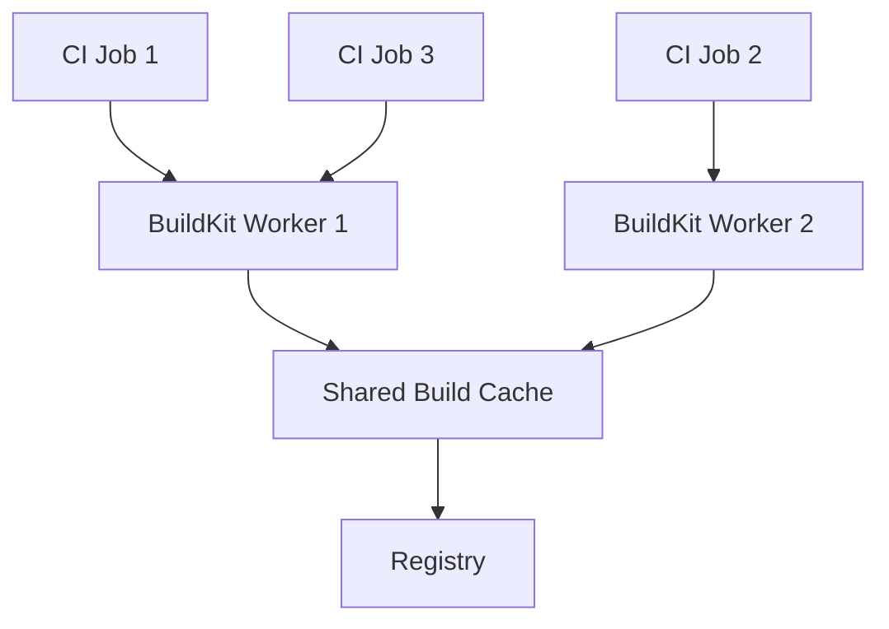

# How to Use BuildKit Workers for Parallel CI Builds

Author: [nawazdhandala](https://github.com/nawazdhandala)

Tags: Docker, BuildKit, CI/CD, Parallel Builds, DevOps, Performance, Docker Buildx

Description: Configure BuildKit workers to run parallel CI builds with shared caching, resource limits, and optimal throughput on your infrastructure.

---

BuildKit is the modern build engine behind Docker. When you run `docker build` on recent Docker versions, BuildKit handles the actual work. But most people use it through Docker's default configuration, which runs a single BuildKit worker with default settings. For CI environments where you run many builds concurrently, tuning BuildKit workers can dramatically improve throughput.

This guide covers running standalone BuildKit workers, configuring them for parallel CI workloads, setting resource limits, and sharing cache across multiple concurrent builds.

## Understanding BuildKit Workers

A BuildKit worker is a daemon process that executes build instructions. Each worker has its own cache, parallelism settings, and resource constraints. Docker Buildx creates workers automatically when you create builders, but you can also run BuildKit standalone for more control.



## Running Standalone BuildKit

Run BuildKit directly as a Docker container for full control over its configuration.

```bash
# Run a standalone BuildKit daemon
docker run -d \
  --name buildkitd \
  --privileged \
  -p 1234:1234 \
  -v buildkit-state:/var/lib/buildkit \
  moby/buildkit:v0.13.0 \
  --addr tcp://0.0.0.0:1234
```

Connect to it with the `buildctl` CLI or through Docker Buildx.

```bash
# Install buildctl
curl -sL https://github.com/moby/buildkit/releases/download/v0.13.0/buildkit-v0.13.0.linux-amd64.tar.gz | \
  sudo tar -xz -C /usr/local/

# Test the connection
buildctl --addr tcp://localhost:1234 debug workers
```

## BuildKit Configuration File

Create a `buildkitd.toml` configuration file to tune worker behavior.

```toml
# buildkitd.toml - BuildKit daemon configuration

# Enable debug logging for troubleshooting
debug = false

[grpc]
  address = ["tcp://0.0.0.0:1234"]
  # Uncomment for Unix socket
  # address = ["unix:///run/buildkit/buildkitd.sock"]

# Worker configuration
[worker.oci]
  enabled = true
  # Maximum number of parallel build steps
  max-parallelism = 4
  # Enable overlay snapshotter for better performance
  snapshotter = "overlayfs"
  # Garbage collection settings
  gc = true
  gckeepbytes = 10737418240  # 10GB
  # Resource limits per build
  [[worker.oci.gcpolicy]]
    keepBytes = 10737418240
    keepDuration = 172800  # 48 hours in seconds
    all = true
  [[worker.oci.gcpolicy]]
    keepBytes = 53687091200  # 50GB total
    all = true

# Registry mirror configuration
[registry."docker.io"]
  mirrors = ["mirror.gcr.io"]

# Cache export/import settings
[cache]
  # Use a large disk cache
  [cache.local]
    dir = "/var/lib/buildkit/cache"
```

Run BuildKit with this configuration.

```bash
# Run BuildKit with custom configuration
docker run -d \
  --name buildkitd \
  --privileged \
  -p 1234:1234 \
  -v buildkit-state:/var/lib/buildkit \
  -v $(pwd)/buildkitd.toml:/etc/buildkit/buildkitd.toml \
  moby/buildkit:v0.13.0 \
  --config /etc/buildkit/buildkitd.toml
```

## Multiple Workers with Docker Compose

For CI servers handling many concurrent builds, run multiple BuildKit workers behind a simple load balancer.

```yaml
# docker-compose.yml - Multiple BuildKit workers
version: "3.8"

services:
  # BuildKit worker 1
  buildkitd-1:
    image: moby/buildkit:v0.13.0
    privileged: true
    volumes:
      - ./buildkitd.toml:/etc/buildkit/buildkitd.toml
      - buildkit-state-1:/var/lib/buildkit
    command:
      - --config
      - /etc/buildkit/buildkitd.toml
      - --addr
      - tcp://0.0.0.0:1234
    deploy:
      resources:
        limits:
          cpus: "4"
          memory: 8G
    networks:
      - buildkit

  # BuildKit worker 2
  buildkitd-2:
    image: moby/buildkit:v0.13.0
    privileged: true
    volumes:
      - ./buildkitd.toml:/etc/buildkit/buildkitd.toml
      - buildkit-state-2:/var/lib/buildkit
    command:
      - --config
      - /etc/buildkit/buildkitd.toml
      - --addr
      - tcp://0.0.0.0:1234
    deploy:
      resources:
        limits:
          cpus: "4"
          memory: 8G
    networks:
      - buildkit

  # BuildKit worker 3
  buildkitd-3:
    image: moby/buildkit:v0.13.0
    privileged: true
    volumes:
      - ./buildkitd.toml:/etc/buildkit/buildkitd.toml
      - buildkit-state-3:/var/lib/buildkit
    command:
      - --config
      - /etc/buildkit/buildkitd.toml
      - --addr
      - tcp://0.0.0.0:1234
    deploy:
      resources:
        limits:
          cpus: "4"
          memory: 8G
    networks:
      - buildkit

  # Nginx load balancer distributes builds across workers
  buildkit-lb:
    image: nginx:alpine
    ports:
      - "1234:1234"
    volumes:
      - ./nginx-lb.conf:/etc/nginx/nginx.conf
    depends_on:
      - buildkitd-1
      - buildkitd-2
      - buildkitd-3
    networks:
      - buildkit

volumes:
  buildkit-state-1:
  buildkit-state-2:
  buildkit-state-3:

networks:
  buildkit:
    driver: bridge
```

Create the Nginx configuration for gRPC load balancing.

```nginx
# nginx-lb.conf - gRPC load balancer for BuildKit workers
events {
    worker_connections 1024;
}

stream {
    upstream buildkit_workers {
        # Round-robin distribution across workers
        server buildkitd-1:1234;
        server buildkitd-2:1234;
        server buildkitd-3:1234;
    }

    server {
        listen 1234;
        proxy_pass buildkit_workers;
        # Increase timeout for long builds
        proxy_timeout 3600s;
        proxy_connect_timeout 10s;
    }
}
```

## Connecting Buildx to Standalone Workers

Register the BuildKit workers as a Buildx builder.

```bash
# Create a Buildx builder pointing to the load balancer
docker buildx create \
  --name ci-workers \
  --driver remote \
  tcp://localhost:1234

# Or create a builder with individual workers for platform-specific routing
docker buildx create \
  --name ci-workers \
  --driver remote \
  --platform linux/amd64 \
  tcp://buildkitd-1:1234

docker buildx create \
  --name ci-workers \
  --append \
  --driver remote \
  --platform linux/amd64 \
  tcp://buildkitd-2:1234

# Set as default
docker buildx use ci-workers
docker buildx inspect ci-workers --bootstrap
```

## Parallelism Within a Single Build

BuildKit automatically parallelizes independent build stages. Write your Dockerfile to maximize parallel execution.

```dockerfile
# Dockerfile - Designed for parallel BuildKit execution
# syntax=docker/dockerfile:1

# These stages run in PARALLEL because they are independent
FROM node:20-alpine AS frontend-deps
WORKDIR /frontend
COPY frontend/package*.json ./
RUN npm ci

FROM golang:1.22-alpine AS backend-deps
WORKDIR /backend
COPY backend/go.mod backend/go.sum ./
RUN go mod download

FROM python:3.12-slim AS ml-deps
WORKDIR /ml
COPY ml/requirements.txt ./
RUN pip install --no-cache-dir -r requirements.txt

# These stages also run in parallel, after their dependencies
FROM frontend-deps AS frontend-build
COPY frontend/ ./
RUN npm run build

FROM backend-deps AS backend-build
COPY backend/ ./
RUN CGO_ENABLED=0 go build -o /server ./cmd/server

FROM ml-deps AS ml-build
COPY ml/ ./
RUN python -m compileall .

# Final stage - combine all artifacts
FROM alpine:3.19

COPY --from=frontend-build /frontend/dist /app/static
COPY --from=backend-build /server /app/server
COPY --from=ml-build /ml /app/ml

ENTRYPOINT ["/app/server"]
```

BuildKit sees that frontend-deps, backend-deps, and ml-deps have no dependencies on each other and runs them all simultaneously. The max-parallelism setting in the worker config controls how many stages can execute at once.

## Shared Cache Across Workers

For cache sharing between multiple BuildKit workers, use a registry-based cache or a shared storage backend.

```bash
# Build with registry-based cache sharing
docker buildx build \
  --builder ci-workers \
  --cache-from type=registry,ref=myregistry/cache:latest \
  --cache-to type=registry,ref=myregistry/cache:latest,mode=max \
  -t myregistry/myapp:latest \
  --push \
  .
```

For S3-based cache (supported in newer BuildKit versions).

```bash
# Build with S3 cache backend
docker buildx build \
  --builder ci-workers \
  --cache-from type=s3,region=us-east-1,bucket=my-buildkit-cache,name=myapp \
  --cache-to type=s3,region=us-east-1,bucket=my-buildkit-cache,name=myapp,mode=max \
  -t myregistry/myapp:latest \
  --push \
  .
```

## Monitoring Worker Performance

Track build times and cache hit rates to identify bottlenecks.

```bash
# Check worker disk usage and cache size
buildctl --addr tcp://localhost:1234 debug workers

# List cached content
buildctl --addr tcp://localhost:1234 du

# Prune cache to free disk space (keep last 10GB)
buildctl --addr tcp://localhost:1234 prune --keep-storage 10737418240

# Get build-specific metrics
buildctl --addr tcp://localhost:1234 debug info
```

## Garbage Collection

Configure automatic garbage collection to prevent workers from filling up their disks.

```toml
# Add to buildkitd.toml
[worker.oci]
  gc = true
  # Keep at least 20GB of cache
  gckeepbytes = 21474836480

  # First policy: remove anything older than 48 hours if over the limit
  [[worker.oci.gcpolicy]]
    keepBytes = 21474836480
    keepDuration = 172800
    filters = ["type==regular"]

  # Second policy: hard limit at 50GB total
  [[worker.oci.gcpolicy]]
    keepBytes = 53687091200
    all = true
```

## Cleanup

```bash
# Stop and remove all BuildKit workers
docker compose down -v

# Or remove the Buildx builder
docker buildx rm ci-workers
```

## Conclusion

Running multiple BuildKit workers with proper parallelism, caching, and resource limits transforms your CI build infrastructure. The combination of parallel build stages within Dockerfiles and multiple workers for concurrent builds gives you multiplicative speedups. Registry-based caching ensures that all workers benefit from each other's work. For monitoring the health of your BuildKit workers and tracking build performance metrics, [OneUptime](https://oneuptime.com) can alert you to slow builds, cache misses, and worker failures before they impact your development velocity.
