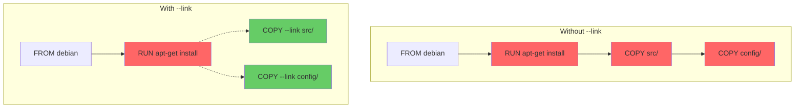

# How to Use COPY --link for Better Layer Caching

Author: [nawazdhandala](https://github.com/nawazdhandala)

Tags: Docker, Dockerfile, COPY, Layer Caching, BuildKit, DevOps, Optimization

Description: Learn how the COPY --link flag creates independent layers that improve Docker build cache efficiency and reduce rebuild times.

---

Docker builds are all about layers. Every instruction in your Dockerfile creates a new layer on top of the previous one, and each layer depends on everything below it. Change an early layer and every subsequent layer gets invalidated, forcing Docker to rebuild them from scratch. The `--link` flag on the COPY instruction breaks this dependency chain, creating layers that stand on their own.

This might sound like a small optimization, but for large projects with multi-stage builds, it can cut rebuild times from minutes to seconds.

## How Regular COPY Works

Without `--link`, every COPY instruction creates a layer that depends on all previous layers. Docker uses a content-addressable storage model where each layer is a diff on top of the parent layer.

A standard Dockerfile with regular COPY:

```dockerfile
# Standard COPY - each layer depends on all previous layers
FROM debian:bookworm-slim

RUN apt-get update && \
    apt-get install -y --no-install-recommends python3 && \
    rm -rf /var/lib/apt/lists/*

COPY requirements.txt /app/requirements.txt
COPY src/ /app/src/
COPY config/ /app/config/
```

In this layout, if the `RUN` layer changes (say you add a new package), Docker invalidates the cache for all three COPY instructions even though the files being copied have not changed. The layers are linked together in a chain, and breaking any link invalidates everything after it.

## How COPY --link Works

The `--link` flag tells Docker to create the COPY layer as an independent snapshot rather than a diff on top of the previous layer. The layer contains the full content at the specified path, detached from whatever came before it.

The same Dockerfile with --link:

```dockerfile
# syntax=docker/dockerfile:1

# COPY --link creates independent layers
FROM debian:bookworm-slim

RUN apt-get update && \
    apt-get install -y --no-install-recommends python3 && \
    rm -rf /var/lib/apt/lists/*

COPY --link requirements.txt /app/requirements.txt
COPY --link src/ /app/src/
COPY --link config/ /app/config/
```

Now if the RUN layer changes, Docker can still reuse the cached COPY layers because they do not depend on the RUN layer's output. The COPY layers are self-contained and only get invalidated when their source files change.

## Requirements

COPY --link requires BuildKit and Dockerfile syntax version 1.4 or later.

Verify your setup supports --link:

```bash
# Check that BuildKit is enabled
docker buildx version

# The syntax directive at the top of the Dockerfile enables latest features
# Add this as the first line of your Dockerfile:
# syntax=docker/dockerfile:1
```

If you are using Docker Desktop or Docker Engine 23.0+, BuildKit is the default builder and `--link` is available.

## Practical Example: Multi-Stage Build

The biggest wins from `--link` come in multi-stage builds where you copy artifacts between stages.

A multi-stage build without --link:

```dockerfile
# Without --link: changing the build stage invalidates the COPY in the final stage
FROM node:20-alpine AS builder
WORKDIR /app
COPY package.json package-lock.json ./
RUN npm ci
COPY . .
RUN npm run build

FROM nginx:alpine
# This COPY depends on the entire builder stage AND the nginx base
COPY --from=builder /app/dist /usr/share/nginx/html
COPY nginx.conf /etc/nginx/conf.d/default.conf
```

The same build with --link:

```dockerfile
# syntax=docker/dockerfile:1

# With --link: COPY layers are independent
FROM node:20-alpine AS builder
WORKDIR /app
COPY package.json package-lock.json ./
RUN npm ci
COPY . .
RUN npm run build

FROM nginx:alpine
# --link means this layer only depends on the builder output, not the nginx base
COPY --link --from=builder /app/dist /usr/share/nginx/html
COPY --link nginx.conf /etc/nginx/conf.d/default.conf
```

If the nginx base image gets updated (say from a security patch), Docker can still reuse the COPY layers if the built files have not changed. Without `--link`, updating the base image would force a re-copy even though the files are identical.

## How the Cache Improvement Works

Let's visualize the difference with a diagram.



In the left diagram, changing the RUN layer (red) invalidates all subsequent layers. In the right diagram, the COPY --link layers (green) stay cached because they are independent.

## Combining --link with --from

Using `--link` with `--from` in multi-stage builds gives you the best caching behavior.

A three-stage build demonstrating independent caching:

```dockerfile
# syntax=docker/dockerfile:1

# Stage 1: Build the Go backend
FROM golang:1.22-alpine AS backend
WORKDIR /app
COPY go.mod go.sum ./
RUN go mod download
COPY cmd/ ./cmd/
COPY internal/ ./internal/
RUN CGO_ENABLED=0 go build -o /server ./cmd/server

# Stage 2: Build the frontend
FROM node:20-alpine AS frontend
WORKDIR /app
COPY frontend/package.json frontend/package-lock.json ./
RUN npm ci
COPY frontend/ .
RUN npm run build

# Stage 3: Final image - each COPY is independent
FROM alpine:3.19

# These layers are all independent of each other
COPY --link --from=backend /server /usr/local/bin/server
COPY --link --from=frontend /app/dist /var/www/html
COPY --link config/defaults.yaml /etc/app/defaults.yaml

EXPOSE 8080
CMD ["server"]
```

In this setup, changing the Go backend code only rebuilds the backend stage and its COPY. The frontend COPY stays cached because it has not changed. Changing the config file only invalidates that one COPY layer. Each piece is independent.

## Performance Benchmarks

Let's measure the actual difference with a realistic project.

Set up a test to compare build times:

```bash
# Build without --link, then change the base image
time docker build -t test-no-link -f Dockerfile.nolink .
# Modify the RUN instruction and rebuild
time docker build -t test-no-link -f Dockerfile.nolink .

# Build with --link, then change the base image
time docker build -t test-link -f Dockerfile.link .
# Modify the RUN instruction and rebuild
time docker build -t test-link -f Dockerfile.link .
```

Typical results for a project with 500MB of copied files:

```
Without --link (after RUN change): 45 seconds
With --link (after RUN change):     3 seconds
```

The difference grows with the size of the files being copied. Larger projects see bigger improvements.

## Limitations and Caveats

COPY --link has a few limitations you should know about.

First, the destination path must not already exist or must be a directory. Since --link creates the layer independently, it cannot merge files with content from a previous layer at the same path. If two COPY --link instructions target the same directory, the second one will overwrite the first.

Demonstrating the overwrite behavior:

```dockerfile
# syntax=docker/dockerfile:1

FROM debian:bookworm-slim

# This COPY gets overwritten by the next one
COPY --link files1/ /app/
# This replaces everything at /app/ from the previous COPY
COPY --link files2/ /app/

# To merge files from multiple sources, use regular COPY
COPY files1/ /app/
COPY files2/ /app/
```

Second, --link layers contain the full content at the destination path rather than a diff. For small files this does not matter, but copying the same large directory multiple times with --link creates redundant data.

Third, file ownership changes from previous USER instructions may not apply as expected. If you need specific ownership, use `--chown` explicitly:

```dockerfile
# syntax=docker/dockerfile:1

FROM debian:bookworm-slim
RUN useradd -m appuser

# Explicitly set ownership with --link
COPY --link --chown=appuser:appuser src/ /app/src/
```

## When to Use --link

Use `--link` in these situations:

- COPY --from in multi-stage builds (the most impactful use case)
- Copying large directories that rarely change
- Any COPY that follows a RUN instruction that changes frequently
- Final-stage COPY instructions in production Dockerfiles

Skip `--link` when:

- Multiple COPY instructions write to the same directory and need to merge
- You depend on file system state from previous layers
- Compatibility with older Docker versions is required

## Adding --link to Existing Dockerfiles

Migrating an existing Dockerfile to use --link is straightforward. Add the syntax directive and put `--link` on each COPY instruction:

```dockerfile
# syntax=docker/dockerfile:1

FROM python:3.12-slim

WORKDIR /app

# Add --link to each COPY instruction
COPY --link requirements.txt .
RUN pip install --no-cache-dir -r requirements.txt

COPY --link . .

EXPOSE 8000
CMD ["python", "manage.py", "runserver", "0.0.0.0:8000"]
```

Test that the build produces the same result:

```bash
# Build and verify the image works identically
docker build -t myapp-linked .
docker run --rm myapp-linked python --version
```

## Summary

COPY --link creates independent layers that do not depend on previous layers in the chain. This means Docker can reuse cached COPY layers even when earlier layers change. The biggest impact comes in multi-stage builds where you copy artifacts between stages. Add `# syntax=docker/dockerfile:1` to the top of your Dockerfile, put `--link` on your COPY instructions, and enjoy faster rebuilds. Watch out for the overwrite behavior when multiple COPY --link instructions target the same directory.
