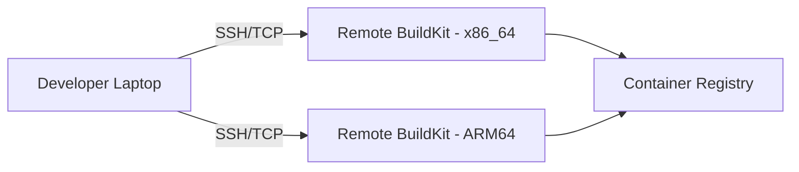

# How to Use Docker BuildKit with Remote Workers

Author: [nawazdhandala](https://github.com/nawazdhandala)

Tags: Docker, BuildKit, Remote Builds, CI/CD, DevOps, Cloud Builds, Performance

Description: Offload Docker builds to remote BuildKit workers over SSH or TCP for faster builds and multi-architecture image support.

---

Building Docker images locally works fine for small projects, but it falls apart when images take 20 minutes to build, when you need ARM builds on an x86 laptop, or when your CI runners lack the CPU and memory to build efficiently. Remote BuildKit workers solve all of these problems by offloading builds to dedicated, powerful machines.

You keep running `docker buildx build` from your laptop or CI system, but the actual build happens on a remote server. The experience is seamless: you get the build output streamed back in real time, and the resulting image lands in your registry or gets loaded locally. This guide covers setting up remote BuildKit workers via SSH and TCP, configuring them for production use, and integrating them into development and CI workflows.

## Why Remote Workers

There are three main reasons to use remote BuildKit workers. First, build speed. A build that takes 15 minutes on a laptop might finish in 2 minutes on a server with 32 cores and NVMe storage. Second, multi-architecture builds. Instead of emulating ARM with QEMU (which is 10-20x slower), you build on actual ARM hardware. Third, resource isolation. Builds no longer compete with your IDE, browser, and other tools for CPU and memory.



## Setting Up the Remote Server

On the remote build server, install Docker and ensure BuildKit is available.

```bash
# On the remote server - install Docker
curl -fsSL https://get.docker.com | sh

# Add your user to the docker group
sudo usermod -aG docker $USER

# Verify BuildKit is available
docker buildx version
```

For SSH-based access (recommended), set up SSH key authentication.

```bash
# On your local machine - copy your SSH key to the remote server
ssh-copy-id builder@build-server.example.com

# Verify you can connect without a password
ssh builder@build-server.example.com "docker info --format '{{.Architecture}}'"
```

## Method 1: SSH-Based Remote Builder

This is the simplest approach. Buildx connects to the remote Docker daemon over SSH and creates a BuildKit container there.

```bash
# Create a remote builder over SSH
docker buildx create \
  --name remote-builder \
  --driver docker-container \
  --platform linux/amd64 \
  ssh://builder@build-server.example.com

# Bootstrap the builder (this starts the BuildKit container on the remote server)
docker buildx inspect remote-builder --bootstrap

# Set it as the default builder
docker buildx use remote-builder
```

Now every `docker buildx build` command will execute on the remote server.

```bash
# Build an image on the remote server
docker buildx build \
  --builder remote-builder \
  -t myregistry/myapp:latest \
  --push \
  .
```

The build context (your source files) gets transferred to the remote server, the build runs there, and the image gets pushed to the registry directly from the server.

## Method 2: Standalone BuildKit Daemon

For more control, run BuildKit as a standalone daemon on the remote server instead of using the Docker driver.

On the remote server, set up BuildKit with TLS.

```bash
# On the remote server - generate TLS certificates
mkdir -p /etc/buildkit/certs

# Generate CA certificate
openssl genrsa -out /etc/buildkit/certs/ca-key.pem 4096
openssl req -new -x509 -days 365 -key /etc/buildkit/certs/ca-key.pem \
  -sha256 -out /etc/buildkit/certs/ca.pem -subj "/CN=BuildKit CA"

# Generate server certificate
openssl genrsa -out /etc/buildkit/certs/server-key.pem 4096
openssl req -new -key /etc/buildkit/certs/server-key.pem \
  -out /etc/buildkit/certs/server.csr -subj "/CN=build-server.example.com"
openssl x509 -req -days 365 -in /etc/buildkit/certs/server.csr \
  -CA /etc/buildkit/certs/ca.pem -CAkey /etc/buildkit/certs/ca-key.pem \
  -CAcreateserial -out /etc/buildkit/certs/server-cert.pem

# Generate client certificate
openssl genrsa -out /etc/buildkit/certs/client-key.pem 4096
openssl req -new -key /etc/buildkit/certs/client-key.pem \
  -out /etc/buildkit/certs/client.csr -subj "/CN=BuildKit Client"
openssl x509 -req -days 365 -in /etc/buildkit/certs/client.csr \
  -CA /etc/buildkit/certs/ca.pem -CAkey /etc/buildkit/certs/ca-key.pem \
  -CAcreateserial -out /etc/buildkit/certs/client-cert.pem
```

Create the BuildKit daemon configuration.

```toml
# /etc/buildkit/buildkitd.toml - Remote BuildKit daemon config
debug = false

[grpc]
  address = ["tcp://0.0.0.0:1234"]

  [grpc.tls]
    cert = "/etc/buildkit/certs/server-cert.pem"
    key = "/etc/buildkit/certs/server-key.pem"
    ca = "/etc/buildkit/certs/ca.pem"

[worker.oci]
  enabled = true
  max-parallelism = 8
  snapshotter = "overlayfs"
  gc = true
  gckeepbytes = 21474836480  # 20GB cache

  [[worker.oci.gcpolicy]]
    keepBytes = 21474836480
    keepDuration = 259200  # 3 days
    all = true

  [[worker.oci.gcpolicy]]
    keepBytes = 53687091200  # 50GB hard limit
    all = true
```

Run the BuildKit daemon as a Docker container on the remote server.

```bash
# On the remote server - run BuildKit daemon
docker run -d \
  --name buildkitd \
  --privileged \
  --restart unless-stopped \
  -p 1234:1234 \
  -v /etc/buildkit:/etc/buildkit \
  -v buildkit-state:/var/lib/buildkit \
  moby/buildkit:v0.13.0 \
  --config /etc/buildkit/buildkitd.toml
```

On your local machine, copy the client certificates and create the builder.

```bash
# Copy the client certificates from the remote server
mkdir -p ~/.buildkit/certs
scp builder@build-server.example.com:/etc/buildkit/certs/ca.pem ~/.buildkit/certs/
scp builder@build-server.example.com:/etc/buildkit/certs/client-cert.pem ~/.buildkit/certs/
scp builder@build-server.example.com:/etc/buildkit/certs/client-key.pem ~/.buildkit/certs/

# Create a builder using the remote BuildKit daemon
docker buildx create \
  --name remote-tls \
  --driver remote \
  --driver-opt cacert=${HOME}/.buildkit/certs/ca.pem,cert=${HOME}/.buildkit/certs/client-cert.pem,key=${HOME}/.buildkit/certs/client-key.pem \
  tcp://build-server.example.com:1234

docker buildx use remote-tls
docker buildx inspect remote-tls --bootstrap
```

## Optimizing Build Context Transfer

The build context (your project files) must be transferred to the remote builder. For large repositories, this can be slow. Minimize the context with a `.dockerignore` file.

```
# .dockerignore - Exclude files from the build context
.git
node_modules
.venv
__pycache__
*.pyc
.env
.env.*
dist
build
coverage
.pytest_cache
.mypy_cache
*.log
```

For very large projects, use named contexts or mount source from a git repository directly.

```bash
# Build from a git repository URL instead of local context
docker buildx build \
  --builder remote-builder \
  -t myregistry/myapp:latest \
  --push \
  https://github.com/your-org/your-repo.git#main
```

This clones the repository directly on the remote builder, eliminating context transfer entirely.

## Multi-Architecture with Remote Workers

Combine an x86_64 remote builder with an ARM64 remote builder for native multi-arch builds.

```bash
# Create a multi-arch builder spanning two remote servers
docker buildx create \
  --name multi-arch \
  --driver docker-container \
  --platform linux/amd64 \
  ssh://builder@x86-server.example.com

docker buildx create \
  --name multi-arch \
  --append \
  --platform linux/arm64 \
  ssh://builder@arm-server.example.com

docker buildx use multi-arch
docker buildx inspect multi-arch --bootstrap

# Build for both architectures - each runs on native hardware
docker buildx build \
  --platform linux/amd64,linux/arm64 \
  -t myregistry/myapp:latest \
  --push \
  .
```

## CI Integration

Use remote builders in GitHub Actions to speed up CI builds.

```yaml
# .github/workflows/build.yml
name: Build with Remote Workers

on:
  push:
    branches: [main]

jobs:
  build:
    runs-on: ubuntu-latest
    steps:
      - uses: actions/checkout@v4

      - name: Set up SSH
        run: |
          mkdir -p ~/.ssh
          echo "${{ secrets.BUILD_SSH_KEY }}" > ~/.ssh/id_rsa
          chmod 600 ~/.ssh/id_rsa
          ssh-keyscan build-server.example.com >> ~/.ssh/known_hosts

      - name: Set up Buildx with remote builder
        run: |
          docker buildx create --name ci-remote \
            --driver docker-container \
            ssh://builder@build-server.example.com
          docker buildx use ci-remote
          docker buildx inspect ci-remote --bootstrap

      - name: Log in to registry
        uses: docker/login-action@v3
        with:
          registry: ghcr.io
          username: ${{ github.actor }}
          password: ${{ secrets.GITHUB_TOKEN }}

      - name: Build and push
        run: |
          docker buildx build \
            --platform linux/amd64,linux/arm64 \
            -t ghcr.io/${{ github.repository }}:${{ github.sha }} \
            --push \
            .
```

## Monitoring and Maintenance

Keep your remote workers healthy with regular maintenance.

```bash
# Check cache usage on the remote builder
ssh builder@build-server.example.com "docker exec buildkitd buildctl du"

# Prune old cache entries
ssh builder@build-server.example.com "docker exec buildkitd buildctl prune --keep-storage 20GB"

# Check worker health
docker buildx inspect remote-builder
```

## Cleanup

```bash
# Remove the remote builder from your Buildx configuration
docker buildx rm remote-builder

# On the remote server, stop the BuildKit daemon
ssh builder@build-server.example.com "docker stop buildkitd && docker rm buildkitd"
```

## Conclusion

Remote BuildKit workers let you build Docker images on powerful dedicated servers while keeping your development workflow unchanged. SSH-based setup takes just one command, and the performance gains are immediate. For multi-architecture builds, remote workers on native hardware eliminate the QEMU emulation penalty entirely. Monitor your remote builders with [OneUptime](https://oneuptime.com) to ensure they stay available and performing well, especially in CI environments where a down builder blocks your entire pipeline.
