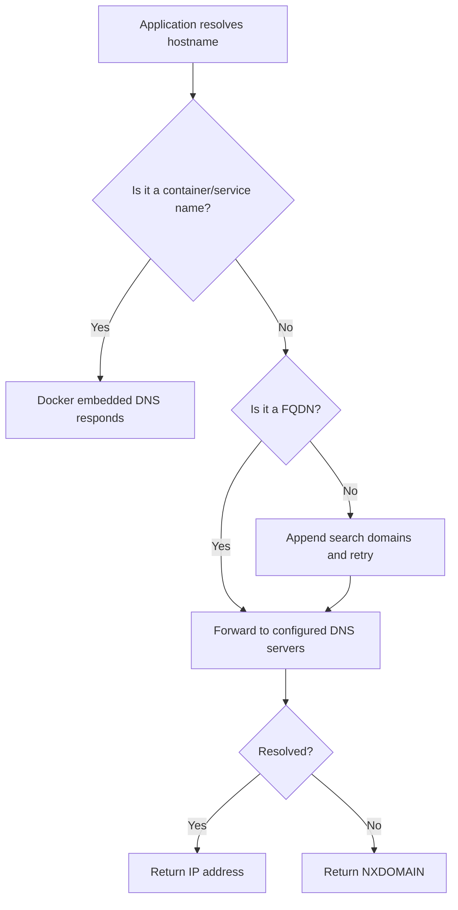

# How to Use Docker Compose dns and dns_search Options

Author: [nawazdhandala](https://github.com/nawazdhandala)

Tags: Docker, Docker Compose, DNS, Networking, Container Configuration, DevOps

Description: Configure custom DNS servers and search domains in Docker Compose for reliable name resolution in containers.

---

Name resolution inside containers does not always work the way you expect. By default, Docker inherits the host's DNS settings, but that is not always appropriate. Corporate environments use internal DNS servers. Development setups need custom domain resolution. Microservice architectures benefit from specific search domains. Docker Compose gives you `dns` and `dns_search` options to control exactly how your containers resolve names.

## How Docker DNS Works by Default

When you start a container, Docker sets up DNS resolution based on the daemon configuration and network mode. For user-defined bridge networks, Docker runs an embedded DNS server at `127.0.0.11` that handles service discovery between containers. For the default bridge network, Docker copies `/etc/resolv.conf` from the host into the container.

```bash
# See the DNS configuration inside a running container
docker run --rm alpine cat /etc/resolv.conf
```

The output typically shows the Docker embedded DNS server for custom networks or the host's DNS servers for the default bridge.

## Configuring Custom DNS Servers

The `dns` option lets you specify which DNS servers a container should use for resolving external names. This is useful when your containers need to reach internal services that only your corporate DNS knows about.

```yaml
# Set custom DNS servers for a service
version: "3.8"

services:
  app:
    image: my-app:latest
    dns:
      - 8.8.8.8
      - 8.8.4.4
```

You can specify a single DNS server or a list. Docker writes these into the container's `/etc/resolv.conf`.

```yaml
# Single DNS server
services:
  app:
    image: my-app:latest
    dns: 10.0.0.2

# Multiple DNS servers
services:
  app:
    image: my-app:latest
    dns:
      - 10.0.0.2
      - 10.0.0.3
      - 8.8.8.8
```

The order matters. The container tries each DNS server in sequence. Put your fastest or most reliable server first.

### Corporate and Internal DNS

In enterprise environments, you often need containers to resolve internal hostnames that only your corporate DNS servers know about.

```yaml
# Container using corporate DNS for internal name resolution
services:
  internal-app:
    image: my-internal-app:latest
    dns:
      - 10.10.1.1      # Primary corporate DNS
      - 10.10.1.2      # Secondary corporate DNS
      - 8.8.8.8        # Fallback public DNS
    networks:
      - corporate-net

networks:
  corporate-net:
    driver: bridge
```

### Local DNS with Pi-hole or Unbound

If you run a local DNS resolver for ad blocking or caching, point your containers at it.

```yaml
# Use local Pi-hole DNS with public fallback
services:
  web:
    image: nginx:alpine
    dns:
      - 192.168.1.100  # Local Pi-hole
      - 1.1.1.1        # Cloudflare fallback
```

## Configuring dns_search Domains

The `dns_search` option sets the search domain list for hostname lookups. When a container tries to resolve a short hostname (one without dots), the DNS resolver appends each search domain and tries the lookup again.

For example, if your search domain is `mycompany.internal` and your application tries to connect to `api`, the resolver will also try `api.mycompany.internal`.

```yaml
# Set DNS search domains
services:
  app:
    image: my-app:latest
    dns_search:
      - mycompany.internal
      - staging.mycompany.internal
```

This is particularly useful in environments where services are organized into DNS zones.

```yaml
# Multiple search domains for a multi-environment setup
services:
  app:
    image: my-app:latest
    dns_search:
      - prod.mycompany.com
      - shared.mycompany.com
      - mycompany.com
```

With this configuration, a connection attempt to `database` would sequentially try:
1. `database` (as-is)
2. `database.prod.mycompany.com`
3. `database.shared.mycompany.com`
4. `database.mycompany.com`

### Disabling Search Domains

Sometimes you want to disable search domains entirely to prevent unexpected resolution behavior.

```yaml
# Disable DNS search domains
services:
  strict-dns-app:
    image: my-app:latest
    dns_search:
      - ""
```

Setting an empty string tells Docker to not configure any search domains.

## Combining dns and dns_search

The two options work together. Here is a complete setup for a development environment that needs to resolve both internal and external names.

```yaml
# Development environment with full DNS configuration
version: "3.8"

services:
  backend:
    build: ./backend
    dns:
      - 10.0.0.53       # Internal DNS server
      - 8.8.8.8         # Google public DNS fallback
    dns_search:
      - dev.internal
      - services.internal
    environment:
      DATABASE_HOST: postgres    # Resolves via Docker DNS
      AUTH_SERVICE: auth         # Resolves as auth.dev.internal via search domain
    networks:
      - app-net

  frontend:
    build: ./frontend
    dns:
      - 10.0.0.53
      - 8.8.8.8
    dns_search:
      - dev.internal
    depends_on:
      - backend
    networks:
      - app-net

networks:
  app-net:
    driver: bridge
```

## How Docker DNS Resolution Order Works

Understanding the resolution order helps you debug DNS issues. When a container on a user-defined network tries to resolve a name, the following happens:

1. Docker's embedded DNS server checks if the name matches a container or service name on the same network
2. If no match, the embedded DNS server forwards the query to the configured DNS servers (from `dns` or daemon defaults)
3. The resolver applies search domains for short hostnames

Here is a diagram showing the resolution flow.



## Practical Use Cases

### Microservices with Service Discovery

When your microservices are spread across multiple Docker networks or hosts, search domains simplify service addresses.

```yaml
# Microservices using search domains for clean service addressing
version: "3.8"

services:
  api-gateway:
    image: my-gateway:latest
    dns_search:
      - services.local
    environment:
      # With search domain, "users" resolves to "users.services.local"
      USER_SERVICE_URL: http://users:8080
      ORDER_SERVICE_URL: http://orders:8080
      PAYMENT_SERVICE_URL: http://payments:8080

  users:
    image: users-service:latest
    hostname: users.services.local

  orders:
    image: orders-service:latest
    hostname: orders.services.local

  payments:
    image: payments-service:latest
    hostname: payments.services.local
```

### Testing with Custom DNS

For integration testing, you might want to override DNS to point services at mock servers.

```yaml
# Test environment with custom DNS pointing to mock services
services:
  test-runner:
    build: ./tests
    dns:
      - 172.20.0.100    # Custom DNS that returns mock IPs
    dns_search:
      - test.local
    depends_on:
      - mock-dns

  mock-dns:
    image: coredns/coredns:latest
    volumes:
      - ./test-dns-config:/etc/coredns
    networks:
      test-net:
        ipv4_address: 172.20.0.100

networks:
  test-net:
    ipam:
      config:
        - subnet: 172.20.0.0/24
```

### VPN and Split DNS Scenarios

When containers need to resolve names differently depending on the domain, combine DNS settings with network configuration.

```yaml
# Split DNS for VPN and public resolution
services:
  app:
    image: my-app:latest
    dns:
      - 10.8.0.1        # VPN DNS for internal domains
      - 1.1.1.1         # Cloudflare for public domains
    dns_search:
      - corp.vpn.internal
```

## Debugging DNS Issues

When name resolution fails inside a container, use these techniques to diagnose the problem.

```bash
# Check the container's DNS configuration
docker exec my-container cat /etc/resolv.conf

# Test DNS resolution from inside the container
docker exec my-container nslookup google.com
docker exec my-container nslookup internal-service.mycompany.com

# Use dig for more detailed DNS information (install dnsutils if needed)
docker exec my-container dig +short api.mycompany.internal

# Test with a throwaway container
docker run --rm --dns 10.0.0.53 --dns-search mycompany.internal \
  alpine nslookup api
```

```bash
# Check Docker daemon DNS settings
docker info | grep -i dns

# Inspect the network's DNS configuration
docker network inspect my-network | jq '.[0].IPAM'
```

## Global DNS Configuration

If you want the same DNS settings for all services, you can set them at the Docker daemon level instead of repeating them in every Compose file.

```json
// /etc/docker/daemon.json - Global DNS configuration
{
  "dns": ["10.0.0.53", "8.8.8.8"],
  "dns-search": ["mycompany.internal"]
}
```

After modifying the daemon configuration, restart Docker.

```bash
# Restart Docker to apply daemon.json changes
sudo systemctl restart docker
```

Services in your Compose file can still override these defaults with their own `dns` and `dns_search` settings.

## Things to Watch Out For

**Docker embedded DNS takes priority.** On user-defined networks, Docker's internal DNS always handles container name resolution first. Your custom DNS servers only receive queries for names Docker cannot resolve internally.

**Search domains add latency.** Each search domain means an additional DNS query if the previous one fails. Keep your search domain list short, ideally three entries or fewer.

**DNS caching varies by image.** Some base images cache DNS responses, others do not. If you change DNS records and containers still resolve the old IP, you may need to restart the container or clear its DNS cache.

Custom DNS configuration in Docker Compose is a simple feature that solves real problems in enterprise environments, development workflows, and complex network topologies. Set your DNS servers and search domains once, and every service in your stack will resolve names correctly.
