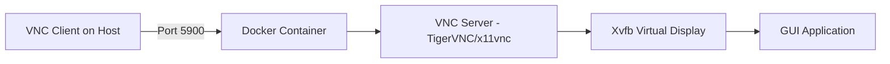

# How to Use Docker Desktop with Virtual Network Computing

Author: [nawazdhandala](https://github.com/nawazdhandala)

Tags: Docker, Docker Desktop, VNC, Virtual Network Computing, GUI Applications, Containers

Description: Run GUI applications inside Docker containers and access them remotely using VNC with Docker Desktop.

---

Containers are typically associated with headless server applications, but there are plenty of reasons to run graphical applications in Docker. Automated browser testing, running desktop Linux applications on macOS or Windows, providing isolated GUI environments for security research, or giving remote teams access to standardized development tools. Virtual Network Computing (VNC) makes this possible by streaming the graphical output from a container to your local VNC client.

This guide shows you how to set up VNC servers inside Docker containers, connect to them from Docker Desktop, and build practical GUI-in-a-container workflows.

## How VNC Works with Docker

VNC uses a client-server model. A VNC server runs inside the container, rendering graphical output to a virtual framebuffer. A VNC client on your host machine connects to the server and displays the remote desktop. The container exposes a VNC port (typically 5900) that your client connects to.

The flow looks like this:



## Running a Basic VNC Container

Start with a minimal Ubuntu container that includes a VNC server and a lightweight desktop environment.

```dockerfile
# Dockerfile.vnc - Ubuntu container with VNC server and XFCE desktop
FROM ubuntu:22.04

# Prevent interactive prompts during package installation
ENV DEBIAN_FRONTEND=noninteractive

# Install XFCE desktop, VNC server, and required utilities
RUN apt-get update && apt-get install -y \
    xfce4 \
    xfce4-terminal \
    tigervnc-standalone-server \
    tigervnc-common \
    dbus-x11 \
    fonts-liberation \
    xfonts-base \
    && rm -rf /var/lib/apt/lists/*

# Create a non-root user for the VNC session
RUN useradd -m -s /bin/bash vncuser && \
    echo "vncuser:vncpassword" | chpasswd

USER vncuser
WORKDIR /home/vncuser

# Set up VNC password (the password for connecting via VNC client)
RUN mkdir -p /home/vncuser/.vnc && \
    echo "dockervnc" | vncpasswd -f > /home/vncuser/.vnc/passwd && \
    chmod 600 /home/vncuser/.vnc/passwd

# VNC startup configuration
RUN echo '#!/bin/bash\nstartxfce4 &' > /home/vncuser/.vnc/xstartup && \
    chmod +x /home/vncuser/.vnc/xstartup

# Expose VNC port
EXPOSE 5901

# Start VNC server on display :1 (port 5901)
CMD ["vncserver", ":1", "-geometry", "1280x720", "-depth", "24", "-fg"]
```

Build and run the container.

```bash
# Build the VNC container image
docker build -f Dockerfile.vnc -t ubuntu-vnc .

# Run the container with port forwarding
docker run -d --name vnc-desktop -p 5901:5901 ubuntu-vnc
```

Connect using any VNC client (like RealVNC Viewer, TigerVNC Viewer, or the built-in macOS Screen Sharing) to `localhost:5901` with the password `dockervnc`.

## Adding a Web-Based VNC Client with noVNC

If you prefer browser-based access, add noVNC to your container. This eliminates the need for a separate VNC client application.

```dockerfile
# Dockerfile.novnc - VNC container with web-based access
FROM ubuntu:22.04

ENV DEBIAN_FRONTEND=noninteractive

# Install desktop, VNC, and noVNC
RUN apt-get update && apt-get install -y \
    xfce4 \
    xfce4-terminal \
    tigervnc-standalone-server \
    tigervnc-common \
    novnc \
    websockify \
    dbus-x11 \
    fonts-liberation \
    python3 \
    python3-numpy \
    && rm -rf /var/lib/apt/lists/*

RUN useradd -m -s /bin/bash vncuser && \
    echo "vncuser:password" | chpasswd

USER vncuser
WORKDIR /home/vncuser

# Configure VNC password and startup
RUN mkdir -p /home/vncuser/.vnc && \
    echo "dockervnc" | vncpasswd -f > /home/vncuser/.vnc/passwd && \
    chmod 600 /home/vncuser/.vnc/passwd && \
    echo '#!/bin/bash\nstartxfce4 &' > /home/vncuser/.vnc/xstartup && \
    chmod +x /home/vncuser/.vnc/xstartup

# Create startup script that launches both VNC and noVNC
USER root
RUN cat > /start.sh << 'SCRIPT'
#!/bin/bash
# Start VNC server as vncuser
su - vncuser -c "vncserver :1 -geometry 1280x720 -depth 24"
# Start noVNC web proxy on port 6080
websockify --web /usr/share/novnc 6080 localhost:5901
SCRIPT
RUN chmod +x /start.sh

# Expose VNC port and noVNC web port
EXPOSE 5901 6080

CMD ["/start.sh"]
```

```bash
# Build and run with both ports exposed
docker build -f Dockerfile.novnc -t ubuntu-novnc .
docker run -d --name web-vnc -p 5901:5901 -p 6080:6080 ubuntu-novnc

# Access via browser at http://localhost:6080/vnc.html
# Or connect a VNC client to localhost:5901
```

Open your browser and navigate to `http://localhost:6080/vnc.html`. Enter the VNC password and you get a full desktop environment running in your browser.

## Running Specific GUI Applications

You do not always need a full desktop. Run individual applications with VNC.

```dockerfile
# Dockerfile.firefox - Firefox browser in a container
FROM ubuntu:22.04

ENV DEBIAN_FRONTEND=noninteractive

RUN apt-get update && apt-get install -y \
    firefox \
    tigervnc-standalone-server \
    tigervnc-common \
    novnc \
    websockify \
    dbus-x11 \
    fonts-liberation \
    xfonts-base \
    && rm -rf /var/lib/apt/lists/*

RUN useradd -m -s /bin/bash browser
USER browser
WORKDIR /home/browser

RUN mkdir -p .vnc && \
    echo "firefox" | vncpasswd -f > .vnc/passwd && \
    chmod 600 .vnc/passwd && \
    echo '#!/bin/bash\nfirefox &' > .vnc/xstartup && \
    chmod +x .vnc/xstartup

USER root
RUN cat > /start.sh << 'SCRIPT'
#!/bin/bash
su - browser -c "vncserver :1 -geometry 1920x1080 -depth 24"
websockify --web /usr/share/novnc 6080 localhost:5901
SCRIPT
RUN chmod +x /start.sh

EXPOSE 5901 6080
CMD ["/start.sh"]
```

```bash
# Run Firefox in a container accessible via browser
docker build -f Dockerfile.firefox -t docker-firefox .
docker run -d --name firefox -p 6080:6080 --shm-size=512m docker-firefox
```

The `--shm-size=512m` flag is important for browsers. Without it, Chrome and Firefox crash because they need shared memory for rendering.

## Docker Compose Setup for VNC Environments

For more complex setups, use Docker Compose.

```yaml
# docker-compose.yml - Multi-service VNC environment
services:
  desktop:
    build:
      context: .
      dockerfile: Dockerfile.novnc
    ports:
      - "6080:6080"
      - "5901:5901"
    # Shared memory for GUI applications
    shm_size: '1gb'
    environment:
      - VNC_RESOLUTION=1920x1080
      - VNC_DEPTH=24
    volumes:
      # Persist user data between restarts
      - desktop-data:/home/vncuser
      # Share files between host and container
      - ./shared:/home/vncuser/shared

  # Optional: Run a separate browser container
  browser:
    build:
      context: .
      dockerfile: Dockerfile.firefox
    ports:
      - "6081:6080"
    shm_size: '512m'
    depends_on:
      - desktop

volumes:
  desktop-data:
```

```bash
# Start the VNC environment
docker compose up -d

# Access desktop at http://localhost:6080/vnc.html
# Access browser at http://localhost:6081/vnc.html
```

## Automated Browser Testing with VNC

VNC containers are valuable for debugging automated browser tests. When a test fails, you can watch it run in real time through VNC instead of guessing from screenshots.

```yaml
# docker-compose.test.yml - Selenium with VNC for test debugging
services:
  selenium:
    image: selenium/standalone-chrome-debug:latest
    ports:
      - "4444:4444"  # Selenium WebDriver
      - "5900:5900"  # VNC for watching tests
    shm_size: '2g'
    environment:
      - SE_VNC_PASSWORD=secret

  test-runner:
    build: .
    depends_on:
      - selenium
    environment:
      - SELENIUM_URL=http://selenium:4444/wd/hub
    command: npm run test:e2e
```

```bash
# Run tests while watching via VNC
docker compose -f docker-compose.test.yml up

# Connect VNC client to localhost:5900 (password: secret)
# Watch tests execute in real time
```

## Performance Optimization

VNC inside Docker can feel sluggish without proper tuning. Apply these optimizations.

```bash
# Run with increased shared memory for smoother rendering
docker run -d --shm-size=1g --name vnc-desktop -p 5901:5901 ubuntu-vnc

# Use a lower color depth for faster network transfer
# In the VNC server startup, use -depth 16 instead of -depth 24
docker run -d --name vnc-fast -p 5901:5901 ubuntu-vnc \
  vncserver :1 -geometry 1280x720 -depth 16 -fg

# For remote access over slow networks, compress the VNC stream
# Configure this in your VNC client settings (ZRLE or Tight encoding)
```

Also consider using a lighter window manager like Openbox or Fluxbox instead of XFCE for lower resource usage.

```bash
# Install a minimal window manager instead of a full desktop
RUN apt-get install -y openbox obconf
```

## Security Considerations

VNC is not encrypted by default. For production use, wrap VNC traffic in SSH or use TLS.

```bash
# Secure VNC access through an SSH tunnel
ssh -L 5901:localhost:5901 user@remote-docker-host

# Then connect your VNC client to localhost:5901
# Traffic is encrypted through the SSH tunnel
```

For noVNC, enable HTTPS by providing SSL certificates.

```bash
# Generate self-signed certificates for noVNC
openssl req -x509 -nodes -newkey rsa:2048 \
  -keyout vnc-key.pem -out vnc-cert.pem -days 365 \
  -subj "/CN=localhost"

# Start noVNC with SSL
websockify --web /usr/share/novnc --cert=vnc-cert.pem --key=vnc-key.pem \
  6080 localhost:5901
```

VNC in Docker containers opens up workflows that would otherwise require dedicated physical or virtual machines. Whether you need isolated browser testing environments, remote desktop access for your team, or a sandboxed space to run untrusted GUI applications, Docker with VNC provides a flexible and reproducible solution.
