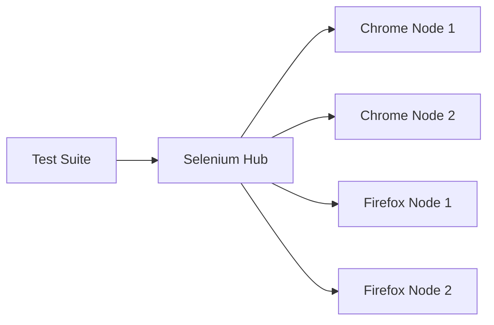

# How to Use Docker for Browser Testing with Selenium Grid

Author: [nawazdhandala](https://github.com/nawazdhandala)

Tags: Docker, Selenium Grid, Browser Testing, Automation, QA, Testing, CI/CD, Chrome, Firefox

Description: Set up a Selenium Grid cluster in Docker for parallel browser testing across Chrome and Firefox browsers.

---

Browser testing is one of those tasks that sounds simple until you try to do it at scale. You need different browser versions, consistent environments, parallel execution to keep test suites fast, and a way to debug failures visually. Selenium Grid solves the orchestration problem, and Docker makes the infrastructure disposable and reproducible.

This guide sets up a complete Selenium Grid in Docker, runs tests in parallel across multiple browsers, and shows you how to watch tests execute in real time.

## Selenium Grid Architecture

Selenium Grid uses a hub-and-node model. The hub receives test requests and routes them to available nodes. Each node runs one or more browser instances. In Docker, the hub and each browser type run as separate containers connected by a network.



Selenium 4 simplified this architecture with the concept of a single "grid" container, but the distributed hub-node model gives you more control over scaling.

## Quick Start with Docker Compose

Here is a Docker Compose file that sets up a Selenium Grid with Chrome and Firefox nodes.

```yaml
# docker-compose.yml - Selenium Grid with Chrome and Firefox
version: "3.8"

services:
  # Selenium Hub routes test requests to browser nodes
  selenium-hub:
    image: selenium/hub:4.18
    container_name: selenium-hub
    ports:
      - "4442:4442"
      - "4443:4443"
      - "4444:4444"
    environment:
      - GRID_MAX_SESSION=10
      - GRID_BROWSER_TIMEOUT=60
      - GRID_TIMEOUT=120

  # Chrome node with VNC access for debugging
  chrome:
    image: selenium/node-chrome:4.18
    container_name: chrome-node
    depends_on:
      - selenium-hub
    environment:
      - SE_EVENT_BUS_HOST=selenium-hub
      - SE_EVENT_BUS_PUBLISH_PORT=4442
      - SE_EVENT_BUS_SUBSCRIBE_PORT=4443
      - SE_NODE_MAX_SESSIONS=4
      - SE_NODE_SESSION_TIMEOUT=120
    shm_size: "2g"  # Required for Chrome to function properly
    volumes:
      - /dev/shm:/dev/shm

  # Firefox node with VNC access for debugging
  firefox:
    image: selenium/node-firefox:4.18
    container_name: firefox-node
    depends_on:
      - selenium-hub
    environment:
      - SE_EVENT_BUS_HOST=selenium-hub
      - SE_EVENT_BUS_PUBLISH_PORT=4442
      - SE_EVENT_BUS_SUBSCRIBE_PORT=4443
      - SE_NODE_MAX_SESSIONS=4
      - SE_NODE_SESSION_TIMEOUT=120
    shm_size: "2g"
    volumes:
      - /dev/shm:/dev/shm
```

```bash
# Start the Selenium Grid
docker compose up -d

# Verify the grid is running
curl http://localhost:4444/status | python3 -m json.tool
```

Open http://localhost:4444 in your browser to see the Selenium Grid console. It shows connected nodes, active sessions, and queue status.

## Writing Tests Against the Grid

Here is a Python test that runs against the Selenium Grid. The test connects to the hub URL instead of a local browser.

```python
# test_example.py - Browser tests using Selenium Grid
from selenium import webdriver
from selenium.webdriver.common.by import By
from selenium.webdriver.support.ui import WebDriverWait
from selenium.webdriver.support import expected_conditions as EC
import unittest

class TestWebApp(unittest.TestCase):

    def setUp(self):
        """Connect to Selenium Grid and create a browser session."""
        chrome_options = webdriver.ChromeOptions()
        chrome_options.add_argument("--no-sandbox")
        chrome_options.add_argument("--disable-dev-shm-usage")

        self.driver = webdriver.Remote(
            command_executor="http://localhost:4444/wd/hub",
            options=chrome_options
        )
        self.driver.implicitly_wait(10)

    def test_page_title(self):
        """Verify the page title loads correctly."""
        self.driver.get("https://example.com")
        self.assertIn("Example Domain", self.driver.title)

    def test_page_content(self):
        """Verify page content is present."""
        self.driver.get("https://example.com")
        heading = self.driver.find_element(By.TAG_NAME, "h1")
        self.assertEqual("Example Domain", heading.text)

    def test_link_navigation(self):
        """Verify links navigate to the correct page."""
        self.driver.get("https://example.com")
        link = self.driver.find_element(By.TAG_NAME, "a")
        link.click()
        WebDriverWait(self.driver, 10).until(
            EC.url_contains("iana.org")
        )

    def tearDown(self):
        """Close the browser session."""
        self.driver.quit()

if __name__ == "__main__":
    unittest.main()
```

```bash
# Install Selenium and run tests
pip install selenium
python -m pytest test_example.py -v
```

## Running Tests on Multiple Browsers

Use pytest parametrize to run the same tests across different browsers.

```python
# test_cross_browser.py - Cross-browser testing with parametrize
import pytest
from selenium import webdriver
from selenium.webdriver.common.by import By

@pytest.fixture(params=["chrome", "firefox"])
def browser(request):
    """Create a browser session for each browser type."""
    if request.param == "chrome":
        options = webdriver.ChromeOptions()
        options.add_argument("--no-sandbox")
    elif request.param == "firefox":
        options = webdriver.FirefoxOptions()

    driver = webdriver.Remote(
        command_executor="http://localhost:4444/wd/hub",
        options=options
    )
    driver.implicitly_wait(10)
    yield driver
    driver.quit()

def test_homepage_loads(browser):
    """Test that the homepage loads in both Chrome and Firefox."""
    browser.get("https://example.com")
    assert "Example Domain" in browser.title

def test_heading_visible(browser):
    """Test that the main heading is visible."""
    browser.get("https://example.com")
    heading = browser.find_element(By.TAG_NAME, "h1")
    assert heading.is_displayed()
    assert heading.text == "Example Domain"
```

```bash
# Run cross-browser tests in parallel
pip install pytest-xdist
python -m pytest test_cross_browser.py -v -n 4
```

## Scaling Browser Nodes

Need more parallel capacity? Scale the Chrome or Firefox nodes.

```bash
# Scale Chrome nodes to 5 instances
docker compose up -d --scale chrome=5

# Scale Firefox nodes to 3 instances
docker compose up -d --scale firefox=3

# Check grid status to see all nodes
curl -s http://localhost:4444/status | python3 -c "
import sys, json
data = json.load(sys.stdin)
nodes = data['value']['nodes']
print(f'Total nodes: {len(nodes)}')
for node in nodes:
    slots = node['slots']
    print(f'  Node: {node[\"uri\"]} - {len(slots)} slots')
"
```

## Visual Debugging with VNC

Use the debug images that include VNC access to watch tests run in real time.

```yaml
# docker-compose-debug.yml - Grid with VNC-enabled nodes
version: "3.8"

services:
  selenium-hub:
    image: selenium/hub:4.18
    ports:
      - "4444:4444"

  chrome-debug:
    image: selenium/node-chrome:4.18
    depends_on:
      - selenium-hub
    environment:
      - SE_EVENT_BUS_HOST=selenium-hub
      - SE_EVENT_BUS_PUBLISH_PORT=4442
      - SE_EVENT_BUS_SUBSCRIBE_PORT=4443
      - SE_VNC_NO_PASSWORD=1
    ports:
      - "7900:7900"  # noVNC web interface
    shm_size: "2g"
```

```bash
# Start the debug grid
docker compose -f docker-compose-debug.yml up -d
```

Open http://localhost:7900 in your browser to watch Chrome execute your tests through a web-based VNC viewer.

## Taking Screenshots on Failure

Configure your tests to capture screenshots when assertions fail.

```python
# conftest.py - Pytest configuration for screenshot capture
import pytest
import os
from datetime import datetime

@pytest.hookimpl(tryfirst=True, hookwrapper=True)
def pytest_runtest_makereport(item, call):
    """Capture a screenshot when a test fails."""
    outcome = yield
    report = outcome.get_result()

    if report.when == "call" and report.failed:
        driver = item.funcargs.get("browser")
        if driver:
            os.makedirs("screenshots", exist_ok=True)
            timestamp = datetime.now().strftime("%Y%m%d_%H%M%S")
            filename = f"screenshots/{item.name}_{timestamp}.png"
            driver.save_screenshot(filename)
            print(f"\nScreenshot saved: {filename}")
```

## CI/CD Integration

Run Selenium Grid as part of your CI pipeline using Docker Compose.

```yaml
# .github/workflows/browser-tests.yml - Browser testing in CI
name: Browser Tests

on:
  pull_request:
    branches: [main]

jobs:
  test:
    runs-on: ubuntu-latest
    steps:
      - uses: actions/checkout@v4

      - name: Start Selenium Grid
        run: docker compose up -d --wait

      - name: Wait for grid to be ready
        run: |
          for i in $(seq 1 30); do
            if curl -s http://localhost:4444/status | grep -q '"ready":true'; then
              echo "Grid is ready"
              break
            fi
            echo "Waiting for grid... ($i/30)"
            sleep 2
          done

      - name: Run browser tests
        run: |
          pip install selenium pytest pytest-xdist
          python -m pytest tests/ -v -n 4 --junitxml=results.xml

      - name: Upload test results
        uses: actions/upload-artifact@v4
        if: always()
        with:
          name: test-results
          path: |
            results.xml
            screenshots/

      - name: Stop Selenium Grid
        if: always()
        run: docker compose down
```

## Wrapping Up

Selenium Grid in Docker transforms browser testing from a painful manual process into an automated, scalable pipeline. You get consistent browser versions, parallel execution, visual debugging through VNC, and straightforward CI integration. The compose file is your single source of truth for the testing infrastructure, and scaling is a one-liner. Start small with one Chrome and one Firefox node, then scale as your test suite grows.
