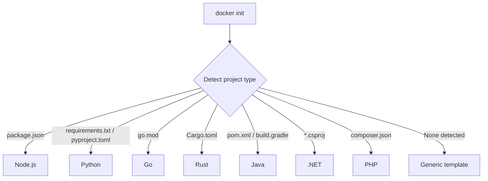

# How to Use docker init to Generate Dockerfiles Automatically

Author: [nawazdhandala](https://github.com/nawazdhandala)

Tags: Docker, Docker Init, Dockerfile, Docker Compose, DevOps, Containerization, Developer Tools

Description: Learn how to use the docker init command to automatically generate Dockerfiles, compose files, and .dockerignore for your projects.

---

Writing Dockerfiles from scratch gets repetitive. You look up the right base image, set the working directory, copy files, install dependencies, configure the entrypoint, and do the same dance for every new project. The `docker init` command automates this process. It detects your project's language and framework, asks a few questions, and generates a production-ready Dockerfile, a Docker Compose file, and a .dockerignore - all following Docker's best practices.

## What docker init Generates

Running `docker init` in a project directory produces three files:

- **Dockerfile** - Multi-stage build optimized for your language
- **compose.yaml** - Docker Compose configuration for local development
- **.dockerignore** - Excludes unnecessary files from the build context

The generated files are not minimal stubs. They include multi-stage builds, proper caching of dependency layers, non-root user configuration, and health checks. These are production-quality starting points.

## Prerequisites

Docker init requires Docker Desktop 4.18 or later. Verify your setup:

```bash
# Check Docker version (need 4.18+ for docker init)
docker version

# Verify docker init is available
docker init --help
```

## Your First docker init

Let's walk through generating Docker files for a simple Node.js project. Start with a basic project:

```bash
# Create a sample project
mkdir my-node-app && cd my-node-app

# Initialize a basic Node.js project
npm init -y
npm install express

# Create a simple server
cat > index.js << 'SCRIPT'
const express = require('express');
const app = express();
const port = process.env.PORT || 3000;

app.get('/', (req, res) => {
  res.json({ status: 'running' });
});

app.listen(port, () => {
  console.log(`Server listening on port ${port}`);
});
SCRIPT
```

Now run docker init:

```bash
# Run docker init in the project directory
docker init
```

The command detects your project as Node.js and walks you through an interactive wizard:

```
Welcome to the Docker Init CLI!

This utility will walk you through creating the following files with
sensible defaults for your project:
  - .dockerignore
  - Dockerfile
  - compose.yaml

? What application platform does your project use? Node
? What version of Node do you want to use? 20
? Which package manager do you want to use? npm
? What command do you want to use to start the app? node index.js
? What port does your server listen on? 3000
```

## Examining the Generated Dockerfile

The generated Dockerfile uses multi-stage builds and follows Docker best practices:

```dockerfile
# syntax=docker/dockerfile:1

# Stage 1: Install dependencies
ARG NODE_VERSION=20
FROM node:${NODE_VERSION}-alpine as base
WORKDIR /usr/src/app

# Install dependencies in a separate stage for caching
FROM base as deps
RUN --mount=type=bind,source=package.json,target=package.json \
    --mount=type=bind,source=package-lock.json,target=package-lock.json \
    --mount=type=cache,target=/root/.npm \
    npm ci --omit=dev

# Final stage: copy dependencies and source code
FROM base as final

# Run as non-root user for security
RUN addgroup -S appgroup && adduser -S appuser -G appgroup
USER appuser

# Copy installed dependencies from the deps stage
COPY --from=deps /usr/src/app/node_modules ./node_modules

# Copy application source
COPY . .

EXPOSE 3000

CMD ["node", "index.js"]
```

Notice the key best practices baked in:

- **Multi-stage build** keeps the final image small
- **BuildKit cache mounts** speed up npm installs
- **Non-root user** improves security
- **Dependency layer separation** means rebuilds only reinstall packages when package.json changes

## Examining the Generated compose.yaml

```yaml
services:
  server:
    build:
      context: .
    ports:
      - "3000:3000"
    environment:
      NODE_ENV: production
```

The compose file is intentionally minimal but functional. You can extend it with volumes, databases, and other services.

## Examining the Generated .dockerignore

```
# Include any files or directories that you don't want to be copied to your
# container here (e.g., local build artifacts, temporary files, etc.).
node_modules
.git
.gitignore
*.md
```

The .dockerignore prevents unnecessary files from bloating your build context. This speeds up builds and reduces image size.

## Supported Languages

Docker init supports several languages and frameworks. The detection works by examining files in your project directory.



If docker init cannot detect your language, it offers a generic template that you can customize.

## Customizing After Generation

The generated files are starting points. You should customize them for your specific needs.

### Adding a Database Service

```yaml
# Extend compose.yaml with a PostgreSQL database
services:
  server:
    build:
      context: .
    ports:
      - "3000:3000"
    environment:
      NODE_ENV: production
      DATABASE_URL: postgres://user:password@db:5432/myapp
    depends_on:
      db:
        condition: service_healthy

  db:
    image: postgres:16-alpine
    environment:
      POSTGRES_USER: user
      POSTGRES_PASSWORD: password
      POSTGRES_DB: myapp
    volumes:
      - pgdata:/var/lib/postgresql/data
    healthcheck:
      test: ["CMD-SHELL", "pg_isready -U user -d myapp"]
      interval: 5s
      timeout: 5s
      retries: 5

volumes:
  pgdata:
```

### Adding Development Mode

The default Dockerfile targets production. For development, add a bind mount and use nodemon:

```yaml
# compose.yaml with development override
services:
  server:
    build:
      context: .
      target: base  # Use the base stage, not the final stage
    ports:
      - "3000:3000"
    volumes:
      - .:/usr/src/app        # Bind mount for hot reload
      - /usr/src/app/node_modules  # Preserve container node_modules
    command: npx nodemon index.js
    environment:
      NODE_ENV: development
```

## Running docker init on Existing Projects

Docker init works on existing projects that already have a Dockerfile. It warns you before overwriting existing files:

```bash
# Running docker init in a project with existing Docker files
docker init

# Output:
# WARNING: The following Docker files already exist:
#   - Dockerfile
#   - compose.yaml
#   - .dockerignore
# ? Do you want to overwrite them? (y/N)
```

This makes it safe to experiment. You can run docker init to see what it would generate, compare with your existing files, and selectively adopt improvements.

## Tips for Getting the Most from docker init

Start every new project with `docker init` before writing your own Dockerfile. Even if you plan to customize heavily, the generated files give you a solid foundation with best practices already applied.

Review the multi-stage build structure. Docker init generates separate stages for dependency installation and final image assembly. This pattern dramatically improves build cache efficiency.

Check the .dockerignore file. The default excludes are good, but you might need to add project-specific entries like test fixtures, documentation, or CI configuration that do not belong in the container.

Use the compose.yaml as your development environment foundation. Add databases, caches, message queues, and other services your application needs. Having a single `docker compose up` command that starts everything saves significant setup time for new team members.

Docker init removes the friction of containerizing applications. It takes what used to be a 30-minute task of researching best practices and writing configuration from scratch, and reduces it to a 30-second interactive wizard. The output is not just functional but genuinely well-structured. Give it a try on your next project.
