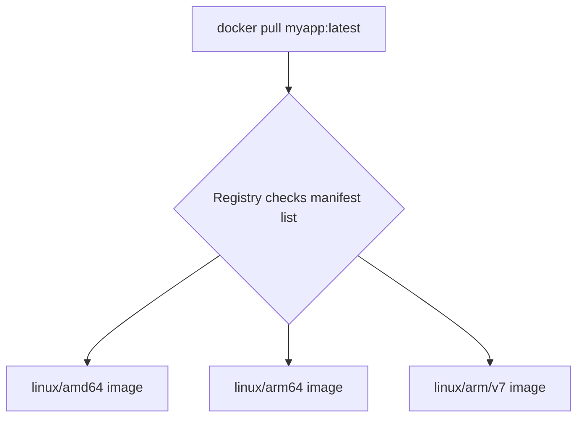

# How to Use docker manifest for Multi-Platform Images

Author: [nawazdhandala](https://github.com/nawazdhandala)

Tags: Docker, Docker Manifest, Multi-Platform, Multi-Architecture, Container Registry, DevOps

Description: Create and manage Docker manifest lists to publish multi-platform images that work on AMD64, ARM64, and other architectures.

---

When someone runs `docker pull nginx`, they get the right image for their CPU architecture automatically. That magic happens through manifest lists. A manifest list is a pointer that maps a single image tag to multiple platform-specific images. The `docker manifest` command lets you create these lists for your own images, so users on any architecture can pull your image with one tag.

## How Manifest Lists Work

A regular Docker image is built for a specific platform, like `linux/amd64`. A manifest list sits on top of multiple platform-specific images and acts as a router. When a Docker client pulls the image, it sends its platform information to the registry. The registry checks the manifest list and returns the correct image for that platform.



## Enabling Docker Manifest

The `docker manifest` command is an experimental feature. You need to enable it in your Docker configuration.

```bash
# Enable experimental CLI features
export DOCKER_CLI_EXPERIMENTAL=enabled

# Or add it to your Docker config file permanently
mkdir -p ~/.docker
cat > ~/.docker/config.json << 'CONF'
{
  "experimental": "enabled"
}
CONF
```

Verify it is enabled:

```bash
# Check if manifest commands are available
docker manifest --help
```

## Inspecting Existing Manifest Lists

Before creating your own, inspect how existing multi-platform images are structured.

```bash
# Inspect the manifest list for nginx
docker manifest inspect nginx:alpine

# Pretty-print with jq
docker manifest inspect nginx:alpine | jq .

# Inspect with verbose flag for full details
docker manifest inspect --verbose nginx:alpine
```

The output shows each platform variant:

```json
{
  "manifests": [
    {
      "digest": "sha256:abc123...",
      "platform": {
        "architecture": "amd64",
        "os": "linux"
      }
    },
    {
      "digest": "sha256:def456...",
      "platform": {
        "architecture": "arm64",
        "os": "linux"
      }
    },
    {
      "digest": "sha256:ghi789...",
      "platform": {
        "architecture": "arm",
        "os": "linux",
        "variant": "v7"
      }
    }
  ]
}
```

```bash
# Quick check: which platforms does an image support?
docker manifest inspect --verbose nginx:alpine | jq '.[].Descriptor.platform'
```

## Creating a Multi-Platform Image with docker manifest

The workflow has three steps: build platform-specific images, push them, then create and push the manifest list.

### Step 1: Build Platform-Specific Images

Build separate images for each target platform.

```bash
# Build for AMD64
docker build --platform linux/amd64 -t myregistry/myapp:latest-amd64 .
docker push myregistry/myapp:latest-amd64

# Build for ARM64
docker build --platform linux/arm64 -t myregistry/myapp:latest-arm64 .
docker push myregistry/myapp:latest-arm64

# Build for ARMv7
docker build --platform linux/arm/v7 -t myregistry/myapp:latest-armv7 .
docker push myregistry/myapp:latest-armv7
```

### Step 2: Create the Manifest List

Combine the platform-specific images into a single manifest list.

```bash
# Create the manifest list
docker manifest create myregistry/myapp:latest \
  myregistry/myapp:latest-amd64 \
  myregistry/myapp:latest-arm64 \
  myregistry/myapp:latest-armv7
```

### Step 3: Annotate Platform Information

Add platform metadata to each entry in the manifest list.

```bash
# Annotate the AMD64 image
docker manifest annotate myregistry/myapp:latest \
  myregistry/myapp:latest-amd64 \
  --os linux --arch amd64

# Annotate the ARM64 image
docker manifest annotate myregistry/myapp:latest \
  myregistry/myapp:latest-arm64 \
  --os linux --arch arm64

# Annotate the ARMv7 image with variant
docker manifest annotate myregistry/myapp:latest \
  myregistry/myapp:latest-armv7 \
  --os linux --arch arm --variant v7
```

### Step 4: Push the Manifest List

```bash
# Push the manifest list to the registry
docker manifest push myregistry/myapp:latest

# Push and purge the local manifest cache
docker manifest push --purge myregistry/myapp:latest
```

## Complete Build and Publish Script

Here is a full script that automates the entire process.

```bash
#!/bin/bash
# build-multiplatform.sh - Build and push multi-platform Docker images

REGISTRY="myregistry.example.com"
IMAGE="myapp"
TAG="${1:-latest}"

echo "Building multi-platform image: ${REGISTRY}/${IMAGE}:${TAG}"

# Build for each platform
for PLATFORM in linux/amd64 linux/arm64 linux/arm/v7; do
  # Create a tag-safe platform suffix (replace / with -)
  SUFFIX=$(echo "$PLATFORM" | tr '/' '-')

  echo "Building for $PLATFORM..."
  docker build --platform "$PLATFORM" \
    -t "${REGISTRY}/${IMAGE}:${TAG}-${SUFFIX}" .

  echo "Pushing ${REGISTRY}/${IMAGE}:${TAG}-${SUFFIX}..."
  docker push "${REGISTRY}/${IMAGE}:${TAG}-${SUFFIX}"
done

# Create manifest list
echo "Creating manifest list..."
docker manifest create "${REGISTRY}/${IMAGE}:${TAG}" \
  "${REGISTRY}/${IMAGE}:${TAG}-linux-amd64" \
  "${REGISTRY}/${IMAGE}:${TAG}-linux-arm64" \
  "${REGISTRY}/${IMAGE}:${TAG}-linux-arm-v7"

# Annotate each platform
docker manifest annotate "${REGISTRY}/${IMAGE}:${TAG}" \
  "${REGISTRY}/${IMAGE}:${TAG}-linux-amd64" --os linux --arch amd64

docker manifest annotate "${REGISTRY}/${IMAGE}:${TAG}" \
  "${REGISTRY}/${IMAGE}:${TAG}-linux-arm64" --os linux --arch arm64

docker manifest annotate "${REGISTRY}/${IMAGE}:${TAG}" \
  "${REGISTRY}/${IMAGE}:${TAG}-linux-arm-v7" --os linux --arch arm --variant v7

# Push the manifest list
echo "Pushing manifest list..."
docker manifest push --purge "${REGISTRY}/${IMAGE}:${TAG}"

echo "Done! Image available at ${REGISTRY}/${IMAGE}:${TAG}"
```

```bash
# Run the script
chmod +x build-multiplatform.sh
./build-multiplatform.sh v1.2.3
```

## docker manifest vs docker buildx

The `docker manifest` command is the manual approach. Docker buildx can create multi-platform images in a single command, which is simpler for most use cases.

```bash
# The buildx equivalent - builds all platforms and pushes in one command
docker buildx build --platform linux/amd64,linux/arm64,linux/arm/v7 \
  -t myregistry/myapp:latest --push .
```

So when should you use `docker manifest` instead of `buildx`?

**Use docker manifest when:**
- You build images on different machines (e.g., AMD64 on an x86 CI server, ARM64 on an ARM CI server)
- You need to combine images built from different Dockerfiles
- You want fine-grained control over the manifest list contents
- Your build process is spread across multiple CI jobs

**Use docker buildx when:**
- You can build all platforms from a single machine
- Your Dockerfile works across all target platforms
- You want the simplest possible workflow

## CI/CD Pipeline with Manifest Lists

In many CI/CD setups, different runners handle different architectures. The manifest list combines their outputs.

```yaml
# Example: GitHub Actions with matrix build and manifest
name: Multi-platform Build

on:
  push:
    tags:
      - 'v*'

jobs:
  build:
    runs-on: ${{ matrix.runner }}
    strategy:
      matrix:
        include:
          - platform: linux/amd64
            runner: ubuntu-latest
            suffix: amd64
          - platform: linux/arm64
            runner: ubuntu-latest  # uses QEMU or native ARM runner
            suffix: arm64
    steps:
      - uses: actions/checkout@v4

      - name: Build and push platform image
        run: |
          docker build --platform ${{ matrix.platform }} \
            -t myregistry/myapp:${{ github.ref_name }}-${{ matrix.suffix }} .
          docker push myregistry/myapp:${{ github.ref_name }}-${{ matrix.suffix }}

  manifest:
    needs: build
    runs-on: ubuntu-latest
    steps:
      - name: Create and push manifest list
        run: |
          docker manifest create myregistry/myapp:${{ github.ref_name }} \
            myregistry/myapp:${{ github.ref_name }}-amd64 \
            myregistry/myapp:${{ github.ref_name }}-arm64

          docker manifest annotate myregistry/myapp:${{ github.ref_name }} \
            myregistry/myapp:${{ github.ref_name }}-amd64 --os linux --arch amd64

          docker manifest annotate myregistry/myapp:${{ github.ref_name }} \
            myregistry/myapp:${{ github.ref_name }}-arm64 --os linux --arch arm64

          docker manifest push myregistry/myapp:${{ github.ref_name }}
```

## Managing Manifest Lists

### Listing Local Manifests

```bash
# List locally created manifests (stored in ~/.docker/manifests/)
ls ~/.docker/manifests/
```

### Updating a Manifest List

To update an existing manifest list, recreate it with the `--amend` flag.

```bash
# Add a new platform to an existing manifest list
docker manifest create --amend myregistry/myapp:latest \
  myregistry/myapp:latest-amd64 \
  myregistry/myapp:latest-arm64 \
  myregistry/myapp:latest-s390x

docker manifest annotate myregistry/myapp:latest \
  myregistry/myapp:latest-s390x --os linux --arch s390x

docker manifest push --purge myregistry/myapp:latest
```

### Removing Local Manifest Cache

```bash
# Remove a locally cached manifest list
docker manifest rm myregistry/myapp:latest

# Or remove the manifest directory directly
rm -rf ~/.docker/manifests/myregistry_myapp-latest
```

## Verifying Multi-Platform Images

After pushing, verify that the manifest list is correct.

```bash
# Check the manifest list in the registry
docker manifest inspect myregistry/myapp:latest | jq '.manifests[] | {platform: .platform, digest: .digest}'

# Pull and verify on different platforms
docker pull --platform linux/amd64 myregistry/myapp:latest
docker inspect --format '{{.Architecture}}' myregistry/myapp:latest

docker pull --platform linux/arm64 myregistry/myapp:latest
docker inspect --format '{{.Architecture}}' myregistry/myapp:latest
```

## Troubleshooting

**"manifest list is not supported"** - Your registry might not support manifest lists. Docker Hub, GitHub Container Registry, and most modern registries do. Some older private registries do not.

**"no matching manifest for platform"** - The manifest list does not include an entry for the pulling client's platform. Add the missing platform and re-push.

**Stale local cache** - If you get unexpected results, clear the local manifest cache with `docker manifest rm` and try again.

```bash
# Clear all local manifest caches
rm -rf ~/.docker/manifests/*
```

Manifest lists are the foundation of multi-platform Docker image distribution. Whether you use `docker manifest` directly or rely on buildx, understanding how manifest lists work helps you debug platform issues and serve users on every architecture from a single image tag.
