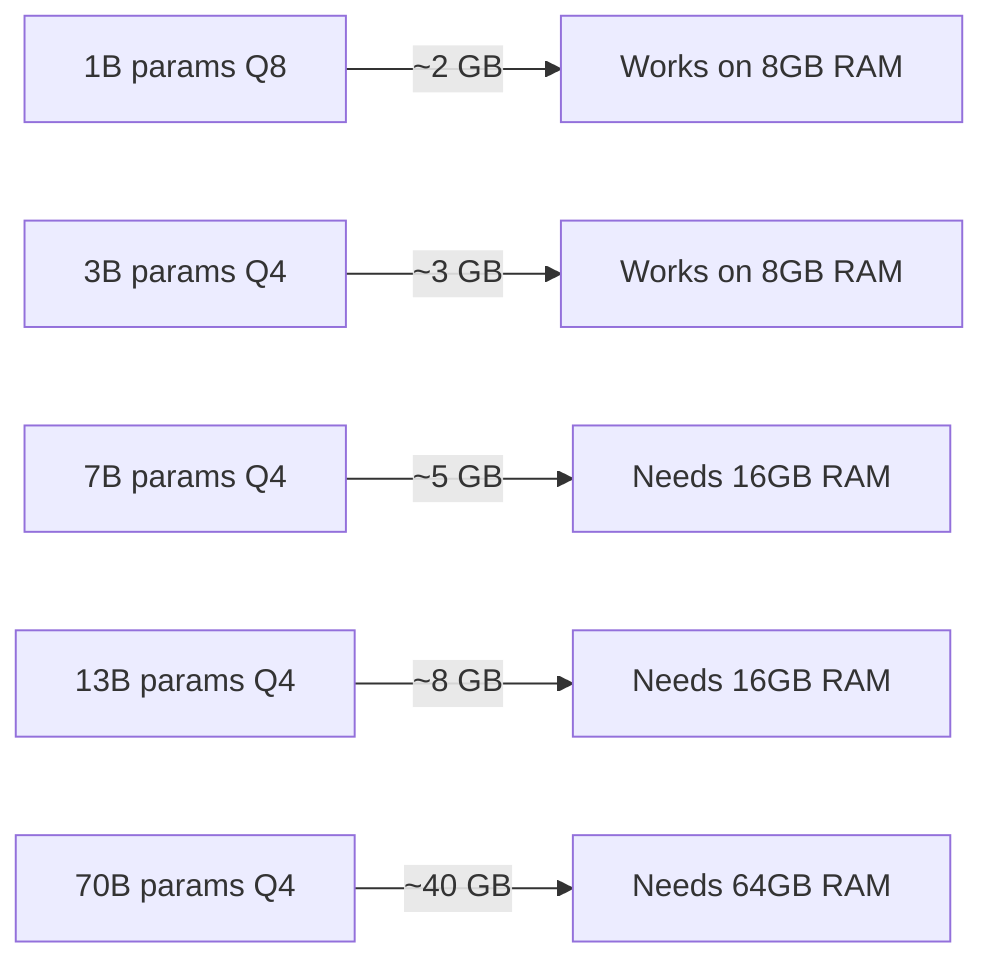

# How to Use Docker Model Runner for Local AI Models

Author: [nawazdhandala](https://github.com/nawazdhandala)

Tags: Docker, Docker Model Runner, AI, Machine Learning, LLM, Local AI, GPU, DevOps

Description: Learn how to use Docker Model Runner to pull, run, and manage AI models locally with GPU acceleration and OpenAI-compatible API endpoints.

---

Running AI models locally gives you privacy, lower latency, and zero API costs. Docker Model Runner makes this accessible by integrating model management directly into the Docker workflow you already know. Pull a model like you pull an image. Run it with a single command. Access it through an OpenAI-compatible API. No Python environment setup, no dependency conflicts, no CUDA version headaches.

## What Docker Model Runner Does

Docker Model Runner is a feature in Docker Desktop that lets you run large language models (LLMs) and other AI models on your local machine. It handles GPU detection, memory management, and model serving automatically. Models are stored and managed similarly to Docker images, with a familiar pull/run/list workflow.

The key capabilities:

- Pull models from Docker Hub and other registries
- Run models with GPU acceleration (NVIDIA, Apple Silicon)
- Expose an OpenAI-compatible REST API
- Manage model lifecycle (start, stop, remove)
- Integrate models into Docker Compose stacks

## Prerequisites

You need Docker Desktop 4.34 or later with the Model Runner feature enabled:

```bash
# Check your Docker Desktop version
docker version

# Verify Model Runner is available
docker model --help
```

For GPU acceleration:
- **NVIDIA GPUs**: Install the NVIDIA Container Toolkit
- **Apple Silicon**: GPU acceleration works out of the box on M1/M2/M3/M4 Macs
- **CPU-only**: Models run on CPU if no GPU is available (slower but functional)

## Pulling Your First Model

Docker Model Runner uses a registry-based model distribution system. Pull models just like Docker images:

```bash
# Pull a small, efficient model (good for getting started)
docker model pull ai/llama3.2:1B-Q8_0

# Pull a larger, more capable model
docker model pull ai/llama3.2:3B-Q4_K_M

# Pull a code-specialized model
docker model pull ai/codellama:7B-Q4_K_M

# List all downloaded models
docker model list
```

The model tags follow a pattern: `model-name:parameter-count-quantization`. Q4_K_M means 4-bit quantization with K-quants, a good balance of quality and memory usage. Q8_0 is higher quality but uses more memory.

## Running a Model

Start a model and interact with it through the built-in API:

```bash
# Run a model (starts the inference server)
docker model run ai/llama3.2:1B-Q8_0

# The model is now serving on a local endpoint
# Default: http://localhost:12434/v1
```

Once running, you can chat with the model directly:

```bash
# Send a chat completion request using curl
curl http://localhost:12434/engines/ai/llama3.2:1B-Q8_0/v1/chat/completions \
  -H "Content-Type: application/json" \
  -d '{
    "model": "ai/llama3.2:1B-Q8_0",
    "messages": [
      {"role": "system", "content": "You are a helpful assistant."},
      {"role": "user", "content": "Explain Docker volumes in 3 sentences."}
    ],
    "temperature": 0.7,
    "max_tokens": 256
  }'
```

The API follows the OpenAI Chat Completions format, which means existing tools and libraries that work with the OpenAI API can point to your local model with minimal changes.

## Using the OpenAI Python Client

Since the API is OpenAI-compatible, you can use the official OpenAI Python library:

```python
# app.py - Using a local Docker model with the OpenAI Python client
from openai import OpenAI

# Point the client to the local Docker Model Runner endpoint
client = OpenAI(
    base_url="http://localhost:12434/engines/ai/llama3.2:1B-Q8_0/v1",
    api_key="not-needed"  # Local models do not require an API key
)

# Send a chat completion request
response = client.chat.completions.create(
    model="ai/llama3.2:1B-Q8_0",
    messages=[
        {"role": "system", "content": "You are a helpful DevOps assistant."},
        {"role": "user", "content": "Write a Dockerfile for a Python Flask app."}
    ],
    temperature=0.7,
    max_tokens=1024
)

print(response.choices[0].message.content)
```

This approach lets you develop and test AI features locally without paying for API calls, then switch to a cloud provider in production by changing the base_url and adding a real API key.

## Integrating Models into Docker Compose

Docker Model Runner models can be part of your Docker Compose stack. This is useful for applications that include an AI component alongside traditional services.

```yaml
# compose.yaml - Application stack with local AI model
services:
  # Your web application
  app:
    build: .
    ports:
      - "3000:3000"
    environment:
      - AI_API_URL=http://model-runner:12434/engines/ai/llama3.2:1B-Q8_0/v1
      - AI_MODEL=ai/llama3.2:1B-Q8_0
    depends_on:
      - db

  # Database
  db:
    image: postgres:16-alpine
    environment:
      POSTGRES_DB: myapp
      POSTGRES_USER: app
      POSTGRES_PASSWORD: secret
    volumes:
      - pgdata:/var/lib/postgresql/data

volumes:
  pgdata:
```

Your application code connects to the model API endpoint just like it would connect to OpenAI, but everything runs locally.

## Managing Models

Docker Model Runner provides commands to manage the model lifecycle:

```bash
# List all downloaded models with sizes
docker model list

# Show detailed information about a model
docker model inspect ai/llama3.2:1B-Q8_0

# Remove a model to free disk space
docker model rm ai/llama3.2:1B-Q8_0

# Remove all unused models
docker model prune
```

## GPU Memory Management

Models consume significant GPU memory. Monitor usage and choose models that fit your hardware:

```bash
# Check GPU memory usage on NVIDIA
nvidia-smi

# On Apple Silicon, check Activity Monitor or:
sudo powermetrics --samplers gpu_power
```

Rough memory requirements by model size:



If you run out of GPU memory, switch to a smaller model or a more aggressive quantization level.

## Building AI-Powered Applications

Here is a practical example of a Node.js application that uses a local Docker model for text summarization:

```javascript
// summarizer.js - Text summarization using local Docker model
const express = require('express');
const app = express();
app.use(express.json());

const AI_URL = process.env.AI_API_URL || 'http://localhost:12434/engines/ai/llama3.2:1B-Q8_0/v1';

// Summarize endpoint - sends text to the local model for summarization
app.post('/api/summarize', async (req, res) => {
    const { text } = req.body;

    try {
        const response = await fetch(`${AI_URL}/chat/completions`, {
            method: 'POST',
            headers: { 'Content-Type': 'application/json' },
            body: JSON.stringify({
                model: 'ai/llama3.2:1B-Q8_0',
                messages: [
                    {
                        role: 'system',
                        content: 'Summarize the following text in 2-3 sentences. Be concise.'
                    },
                    { role: 'user', content: text }
                ],
                temperature: 0.3,
                max_tokens: 256
            })
        });

        const data = await response.json();
        res.json({ summary: data.choices[0].message.content });
    } catch (error) {
        res.status(500).json({ error: 'Model inference failed' });
    }
});

app.listen(3000, () => console.log('Summarizer running on port 3000'));
```

## Streaming Responses

For better user experience with longer outputs, use streaming:

```python
# stream_example.py - Stream responses from a local Docker model
from openai import OpenAI

client = OpenAI(
    base_url="http://localhost:12434/engines/ai/llama3.2:1B-Q8_0/v1",
    api_key="not-needed"
)

# Enable streaming for real-time output
stream = client.chat.completions.create(
    model="ai/llama3.2:1B-Q8_0",
    messages=[
        {"role": "user", "content": "Write a comprehensive guide to Docker networking."}
    ],
    stream=True
)

# Print tokens as they arrive
for chunk in stream:
    if chunk.choices[0].delta.content:
        print(chunk.choices[0].delta.content, end="", flush=True)
```

## Choosing the Right Model

Different tasks call for different models:

- **General conversation**: Llama 3.2 1B or 3B
- **Code generation**: CodeLlama 7B or 13B
- **Technical writing**: Llama 3.2 3B or larger
- **Quick responses, limited hardware**: Llama 3.2 1B with Q4 quantization

Start small and scale up if the quality is insufficient. A 1B parameter model runs fast and handles many tasks surprisingly well. Move to 3B or 7B only if you need the extra capability.

## Practical Tips

Keep models on an SSD. Loading a multi-gigabyte model from a spinning disk adds significant startup time.

Use lower quantization (Q4) for development and testing where speed matters more than quality. Switch to Q8 or full precision only when evaluating model output quality.

Set temperature to 0.0 for deterministic outputs in testing. This makes your AI features easier to test because the same input always produces the same output.

Docker Model Runner bridges the gap between traditional Docker workflows and AI model serving. You manage models with familiar commands, serve them through a standard API, and integrate them into existing Compose stacks. For development and testing, this eliminates the need for cloud API keys and gives you complete control over your AI infrastructure.
