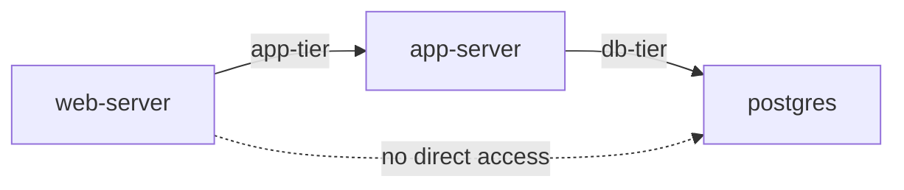

# How to Use Docker Network Connect and Disconnect Commands

Author: [nawazdhandala](https://github.com/nawazdhandala)

Tags: Docker, Networking, Containers, DevOps, Docker CLI

Description: Learn how to dynamically attach and detach Docker containers from networks using the connect and disconnect commands.

---

Docker containers often need to communicate with each other, and Docker networks make that possible. What many people miss is that you can attach a running container to additional networks, or remove it from networks, without stopping or restarting the container. The `docker network connect` and `docker network disconnect` commands give you this flexibility.

## The Basics

Every Docker container starts attached to at least one network. By default, that is the `bridge` network. But you can connect a container to additional networks at any time, and a container can belong to multiple networks simultaneously.

Think of it like plugging an ethernet cable into an additional switch. The container gets a new network interface, a new IP address on that network, and can immediately communicate with other containers on that network.

## Creating Networks to Work With

Before connecting containers to networks, let's create a few to experiment with:

```bash
# Create two custom bridge networks
docker network create frontend
docker network create backend
```

And start a container on the frontend network:

```bash
# Start an Nginx container on the frontend network
docker run -d --name web --network frontend nginx:latest
```

At this point, the container is only on the `frontend` network. Let's verify:

```bash
# Inspect the container's network settings
docker inspect web --format '{{range $key, $val := .NetworkSettings.Networks}}{{$key}} {{end}}'
```

This outputs `frontend`, confirming the container is on exactly one network.

## Connecting a Container to an Additional Network

Now connect the same container to the `backend` network:

```bash
# Connect the running "web" container to the backend network
docker network connect backend web
```

The container is now on both networks. Verify:

```bash
# Show all networks the container belongs to
docker inspect web --format '{{json .NetworkSettings.Networks}}' | jq 'keys'
```

Output: `["backend", "frontend"]`

The container now has two network interfaces, each with its own IP address:

```bash
# Show IP addresses on each network
docker inspect web --format '{{range $net, $config := .NetworkSettings.Networks}}{{$net}}: {{$config.IPAddress}}{{"\n"}}{{end}}'
```

## Connecting with a Specific IP Address

You can assign a specific IP address when connecting to a network:

```bash
# Connect to the backend network with a specific IP
docker network connect --ip 172.20.0.100 backend web
```

This requires that the network was created with a subnet that includes the requested IP. If you need a specific subnet:

```bash
# Create a network with a specific subnet
docker network create --subnet 172.25.0.0/16 custom-net

# Connect a container with a specific IP on that subnet
docker network connect --ip 172.25.0.50 custom-net web
```

## Connecting with Aliases

Network aliases let other containers discover your container by alternative names. This is useful when multiple containers should respond to the same service name (like a poor man's load balancer):

```bash
# Connect with a network alias
docker network connect --alias webserver --alias http-service backend web
```

Now other containers on the `backend` network can reach the `web` container using the names `webserver` or `http-service`:

```bash
# From another container on the backend network, all of these resolve
docker run --rm --network backend alpine ping -c 1 web
docker run --rm --network backend alpine ping -c 1 webserver
docker run --rm --network backend alpine ping -c 1 http-service
```

## Disconnecting a Container from a Network

To remove a container from a network, use `docker network disconnect`:

```bash
# Disconnect the web container from the frontend network
docker network disconnect frontend web
```

The container keeps running. It just loses its interface on that network. Any connections to other containers on the `frontend` network will break immediately.

Verify the container is now only on the backend network:

```bash
# Confirm the container's current networks
docker inspect web --format '{{range $key, $val := .NetworkSettings.Networks}}{{$key}} {{end}}'
```

Output: `backend`

## Force Disconnecting

If a container is stuck or a network operation is hanging, you can force-disconnect:

```bash
# Force disconnect a container from a network
docker network disconnect -f frontend web
```

Use this sparingly, as it can leave network state in an inconsistent condition.

## Practical Use Cases

### Multi-Tier Application Isolation

A common pattern is to isolate your application into tiers. The web tier talks to the app tier, and the app tier talks to the database tier, but the web tier cannot reach the database directly.

```bash
# Create tier-specific networks
docker network create web-tier
docker network create app-tier
docker network create db-tier

# Start the database on only the db-tier
docker run -d --name postgres --network db-tier postgres:16

# Start the app server on both app-tier and db-tier
docker run -d --name app-server --network app-tier my-app
docker network connect db-tier app-server

# Start the web server on both web-tier and app-tier
docker run -d --name web-server --network web-tier nginx
docker network connect app-tier web-server
```

Now the network topology looks like this:



The web server can reach the app server through the `app-tier` network. The app server can reach PostgreSQL through the `db-tier` network. But the web server has no route to PostgreSQL because they share no common network.

### Zero-Downtime Network Migration

When you need to move a container from one network to another without downtime, connect first, then disconnect:

```bash
# Step 1: Connect to the new network (container is now on both)
docker network connect new-network web

# Step 2: Verify the container is reachable on the new network
docker run --rm --network new-network alpine ping -c 3 web

# Step 3: Disconnect from the old network
docker network disconnect old-network web
```

There is no interruption because the container was on both networks during the transition.

### Dynamic Service Discovery

You can dynamically add containers to a shared network as services come online:

```bash
# A monitoring container watches for new services
docker run -d --name monitor --network monitoring grafana/grafana

# When a new service starts, connect it to the monitoring network
docker run -d --name new-service my-service
docker network connect monitoring new-service
```

The monitoring container can now scrape metrics from `new-service` using its container name as a hostname.

## Inspecting Network Connectivity

After connecting and disconnecting, verify the state of your networks:

```bash
# List all containers on a specific network
docker network inspect backend --format '{{range .Containers}}{{.Name}} ({{.IPv4Address}}){{"\n"}}{{end}}'
```

Check which networks a specific container belongs to:

```bash
# Detailed network info for a container
docker inspect web --format '{{json .NetworkSettings.Networks}}' | jq '.'
```

Test connectivity between containers:

```bash
# Ping from one container to another by name
docker exec app-server ping -c 3 postgres
```

## Using Connect/Disconnect in Docker Compose

Docker Compose manages networks automatically, but you can still use `docker network connect` alongside Compose-managed containers:

```yaml
# docker-compose.yml
services:
  web:
    image: nginx
    networks:
      - frontend

  api:
    image: my-api
    networks:
      - frontend
      - backend

  db:
    image: postgres:16
    networks:
      - backend

networks:
  frontend:
  backend:
```

If you later need to connect the `db` container to the frontend network for debugging:

```bash
# Temporarily connect the database to the frontend for debugging
docker network connect myproject_frontend myproject-db-1

# When done, disconnect it
docker network disconnect myproject_frontend myproject-db-1
```

## Common Mistakes

A few things to watch for when using these commands:

1. You cannot disconnect a container from its last network. Every running container must be on at least one network (unless you use `--network none`).
2. Network aliases are per-network. An alias set on one network does not carry over when you connect to another network.
3. The default bridge network does not support automatic DNS resolution. Use custom networks for service discovery by container name.
4. Connecting to a network does not automatically expose ports. Port publishing (`-p`) is separate from network connectivity.

## Summary

The `docker network connect` and `docker network disconnect` commands let you reshape container networking on the fly. Use them to build multi-tier architectures, perform zero-downtime migrations, and dynamically manage service discovery. Combined with custom networks and aliases, they give you fine-grained control over which containers can talk to each other.
