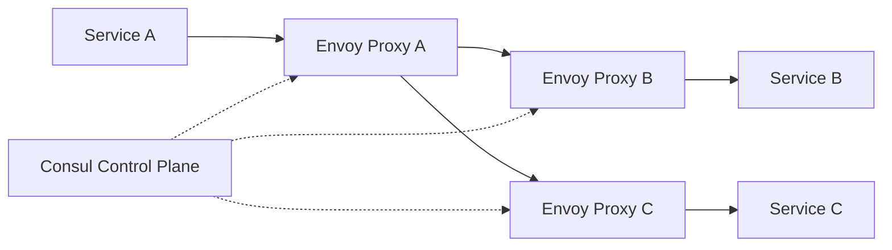

# How to Use Docker Networks with Service Mesh

Author: [nawazdhandala](https://github.com/nawazdhandala)

Tags: Docker, Service Mesh, Networking, Consul, Envoy, Microservices, Containers

Description: Implement a service mesh on Docker networks using Envoy and Consul for traffic management, observability, and security.

---

A service mesh adds infrastructure-level capabilities to your microservices without changing application code. Features like traffic encryption, load balancing, circuit breaking, retries, and observability all happen transparently through sidecar proxies. While service meshes are often associated with Kubernetes, they work perfectly well with plain Docker and Docker Compose.

This guide shows you how to build a service mesh on Docker using Envoy as the data plane and Consul as the control plane. Every example uses Docker Compose and runs on a single machine.

## What a Service Mesh Does

Without a service mesh, every microservice must implement its own:

- TLS certificate management
- Retry logic
- Circuit breakers
- Load balancing
- Metrics collection
- Access control

A service mesh moves all of this into sidecar proxies that intercept network traffic. Your application code makes plain HTTP calls, and the sidecar handles everything else.



## Setting Up the Docker Network

Create a dedicated network for the mesh:

```bash
# Create a bridge network for the service mesh
docker network create \
  --driver bridge \
  --subnet 10.5.0.0/24 \
  mesh-network
```

## Deploying Consul as the Control Plane

Consul handles service discovery and provides configuration to the Envoy proxies:

```yaml
# docker-compose.yml - Consul server and mesh infrastructure
services:
  consul:
    image: hashicorp/consul:1.17
    ports:
      - "8500:8500"   # HTTP API
      - "8600:8600"   # DNS
    command: >
      agent -server -bootstrap-expect=1
      -ui -client=0.0.0.0
      -data-dir=/consul/data
      -bind=0.0.0.0
    networks:
      mesh-network:
        ipv4_address: 10.5.0.2

networks:
  mesh-network:
    external: true
```

Start Consul and verify it is running:

```bash
# Start the Consul server
docker compose up -d consul

# Check Consul is healthy
curl http://localhost:8500/v1/status/leader
```

## Building a Simple Microservice

Create a small Python service that the mesh will wrap:

```python
# app.py - A simple Flask service that the Envoy sidecar will proxy
from flask import Flask, jsonify
import os
import socket

app = Flask(__name__)

SERVICE_NAME = os.environ.get("SERVICE_NAME", "unknown")

@app.route("/")
def index():
    return jsonify({
        "service": SERVICE_NAME,
        "hostname": socket.gethostname(),
        "message": f"Hello from {SERVICE_NAME}"
    })

@app.route("/health")
def health():
    return jsonify({"status": "healthy", "service": SERVICE_NAME})

if __name__ == "__main__":
    app.run(host="0.0.0.0", port=5000)
```

```dockerfile
# Dockerfile - Simple Flask microservice image
FROM python:3.11-slim
RUN pip install flask
COPY app.py /app/app.py
WORKDIR /app
CMD ["python", "app.py"]
```

## Configuring Envoy Sidecars

Each service gets an Envoy sidecar proxy. Here is the Envoy configuration for the frontend service:

```yaml
# envoy-frontend.yaml - Envoy proxy configuration for the frontend service
static_resources:
  listeners:
    - name: public_listener
      address:
        socket_address:
          address: 0.0.0.0
          port_value: 8080
      filter_chains:
        - filters:
            - name: envoy.filters.network.http_connection_manager
              typed_config:
                "@type": type.googleapis.com/envoy.extensions.filters.network.http_connection_manager.v3.HttpConnectionManager
                stat_prefix: ingress_http
                route_config:
                  name: local_route
                  virtual_hosts:
                    - name: backend
                      domains: ["*"]
                      routes:
                        - match:
                            prefix: "/api/users"
                          route:
                            cluster: user-service
                        - match:
                            prefix: "/api/orders"
                          route:
                            cluster: order-service
                        - match:
                            prefix: "/"
                          route:
                            cluster: local_service
                http_filters:
                  - name: envoy.filters.http.router
                    typed_config:
                      "@type": type.googleapis.com/envoy.extensions.filters.http.router.v3.Router

  clusters:
    - name: local_service
      connect_timeout: 0.25s
      type: STRICT_DNS
      load_assignment:
        cluster_name: local_service
        endpoints:
          - lb_endpoints:
              - endpoint:
                  address:
                    socket_address:
                      address: 127.0.0.1
                      port_value: 5000

    - name: user-service
      connect_timeout: 0.5s
      type: STRICT_DNS
      load_assignment:
        cluster_name: user-service
        endpoints:
          - lb_endpoints:
              - endpoint:
                  address:
                    socket_address:
                      address: user-envoy
                      port_value: 8080

    - name: order-service
      connect_timeout: 0.5s
      type: STRICT_DNS
      load_assignment:
        cluster_name: order-service
        endpoints:
          - lb_endpoints:
              - endpoint:
                  address:
                    socket_address:
                      address: order-envoy
                      port_value: 8080

admin:
  address:
    socket_address:
      address: 0.0.0.0
      port_value: 9901
```

## Full Docker Compose with Sidecars

Deploy three services, each with an Envoy sidecar:

```yaml
# docker-compose.mesh.yml - Full service mesh deployment
services:
  consul:
    image: hashicorp/consul:1.17
    ports:
      - "8500:8500"
    command: agent -server -bootstrap-expect=1 -ui -client=0.0.0.0 -data-dir=/consul/data
    networks:
      - mesh-network

  # Frontend service with its Envoy sidecar
  frontend:
    build: .
    environment:
      SERVICE_NAME: frontend
    network_mode: "service:frontend-envoy"

  frontend-envoy:
    image: envoyproxy/envoy:v1.28-latest
    volumes:
      - ./envoy-frontend.yaml:/etc/envoy/envoy.yaml:ro
    ports:
      - "8080:8080"
      - "9901:9901"
    networks:
      - mesh-network

  # User service with its Envoy sidecar
  user-service:
    build: .
    environment:
      SERVICE_NAME: user-service
    network_mode: "service:user-envoy"

  user-envoy:
    image: envoyproxy/envoy:v1.28-latest
    volumes:
      - ./envoy-user.yaml:/etc/envoy/envoy.yaml:ro
    networks:
      - mesh-network

  # Order service with its Envoy sidecar
  order-service:
    build: .
    environment:
      SERVICE_NAME: order-service
    network_mode: "service:order-envoy"

  order-envoy:
    image: envoyproxy/envoy:v1.28-latest
    volumes:
      - ./envoy-order.yaml:/etc/envoy/envoy.yaml:ro
    networks:
      - mesh-network

networks:
  mesh-network:
    driver: bridge
```

Notice the `network_mode: "service:frontend-envoy"` line. This puts the application container in the same network namespace as its Envoy sidecar. They share an IP address and can communicate over localhost.

## Adding Circuit Breaking

Configure Envoy to stop sending traffic to a failing service:

```yaml
# Add circuit breaker settings to a cluster definition
clusters:
  - name: user-service
    connect_timeout: 0.5s
    type: STRICT_DNS
    circuit_breakers:
      thresholds:
        - priority: DEFAULT
          max_connections: 100
          max_pending_requests: 50
          max_requests: 200
          max_retries: 3
    load_assignment:
      cluster_name: user-service
      endpoints:
        - lb_endpoints:
            - endpoint:
                address:
                  socket_address:
                    address: user-envoy
                    port_value: 8080
```

## Adding Retry Logic

Configure automatic retries for transient failures:

```yaml
# Add retry policy to a route definition
routes:
  - match:
      prefix: "/api/users"
    route:
      cluster: user-service
      retry_policy:
        retry_on: "5xx,connect-failure,refused-stream"
        num_retries: 3
        per_try_timeout: 2s
```

## Observability

Envoy generates detailed metrics. Expose them to Prometheus:

```bash
# View Envoy's built-in stats
curl http://localhost:9901/stats

# View stats in Prometheus format
curl http://localhost:9901/stats/prometheus

# Check specific metrics for the user-service cluster
curl http://localhost:9901/stats | grep "cluster.user-service"
```

Key metrics to monitor:

- `upstream_cx_total` - Total connections to upstream
- `upstream_rq_total` - Total requests to upstream
- `upstream_rq_retry` - Number of retries
- `upstream_rq_5xx` - Server error count
- `upstream_cx_connect_timeout` - Connection timeouts

## Testing the Mesh

Send traffic through the mesh and observe the behavior:

```bash
# Start the full mesh
docker compose -f docker-compose.mesh.yml up -d

# Hit the frontend, which routes to backend services through Envoy
curl http://localhost:8080/
curl http://localhost:8080/api/users
curl http://localhost:8080/api/orders

# Generate load to test circuit breaking
for i in $(seq 1 1000); do
  curl -s -o /dev/null -w "%{http_code}\n" http://localhost:8080/api/users
done | sort | uniq -c
```

## Conclusion

A service mesh on Docker gives you the same traffic management, security, and observability features that Kubernetes-based meshes provide, without the complexity of a full orchestration platform. Envoy sidecars handle the networking concerns, Consul manages service discovery, and your application code stays focused on business logic. Start by adding a sidecar to your most critical service, configure basic routing and retries, then expand the mesh to cover more services as you gain confidence.
