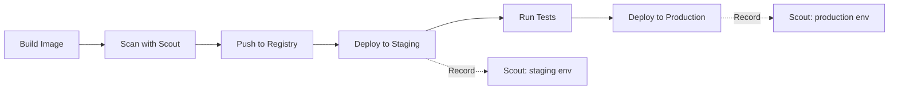

# How to Use Docker Scout Environment Tracking

Author: [nawazdhandala](https://github.com/nawazdhandala)

Tags: Docker, Docker Scout, Environment Tracking, Container Security, DevOps, Supply Chain Security

Description: Learn how to use Docker Scout environment tracking to monitor which images run in staging and production and catch vulnerabilities before they hit users.

---

Knowing which container images run in each environment is surprisingly difficult at scale. You might have different versions in development, staging, and production. When a critical vulnerability drops, you need to answer fast: "Is this CVE in our production images?" Docker Scout environment tracking solves this problem by letting you record which images are deployed where and then query vulnerability data against those specific environments.

## The Problem Environment Tracking Solves

Consider a typical deployment pipeline. You build an image, scan it, push it to a registry, deploy to staging, run tests, and promote to production. At any given moment, staging and production likely run different image versions. Your vulnerability scanner might flag issues in the latest build, but what about the image actually running in production right now?

Without environment tracking, you end up manually correlating image tags with deployment logs. That gets messy fast, especially when multiple services are involved.



## Setting Up Environment Tracking

Docker Scout environments let you tag a specific image as belonging to an environment. You can then query Scout for vulnerability data filtered by environment.

### Prerequisites

You need a Docker Hub account with Scout enabled and the Docker Scout CLI plugin installed.

```bash
# Verify Docker Scout is available
docker scout version

# Log in to Docker Hub (required for environment features)
docker login
```

### Creating Environments

Environments are defined at the organization or repository level in Docker Scout.

```bash
# Record an image as deployed to the "staging" environment
docker scout enroll myorg/myapp
docker scout environment staging myorg/myapp:v1.2.3

# Record an image as deployed to the "production" environment
docker scout environment production myorg/myapp:v1.2.0
```

After running these commands, Docker Scout knows that `v1.2.3` is in staging and `v1.2.0` is in production. Vulnerability queries can now target a specific environment.

### Querying Vulnerabilities by Environment

This is where the real value shows up. Instead of scanning a generic tag, you ask Scout about a specific environment.

```bash
# Show CVEs affecting the production environment
docker scout cves --env production myorg/myapp

# Show CVEs affecting staging
docker scout cves --env staging myorg/myapp

# Compare vulnerabilities between staging and production
docker scout compare --to-env production --env staging myorg/myapp
```

The compare command is particularly powerful. It shows you exactly what vulnerabilities you are about to introduce or fix by promoting staging to production.

## Integrating with CI/CD

The real power of environment tracking comes when you automate it. Every deployment should update Docker Scout with the current image for that environment.

### GitHub Actions Example

```yaml
# .github/workflows/deploy.yml
name: Deploy and Track Environment
on:
  workflow_dispatch:
    inputs:
      environment:
        description: 'Target environment'
        required: true
        type: choice
        options:
          - staging
          - production

jobs:
  deploy:
    runs-on: ubuntu-latest
    environment: ${{ github.event.inputs.environment }}
    steps:
      - name: Login to Docker Hub
        uses: docker/login-action@v3
        with:
          username: ${{ secrets.DOCKERHUB_USERNAME }}
          password: ${{ secrets.DOCKERHUB_TOKEN }}

      # Deploy the image (simplified - replace with your actual deploy step)
      - name: Deploy to ${{ github.event.inputs.environment }}
        run: |
          IMAGE="myorg/myapp:${{ github.sha }}"
          echo "Deploying $IMAGE to ${{ github.event.inputs.environment }}"
          # Your actual deployment command here

      # Record the deployment in Docker Scout
      - name: Update Docker Scout environment
        run: |
          docker scout environment \
            ${{ github.event.inputs.environment }} \
            myorg/myapp:${{ github.sha }}
```

### Kubernetes Deployment Hook

If you deploy to Kubernetes, you can add a post-deployment step that updates Docker Scout.

```bash
#!/bin/bash
# post-deploy.sh - Run after kubectl apply
# Updates Docker Scout with the deployed image version

NAMESPACE="$1"
DEPLOYMENT="$2"
ENVIRONMENT="$3"

# Extract the current image from the running deployment
IMAGE=$(kubectl get deployment "$DEPLOYMENT" \
  -n "$NAMESPACE" \
  -o jsonpath='{.spec.template.spec.containers[0].image}')

echo "Recording $IMAGE as deployed to $ENVIRONMENT"
docker scout environment "$ENVIRONMENT" "$IMAGE"
```

Usage after a deployment:

```bash
# After deploying to staging
kubectl apply -f k8s/staging/
./post-deploy.sh default myapp staging

# After promoting to production
kubectl apply -f k8s/production/
./post-deploy.sh default myapp production
```

## Monitoring Environments for New Vulnerabilities

Vulnerabilities do not stop being discovered after you deploy. An image that was clean last week might have new CVEs today. Docker Scout can alert you when new vulnerabilities affect your tracked environments.

### Scheduled Scanning in CI

```yaml
# .github/workflows/env-scan.yml
name: Scheduled Environment Vulnerability Check
on:
  schedule:
    # Run every morning at 8 AM UTC
    - cron: '0 8 * * *'

jobs:
  scan-environments:
    runs-on: ubuntu-latest
    strategy:
      matrix:
        environment: [staging, production]
    steps:
      - name: Login to Docker Hub
        uses: docker/login-action@v3
        with:
          username: ${{ secrets.DOCKERHUB_USERNAME }}
          password: ${{ secrets.DOCKERHUB_TOKEN }}

      # Check for critical vulnerabilities in each environment
      - name: Scan ${{ matrix.environment }}
        run: |
          docker scout cves \
            --env ${{ matrix.environment }} \
            --only-severity critical,high \
            --exit-code \
            myorg/myapp || echo "Vulnerabilities found in ${{ matrix.environment }}"

      # Send a Slack notification if critical CVEs are found
      - name: Notify on findings
        if: failure()
        uses: slackapi/slack-github-action@v1
        with:
          payload: |
            {
              "text": "Critical vulnerabilities found in ${{ matrix.environment }} environment for myorg/myapp"
            }
        env:
          SLACK_WEBHOOK_URL: ${{ secrets.SLACK_WEBHOOK }}
```

## Viewing Environment Data in Docker Scout Dashboard

Docker Scout provides a web dashboard that visualizes your environments. Navigate to https://scout.docker.com and select your organization. The dashboard shows each environment with its current image, vulnerability counts broken down by severity, and a timeline of changes.

The dashboard answers questions at a glance:

- Which CVEs exist in production right now?
- What changed between the last staging and production deployment?
- How many critical vulnerabilities are we carrying in each environment?

## Managing Multiple Services

Most applications consist of multiple services, each with its own image. Environment tracking works per-image, so you track each service independently.

```bash
# Record all service images for a staging deployment
docker scout environment staging myorg/frontend:v2.1.0
docker scout environment staging myorg/api:v3.4.2
docker scout environment staging myorg/worker:v1.8.0

# Promote all to production after testing
docker scout environment production myorg/frontend:v2.1.0
docker scout environment production myorg/api:v3.4.2
docker scout environment production myorg/worker:v1.8.0
```

You can script this to read from your deployment manifests:

```bash
#!/bin/bash
# update-scout-env.sh - Read images from docker-compose and update Scout
ENVIRONMENT="$1"
COMPOSE_FILE="$2"

# Extract all image references from docker-compose.yml
IMAGES=$(grep 'image:' "$COMPOSE_FILE" | awk '{print $2}')

for IMAGE in $IMAGES; do
  echo "Recording $IMAGE in $ENVIRONMENT"
  docker scout environment "$ENVIRONMENT" "$IMAGE"
done
```

## Policy Enforcement with Environments

Docker Scout policies let you define rules like "no critical CVEs in production." Combined with environment tracking, policies become enforceable gates.

```bash
# Check if an image passes the policy for production
docker scout policy myorg/myapp:latest --env production

# In CI, fail the pipeline if the policy check fails
docker scout policy myorg/myapp:$TAG --env production --exit-code
```

This gives you a concrete mechanism to prevent vulnerable images from reaching production. The policy check runs against the actual vulnerability data for that image, and the exit code lets your CI pipeline gate the deployment.

## Practical Recommendations

Start by tracking just two environments: staging and production. You can add development, QA, or other environments later, but the staging-to-production comparison provides the most immediate value.

Automate the environment updates. Manual tracking falls out of sync within days. Hook the update into your deployment pipeline so it always reflects reality.

Run scheduled scans against your environments. New CVEs appear daily, and an image that was clean yesterday might be vulnerable today. A daily scan with notifications keeps you informed without requiring manual checks.

Use the compare feature before every promotion. Knowing exactly what vulnerabilities you are introducing or resolving helps you make informed deployment decisions.

Environment tracking turns Docker Scout from a point-in-time scanner into a continuous monitoring tool. It bridges the gap between "we scanned this image once" and "we know what is running in production right now."
