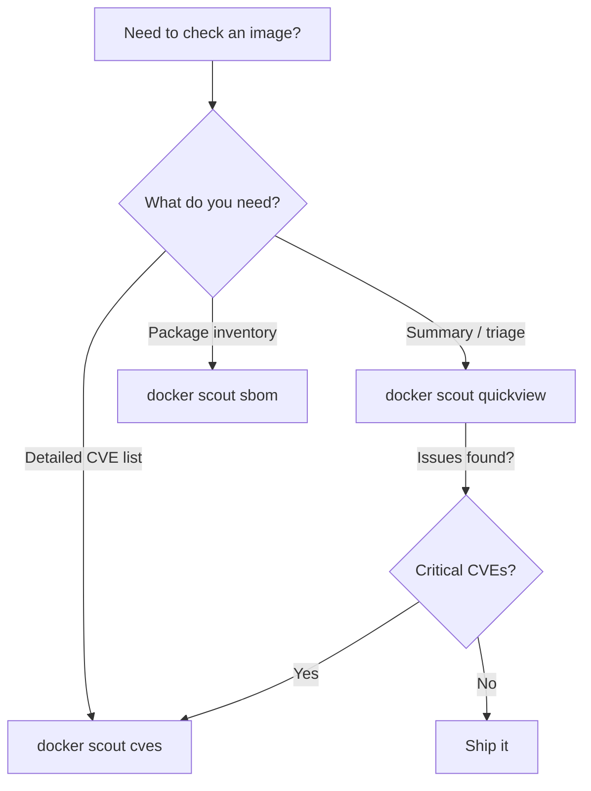

# How to Use Docker Scout Quickview for Image Overview

Author: [nawazdhandala](https://github.com/nawazdhandala)

Tags: Docker, Docker Scout, Quickview, Container Security, Image Analysis, DevOps

Description: Learn how to use Docker Scout quickview to get instant vulnerability summaries and image health checks for your container images.

---

When you need a fast answer about the security posture of a container image, you do not want to scroll through hundreds of CVE entries. Docker Scout quickview gives you exactly that - a high-level summary of vulnerabilities, base image status, and policy compliance in a single command. It is the first tool you should reach for when triaging image security.

## What Docker Scout Quickview Shows

The quickview command provides a condensed summary of an image's security status. It shows vulnerability counts grouped by severity, base image information, and whether recommended updates are available. Think of it as the executive summary before you dive into the detailed CVE report.

Run quickview against any image:

```bash
# Quickview for a local image
docker scout quickview myapp:latest

# Quickview for a remote image from Docker Hub
docker scout quickview nginx:1.25

# Quickview for an image in a private registry
docker scout quickview myregistry.example.com/myapp:v2.3.1
```

Typical output looks something like this:

```
  Target     myapp:latest
  Digest     sha256:abc123...
  Base image node:20-alpine

    Vulnerabilities
      Critical    2
      High        8
      Medium     24
      Low        15

    Base image update available
      node:20-alpine (current)  ->  node:20-alpine (updated)
      Fixes: 1C 3H 5M
```

The output tells you several things at once: total vulnerability count by severity, what base image you are using, and whether updating the base image would fix some of those vulnerabilities.

## When to Use Quickview vs Full CVE Scan

Quickview and full CVE scanning serve different purposes.



Use quickview when you want to quickly assess whether an image needs attention. If the quickview shows zero critical and high vulnerabilities, you might be good to go. If it flags issues, switch to `docker scout cves` for the full details.

```bash
# Quick check - is this image safe to deploy?
docker scout quickview myapp:latest

# If quickview shows issues, drill down into specifics
docker scout cves myapp:latest --only-severity critical,high
```

## Using Quickview in Local Development

During development, you often rebuild images frequently. Running a full vulnerability scan every time slows you down. Quickview gives you a fast signal without the wait.

```bash
# Build your image and immediately check its health
docker build -t myapp:dev .
docker scout quickview myapp:dev

# Compare quickview before and after updating your base image
docker scout quickview myapp:old-base
# ... update Dockerfile with new base image ...
docker build -t myapp:new-base .
docker scout quickview myapp:new-base
```

This workflow lets you see the impact of base image updates in seconds. If switching from `node:20-alpine3.18` to `node:20-alpine3.19` drops your critical count from 3 to 0, you know the update is worth it.

## Quickview for Multiple Images

If you manage several microservices, you might want to check all of them quickly. A simple script gets you a dashboard-style overview.

```bash
#!/bin/bash
# quickview-all.sh - Run quickview against all your service images

IMAGES=(
  "myorg/frontend:latest"
  "myorg/api:latest"
  "myorg/worker:latest"
  "myorg/scheduler:latest"
)

for IMAGE in "${IMAGES[@]}"; do
  echo "============================================"
  echo "Image: $IMAGE"
  echo "============================================"
  docker scout quickview "$IMAGE"
  echo ""
done
```

This gives you a consolidated view of your entire application's security posture in one terminal session.

## Quickview with Environment Context

If you have set up Docker Scout environment tracking, quickview can show you the status of images deployed to specific environments.

```bash
# Check the image currently deployed to production
docker scout quickview --env production myorg/myapp

# Check staging
docker scout quickview --env staging myorg/myapp
```

This is useful during incident response. When a new CVE is announced, run quickview against your production environment to instantly see if you are affected.

## Integrating Quickview into CI/CD

While the full CVE scan is better for CI/CD gates (because it provides exit codes based on severity), quickview works well as a summary step in your pipeline.

```yaml
# .github/workflows/build.yml
name: Build and Check
on:
  push:
    branches: [main]

jobs:
  build:
    runs-on: ubuntu-latest
    steps:
      - uses: actions/checkout@v4

      - name: Login to Docker Hub
        uses: docker/login-action@v3
        with:
          username: ${{ secrets.DOCKERHUB_USERNAME }}
          password: ${{ secrets.DOCKERHUB_TOKEN }}

      - name: Build image
        run: docker build -t myapp:${{ github.sha }} .

      # Quick summary in the build logs
      - name: Image Security Overview
        run: docker scout quickview myapp:${{ github.sha }}

      # Detailed scan for gating
      - name: Full vulnerability check
        run: |
          docker scout cves myapp:${{ github.sha }} \
            --only-severity critical,high \
            --exit-code
```

The quickview step gives developers a readable summary in the build logs. The full CVE scan handles the actual pass/fail decision.

## Reading Quickview Output

Let's break down each section of quickview output so you know what to look for.

### Vulnerability Counts

The vulnerability counts are grouped into four severity levels:

- **Critical** - Actively exploited or easily exploitable vulnerabilities. Fix these immediately.
- **High** - Significant risk. Plan to fix these within your current sprint.
- **Medium** - Moderate risk. Track these and fix when convenient.
- **Low** - Minimal risk. Informational.

### Base Image Information

Quickview identifies your base image and checks if a newer version is available. It also estimates how many vulnerabilities the update would fix. This is one of the most actionable pieces of information in the output, because updating a base image is usually a one-line Dockerfile change.

```dockerfile
# Before - using an outdated base image
FROM node:20-alpine3.18

# After - update based on quickview recommendation
FROM node:20-alpine3.19
```

### Policy Status

If your organization has configured Docker Scout policies, quickview shows whether the image passes or fails each policy. Policies might include rules like "no critical CVEs" or "base image must be less than 30 days old."

## Quickview for Base Image Selection

Quickview is also useful when choosing between base images for a new project. Compare the security posture of different options.

```bash
# Compare different base image options
docker scout quickview node:20-alpine
docker scout quickview node:20-slim
docker scout quickview node:20-bookworm

# Check different versions of the same base
docker scout quickview python:3.12-alpine
docker scout quickview python:3.11-alpine
docker scout quickview python:3.10-alpine
```

This comparison helps you pick the base image with the fewest known vulnerabilities before writing a single line of application code.

## Quickview vs Docker Desktop GUI

Docker Desktop includes a graphical version of Scout analysis. Quickview provides the same summary data from the command line, which makes it suitable for CI/CD, scripting, and remote server use. If you prefer a visual interface and are working locally, Docker Desktop's Scout tab shows the same information with clickable CVE details.

## Practical Tips

Run quickview right after building. Make it a habit. The 2-3 seconds it takes can save you from deploying an image with known critical vulnerabilities.

Pay the most attention to the base image recommendations. Updating your base image is the single highest-leverage fix because it resolves vulnerabilities in packages you did not install yourself.

When quickview shows zero critical and zero high vulnerabilities, that image is a reasonable candidate for deployment. Mediums and lows are worth tracking over time but rarely warrant blocking a release.

Use quickview as your starting point, not your ending point. It tells you whether to investigate further. The detailed CVE data from `docker scout cves` gives you the specifics you need to actually fix issues.

Docker Scout quickview turns image security from a chore into a quick check. No excuses to skip it.
