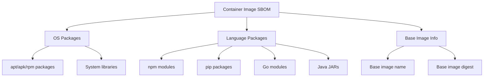

# How to Use Docker Scout SBOM Generation

Author: [nawazdhandala](https://github.com/nawazdhandala)

Tags: Docker, Docker Scout, SBOM, Software Supply Chain, Container Security, DevOps, Compliance

Description: Learn how to generate Software Bills of Materials with Docker Scout, including SPDX and CycloneDX formats for compliance and security auditing.

---

A Software Bill of Materials (SBOM) is a complete inventory of every component inside your container image. Think of it like a nutritional label for software. It lists every package, library, and dependency along with version numbers and license information. Regulatory requirements, supply chain security concerns, and vulnerability management all drive the need for SBOMs in production environments.

Docker Scout includes built-in SBOM generation that works directly with your existing Docker workflow. No extra tools needed.

## Why SBOMs Matter

The Executive Order on Improving the Nation's Cybersecurity (EO 14028) made SBOMs a federal requirement for software sold to the US government. But the practical benefits extend far beyond compliance. When a new vulnerability drops, an SBOM lets you instantly answer the question: "Are we affected?" Without one, you are scanning every image from scratch.

SBOMs also help with license compliance. If your legal team needs to verify that no GPL-licensed code has crept into your proprietary product, an SBOM gives them the answer in seconds.

## Generating Your First SBOM

Docker Scout generates SBOMs using the `docker scout sbom` command. It analyzes the image layers and produces a structured inventory.

Generate an SBOM for a local image:

```bash
# Generate an SBOM in the default SPDX JSON format
docker scout sbom myapp:latest

# Generate an SBOM and save it to a file
docker scout sbom myapp:latest --output myapp-sbom.spdx.json

# Generate an SBOM for a remote image without pulling it locally
docker scout sbom nginx:1.25 --output nginx-sbom.spdx.json
```

## SBOM Output Formats

Docker Scout supports multiple SBOM standards. The two most common are SPDX and CycloneDX.

### SPDX Format

SPDX (Software Package Data Exchange) is an ISO standard maintained by the Linux Foundation. It is widely used in open-source compliance.

```bash
# Generate SBOM in SPDX JSON format (default)
docker scout sbom --format spdx myapp:latest --output myapp-sbom.spdx.json

# The output includes package information like this structure:
# {
#   "spdxVersion": "SPDX-2.3",
#   "packages": [
#     {
#       "name": "openssl",
#       "versionInfo": "3.1.4",
#       "supplier": "Organization: Alpine",
#       "licenseConcluded": "Apache-2.0"
#     }
#   ]
# }
```

### CycloneDX Format

CycloneDX is an OWASP project designed specifically for security use cases. It integrates well with vulnerability management tools.

```bash
# Generate SBOM in CycloneDX format
docker scout sbom --format cyclonedx myapp:latest --output myapp-sbom.cdx.json
```

### Listing Packages in a Readable Format

Sometimes you just want a quick list of what is inside an image:

```bash
# List all packages in a human-readable table
docker scout sbom --format list myapp:latest

# Pipe through common tools for filtering
docker scout sbom --format list myapp:latest | grep openssl
```

## Understanding SBOM Contents

An SBOM from Docker Scout typically captures several categories of components.



For a typical Node.js application, the SBOM would include Alpine or Debian system packages from the base image, Node.js runtime packages, and all npm dependencies bundled into the final image.

## Integrating SBOMs into CI/CD

Generating an SBOM at build time and storing it alongside your image ensures you always have an accurate inventory.

### GitHub Actions Integration

```yaml
# .github/workflows/sbom.yml
name: Build and Generate SBOM
on:
  push:
    branches: [main]

jobs:
  build:
    runs-on: ubuntu-latest
    steps:
      - uses: actions/checkout@v4

      - name: Set up Docker Buildx
        uses: docker/setup-buildx-action@v3

      - name: Login to Docker Hub
        uses: docker/login-action@v3
        with:
          username: ${{ secrets.DOCKERHUB_USERNAME }}
          password: ${{ secrets.DOCKERHUB_TOKEN }}

      - name: Build image
        run: docker build -t myapp:${{ github.sha }} .

      # Generate SBOM in both SPDX and CycloneDX formats
      - name: Generate SPDX SBOM
        run: docker scout sbom --format spdx myapp:${{ github.sha }} --output sbom-spdx.json

      - name: Generate CycloneDX SBOM
        run: docker scout sbom --format cyclonedx myapp:${{ github.sha }} --output sbom-cdx.json

      # Store the SBOMs as build artifacts
      - name: Upload SBOMs
        uses: actions/upload-artifact@v4
        with:
          name: sbom-${{ github.sha }}
          path: |
            sbom-spdx.json
            sbom-cdx.json
```

### Attaching SBOMs to Images with BuildKit

Docker BuildKit can embed SBOMs directly into the image manifest during the build process. This keeps the SBOM permanently attached to the image.

```bash
# Build with SBOM attestation using BuildKit
docker buildx build \
  --sbom=true \
  --tag myapp:latest \
  --push \
  .

# Later, extract the SBOM from the image attestation
docker buildx imagetools inspect myapp:latest --format '{{ json .SBOM }}'
```

## Analyzing SBOMs for Vulnerabilities

Once you have an SBOM, you can feed it into vulnerability scanning tools without needing the original image.

```bash
# Generate an SBOM and pipe it to analysis
docker scout sbom --format spdx myapp:latest --output myapp-sbom.json

# Use the SBOM with Docker Scout CVE scanning
docker scout cves --sbom myapp-sbom.json

# You can also use third-party tools like grype with the SBOM
grype sbom:myapp-sbom.json
```

This approach is useful when the image is no longer available or when you want to re-scan historical images against updated vulnerability databases.

## Comparing SBOMs Between Versions

Tracking what changed between image versions helps you understand your supply chain risk over time.

```bash
# Generate SBOMs for two versions
docker scout sbom --format list myapp:v1 --output v1-packages.txt
docker scout sbom --format list myapp:v2 --output v2-packages.txt

# Compare the package lists to find differences
diff v1-packages.txt v2-packages.txt
```

A more structured comparison using JSON:

```bash
#!/bin/bash
# compare-sboms.sh - Compare packages between two image versions
IMAGE_V1="myapp:v1"
IMAGE_V2="myapp:v2"

# Extract package names and versions from SPDX SBOMs
docker scout sbom --format spdx "$IMAGE_V1" | \
  jq -r '.packages[] | "\(.name) \(.versionInfo)"' | sort > /tmp/v1-pkgs.txt

docker scout sbom --format spdx "$IMAGE_V2" | \
  jq -r '.packages[] | "\(.name) \(.versionInfo)"' | sort > /tmp/v2-pkgs.txt

echo "=== Packages added in $IMAGE_V2 ==="
comm -13 /tmp/v1-pkgs.txt /tmp/v2-pkgs.txt

echo "=== Packages removed in $IMAGE_V2 ==="
comm -23 /tmp/v1-pkgs.txt /tmp/v2-pkgs.txt
```

## SBOM Storage and Management

For organizations managing many images, you need a strategy for storing and querying SBOMs.

```bash
# Store SBOMs in a dedicated registry repository
docker scout sbom --format spdx myapp:latest --output sbom.json

# Tag and push SBOMs alongside images using OCI artifacts
# (requires a registry that supports OCI artifacts)
oras push myregistry.example.com/sboms/myapp:latest \
  --artifact-type application/spdx+json \
  sbom.json:application/spdx+json
```

## Practical Tips

Keep these things in mind when working with Docker Scout SBOMs.

First, generate SBOMs from final production images, not intermediate build stages. Multi-stage builds might include build tools in earlier stages that do not exist in the final image.

Second, regenerate SBOMs whenever you rebuild. A cached image rebuild might pull in different package versions even if your Dockerfile has not changed.

Third, store SBOMs with a reference to the exact image digest, not just the tag. Tags are mutable, but digests are permanent.

```bash
# Get the image digest for accurate SBOM tracking
DIGEST=$(docker inspect --format='{{index .RepoDigests 0}}' myapp:latest)
echo "SBOM generated for image: $DIGEST"
docker scout sbom --format spdx myapp:latest --output "sbom-${DIGEST##*:}.json"
```

SBOMs are becoming as essential as unit tests in modern software delivery. Docker Scout makes generating them straightforward, and integrating SBOM generation into your build pipeline takes just a few minutes. Start generating them now, even if you do not have a compliance requirement yet. When the next Log4Shell-scale vulnerability hits, you will be glad you can instantly check every image in your fleet.
