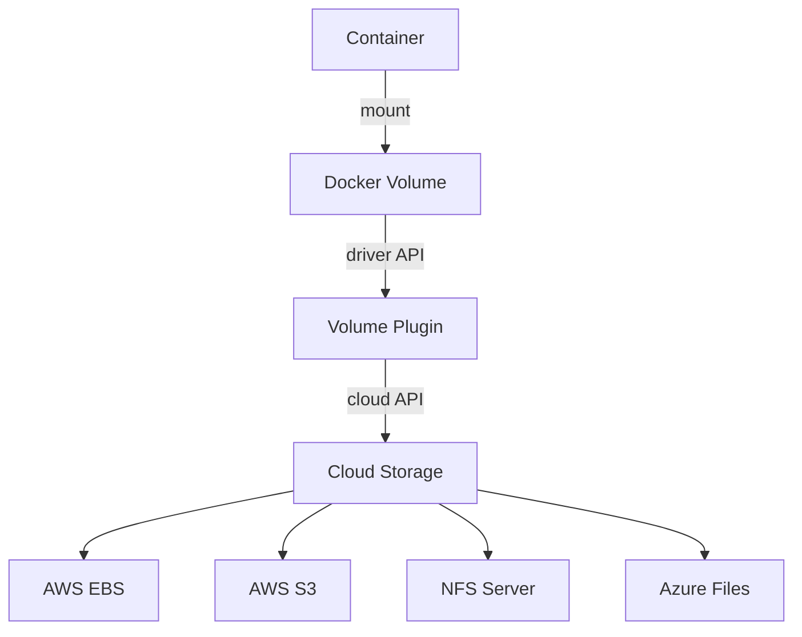

# How to Use Docker Volume Drivers for Cloud Storage

Author: [nawazdhandala](https://github.com/nawazdhandala)

Tags: Docker, Volumes, Cloud Storage, AWS, DevOps, Storage Drivers

Description: Learn how to use Docker volume drivers to connect containers to cloud storage services like AWS EBS, S3, and NFS for persistent data.

---

Docker's built-in local volume driver stores data on the host filesystem. That works fine for development and single-server setups, but production environments often need cloud-backed storage that persists across host failures, scales independently, and integrates with cloud provider features like snapshots and encryption. Docker volume drivers (also called volume plugins) bridge this gap by letting you mount cloud storage services as Docker volumes.

## How Volume Drivers Work

Volume drivers are plugins that implement Docker's volume API. When you create a volume with a specific driver, Docker delegates all storage operations to that plugin. The container sees a normal filesystem mount, but the data lives on a cloud storage backend.



## Installing Volume Plugins

Docker volume plugins are installed through `docker plugin install`:

```bash
# List currently installed plugins
docker plugin ls

# Install a volume plugin (example: REX-Ray for AWS)
docker plugin install rexray/ebs
```

## Using the Local Driver with NFS

Before jumping to cloud-specific plugins, the built-in `local` driver supports NFS mounts natively. This is the simplest way to use network storage:

```bash
# Create a volume backed by an NFS share
docker volume create \
  --driver local \
  --opt type=nfs \
  --opt o=addr=192.168.1.100,rw,nfsvers=4 \
  --opt device=:/exports/data \
  nfs-data
```

Use the volume:

```bash
# Run a container with the NFS-backed volume
docker run -d --name app -v nfs-data:/data my-app
```

In Docker Compose:

```yaml
# docker-compose.yml with NFS volume
services:
  app:
    image: my-app
    volumes:
      - nfs-data:/data

volumes:
  nfs-data:
    driver: local
    driver_opts:
      type: nfs
      o: addr=192.168.1.100,rw,nfsvers=4
      device: ":/exports/data"
```

## AWS EBS Volumes with REX-Ray

REX-Ray is a popular volume plugin that supports AWS EBS, among other backends. It creates, attaches, and mounts EBS volumes automatically.

Install the plugin:

```bash
# Install the REX-Ray EBS plugin
docker plugin install rexray/ebs \
  EBS_ACCESSKEY=YOUR_ACCESS_KEY \
  EBS_SECRETKEY=YOUR_SECRET_KEY \
  EBS_REGION=us-east-1
```

Create an EBS-backed volume:

```bash
# Create a 50GB GP3 EBS volume
docker volume create \
  --driver rexray/ebs \
  --opt size=50 \
  --opt volumetype=gp3 \
  production-db-data
```

Use it like any other volume:

```bash
# Run PostgreSQL with an EBS-backed volume
docker run -d \
  --name postgres \
  -v production-db-data:/var/lib/postgresql/data \
  -e POSTGRES_PASSWORD=secret \
  postgres:16
```

The EBS volume is created in your AWS account. If the container moves to a different host (like in Docker Swarm), the EBS volume detaches from the old host and reattaches to the new one.

## AWS S3 with s3fs Volume Driver

For object storage, you can mount S3 buckets as Docker volumes using the s3fs driver:

```bash
# Install the s3fs volume plugin
docker plugin install elementar/d-s3-volume \
  --grant-all-permissions \
  AWSACCESSKEYID=YOUR_KEY \
  AWSSECRETACCESSKEY=YOUR_SECRET
```

Create an S3-backed volume:

```bash
# Mount an S3 bucket as a Docker volume
docker volume create \
  --driver elementar/d-s3-volume \
  --opt bucket=my-app-data \
  --opt prefix=uploads/ \
  s3-uploads
```

Use the volume:

```bash
# Container reads and writes to S3 transparently
docker run -d \
  --name file-server \
  -v s3-uploads:/app/uploads \
  my-file-server
```

Keep in mind that S3-backed volumes have higher latency than block storage. They work well for file storage and sharing but are not suitable for databases.

## CIFS/SMB Volumes for Windows Shares

The local driver also supports CIFS (SMB) mounts for Windows file shares:

```bash
# Create a volume backed by a Windows file share
docker volume create \
  --driver local \
  --opt type=cifs \
  --opt device=//windows-server/share \
  --opt o=username=user,password=pass,vers=3.0 \
  smb-data
```

In Docker Compose:

```yaml
volumes:
  smb-data:
    driver: local
    driver_opts:
      type: cifs
      device: "//windows-server/share"
      o: "username=user,password=pass,vers=3.0"
```

## Portworx for Multi-Cloud Storage

Portworx is an enterprise storage platform that works across cloud providers. It replicates data across nodes and supports snapshots.

```bash
# Install Portworx (simplified - actual setup varies by environment)
docker plugin install portworx/px-dev

# Create a replicated volume
docker volume create \
  --driver pxd \
  --opt size=100 \
  --opt repl=3 \
  --opt io_priority=high \
  critical-data
```

The `repl=3` option maintains three copies of the data across different nodes.

## GlusterFS Volumes

GlusterFS provides distributed, replicated storage:

```bash
# Create a volume backed by GlusterFS
docker volume create \
  --driver local \
  --opt type=glusterfs \
  --opt o=addr=gluster-server \
  --opt device=gv0 \
  gluster-data
```

## Managing Cloud-Backed Volumes

List volumes and their drivers:

```bash
# Show all volumes with their drivers
docker volume ls --format "table {{.Driver}}\t{{.Name}}"
```

Inspect a cloud-backed volume:

```bash
# Get details about a specific volume
docker volume inspect production-db-data
```

Remove a cloud-backed volume (this may also delete the cloud resource):

```bash
# Remove a volume - WARNING: this may delete cloud storage
docker volume rm production-db-data
```

## Volume Driver Comparison

| Driver | Backend | Best For | Latency | Shared Access |
|--------|---------|----------|---------|---------------|
| local (NFS) | NFS Server | Shared files | Medium | Yes |
| rexray/ebs | AWS EBS | Databases | Low | No |
| s3fs | AWS S3 | File storage | High | Yes |
| local (CIFS) | Windows/SMB | Windows integration | Medium | Yes |
| portworx | Multi-cloud | Enterprise | Low | Configurable |

## Best Practices

When using cloud volume drivers in production, follow these guidelines:

1. **Test failover.** Kill a container and verify the volume reattaches on a new host.

2. **Enable encryption.** Most cloud storage supports encryption at rest:

```bash
# Create an encrypted EBS volume
docker volume create \
  --driver rexray/ebs \
  --opt size=50 \
  --opt encrypted=true \
  encrypted-data
```

3. **Set up snapshots.** Use cloud provider snapshot features for backups:

```bash
# Create a snapshot of an EBS volume (using AWS CLI)
aws ec2 create-snapshot --volume-id vol-1234567890abcdef0 --description "Daily backup"
```

4. **Monitor volume health.** Cloud volumes can enter degraded states. Set up monitoring for volume status.

5. **Use appropriate volume types.** SSD-backed volumes for databases, HDD for archives, object storage for files.

6. **Label your volumes.** Track what each volume is used for:

```bash
# Create a labeled volume for easier management
docker volume create \
  --driver rexray/ebs \
  --opt size=100 \
  --label environment=production \
  --label service=database \
  --label team=backend \
  prod-db-data
```

## Docker Compose with Cloud Volumes

A complete production Docker Compose file with cloud-backed volumes:

```yaml
# docker-compose.yml - Production setup with cloud storage
services:
  api:
    image: my-api:latest
    volumes:
      - uploads:/app/uploads
    deploy:
      replicas: 3

  database:
    image: postgres:16
    volumes:
      - db-data:/var/lib/postgresql/data
    environment:
      POSTGRES_PASSWORD_FILE: /run/secrets/db_password

volumes:
  uploads:
    driver: local
    driver_opts:
      type: nfs
      o: addr=nfs.internal,rw
      device: ":/exports/uploads"

  db-data:
    driver: rexray/ebs
    driver_opts:
      size: "100"
      volumetype: "gp3"
      encrypted: "true"
```

## Summary

Docker volume drivers extend storage beyond the local filesystem. The built-in local driver handles NFS and CIFS. Third-party plugins like REX-Ray, Portworx, and s3fs connect to cloud block storage, object storage, and distributed filesystems. Choose block storage (EBS) for databases that need low latency, NFS for shared file access, and object storage (S3) for files and media. Always test failover, enable encryption, and set up automated snapshots for production volumes.
