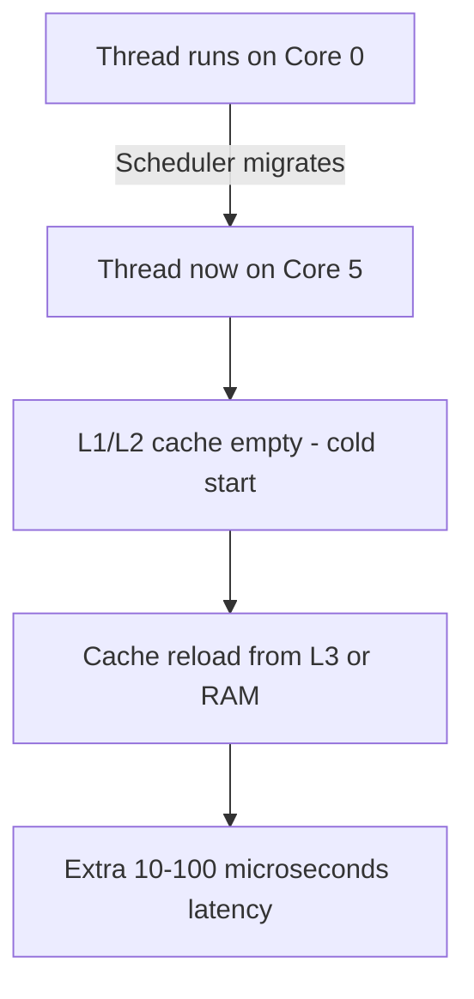

# How to Use Docker with CPU Pinning for Latency-Sensitive Apps

Author: [nawazdhandala](https://github.com/nawazdhandala)

Tags: Docker, Performance, CPU Pinning, Latency, Linux, NUMA, Real-Time, Optimization, DevOps

Description: Learn how to pin Docker containers to specific CPU cores for consistent low-latency performance, avoiding cache thrashing and scheduler jitter.

---

When Docker runs a container without CPU constraints, the Linux scheduler freely moves its threads across all available cores. For most applications, this is fine. The scheduler does a good job of balancing load. But for latency-sensitive applications like financial trading systems, real-time data processing, game servers, and low-latency APIs, thread migration between cores causes cache invalidation, NUMA penalties, and scheduling jitter. CPU pinning fixes this by restricting a container to specific cores.

## Why CPU Pinning Matters for Latency

Every time a thread moves from one CPU core to another, it loses its L1 and L2 cache contents. The new core must reload everything from L3 cache or main memory. This cache cold-start adds microseconds to hundreds of microseconds of latency per migration.

On multi-socket servers (NUMA systems), the penalty is worse. Moving between NUMA nodes means the thread must access memory attached to a different physical CPU socket, adding significant latency.



CPU pinning eliminates this by keeping threads on the same cores, preserving cache locality.

## Basic CPU Pinning with Docker

Docker provides the `--cpuset-cpus` flag to restrict which CPU cores a container can use:

```bash
# Pin a container to cores 0 and 1
docker run -d --cpuset-cpus="0,1" --name latency-app myapp:latest

# Pin to a range of cores
docker run -d --cpuset-cpus="0-3" --name latency-app myapp:latest

# Pin to specific, non-contiguous cores
docker run -d --cpuset-cpus="0,2,4,6" --name latency-app myapp:latest
```

Verify the pinning:

```bash
# Check which CPUs the container is allowed to use
docker inspect latency-app --format '{{.HostConfig.CpusetCpus}}'
# Output: 0,1

# Verify from inside the container
docker exec latency-app cat /sys/fs/cgroup/cpuset/cpuset.cpus
# Or for cgroup v2:
docker exec latency-app cat /sys/fs/cgroup/cpuset.cpus.effective
```

## Understanding Your CPU Topology

Before pinning, understand your server's CPU layout. Which cores share caches? Which are on the same NUMA node?

```bash
# Show CPU topology
lscpu | grep -E "(Socket|Core|Thread|NUMA)"
# Socket(s):             2
# Core(s) per socket:    8
# Thread(s) per core:    2
# NUMA node(s):          2
# NUMA node0 CPU(s):     0-7,16-23
# NUMA node1 CPU(s):     8-15,24-31

# Detailed topology map
lscpu -e
# CPU NODE SOCKET CORE L1d:L1i:L2:L3
#   0    0      0    0 0:0:0:0
#   1    0      0    1 1:1:1:0
#   ...

# Show which CPUs share L3 cache
cat /sys/devices/system/cpu/cpu0/cache/index3/shared_cpu_list
# Output: 0-7,16-23  (these all share the same L3 cache)
```

## Pinning Strategy: Isolate Application Cores

The best approach dedicates cores exclusively to your application, keeping system processes and interrupts on separate cores.

### Step 1: Identify and Reserve Cores

```bash
# On a 16-core server (0-15), reserve cores 0-1 for the system
# and dedicate 2-15 to application containers

# Isolate cores from the general scheduler using kernel parameter
# Edit /etc/default/grub
GRUB_CMDLINE_LINUX="isolcpus=2-15 nohz_full=2-15 rcu_nocbs=2-15"

# Update GRUB and reboot
sudo update-grub
sudo reboot
```

The kernel parameters:
- `isolcpus=2-15`: Prevents the scheduler from placing tasks on these cores unless explicitly pinned
- `nohz_full=2-15`: Disables timer interrupts on isolated cores when only one task is running
- `rcu_nocbs=2-15`: Moves RCU (Read-Copy-Update) callbacks off these cores

### Step 2: Pin Containers to Isolated Cores

```bash
# Pin the latency-sensitive app to isolated cores 2-5
docker run -d \
  --cpuset-cpus="2-5" \
  --name trading-engine \
  trading-app:latest

# Pin a second app to different isolated cores 6-9
docker run -d \
  --cpuset-cpus="6-9" \
  --name matching-engine \
  matching-app:latest

# System services and Docker daemon run on cores 0-1 (non-isolated)
```

### Step 3: Pin Interrupts to System Cores

Network card interrupts should not hit your application cores:

```bash
#!/bin/bash
# pin-interrupts.sh
# Move network interrupts to system cores (0-1)

SYSTEM_CORES="0,1"

# Find network card IRQs
for irq in $(grep eth0 /proc/interrupts | awk -F: '{print $1}' | tr -d ' '); do
    echo "$SYSTEM_CORES" > /proc/irq/$irq/smp_affinity_list
    echo "Pinned IRQ $irq to cores $SYSTEM_CORES"
done

# Move all IRQ balancing to system cores
if [ -f /proc/irq/default_smp_affinity ]; then
    echo 3 > /proc/irq/default_smp_affinity  # Bitmask for cores 0,1
fi
```

## NUMA-Aware Pinning

On multi-socket servers, keep the container's CPUs and memory on the same NUMA node:

```bash
# Check NUMA topology
numactl --hardware
# available: 2 nodes (0-1)
# node 0 cpus: 0 1 2 3 4 5 6 7
# node 0 size: 32768 MB
# node 1 cpus: 8 9 10 11 12 13 14 15
# node 1 size: 32768 MB

# Pin to NUMA node 0 (CPUs and memory)
docker run -d \
  --cpuset-cpus="0-7" \
  --cpuset-mems="0" \
  --name numa-app myapp:latest

# Pin to NUMA node 1
docker run -d \
  --cpuset-cpus="8-15" \
  --cpuset-mems="1" \
  --name numa-app-2 myapp:latest
```

Verify NUMA locality:

```bash
# Check that memory allocations are local to the NUMA node
numastat -p $(docker inspect --format '{{.State.Pid}}' numa-app)
```

## Hyperthreading Considerations

Hyperthreading (Intel) or SMT (AMD) shares physical core resources between two logical cores. For latency-sensitive workloads, pinning to only one thread per physical core avoids contention:

```bash
# On a system with HT enabled:
# Physical core 0 = logical CPUs 0 and 16
# Physical core 1 = logical CPUs 1 and 17
# ...

# Pin to physical cores 2-5 (one thread each, no HT sibling contention)
docker run -d \
  --cpuset-cpus="2,3,4,5" \
  --name latency-app myapp:latest

# Or disable HT entirely for the most consistent performance
# In BIOS/UEFI: Disable Hyper-Threading
```

Find HT siblings:

```bash
# Show which logical CPUs share physical cores
for cpu in /sys/devices/system/cpu/cpu[0-9]*; do
    if [ -f "$cpu/topology/thread_siblings_list" ]; then
        echo "$(basename $cpu): siblings $(cat $cpu/topology/thread_siblings_list)"
    fi
done
# cpu0: siblings 0,16
# cpu1: siblings 1,17
# cpu2: siblings 2,18
```

## Docker Compose with CPU Pinning

```yaml
# docker-compose.yml with CPU pinning
services:
  trading-engine:
    image: trading-app:latest
    cpuset: "2,3,4,5"
    mem_limit: 8g
    memswap_limit: 8g
    deploy:
      resources:
        limits:
          cpus: "4.0"
          memory: 8G

  market-data:
    image: market-data:latest
    cpuset: "6,7,8,9"
    mem_limit: 4g
    memswap_limit: 4g

  monitoring:
    image: prometheus:latest
    cpuset: "0,1"
    mem_limit: 2g
```

## Measuring Latency Improvement

Benchmark the difference between pinned and unpinned configurations:

```bash
#!/bin/bash
# bench-latency.sh
# Compare latency with and without CPU pinning

echo "=== Without CPU Pinning ==="
docker run --rm myapp:latest /app/latency-bench --iterations 100000 2>&1 | \
  grep -E "(p50|p99|p999|max)"

echo ""
echo "=== With CPU Pinning ==="
docker run --rm --cpuset-cpus="2-5" myapp:latest /app/latency-bench --iterations 100000 2>&1 | \
  grep -E "(p50|p99|p999|max)"
```

You can also measure scheduling latency using cyclictest:

```bash
# Run cyclictest inside a container to measure scheduling latency
# Without pinning
docker run --rm --privileged rt-tests cyclictest -p 80 -t 4 -D 30 -q

# With pinning to isolated cores
docker run --rm --privileged --cpuset-cpus="2-5" rt-tests cyclictest -p 80 -t 4 -D 30 -q
```

Typical results show 2-10x improvement in p99 latency with proper CPU pinning on busy servers.

## Monitoring Pinned Containers

Track CPU migration events to verify pinning effectiveness:

```bash
# Count involuntary context switches (lower is better)
docker exec latency-app cat /proc/1/status | grep nonvoluntary
# nonvoluntary_ctxt_switches: 42  (low = good)

# Monitor CPU usage per core
docker stats --no-stream --format "table {{.Name}}\t{{.CPUPerc}}"

# Check for CPU migrations using perf
perf stat -e migrations -p $(docker inspect --format '{{.State.Pid}}' latency-app) -- sleep 10
# 0 migrations  (exactly what we want)
```

## Wrapping Up

CPU pinning is a simple configuration change with significant latency benefits. The key steps are: understand your CPU topology, isolate cores from the general scheduler, pin containers to specific cores, keep interrupts off application cores, and respect NUMA boundaries. This is not something every application needs, but for workloads where consistent sub-millisecond latency matters, CPU pinning is essential.
