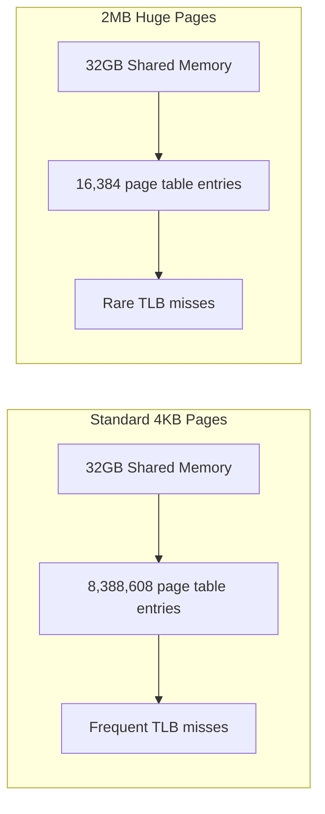

# How to Use Docker with Huge Pages for Database Workloads

Author: [nawazdhandala](https://github.com/nawazdhandala)

Tags: Docker, Performance, Huge Pages, Database, Linux, Memory, PostgreSQL, MySQL, Optimization

Description: Learn how to configure Linux huge pages and use them in Docker containers to improve database performance by reducing TLB misses and memory overhead.

---

Databases work with large amounts of memory. PostgreSQL's shared buffers, MySQL's InnoDB buffer pool, and Oracle's SGA all benefit from large contiguous memory regions. Standard 4 KB memory pages force the CPU to maintain millions of page table entries, consuming TLB (Translation Lookaside Buffer) slots and causing frequent page walks. Huge pages (2 MB or 1 GB) reduce this overhead dramatically, and Docker containers can use them with some configuration.

## Why Huge Pages Help Databases

Every memory access requires a virtual-to-physical address translation. The TLB caches these translations, but it has limited slots (typically 512-2048 entries). With 4 KB pages and 32 GB of shared memory, a database needs 8 million page table entries. The TLB cannot hold them all, so the CPU constantly evicts and reloads entries.

With 2 MB huge pages, the same 32 GB needs only 16,384 entries. TLB misses drop by orders of magnitude, and the CPU spends less time on page table walks.



## Step 1: Configure Huge Pages on the Host

Huge pages must be configured at the Linux kernel level before Docker can use them.

### Check Current Huge Page Configuration

```bash
# View current huge page settings
cat /proc/meminfo | grep -i huge
# HugePages_Total:       0      <- Total allocated huge pages
# HugePages_Free:        0      <- Currently unused
# HugePages_Rsvd:        0      <- Reserved but not yet used
# HugePages_Surp:        0      <- Surplus pages
# Hugepagesize:       2048 kB   <- Size per huge page (2 MB)

# Check transparent huge pages status
cat /sys/kernel/mm/transparent_hugepage/enabled
# [always] madvise never
```

### Allocate Huge Pages

Calculate how many pages you need. For a PostgreSQL instance with 8 GB of shared buffers:

```bash
# Calculate: 8 GB / 2 MB = 4096 pages
# Add 10% overhead for internal PostgreSQL structures
# Total: ~4500 pages

# Allocate huge pages (temporary, lost on reboot)
echo 4500 | sudo tee /proc/sys/vm/nr_hugepages

# Make it persistent across reboots
echo "vm.nr_hugepages = 4500" | sudo tee -a /etc/sysctl.d/hugepages.conf
sudo sysctl -p /etc/sysctl.d/hugepages.conf

# Verify allocation
grep HugePages_ /proc/meminfo
# HugePages_Total:    4500
# HugePages_Free:     4500
```

### Allocate at Boot Time for Guaranteed Availability

For best results, allocate huge pages at boot time when memory is not fragmented. Add to the kernel command line:

```bash
# Edit GRUB configuration
sudo vi /etc/default/grub

# Add to GRUB_CMDLINE_LINUX
GRUB_CMDLINE_LINUX="hugepagesz=2M hugepages=4500"

# Update GRUB
sudo update-grub
sudo reboot
```

### Configure Huge Page Groups

Docker containers need permission to use huge pages. Set up a group:

```bash
# Create a group for huge page users
sudo groupadd hugetlb

# Configure the group ID for huge pages
GID=$(getent group hugetlb | cut -d: -f3)
echo $GID | sudo tee /proc/sys/vm/hugetlb_shm_group

# Make it persistent
echo "vm.hugetlb_shm_group = $GID" | sudo tee -a /etc/sysctl.d/hugepages.conf
sudo sysctl -p /etc/sysctl.d/hugepages.conf
```

### Mount the hugetlbfs Filesystem

```bash
# Create the mount point
sudo mkdir -p /dev/hugepages

# Mount hugetlbfs
sudo mount -t hugetlbfs -o gid=$(getent group hugetlb | cut -d: -f3),mode=1770 \
  hugetlbfs /dev/hugepages

# Make it persistent
echo "hugetlbfs /dev/hugepages hugetlbfs gid=$(getent group hugetlb | cut -d: -f3),mode=1770 0 0" | \
  sudo tee -a /etc/fstab
```

## Step 2: Configure Docker to Use Huge Pages

Docker supports huge pages through the `--shm-size` flag and direct hugetlbfs mounts.

### Mount hugetlbfs into the Container

```bash
# Run PostgreSQL with huge pages mounted
docker run -d \
  --name postgres-hugepages \
  -v /dev/hugepages:/dev/hugepages \
  --shm-size=8g \
  -e POSTGRES_PASSWORD=secret \
  -e POSTGRES_SHARED_PRELOAD_LIBRARIES='pg_stat_statements' \
  postgres:16-alpine
```

### Using Docker Compose

```yaml
# docker-compose.yml with huge pages support
services:
  postgres:
    image: postgres:16-alpine
    volumes:
      # Mount hugetlbfs for huge page support
      - /dev/hugepages:/dev/hugepages
      - pgdata:/var/lib/postgresql/data
      - ./postgresql.conf:/etc/postgresql/postgresql.conf
    shm_size: '8g'
    environment:
      POSTGRES_PASSWORD: secret
    command: postgres -c config_file=/etc/postgresql/postgresql.conf
    deploy:
      resources:
        limits:
          memory: 16G
        reservations:
          memory: 12G

volumes:
  pgdata:
```

## Step 3: Configure the Database to Use Huge Pages

### PostgreSQL Configuration

```ini
# postgresql.conf - huge pages configuration
# Tell PostgreSQL to use huge pages
huge_pages = on

# Set shared_buffers to match your huge page allocation
# 4500 pages * 2 MB = ~8.8 GB, so set shared_buffers to 8 GB
shared_buffers = 8GB

# Other performance-related settings
effective_cache_size = 12GB
work_mem = 256MB
maintenance_work_mem = 1GB
wal_buffers = 64MB
```

Start the container and verify huge pages are being used:

```bash
# Check PostgreSQL is using huge pages
docker exec postgres-hugepages psql -U postgres -c "SHOW huge_pages;"
# Output: on

# Check from the host that pages are allocated
grep HugePages_ /proc/meminfo
# HugePages_Total:    4500
# HugePages_Free:      404    <- Many pages now in use
# HugePages_Rsvd:       50
```

### MySQL/InnoDB Configuration

```ini
# my.cnf - huge pages configuration for MySQL
[mysqld]
# Enable large pages
large-pages

# Set the buffer pool size to use the huge pages
innodb_buffer_pool_size = 8G
innodb_buffer_pool_instances = 8
```

Run MySQL with huge pages:

```bash
# Run MySQL with huge pages and required capabilities
docker run -d \
  --name mysql-hugepages \
  -v /dev/hugepages:/dev/hugepages \
  --cap-add SYS_NICE \
  --cap-add IPC_LOCK \
  -v ./my.cnf:/etc/mysql/conf.d/hugepages.cnf \
  -e MYSQL_ROOT_PASSWORD=secret \
  mysql:8.0
```

The `IPC_LOCK` capability is required for the process to lock memory into huge pages without being subject to the mlock limit.

## Step 4: Verify Huge Page Usage

Confirm that the database is actually using huge pages:

```bash
# Check huge page usage from the host
cat /proc/meminfo | grep -i huge
# HugePages_Total:    4500
# HugePages_Free:      404
# HugePages_Rsvd:       50
# HugePages_Surp:        0

# Check the container's memory mapping
docker exec postgres-hugepages cat /proc/1/smaps | grep -i huge

# Monitor in real-time
watch -n 1 'grep HugePages_ /proc/meminfo'
```

## Transparent Huge Pages vs Explicit Huge Pages

Linux supports two types of huge pages:

- **Transparent Huge Pages (THP)**: The kernel automatically promotes regular pages to huge pages. Sounds convenient, but it causes latency spikes during compaction and can hurt database performance.
- **Explicit Huge Pages**: You allocate them manually, and they are guaranteed to be available. This is what databases want.

Disable THP for database workloads:

```bash
# Disable Transparent Huge Pages
echo never | sudo tee /sys/kernel/mm/transparent_hugepage/enabled
echo never | sudo tee /sys/kernel/mm/transparent_hugepage/defrag

# Make it persistent with a systemd service
sudo tee /etc/systemd/system/disable-thp.service << 'EOF'
[Unit]
Description=Disable Transparent Huge Pages
DefaultDependencies=no
After=sysinit.target local-fs.target
Before=docker.service

[Service]
Type=oneshot
ExecStart=/bin/sh -c 'echo never > /sys/kernel/mm/transparent_hugepage/enabled && echo never > /sys/kernel/mm/transparent_hugepage/defrag'

[Install]
WantedBy=basic.target
EOF

sudo systemctl enable disable-thp
```

## Benchmarking the Difference

Measure the impact of huge pages on your database:

```bash
# Benchmark PostgreSQL without huge pages
docker run --rm -d --name pg-nohuge \
  -e POSTGRES_PASSWORD=test \
  -p 5432:5432 \
  postgres:16-alpine -c huge_pages=off -c shared_buffers=8GB

# Wait for startup, then benchmark
pgbench -i -s 100 -h localhost -U postgres testdb
pgbench -c 32 -j 8 -T 120 -h localhost -U postgres testdb

# Stop and restart with huge pages
docker stop pg-nohuge

docker run --rm -d --name pg-huge \
  -v /dev/hugepages:/dev/hugepages \
  --shm-size=8g \
  -e POSTGRES_PASSWORD=test \
  -p 5432:5432 \
  postgres:16-alpine -c huge_pages=on -c shared_buffers=8GB

# Run the same benchmark
pgbench -i -s 100 -h localhost -U postgres testdb
pgbench -c 32 -j 8 -T 120 -h localhost -U postgres testdb
```

Typical results show 5-15% improvement in transactions per second and 20-40% reduction in TLB misses. The improvement is more pronounced with larger buffer pools and higher concurrency.

## Troubleshooting

**Problem**: "could not map anonymous shared memory: Cannot allocate memory"
**Solution**: Not enough huge pages allocated. Increase `vm.nr_hugepages`.

**Problem**: PostgreSQL falls back to regular pages despite `huge_pages = on`
**Solution**: Check that enough free huge pages are available with `grep HugePages_Free /proc/meminfo`.

**Problem**: Huge pages show allocated but not used
**Solution**: Verify the hugetlbfs mount is accessible inside the container and the process has the IPC_LOCK capability.

## Wrapping Up

Huge pages reduce TLB pressure and improve database performance in Docker containers. The setup requires host-level configuration (allocating pages, mounting hugetlbfs, disabling THP) and container-level access (volume mounts, capabilities). The performance gains are most significant for memory-intensive workloads with large buffer pools and high concurrency. If you run databases in Docker, huge pages should be part of your production configuration.
