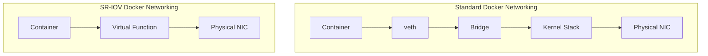

# How to Use Docker with SRIOV for High-Performance Networking

Author: [nawazdhandala](https://github.com/nawazdhandala)

Tags: Docker, SR-IOV, Networking, High Performance, NIC, Container, Linux

Description: Configure SR-IOV virtual functions with Docker containers to achieve near bare-metal network performance for demanding workloads.

---

SR-IOV (Single Root I/O Virtualization) lets a physical network card present itself as multiple virtual network interfaces. Each virtual function (VF) acts as an independent NIC that can be assigned directly to a container, bypassing Docker's bridge and NAT path. The result is network performance that approaches bare metal, with latency measured in microseconds and throughput limited primarily by the physical hardware.

This guide shows you how to set up SR-IOV with Docker containers for workloads where bridge networking overhead is unacceptable: financial trading systems, real-time data processing, high-frequency packet capture, and network function virtualization.

## How SR-IOV Works

A standard Docker container uses a veth pair connected to a bridge. Every packet traverses the bridge, the kernel's network stack, and potentially iptables rules. SR-IOV eliminates most of this path.



With SR-IOV, the container receives a Virtual Function (VF) that communicates directly with the hardware. The host kernel is barely involved in the data path.

## Prerequisites

SR-IOV requires:

- A physical NIC that supports SR-IOV (Intel X710, Mellanox ConnectX series, etc.)
- BIOS/UEFI with SR-IOV and VT-d (Intel) or AMD-Vi (AMD) enabled
- A Linux kernel with SR-IOV support (4.x or later)
- The Docker SR-IOV network plugin for Docker, or sriov-cni for Kubernetes/CNI deployments

Check if your NIC supports SR-IOV:

```bash
# Check if the NIC supports SR-IOV

lspci -vvv | grep -i "single root"

# Find your network interface name
ip link show

# Check the maximum number of VFs supported
cat /sys/class/net/eth0/device/sriov_totalvfs
```

## Enabling SR-IOV Virtual Functions

Create virtual functions on your physical NIC:

```bash
# Enable 8 virtual functions on the physical interface
echo 8 | sudo tee /sys/class/net/eth0/device/sriov_numvfs

# Verify the VFs were created
lspci | grep "Virtual Function"

# List the VF interfaces
ip link show eth0
```

The output will show VF entries under the physical function:

```text
2: eth0: <BROADCAST,MULTICAST,UP,LOWER_UP> mtu 1500 qdisc mq state UP
    vf 0 MAC 00:00:00:00:00:00, spoof checking on, link-state auto
    vf 1 MAC 00:00:00:00:00:00, spoof checking on, link-state auto
    ...
```

Make VF creation persistent across reboots:

```bash
# /etc/udev/rules.d/70-sriov.rules - Create VFs on boot
ACTION=="add", SUBSYSTEM=="net", ENV{ID_NET_DRIVER}=="i40e", ATTR{device/sriov_numvfs}="8"
```

Alternatively, use a systemd service:

```ini
# /etc/systemd/system/sriov-setup.service
[Unit]
Description=Enable SR-IOV Virtual Functions
After=network-pre.target

[Service]
Type=oneshot
ExecStart=/bin/bash -c 'echo 8 > /sys/class/net/eth0/device/sriov_numvfs'
RemainAfterExit=yes

[Install]
WantedBy=multi-user.target
```

## Two Paths: Kernel Driver vs DPDK

Before installing plugins, decide which approach fits your workload. These are **two separate paths** - do not mix them:

- **Kernel driver path (recommended for most users):** VFs stay bound to the kernel network driver (e.g., `iavf` for Intel). You use Docker's SR-IOV network plugin to create networks and attach containers. This gives you standard Docker networking with near-bare-metal performance.
- **DPDK path (maximum performance):** VFs are bound to `vfio-pci`, which removes them from the kernel network stack entirely. You cannot use Docker networking at all - instead, you pass the VFIO device directly into the container. Your application must use a DPDK library to handle packets in userspace.

> **Important:** Once you bind a VF to `vfio-pci`, it is no longer a kernel network interface. Commands like `docker network create --driver=sriov` will not see it. If you get `plugin "vfio-pci" not found`, you are likely trying to use `vfio-pci` as a Docker network driver - it is not one. Use `--driver=sriov` instead, and make sure your VFs are on the kernel driver.

## Installing the Docker SR-IOV Plugin (Kernel Driver Path)

The [Mellanox Docker SR-IOV plugin](https://github.com/Mellanox/docker-sriov-plugin) runs as a privileged container that registers itself as a Docker network driver:

```bash
# Run the SR-IOV Docker network driver plugin
docker run -v /run/docker/plugins:/run/docker/plugins \
  -v /etc/docker:/etc/docker \
  -v /var/run:/var/run \
  --net=host --privileged \
  rdma/sriov-plugin

# Verify the plugin is running
docker ps --filter ancestor=rdma/sriov-plugin
```

If you are also deploying SR-IOV workloads on Kubernetes, the SR-IOV network device plugin can advertise VF resource pools to kubelet. You can build its image from source:

```bash
# Clone and build the SR-IOV network device plugin
git clone https://github.com/k8snetworkplumbingwg/sriov-network-device-plugin.git
cd sriov-network-device-plugin

# Build the plugin image
make image

# Or use a pre-built Docker image
docker pull ghcr.io/k8snetworkplumbingwg/sriov-network-device-plugin:latest
```

The Kubernetes device plugin requires a `config.json` that maps your SR-IOV devices. Create one based on your hardware - note that the device ID varies between NICs and setups:

```json
{
  "resourceList": [
    {
      "resourceName": "intel_sriov_netdevice",
      "selectors": [
        {
          "vendors": ["8086"],
          "devices": ["154c", "10ed", "1889"],
          "drivers": ["i40evf", "iavf"]
        }
      ]
    }
  ]
}
```

You can find your device ID with `lspci -nn | grep Virtual`. See the [upstream config reference](https://github.com/k8snetworkplumbingwg/sriov-network-device-plugin/blob/master/docs/dpdk/configMap.yaml) for DPDK-specific configurations.

## Creating an SR-IOV Docker Network

Create a Docker network backed by SR-IOV:

```bash
# Create an SR-IOV network using the plugin
docker network create \
  --driver=sriov \
  --subnet=10.100.0.0/24 \
  --gateway=10.100.0.1 \
  -o netdevice=eth0 \
  sriov-network
```

If using the macvlan driver as a simpler alternative with SR-IOV VFs:

```bash
# Assign a VF netdevice to a macvlan network
# First, identify the VF interface name, such as enp3s0f0v0 on some systems
ip -o link show

# Create a macvlan network using the VF
docker network create \
  --driver macvlan \
  --subnet=10.100.0.0/24 \
  --gateway=10.100.0.1 \
  -o parent=enp3s0f0v0 \
  sriov-macvlan
```

## Running Containers with SR-IOV

Launch a container on the SR-IOV network:

```bash
# Run a container with SR-IOV networking
docker run -d \
  --name sriov-app \
  --network sriov-network \
  --ip 10.100.0.10 \
  nginx:alpine

# Verify the container has a VF interface
docker exec sriov-app apk add --no-cache iproute2 ethtool
docker exec sriov-app ip addr show
docker exec sriov-app ethtool -i eth0
```

The `ethtool` output will show the VF driver (like `iavf` for Intel) instead of the usual `veth` driver, confirming the container is using SR-IOV.

## Configuring VF Properties

Set MAC addresses, VLANs, and QoS on virtual functions:

```bash
# Set a specific MAC address on VF 0
sudo ip link set eth0 vf 0 mac 02:00:00:00:00:01

# Assign VF 0 to VLAN 100
sudo ip link set eth0 vf 0 vlan 100

# Set QoS priority on VF 0
sudo ip link set eth0 vf 0 vlan 100 qos 3

# Set rate limiting on VF 0 (max 1000 Mbps)
sudo ip link set eth0 vf 0 rate 1000

# Enable/disable spoof checking
sudo ip link set eth0 vf 0 spoofchk on

# Set trusted mode (allows promiscuous mode in the VF)
sudo ip link set eth0 vf 0 trust on
```

## Benchmarking SR-IOV vs Bridge Networking

Compare performance between standard bridge networking and SR-IOV:

```bash
# Setup: Run iperf3 server on another machine or in a container on the physical network

# Test 1: Standard bridge networking
docker run --rm --network bridge \
  networkstatic/iperf3 -c 10.0.0.100 -t 30 -P 4

# Test 2: SR-IOV networking
docker run --rm --network sriov-network \
  networkstatic/iperf3 -c 10.0.0.100 -t 30 -P 4
```

For latency testing:

```bash
# Measure round-trip latency with standard bridge
docker run --rm --network bridge alpine ping -c 100 10.0.0.100 -q

# Measure round-trip latency with SR-IOV
docker run --rm --network sriov-network alpine ping -c 100 10.0.0.100 -q
```

Typical results on a 25Gbps NIC:

| Metric | Bridge Network | SR-IOV |
|--------|---------------|--------|
| Throughput | 15-20 Gbps | 24-25 Gbps |
| Latency (avg) | 50-100 us | 10-20 us |
| CPU usage | 40-60% | 5-15% |
| Packets/sec | 2-3M pps | 10-14M pps |

## Docker Compose with SR-IOV

Use SR-IOV networks in Docker Compose:

```yaml
# docker-compose.yml - High-performance services with SR-IOV
services:
  trading-engine:
    image: trading-app:latest
    networks:
      fast-network:
        ipv4_address: 10.100.0.10
    deploy:
      resources:
        limits:
          cpus: '4'
          memory: 8G

  market-data:
    image: market-data-feed:latest
    networks:
      fast-network:
        ipv4_address: 10.100.0.11
    deploy:
      resources:
        limits:
          cpus: '2'
          memory: 4G

networks:
  fast-network:
    driver: sriov
    driver_opts:
      netdevice: eth0
    ipam:
      config:
        - subnet: 10.100.0.0/24
          gateway: 10.100.0.1
```

## DPDK Integration with SR-IOV (Alternate Path)

For the absolute lowest latency, combine SR-IOV with DPDK (Data Plane Development Kit). This is a **separate path** from the kernel driver approach above - VFs bound to `vfio-pci` are removed from the kernel network stack and **cannot be used with Docker's SR-IOV network plugin or `docker network create`**. Your application must use DPDK libraries to send and receive packets directly.

Bind a VF to the DPDK driver:

```bash
# Bind a VF to the vfio-pci driver for DPDK use
sudo modprobe vfio-pci

# Get the VF PCI address
VF_PCI=$(readlink -f /sys/class/net/eth0/device/virtfn0 | sed 's|.*\/||')
echo "VF PCI address: $VF_PCI"

# Unbind from the kernel driver
VF_DRIVER=$(basename "$(readlink -f /sys/bus/pci/devices/$VF_PCI/driver)")
echo "$VF_PCI" | sudo tee /sys/bus/pci/drivers/$VF_DRIVER/unbind

# Bind to vfio-pci
echo "vfio-pci" | sudo tee /sys/bus/pci/devices/$VF_PCI/driver_override
echo "$VF_PCI" | sudo tee /sys/bus/pci/drivers/vfio-pci/bind
```

Run a DPDK application in Docker with the VF. Since the VF is not a network interface, you pass the VFIO device directly instead of using `--network`:

```bash
# Run a DPDK container with access to the VF via vfio
# Note: Do NOT use --network=sriov-network here - DPDK bypasses Docker networking
docker run -d \
  --name dpdk-app \
  --privileged \
  -v /dev/vfio:/dev/vfio \
  -v /sys/bus/pci:/sys/bus/pci \
  -v /dev/hugepages:/dev/hugepages \
  dpdk-app:latest
```

## Monitoring SR-IOV VFs

Monitor VF status and performance:

```bash
# View VF statistics through the PF (Physical Function)
ip -s link show eth0

# Check VF link state
ip link show eth0 | grep "vf "

# Monitor VF traffic using ethtool
sudo ethtool -S eth0 | grep "vf"
```

## Troubleshooting

Common SR-IOV issues:

```bash
# Problem: Cannot create VFs
# Check IOMMU is enabled
dmesg | grep -i iommu

# Verify SR-IOV is enabled in BIOS
sudo lspci -vvv -s $(lspci | grep Ethernet | head -1 | awk '{print $1}') | grep -i "SR-IOV"

# Problem: VF has no link
# Check VF link state
sudo ip link set eth0 vf 0 state enable

# Problem: Container cannot send packets
# Check spoof checking (disable if MAC does not match)
sudo ip link set eth0 vf 0 spoofchk off
```

## Conclusion

SR-IOV with Docker delivers near bare-metal network performance for containers. The setup requires compatible hardware and more configuration than standard bridge networking, but the performance gains are substantial: 2-5x better throughput, 5-10x lower latency, and dramatically reduced CPU overhead. Use SR-IOV for workloads where network performance directly impacts business outcomes, such as financial systems, real-time analytics, and network appliances. For everything else, standard bridge networking remains simpler and sufficient.
