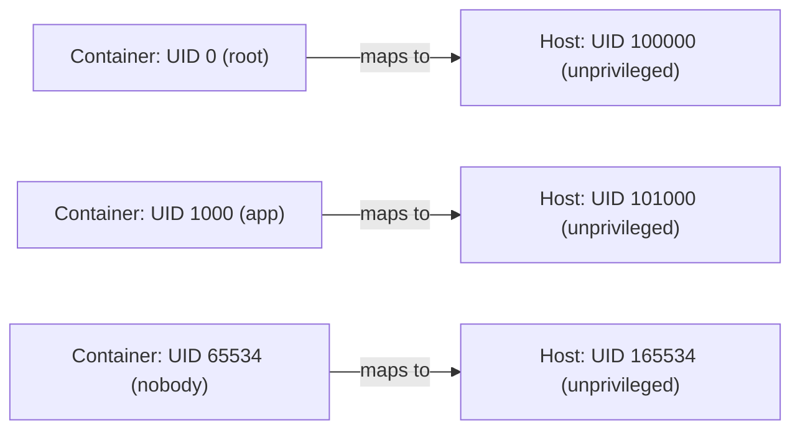

# How to Use Docker with User Namespace Remapping

Author: [nawazdhandala](https://github.com/nawazdhandala)

Tags: Docker, Security, Linux, Namespaces, Containers, Hardening, DevOps, Root Security

Description: Learn how to configure Docker user namespace remapping so that root inside containers maps to an unprivileged user on the host.

---

Containers that run as root inside the container are also root on the host by default. If an attacker escapes the container, they have full root access to the host system. User namespace remapping fixes this by mapping the container's root user to an unprivileged user on the host. Even if something breaks out, it lands as a nobody with limited permissions.

## The Problem with Root in Containers

When you run `docker run -u root` (or just use the default), the process inside the container runs as UID 0. The Linux kernel uses UID 0 for privilege checks. While Docker applies other isolation layers (cgroups, namespaces, seccomp, AppArmor), a kernel exploit can bypass these. If the exploit succeeds and the container process is UID 0 on the host, the attacker owns the machine.

Check what UID your containers actually use on the host:

```bash
# Start a container running as root
docker run -d --name test-root nginx:latest

# Check the process UID on the host
ps aux | grep nginx
# Output shows the master process running as root (UID 0)
```

With user namespace remapping, that UID 0 inside the container maps to something like UID 100000 on the host, which has no special privileges.

## How User Namespace Remapping Works

Linux user namespaces allow a process to have UID 0 inside the namespace while being a different UID in the parent namespace. Docker uses subordinate user and group ID ranges, defined in `/etc/subuid` and `/etc/subgid`, to set up this mapping.



The mapping is straightforward: container UID = host base UID + container UID. If the base UID is 100000, container root (UID 0) maps to host UID 100000, container UID 1000 maps to host UID 101000, and so on.

## Setting Up User Namespace Remapping

### Step 1: Create the Remap User

Create a dedicated user for the remapping. This user does not need a home directory or shell access.

```bash
# Create a dedicated user for Docker namespace remapping
sudo useradd -r -s /bin/false dockremap
```

### Step 2: Configure Subordinate ID Ranges

Add entries to `/etc/subuid` and `/etc/subgid`. Each entry specifies a starting UID/GID and a count of how many IDs the user can map.

```bash
# Add subordinate UID range (start at 100000, allow 65536 IDs)
echo "dockremap:100000:65536" | sudo tee -a /etc/subuid

# Add subordinate GID range
echo "dockremap:100000:65536" | sudo tee -a /etc/subgid
```

Verify the entries:

```bash
# Check the configured ranges
cat /etc/subuid
# Output: dockremap:100000:65536

cat /etc/subgid
# Output: dockremap:100000:65536
```

### Step 3: Configure the Docker Daemon

Edit the Docker daemon configuration to enable user namespace remapping:

```bash
# Create or edit the daemon configuration
sudo tee /etc/docker/daemon.json << 'EOF'
{
  "userns-remap": "dockremap"
}
EOF
```

You can also use `default` as the value. Docker will create a `dockremap` user automatically:

```json
{
  "userns-remap": "default"
}
```

### Step 4: Restart Docker

```bash
# Restart the Docker daemon to apply the new configuration
sudo systemctl restart docker

# Verify the daemon started successfully
sudo systemctl status docker
```

### Step 5: Verify the Remapping

Run a container and check the UID mapping:

```bash
# Run a container as root inside the namespace
docker run --rm alpine id
# Output: uid=0(root) gid=0(root) groups=0(root)

# But on the host, the process runs as UID 100000
docker run -d --name test-remap alpine sleep 3600
ps aux | grep "sleep 3600"
# Output shows UID 100000 instead of 0
```

Check the namespace mapping from inside the container:

```bash
# View the UID mapping from inside the container
docker run --rm alpine cat /proc/1/uid_map
# Output:    0     100000      65536
# This means: container UID 0 maps to host UID 100000, range of 65536
```

## Impact on Existing Containers and Volumes

Enabling user namespace remapping changes how Docker stores data. Images, containers, and volumes are stored in a subdirectory specific to the remapped user.

```bash
# Without remapping, data lives in:
# /var/lib/docker/

# With remapping to dockremap (100000:100000), data lives in:
# /var/lib/docker/100000.100000/

ls /var/lib/docker/
# You'll see both the original directory structure and the remapped one
```

Existing images need to be pulled again within the remapped namespace. Existing volumes are not accessible from remapped containers because the file ownership does not match.

## Working with Volume Permissions

Volume permissions are the most common pain point with user namespace remapping. Files created by the container appear owned by the remapped UID on the host.

```bash
# Create a volume and write a file
docker run --rm -v /tmp/test-vol:/data alpine sh -c "echo hello > /data/test.txt"

# Check ownership on the host
ls -la /tmp/test-vol/test.txt
# Output: -rw-r--r-- 1 100000 100000 6 Jan 15 10:00 test.txt
```

The file is owned by UID 100000, not root. This is actually the security benefit working correctly. To handle this in practice:

```bash
# Option 1: Set directory ownership to the remapped UID
sudo chown -R 100000:100000 /path/to/host/data

# Option 2: Use named volumes (Docker manages permissions)
docker volume create mydata
docker run --rm -v mydata:/data alpine sh -c "echo hello > /data/test.txt"

# Option 3: Use init containers to fix permissions
docker run --rm -v /path/to/data:/data alpine sh -c "chown -R 1000:1000 /data"
```

## Running Specific Containers Without Remapping

Some containers, like monitoring agents or system tools, genuinely need host root access. You can exempt specific containers from user namespace remapping:

```bash
# Run a container WITHOUT user namespace remapping
docker run --rm --userns=host alpine id
# Output: uid=0(root) gid=0(root) - actual host root
```

The `--userns=host` flag bypasses the remapping for that specific container. Use this sparingly and only for containers that need it.

## Docker Compose Configuration

In Docker Compose, you can set the userns mode per service:

```yaml
# docker-compose.yml with user namespace configuration
services:
  app:
    image: myapp:latest
    # Uses the daemon's default remapping

  monitoring:
    image: prometheus/node-exporter:latest
    # This service needs host access, bypass remapping
    userns_mode: "host"
    volumes:
      - /proc:/host/proc:ro
      - /sys:/host/sys:ro
```

## Verifying Security Improvements

Test that the remapping actually protects you. Try accessing a host-owned file from a remapped container:

```bash
# Create a file owned by root on the host
echo "sensitive data" | sudo tee /tmp/sensitive.txt
sudo chmod 600 /tmp/sensitive.txt

# Try to read it from a remapped container
docker run --rm -v /tmp/sensitive.txt:/data/sensitive.txt:ro alpine cat /data/sensitive.txt
# Permission denied - the container's "root" (UID 100000) cannot read root-owned files
```

Without remapping, that container could read the file because it runs as actual root.

## Common Issues and Solutions

**Problem**: Container cannot write to mounted volumes.
**Solution**: Set the volume directory ownership to match the remapped UID, or use named volumes.

**Problem**: Application fails because it cannot bind to port 80.
**Solution**: Ports below 1024 require `CAP_NET_BIND_SERVICE`. This capability still works inside the user namespace. If it does not, remap the port with `-p 8080:80`.

**Problem**: Docker-in-Docker does not work.
**Solution**: Docker-in-Docker requires real root and is incompatible with user namespace remapping. Use `--userns=host` or switch to a rootless Docker setup.

## Wrapping Up

User namespace remapping is one of the strongest security features available in Docker. It eliminates the risk of container escapes granting host root access, and it requires minimal application changes. The main friction point is volume permissions, which are manageable with proper ownership configuration. Enable it on all hosts where containers do not need real root access, and use `--userns=host` selectively for the exceptions.
