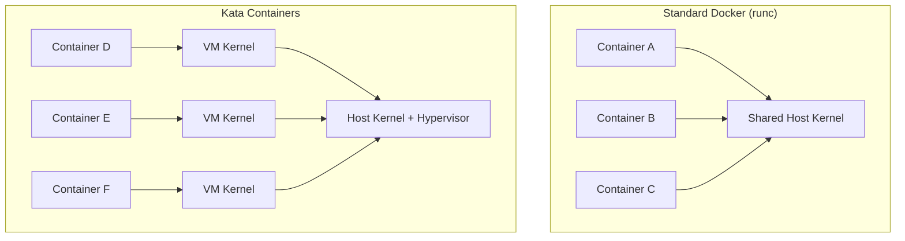

# How to Use Kata Containers with Docker for Enhanced Isolation

Author: [nawazdhandala](https://github.com/nawazdhandala)

Tags: Docker, Kata Containers, Security, Virtualization, Containers, Isolation, DevOps

Description: Learn how to run Docker containers inside lightweight VMs using Kata Containers for hardware-level isolation without sacrificing container workflow.

---

Standard Docker containers share the host kernel. Every container on a machine makes system calls to the same kernel, and a kernel vulnerability in one container threatens them all. Kata Containers solves this by running each container inside its own lightweight virtual machine. You get the developer experience of Docker with the isolation of virtual machines.

## What Are Kata Containers?

Kata Containers is an open source project that runs container workloads inside lightweight VMs. Each container (or pod) gets its own kernel, its own memory space, and hardware-enforced isolation through the CPU's virtualization extensions (Intel VT-x or AMD-V).

The key difference from traditional VMs is speed. Kata VMs boot in under a second, use minimal memory overhead (around 20-30 MB per VM), and present a standard OCI runtime interface. Docker sees Kata as just another runtime, like runc.



## When to Use Kata Containers

Kata Containers makes sense for specific use cases:

- Multi-tenant environments where containers from different customers run on the same host
- Running untrusted code (CI/CD build jobs, serverless functions, user-submitted code)
- Regulatory environments requiring hardware-level isolation
- Workloads that need a different kernel version than the host

For single-tenant environments running trusted code, standard runc containers with proper seccomp and AppArmor profiles provide adequate isolation with less overhead.

## Prerequisites

Kata Containers requires hardware virtualization support. Check your system:

```bash
# Check for Intel VT-x or AMD-V support
grep -cE '(vmx|svm)' /proc/cpuinfo
# Output should be > 0

# If running in a VM, ensure nested virtualization is enabled
cat /sys/module/kvm_intel/parameters/nested
# Should output "Y" or "1"
```

You also need a compatible hypervisor. Kata supports QEMU, Cloud Hypervisor, and Firecracker.

## Installation

### Install Kata Containers on Ubuntu/Debian

```bash
# Add the Kata Containers repository
sudo mkdir -p /etc/apt/keyrings
wget -qO- https://packages.kata-containers.io/kata-containers.key | \
  sudo tee /etc/apt/keyrings/kata-containers.asc

sudo tee /etc/apt/sources.list.d/kata-containers.list << 'EOF'
deb [signed-by=/etc/apt/keyrings/kata-containers.asc] https://packages.kata-containers.io/stable/ubuntu/ $(lsb_release -cs) main
EOF

# Install the Kata runtime
sudo apt-get update
sudo apt-get install -y kata-containers
```

### Install on Fedora/RHEL

```bash
# Install from the official repository
sudo dnf install -y kata-containers
```

### Verify the Installation

```bash
# Run the Kata check utility
kata-runtime check
# This validates hardware support, hypervisor availability, and kernel config

# Check the installed version
kata-runtime --version
```

## Configuring Docker to Use Kata

Docker needs to know about the Kata runtime. Register it in the Docker daemon configuration:

```bash
# Add Kata as a runtime in daemon.json
sudo tee /etc/docker/daemon.json << 'EOF'
{
  "runtimes": {
    "kata": {
      "path": "/usr/bin/kata-runtime"
    },
    "kata-clh": {
      "path": "/usr/bin/kata-runtime",
      "runtimeArgs": ["--config", "/etc/kata-containers/configuration-clh.toml"]
    },
    "kata-fc": {
      "path": "/usr/bin/kata-runtime",
      "runtimeArgs": ["--config", "/etc/kata-containers/configuration-fc.toml"]
    }
  }
}
EOF

# Restart Docker to load the new configuration
sudo systemctl restart docker
```

This registers three Kata runtime variants:
- `kata`: Default (QEMU hypervisor)
- `kata-clh`: Cloud Hypervisor (lower overhead, fewer features)
- `kata-fc`: Firecracker (minimal, fast boot, limited device support)

## Running Containers with Kata

Use the `--runtime` flag to select Kata:

```bash
# Run an nginx container inside a Kata VM
docker run -d --runtime=kata --name kata-nginx -p 8080:80 nginx:latest

# Verify it is running
docker ps
curl http://localhost:8080

# Check that it uses a Kata VM
docker inspect kata-nginx | grep -i runtime
# Output: "Runtime": "kata"
```

Compare the isolation by checking the kernel version:

```bash
# Host kernel version
uname -r
# Output: 6.5.0-generic (your host kernel)

# Kernel inside a standard container - same as host
docker run --rm alpine uname -r
# Output: 6.5.0-generic

# Kernel inside a Kata container - different, it is the VM kernel
docker run --rm --runtime=kata alpine uname -r
# Output: 6.1.62 (Kata's guest kernel)
```

Different kernel versions confirm the Kata container is running in its own VM.

## Setting Kata as the Default Runtime

If all containers should use Kata, set it as the default:

```json
{
  "default-runtime": "kata",
  "runtimes": {
    "kata": {
      "path": "/usr/bin/kata-runtime"
    }
  }
}
```

Now every `docker run` uses Kata unless overridden with `--runtime=runc`.

## Docker Compose with Kata

Docker Compose supports the runtime option:

```yaml
# docker-compose.yml using Kata for isolated services
services:
  # Trusted internal service - standard runtime
  database:
    image: postgres:16-alpine
    runtime: runc
    volumes:
      - pgdata:/var/lib/postgresql/data
    environment:
      POSTGRES_PASSWORD: secret

  # Untrusted workload - Kata isolation
  code-runner:
    image: code-sandbox:latest
    runtime: kata
    deploy:
      resources:
        limits:
          memory: 512M
          cpus: "1.0"

  # Public-facing service - Kata isolation
  api:
    image: api:latest
    runtime: kata
    ports:
      - "8080:8080"

volumes:
  pgdata:
```

## Performance Tuning

Kata adds overhead compared to runc. The VM boot time, memory usage, and I/O path all contribute. Here are ways to minimize the impact.

### Choose the Right Hypervisor

Each hypervisor has different tradeoffs:

```bash
# QEMU: Most compatible, highest overhead (~30 MB per VM, ~500ms boot)
docker run --runtime=kata --name test1 alpine echo hello

# Cloud Hypervisor: Good balance (~20 MB per VM, ~200ms boot)
docker run --runtime=kata-clh --name test2 alpine echo hello

# Firecracker: Fastest boot (~15 MB per VM, ~125ms boot), limited features
docker run --runtime=kata-fc --name test3 alpine echo hello
```

### Tune VM Resources

Edit the Kata configuration to right-size the VMs:

```bash
# Edit the Kata configuration
sudo vi /etc/kata-containers/configuration.toml
```

Key settings to adjust:

```toml
# /etc/kata-containers/configuration.toml

[hypervisor.qemu]
# Reduce default memory (default is 256 MB, lower for small containers)
default_memory = 128

# Set default vCPUs (default is 1)
default_vcpus = 1

# Enable memory hotplug so VMs start small and grow as needed
enable_mem_prealloc = false

# Use DAX for faster filesystem access
enable_iothreads = true

# Use virtio-fs instead of 9p for better file I/O
shared_fs = "virtio-fs"
```

### Use virtio-fs for Better I/O

The default 9p filesystem driver is slow. Switch to virtio-fs for significantly better I/O performance:

```toml
# In /etc/kata-containers/configuration.toml
[hypervisor.qemu]
shared_fs = "virtio-fs"
virtio_fs_daemon = "/usr/libexec/virtiofsd"
```

Benchmark the difference:

```bash
# I/O benchmark with 9p (default)
docker run --rm --runtime=kata alpine sh -c "dd if=/dev/zero of=/tmp/test bs=1M count=100 2>&1"

# I/O benchmark with virtio-fs (after configuration change)
docker run --rm --runtime=kata alpine sh -c "dd if=/dev/zero of=/tmp/test bs=1M count=100 2>&1"
```

## Networking Considerations

Kata containers use a virtual network interface inside the VM that bridges to the host network. This adds a small latency overhead (typically under 1 ms).

```bash
# Measure network latency to the container
docker run -d --runtime=kata --name kata-test -p 8080:80 nginx:latest
# Compare with runc
docker run -d --runtime=runc --name runc-test -p 8081:80 nginx:latest

# Benchmark both
ab -n 1000 -c 10 http://localhost:8080/
ab -n 1000 -c 10 http://localhost:8081/
```

## Monitoring Kata Containers

Kata provides a monitoring socket for each VM:

```bash
# Get Kata-specific metrics for a running container
kata-runtime metrics <container-id>

# Check the VM status
kata-runtime state <container-id>

# View Kata logs
journalctl -t kata-runtime
```

## Limitations

Kata Containers has some limitations compared to standard runc:

- No `--privileged` mode (the whole point is isolation)
- Limited device passthrough
- Higher memory baseline per container
- Some volume drivers may not work
- Docker-in-Docker requires special configuration
- Host PID and network namespace sharing are not supported

## Wrapping Up

Kata Containers adds hardware-level isolation to Docker without changing your workflow. The tradeoff is modest overhead in memory and startup time. For multi-tenant environments, untrusted workloads, and compliance requirements, this tradeoff is well worth it. Start by running Kata alongside runc, applying it selectively to workloads that need stronger isolation, and expand from there as you get comfortable with the performance characteristics.
