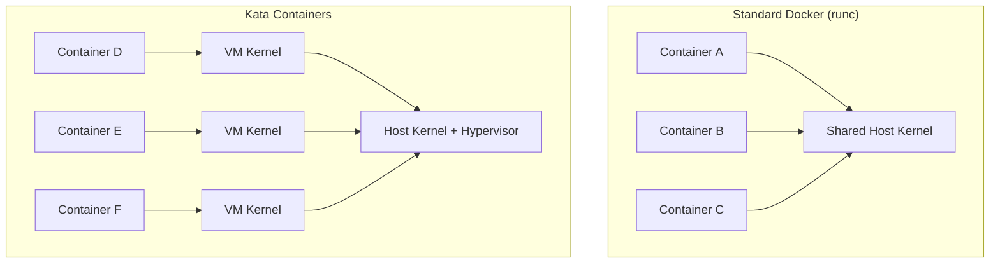

# How to Use Kata Containers with Docker for Enhanced Isolation

Author: [nawazdhandala](https://github.com/nawazdhandala)

Tags: Docker, Kata Containers, Security, Virtualization, Container, Isolation, DevOps

Description: Learn how to run Docker containers inside lightweight VMs using Kata Containers for hardware-level isolation without sacrificing container workflow.

---

Standard Docker containers share the host kernel. Every container on a machine makes system calls to the same kernel, and a kernel vulnerability in one container threatens them all. Kata Containers solves this by running each container inside its own lightweight virtual machine. You get the developer experience of Docker with the isolation of virtual machines.

## What Are Kata Containers?

Kata Containers is an open source project that runs container workloads inside lightweight VMs. Each container (or pod) gets its own kernel, its own memory space, and hardware-enforced isolation through the CPU's virtualization extensions (Intel VT-x or AMD-V).

The key difference from traditional VMs is speed. Kata VMs are designed to boot quickly, use less overhead than general-purpose VMs, and present a standard container runtime interface. Docker can select Kata through its containerd shim runtime, just as it can select other alternative runtimes.


```mermaid
graph TB
    subgraph "Standard Docker (runc)"
        A[Container A] --> K[Shared Host Kernel]
        B[Container B] --> K
        C[Container C] --> K
    end
    subgraph "Kata Containers"
        D[Container D] --> K1[VM Kernel]
        E[Container E] --> K2[VM Kernel]
        F[Container F] --> K3[VM Kernel]
        K1 --> H[Host Kernel + Hypervisor]
        K2 --> H
        K3 --> H
    end
```

## When to Use Kata Containers

Kata Containers makes sense for specific use cases:

- Multi-tenant environments where containers from different customers run on the same host
- Running untrusted code (CI/CD build jobs, serverless functions, user-submitted code)
- Regulatory environments requiring hardware-level isolation
- Workloads that need a different kernel version than the host

For single-tenant environments running trusted code, standard runc containers with proper seccomp and AppArmor profiles provide adequate isolation with less overhead.

## Prerequisites

Kata Containers requires hardware virtualization support. Check your system:

```bash
# Check for Intel VT-x or AMD-V support

grep -cE '(vmx|svm)' /proc/cpuinfo
# Output should be > 0

# If running in a VM, ensure nested virtualization is enabled
cat /sys/module/kvm_intel/parameters/nested
# Should output "Y" or "1"

# On AMD hosts, check the AMD KVM module instead
cat /sys/module/kvm_amd/parameters/nested
# Should output "Y" or "1"
```

You also need a compatible hypervisor. Kata supports QEMU, Cloud Hypervisor, and Firecracker.

## Installation

### Install Kata Containers on Ubuntu/Debian

```bash
# Install tools needed to unpack the static release archive
sudo apt-get update
sudo apt-get install -y curl zstd

# Download the current Kata Containers static release for amd64
KATA_VERSION="3.31.0"
curl -LO "https://github.com/kata-containers/kata-containers/releases/download/${KATA_VERSION}/kata-static-${KATA_VERSION}-amd64.tar.zst"

# Extract to /opt/kata and put the main tools on PATH
sudo tar --zstd -xvf "kata-static-${KATA_VERSION}-amd64.tar.zst" -C /
sudo ln -sf /opt/kata/bin/kata-runtime /usr/local/bin/kata-runtime
sudo ln -sf /opt/kata/bin/containerd-shim-kata-v2 /usr/local/bin/containerd-shim-kata-v2
```

### Install on Fedora

```bash
# Install from the Fedora repository
sudo dnf install -y kata-containers
```

### Verify the Installation

```bash
# Run the Kata check utility
kata-runtime check
# This validates hardware support, hypervisor availability, and kernel config

# Check the installed version
kata-runtime --version
```

## Configuring Docker to Use Kata

Docker needs to know about the Kata runtime. Register it in the Docker daemon configuration:

```bash
# Optional: create wrapper shims for non-default hypervisor configs
sudo tee /usr/local/bin/containerd-shim-kata-clh-v2 << 'EOF'
#!/bin/sh
KATA_CONF_FILE=/opt/kata/share/defaults/kata-containers/configuration-clh.toml exec /usr/local/bin/containerd-shim-kata-v2 "$@"
EOF

sudo tee /usr/local/bin/containerd-shim-kata-fc-v2 << 'EOF'
#!/bin/sh
KATA_CONF_FILE=/opt/kata/share/defaults/kata-containers/configuration-fc.toml exec /usr/local/bin/containerd-shim-kata-v2 "$@"
EOF

sudo chmod +x /usr/local/bin/containerd-shim-kata-clh-v2 /usr/local/bin/containerd-shim-kata-fc-v2

# Add Kata as a runtime in daemon.json
sudo tee /etc/docker/daemon.json << 'EOF'
{
  "runtimes": {
    "kata": {
      "runtimeType": "io.containerd.kata.v2"
    },
    "kata-clh": {
      "runtimeType": "/usr/local/bin/containerd-shim-kata-clh-v2"
    },
    "kata-fc": {
      "runtimeType": "/usr/local/bin/containerd-shim-kata-fc-v2"
    }
  }
}
EOF

# Restart Docker to load the new configuration
sudo systemctl restart docker
```

This registers three Kata runtime variants:
- `kata`: Default (QEMU hypervisor)
- `kata-clh`: Cloud Hypervisor (lower overhead, fewer features)
- `kata-fc`: Firecracker (minimal, fast boot, limited device support)

## Running Containers with Kata

Use the `--runtime` flag to select Kata:

```bash
# Run an nginx container inside a Kata VM
docker run -d --runtime=kata --name kata-nginx -p 8080:80 nginx:latest

# Verify it is running
docker ps
curl http://localhost:8080

# Check that it uses a Kata VM
docker inspect kata-nginx | grep -i runtime
# Output: "Runtime": "kata"
```

Compare the isolation by checking the kernel version:

```bash
# Host kernel version
uname -r
# Output: 6.5.0-generic (your host kernel)

# Kernel inside a standard container - same as host
docker run --rm alpine uname -r
# Output: 6.5.0-generic

# Kernel inside a Kata container - different, it is the VM kernel
docker run --rm --runtime=kata alpine uname -r
# Output: 6.1.62 (Kata's guest kernel)
```

Different kernel versions confirm the Kata container is running in its own VM.

## Setting Kata as the Default Runtime

If all containers should use Kata, set it as the default:

```json
{
  "default-runtime": "kata",
  "runtimes": {
    "kata": {
      "runtimeType": "io.containerd.kata.v2"
    }
  }
}
```

Now every `docker run` uses Kata unless overridden with `--runtime=runc`.

## Docker Compose with Kata

Docker Compose supports the runtime option:

```yaml
# docker-compose.yml using Kata for isolated services
services:
  # Trusted internal service - standard runtime
  database:
    image: postgres:16-alpine
    runtime: runc
    volumes:
      - pgdata:/var/lib/postgresql/data
    environment:
      POSTGRES_PASSWORD: secret

  # Untrusted workload - Kata isolation
  code-runner:
    image: code-sandbox:latest
    runtime: kata
    deploy:
      resources:
        limits:
          memory: 512M
          cpus: "1.0"

  # Public-facing service - Kata isolation
  api:
    image: api:latest
    runtime: kata
    ports:
      - "8080:8080"

volumes:
  pgdata:
```

## Performance Tuning

Kata adds overhead compared to runc. The VM boot time, memory usage, and I/O path all contribute. Here are ways to minimize the impact.

### Choose the Right Hypervisor

Each hypervisor has different tradeoffs:

```bash
# QEMU: Most compatible
docker run --rm --runtime=kata --name test1 alpine echo hello

# Cloud Hypervisor: Good balance between compatibility and overhead
docker run --rm --runtime=kata-clh --name test2 alpine echo hello

# Firecracker: Minimal, fast boot, limited features
docker run --rm --runtime=kata-fc --name test3 alpine echo hello
```

### Tune VM Resources

Edit the Kata configuration to right-size the VMs:

```bash
# Copy the packaged QEMU config into /etc so local changes override defaults
sudo mkdir -p /etc/kata-containers
sudo cp /opt/kata/share/defaults/kata-containers/configuration-qemu.toml \
  /etc/kata-containers/configuration.toml

# Edit the local Kata configuration
sudo vi /etc/kata-containers/configuration.toml
```

Key settings to adjust:

```toml
# /etc/kata-containers/configuration.toml

[hypervisor.qemu]
# Reduce default memory for small containers
default_memory = 128

# Set default vCPUs
default_vcpus = 1

# Disable preallocated memory so VM memory is not reserved up front
enable_mem_prealloc = false

# Use I/O threads for virtio block devices
enable_iothreads = true

# Use virtio-fs for shared filesystem I/O
shared_fs = "virtio-fs"
```

### Use virtio-fs for Better I/O

The default 9p filesystem driver is slow. Switch to virtio-fs for significantly better I/O performance:

```toml
# In /etc/kata-containers/configuration.toml
[hypervisor.qemu]
shared_fs = "virtio-fs"
virtio_fs_daemon = "/opt/kata/libexec/virtiofsd"
```

Benchmark the difference:

```bash
# I/O benchmark with 9p (default)
docker run --rm --runtime=kata alpine sh -c "dd if=/dev/zero of=/tmp/test bs=1M count=100 2>&1"

# I/O benchmark with virtio-fs (after configuration change)
docker run --rm --runtime=kata alpine sh -c "dd if=/dev/zero of=/tmp/test bs=1M count=100 2>&1"
```

## Networking Considerations

Kata containers use a virtual network interface inside the VM that bridges to the host network. This adds a small latency overhead (typically under 1 ms).

```bash
# Measure network latency to the container
docker run -d --runtime=kata --name kata-test -p 8080:80 nginx:latest
# Compare with runc
docker run -d --runtime=runc --name runc-test -p 8081:80 nginx:latest

# Benchmark both
ab -n 1000 -c 10 http://localhost:8080/
ab -n 1000 -c 10 http://localhost:8081/
```

## Monitoring Kata Containers

Kata provides environment, log, and diagnostic tools for troubleshooting:

```bash
# Show the Kata environment and selected configuration
kata-runtime env

# Collect diagnostic data for troubleshooting
sudo kata-collect-data.sh

# View Kata logs
sudo journalctl -t kata
```

## Limitations

Kata Containers has some limitations compared to standard runc:

- `--privileged` has different semantics than runc and does not pass host devices through by default
- Limited device passthrough
- Higher memory baseline per container
- Some volume drivers may not work
- Docker-in-Docker requires special configuration
- Host PID and network namespace sharing are not supported

## Wrapping Up

Kata Containers adds hardware-level isolation to Docker without changing your workflow. The tradeoff is modest overhead in memory and startup time. For multi-tenant environments, untrusted workloads, and compliance requirements, this tradeoff is well worth it. Start by running Kata alongside runc, applying it selectively to workloads that need stronger isolation, and expand from there as you get comfortable with the performance characteristics.
