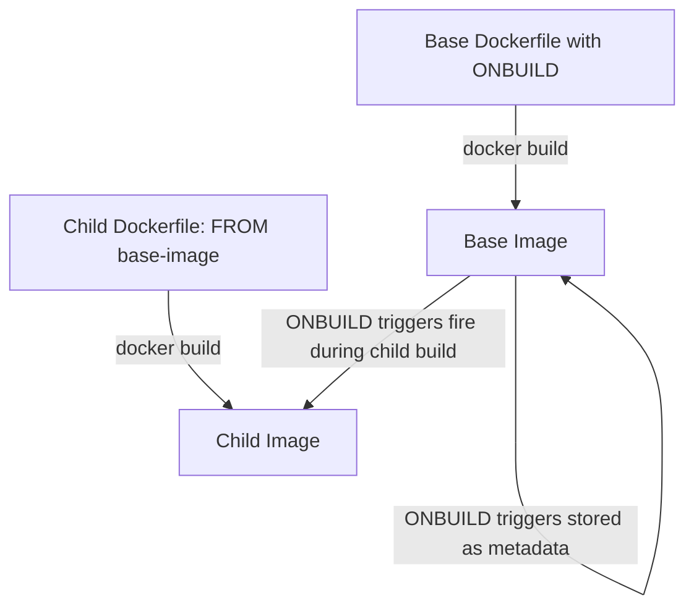

# How to Use the ONBUILD Instruction for Template Dockerfiles

Author: [nawazdhandala](https://github.com/nawazdhandala)

Tags: Docker, Dockerfile, ONBUILD, Templates, Base Images, DevOps

Description: Learn how to use the ONBUILD instruction to create reusable template Dockerfiles that trigger actions in child images.

---

The ONBUILD instruction registers a command that will execute when the image is used as a base for another build. Think of it as a deferred instruction: it does nothing during the build of the image where it is defined, but it fires automatically when a child Dockerfile uses `FROM` to build on top of that image.

This makes ONBUILD a powerful tool for creating template base images. If your organization has multiple applications that follow the same build pattern, an ONBUILD-enabled base image can enforce that pattern without requiring each application to repeat the same Dockerfile instructions.

## How ONBUILD Works

Here is the basic flow:

1. You create a base image with ONBUILD instructions
2. During the base image build, ONBUILD instructions are recorded as metadata but not executed
3. Someone else writes a Dockerfile that uses your image as a base (via FROM)
4. During their build, the ONBUILD instructions execute automatically, right after the FROM step



## Basic Syntax

ONBUILD takes any valid Dockerfile instruction as its argument:

```dockerfile
# These instructions are deferred to child image builds
ONBUILD COPY . /app
ONBUILD RUN npm install
ONBUILD EXPOSE 3000
```

You can use ONBUILD with most instructions. The exceptions are FROM, MAINTAINER, and ONBUILD itself (no nested ONBUILD).

## A Complete Example: Node.js Base Image

Let's build a practical example. Suppose your team has 15 Node.js microservices that all follow the same pattern: copy code, install dependencies, expose port 3000, and start with `npm start`.

### The Base Image

Create a base image that encapsulates the common pattern:

```dockerfile
# Dockerfile.base - Template base image for Node.js services
FROM node:20-alpine

WORKDIR /app

# When a child image is built, copy its package files first
ONBUILD COPY package.json package-lock.json ./

# Install dependencies in the child build
ONBUILD RUN npm ci --only=production

# Copy the rest of the application code
ONBUILD COPY . .

# Document the expected port
ONBUILD EXPOSE 3000

CMD ["npm", "start"]
```

Build and tag the base image:

```bash
# Build the base image
docker build -f Dockerfile.base -t myorg/node-base:20 .
```

### The Child Image

Now each microservice has a minimal Dockerfile:

```dockerfile
# Dockerfile for a specific microservice
# The ONBUILD triggers handle everything
FROM myorg/node-base:20
```

That's it. A single line. When this Dockerfile is built, the ONBUILD instructions from the base image execute in order:

1. `COPY package.json package-lock.json ./` copies the child project's package files
2. `RUN npm ci --only=production` installs the child project's dependencies
3. `COPY . .` copies the child project's source code
4. `EXPOSE 3000` documents the port

Build the child image:

```bash
# Build the microservice image
cd my-microservice/
docker build -t my-microservice:latest .
```

The build output shows the ONBUILD triggers executing:

```
Step 1/1 : FROM myorg/node-base:20
# Executing 4 build triggers
 ---> Running in abc123...
Sending build context to Docker daemon  ...
```

## Python Base Image Example

The same pattern works for Python applications:

```dockerfile
# Dockerfile.base - Template for Python web services
FROM python:3.11-slim

WORKDIR /app

# Install system dependencies that all services need
RUN apt-get update && \
    apt-get install -y --no-install-recommends libpq-dev && \
    rm -rf /var/lib/apt/lists/*

# Child builds: copy and install Python dependencies
ONBUILD COPY requirements.txt .
ONBUILD RUN pip install --no-cache-dir -r requirements.txt

# Child builds: copy application code
ONBUILD COPY . .

EXPOSE 8000
CMD ["gunicorn", "--bind", "0.0.0.0:8000", "app:app"]
```

Each Python service:

```dockerfile
# Minimal Dockerfile for a Python service
FROM myorg/python-base:3.11

# Override CMD if this service has a different entry point
CMD ["gunicorn", "--bind", "0.0.0.0:8000", "api:create_app()"]
```

## Java/Maven Base Image Example

ONBUILD is particularly useful for Java projects where the build process is complex:

```dockerfile
# Dockerfile.base - Template for Maven-based Java services
FROM maven:3.9-eclipse-temurin-17 AS builder

WORKDIR /build

# Child builds: copy the POM file first for dependency caching
ONBUILD COPY pom.xml .
ONBUILD RUN mvn dependency:go-offline -B

# Child builds: copy source and build
ONBUILD COPY src/ src/
ONBUILD RUN mvn package -DskipTests -B

# Runtime image
FROM eclipse-temurin:17-jre

WORKDIR /app

# Note: ONBUILD doesn't work across stages in multi-stage builds
# You would need a different approach for multi-stage templates

EXPOSE 8080
CMD ["java", "-jar", "app.jar"]
```

Note the limitation here: ONBUILD triggers only fire in the stage where FROM references the base image. They do not propagate across multi-stage builds. This limits the usefulness of ONBUILD with multi-stage Dockerfiles.

## Viewing ONBUILD Triggers

You can inspect an image to see its ONBUILD triggers:

```bash
# View ONBUILD instructions stored in an image
docker inspect --format='{{json .Config.OnBuild}}' myorg/node-base:20 | python3 -m json.tool
```

Output:

```json
[
    "COPY package.json package-lock.json ./",
    "RUN npm ci --only=production",
    "COPY . .",
    "EXPOSE 3000"
]
```

This is useful for understanding what a base image will do during your build.

## Execution Order

ONBUILD triggers execute in the order they are defined in the base image, and they run immediately after the FROM instruction in the child Dockerfile:

```dockerfile
# Child Dockerfile
FROM myorg/node-base:20
# ^ ONBUILD triggers execute here, between FROM and the next instruction

# This RUN happens AFTER all ONBUILD triggers
RUN echo "This runs after ONBUILD instructions"
```

The effective build order is:

1. FROM myorg/node-base:20
2. ONBUILD COPY package.json package-lock.json ./
3. ONBUILD RUN npm ci --only=production
4. ONBUILD COPY . .
5. ONBUILD EXPOSE 3000
6. RUN echo "This runs after ONBUILD instructions"

## ONBUILD Limitations

There are several important limitations to keep in mind:

### No Nesting

ONBUILD triggers do not propagate to grandchild images:

```dockerfile
# Base image A
ONBUILD RUN echo "trigger from A"

# Image B (FROM A) - trigger fires during B's build
# Image C (FROM B) - trigger does NOT fire, it was consumed by B's build
```

### No ONBUILD ONBUILD

You cannot nest ONBUILD:

```dockerfile
# This is NOT allowed
ONBUILD ONBUILD RUN echo "nested trigger"
```

### No ONBUILD FROM

You cannot use ONBUILD with FROM:

```dockerfile
# This is NOT allowed
ONBUILD FROM python:3.11
```

### Multi-Stage Limitations

ONBUILD triggers only affect the stage that uses the base image. They cannot trigger actions in other stages of a multi-stage build.

### Build Context Dependency

ONBUILD COPY and ONBUILD ADD rely on files being present in the child build context. If a child project does not have a `package.json` file, `ONBUILD COPY package.json .` will fail.

## When to Use ONBUILD

ONBUILD works best when:

- Your organization has many applications that follow an identical build pattern
- You want to enforce consistent build practices across teams
- The base image maintainer wants to reduce boilerplate in child Dockerfiles
- All child images have the same project structure (same file names, same directory layout)

## When to Avoid ONBUILD

ONBUILD is a poor choice when:

- Applications have significantly different build steps
- The project structure varies between teams
- You need fine-grained control over build order and caching
- Transparency is important (ONBUILD hides what happens during the build)

The biggest criticism of ONBUILD is that it creates implicit behavior. When someone reads a child Dockerfile that only says `FROM myorg/node-base:20`, they have no idea what the build actually does without inspecting the base image. This can make debugging difficult.

## Alternatives to ONBUILD

For many use cases, a well-documented Dockerfile template or a shared build script achieves the same result with better transparency:

```dockerfile
# Template Dockerfile - copy and customize for each service
FROM node:20-alpine
WORKDIR /app
COPY package.json package-lock.json ./
RUN npm ci --only=production
COPY . .
EXPOSE 3000
CMD ["npm", "start"]
```

Another option is to use a build tool or CI template that generates Dockerfiles:

```bash
# A script that generates a Dockerfile based on project type
./generate-dockerfile.sh --type node --port 3000
```

## Summary

The ONBUILD instruction creates deferred triggers that execute when a child image is built from your base image. It is useful for creating template base images that enforce consistent build patterns across multiple similar applications. Define ONBUILD instructions in the base image, and child Dockerfiles can be as simple as a single FROM line. However, ONBUILD adds implicit behavior that can make debugging harder, so use it deliberately and document what your base images do. For teams that value explicit over implicit, a shared Dockerfile template may be a better choice.
