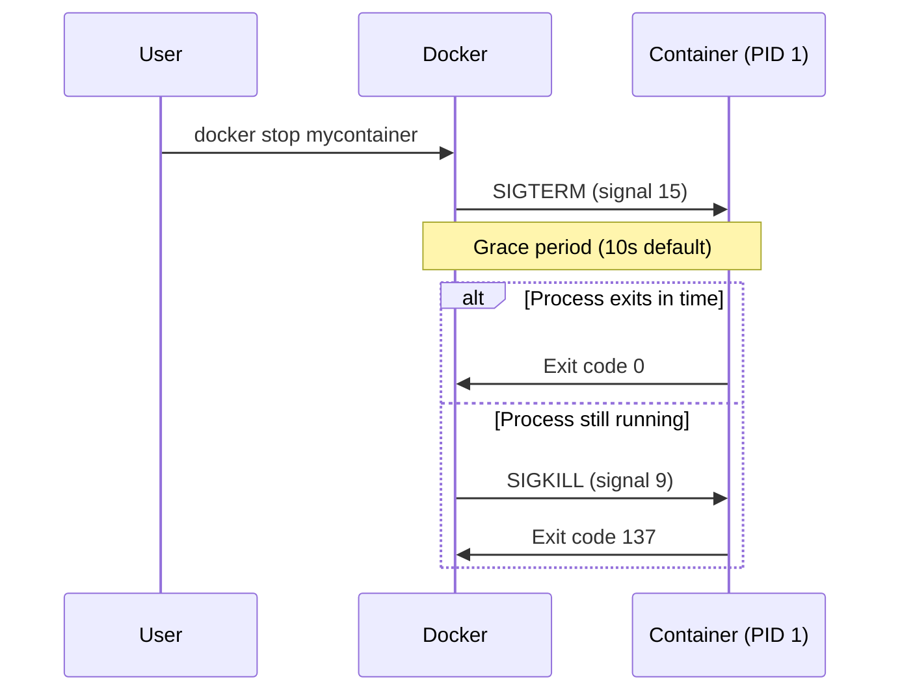

# How to Use the STOPSIGNAL Instruction in Dockerfiles

Author: [nawazdhandala](https://github.com/nawazdhandala)

Tags: Docker, Dockerfile, STOPSIGNAL, Signals, Graceful Shutdown, DevOps

Description: Learn how to use the STOPSIGNAL instruction in Dockerfiles to control how containers receive shutdown signals for graceful termination.

---

When Docker stops a container, it sends a signal to the main process (PID 1) inside the container. By default, this signal is SIGTERM. If the process does not exit within a grace period (10 seconds by default), Docker sends SIGKILL to force termination. The STOPSIGNAL instruction in a Dockerfile lets you change which signal Docker sends first, giving you control over how your application handles shutdown requests.

This instruction matters for any application that needs to perform cleanup work before exiting, like flushing buffers, closing database connections, finishing in-progress requests, or saving state.

## The Default Stop Behavior

Here is what happens when you run `docker stop`:

1. Docker sends SIGTERM (signal 15) to PID 1 in the container
2. Docker waits for the grace period (default: 10 seconds)
3. If the process is still running, Docker sends SIGKILL (signal 9)



SIGKILL cannot be caught or ignored. It immediately terminates the process without any cleanup opportunity. This is why graceful shutdown handling is important.

## Basic STOPSIGNAL Syntax

```dockerfile
# Using the signal name
STOPSIGNAL SIGQUIT

# Using the signal number
STOPSIGNAL 3

# SIGTERM is the default (you don't need to set it explicitly)
STOPSIGNAL SIGTERM
```

The instruction accepts either a signal name (like SIGTERM, SIGQUIT, SIGUSR1) or its numeric equivalent.

## Common Signals and Their Uses

Different applications expect different shutdown signals. Here are the most commonly used ones:

| Signal | Number | Default Action | Common Use |
|--------|--------|---------------|------------|
| SIGTERM | 15 | Terminate | General-purpose graceful shutdown |
| SIGQUIT | 3 | Quit with core dump | Nginx graceful shutdown |
| SIGINT | 2 | Interrupt | Same as pressing Ctrl+C |
| SIGUSR1 | 10 | User-defined | Application-specific (log rotation, etc.) |
| SIGWINCH | 28 | Window change | Apache graceful shutdown |

## Practical Examples

### Nginx

Nginx uses SIGQUIT for graceful shutdown. When Nginx receives SIGQUIT, it finishes serving all in-progress requests before exiting. SIGTERM causes Nginx to shut down immediately.

```dockerfile
FROM nginx:alpine

# Configure custom settings
COPY nginx.conf /etc/nginx/nginx.conf
COPY html/ /usr/share/nginx/html/

# Use SIGQUIT for graceful shutdown - finishes serving current requests
STOPSIGNAL SIGQUIT

EXPOSE 80
CMD ["nginx", "-g", "daemon off;"]
```

The official Nginx image already sets this, but if you are building a custom Nginx image from a base OS, you need to set it yourself.

### Apache HTTP Server

Apache uses SIGWINCH for graceful shutdown:

```dockerfile
FROM httpd:2.4

COPY httpd.conf /usr/local/apache2/conf/httpd.conf
COPY public-html/ /usr/local/apache2/htdocs/

# Apache graceful stop - allows current requests to complete
STOPSIGNAL SIGWINCH

EXPOSE 80
CMD ["httpd-foreground"]
```

### A Python Application with Custom Signal Handling

Here is a Python application that handles the shutdown signal to clean up properly:

```python
# app.py - A service with graceful shutdown handling
import signal
import sys
import time

running = True

def handle_shutdown(signum, frame):
    """Handle the shutdown signal by finishing current work"""
    global running
    print(f"Received signal {signum}, shutting down gracefully...")
    running = False

# Register signal handlers
signal.signal(signal.SIGTERM, handle_shutdown)
signal.signal(signal.SIGINT, handle_shutdown)

print("Service started, processing work...")
while running:
    # Simulate doing work
    time.sleep(1)
    print("Processing...")

# Cleanup
print("Flushing buffers...")
time.sleep(2)
print("Closing connections...")
time.sleep(1)
print("Shutdown complete.")
sys.exit(0)
```

The Dockerfile for this application:

```dockerfile
FROM python:3.11-slim

WORKDIR /app
COPY app.py .

# SIGTERM is the default, which matches our signal handler
STOPSIGNAL SIGTERM

CMD ["python", "-u", "app.py"]
```

The `-u` flag makes Python output unbuffered so you can see the shutdown messages in `docker logs`.

### Java Applications

Java applications typically handle SIGTERM through a shutdown hook:

```dockerfile
FROM eclipse-temurin:17-jre

WORKDIR /app
COPY target/myapp.jar .

# SIGTERM triggers Java's shutdown hooks
STOPSIGNAL SIGTERM

CMD ["java", "-jar", "myapp.jar"]
```

In Java, you register shutdown hooks that run when the JVM receives SIGTERM:

```java
// Java shutdown hook
Runtime.getRuntime().addShutdownHook(new Thread(() -> {
    System.out.println("Shutting down gracefully...");
    // Close database connections, flush caches, etc.
}));
```

## Overriding STOPSIGNAL at Runtime

You can override the stop signal when running a container, regardless of what the Dockerfile specifies:

```bash
# Override the stop signal at container creation
docker run --stop-signal SIGINT myimage

# Or specify the signal when stopping
docker stop --signal SIGQUIT mycontainer
```

You can also set it in Docker Compose:

```yaml
# docker-compose.yml
services:
  web:
    build: .
    stop_signal: SIGQUIT
    stop_grace_period: 30s
```

The `stop_grace_period` controls how long Docker waits before sending SIGKILL.

## Adjusting the Grace Period

The default 10-second grace period may not be enough for applications that need to finish processing long-running requests or flush large buffers.

```bash
# Stop with a 30-second grace period
docker stop --time 30 mycontainer

# Or set it when creating the container
docker run --stop-timeout 30 myimage
```

In Docker Compose:

```yaml
services:
  worker:
    build: .
    stop_grace_period: 60s
```

## The PID 1 Problem

Docker sends the stop signal to PID 1 inside the container. If your application is not running as PID 1, it will never receive the signal.

This is a common issue with shell form CMD or ENTRYPOINT:

```dockerfile
# Shell form - bash is PID 1, your app is a child process
CMD python app.py
# bash receives SIGTERM, but may not forward it to python
```

```dockerfile
# Exec form - python is PID 1, receives SIGTERM directly
CMD ["python", "app.py"]
```

Always use the exec form for CMD and ENTRYPOINT to ensure your application runs as PID 1 and receives signals directly.

If you need a shell script as an entrypoint, use `exec` to replace the shell process:

```bash
#!/bin/bash
# entrypoint.sh

# Perform setup
echo "Setting up environment..."
export DATABASE_URL="postgres://localhost/mydb"

# Use exec to replace this shell with the application process
# The application becomes PID 1 and receives signals
exec python app.py
```

```dockerfile
FROM python:3.11-slim
WORKDIR /app
COPY entrypoint.sh app.py ./
RUN chmod +x entrypoint.sh
STOPSIGNAL SIGTERM
ENTRYPOINT ["./entrypoint.sh"]
```

Alternatively, use a proper init system like `tini`:

```dockerfile
FROM python:3.11-slim

# Install tini as PID 1 init process
RUN apt-get update && apt-get install -y tini && rm -rf /var/lib/apt/lists/*

WORKDIR /app
COPY app.py .

STOPSIGNAL SIGTERM

# tini properly forwards signals to child processes
ENTRYPOINT ["tini", "--"]
CMD ["python", "app.py"]
```

## Testing Signal Handling

Verify that your container handles shutdown signals correctly:

```bash
# Start the container
docker run -d --name signal-test myimage

# Watch the logs in one terminal
docker logs -f signal-test

# In another terminal, stop the container
docker stop signal-test

# Check the exit code (0 = graceful, 137 = killed)
docker inspect --format='{{.State.ExitCode}}' signal-test
```

An exit code of 0 indicates the process handled the signal and exited on its own. An exit code of 137 means Docker had to send SIGKILL (128 + 9 = 137), which means the graceful shutdown either was not implemented or took too long.

You can also send specific signals to a running container:

```bash
# Send SIGUSR1 to a running container
docker kill --signal SIGUSR1 mycontainer
```

## Summary

The STOPSIGNAL instruction controls which signal Docker sends when stopping a container. Different applications expect different signals: Nginx uses SIGQUIT, Apache uses SIGWINCH, and most other applications use the default SIGTERM. Always use exec form for CMD and ENTRYPOINT so your application runs as PID 1 and receives signals directly. Adjust the grace period with `--stop-timeout` if your application needs more time to shut down cleanly. Test your signal handling by checking exit codes, where 0 means graceful shutdown and 137 means the process was forcibly killed.
