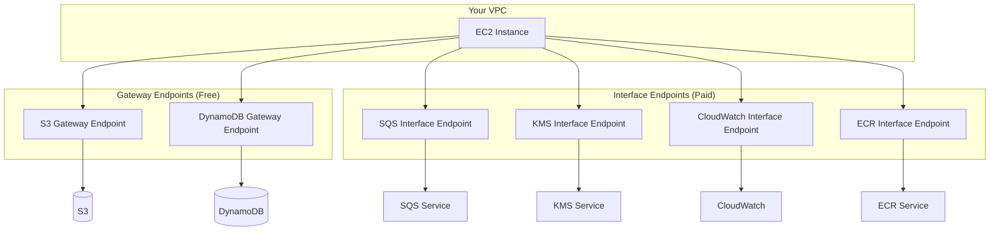

# How to Access AWS Services Privately Using VPC Endpoints

Author: [nawazdhandala](https://github.com/nawazdhandala)

Tags: AWS, VPC, Networking, PrivateLink, Security

Description: A comprehensive guide to accessing AWS services privately from your VPC using gateway and interface endpoints, eliminating the need for internet connectivity.

---

By default, every call from your VPC to an AWS service leaves the VPC. Even `aws s3 ls` from a private EC2 instance routes through a NAT gateway, hits the internet, and comes back to the S3 endpoint. The data stays on AWS infrastructure, but it technically traverses a public path. For many compliance frameworks and security postures, that's not acceptable.

VPC endpoints let you access AWS services without leaving the Amazon network. Your traffic never touches the internet. There's no NAT gateway in the path, no internet gateway needed, and no public IP required on your resources. It's private access to public services.

## Two Types of Endpoints

AWS offers two types of VPC endpoints, and knowing when to use each one saves you money and configuration headaches.

**Gateway Endpoints**: Free, route-table based. Available only for S3 and DynamoDB. They add a prefix list route to your route tables, directing service traffic through the endpoint instead of the NAT gateway.

**Interface Endpoints (PrivateLink)**: Paid, ENI-based. Available for most AWS services (200+). They create elastic network interfaces in your subnets with private IP addresses. DNS resolves the service endpoint to these private IPs.



## Starting Point: What Do You Actually Need?

Don't create endpoints for every AWS service. Start by figuring out which services your workload actually calls. Here's how:

```bash
# Check VPC Flow Logs for traffic going to AWS service IPs
# First, enable flow logs if you haven't
aws ec2 create-flow-logs \
  --resource-type VPC \
  --resource-ids $VPC_ID \
  --traffic-type ALL \
  --log-destination-type cloud-watch-logs \
  --log-group-name /vpc/flow-logs

# Then query for traffic going through the NAT gateway
# Look at destination IPs and match them to AWS service IP ranges
```

A simpler approach: check what your application imports and uses. If your Lambda function uses boto3 to call SQS, KMS, and S3, those are the three services that need endpoints.

## Common Patterns by Workload

Here's what different workloads typically need:

**ECS/Fargate tasks:**
```bash
# Required endpoints for Fargate tasks
SERVICES=(
  "com.amazonaws.us-east-1.ecr.api"       # Pull container images
  "com.amazonaws.us-east-1.ecr.dkr"       # Docker registry
  "com.amazonaws.us-east-1.s3"            # ECR stores layers in S3 (use gateway)
  "com.amazonaws.us-east-1.logs"          # CloudWatch Logs
  "com.amazonaws.us-east-1.sts"           # IAM role assumption
  "com.amazonaws.us-east-1.secretsmanager" # If using secrets
)
```

**Lambda functions (in VPC):**
```bash
# Lambda in VPC needs these to call AWS services
SERVICES=(
  "com.amazonaws.us-east-1.s3"            # Gateway endpoint
  "com.amazonaws.us-east-1.dynamodb"      # Gateway endpoint
  "com.amazonaws.us-east-1.sqs"           # If using SQS
  "com.amazonaws.us-east-1.sns"           # If using SNS
  "com.amazonaws.us-east-1.kms"           # If using encryption
  "com.amazonaws.us-east-1.secretsmanager" # If using secrets
)
```

**EC2 instances (managed by SSM):**
```bash
# Required for Systems Manager to manage EC2 instances
SERVICES=(
  "com.amazonaws.us-east-1.ssm"
  "com.amazonaws.us-east-1.ssmmessages"
  "com.amazonaws.us-east-1.ec2messages"
  "com.amazonaws.us-east-1.s3"            # Gateway - for SSM patch baselines
)
```

## Building a Complete Private VPC

Let's put it all together. Here's a VPC with zero internet access that can still use AWS services:

```bash
#!/bin/bash
# create-private-vpc-with-endpoints.sh
# Creates a fully private VPC with service access via endpoints only

REGION="us-east-1"
VPC_CIDR="10.0.0.0/16"

# Create VPC
VPC_ID=$(aws ec2 create-vpc \
  --cidr-block $VPC_CIDR \
  --query 'Vpc.VpcId' \
  --output text)

aws ec2 modify-vpc-attribute --vpc-id $VPC_ID --enable-dns-support '{"Value":true}'
aws ec2 modify-vpc-attribute --vpc-id $VPC_ID --enable-dns-hostnames '{"Value":true}'

# Create private subnets (NO public subnets, NO IGW, NO NAT)
SUBNET_1=$(aws ec2 create-subnet \
  --vpc-id $VPC_ID \
  --cidr-block 10.0.1.0/24 \
  --availability-zone ${REGION}a \
  --query 'Subnet.SubnetId' --output text)

SUBNET_2=$(aws ec2 create-subnet \
  --vpc-id $VPC_ID \
  --cidr-block 10.0.2.0/24 \
  --availability-zone ${REGION}b \
  --query 'Subnet.SubnetId' --output text)

# Security group for endpoints
EP_SG=$(aws ec2 create-security-group \
  --group-name endpoint-sg \
  --description "Allow HTTPS from VPC" \
  --vpc-id $VPC_ID \
  --query 'GroupId' --output text)

aws ec2 authorize-security-group-ingress \
  --group-id $EP_SG \
  --protocol tcp --port 443 \
  --cidr $VPC_CIDR

# Gateway endpoints (free)
aws ec2 create-vpc-endpoint \
  --vpc-id $VPC_ID \
  --service-name com.amazonaws.${REGION}.s3 \
  --vpc-endpoint-type Gateway \
  --route-table-ids $(aws ec2 describe-route-tables \
    --filters "Name=vpc-id,Values=$VPC_ID" \
    --query 'RouteTables[0].RouteTableId' --output text)

aws ec2 create-vpc-endpoint \
  --vpc-id $VPC_ID \
  --service-name com.amazonaws.${REGION}.dynamodb \
  --vpc-endpoint-type Gateway \
  --route-table-ids $(aws ec2 describe-route-tables \
    --filters "Name=vpc-id,Values=$VPC_ID" \
    --query 'RouteTables[0].RouteTableId' --output text)

# Interface endpoints (paid)
for SERVICE in logs monitoring kms secretsmanager sqs sts ecr.api ecr.dkr ssm ssmmessages ec2messages; do
  echo "Creating endpoint for $SERVICE..."
  aws ec2 create-vpc-endpoint \
    --vpc-id $VPC_ID \
    --vpc-endpoint-type Interface \
    --service-name com.amazonaws.${REGION}.${SERVICE} \
    --subnet-ids $SUBNET_1 $SUBNET_2 \
    --security-group-ids $EP_SG \
    --private-dns-enabled true
done

echo "Done. This VPC has no internet access but full AWS service access."
```

This VPC has no internet gateway, no NAT gateway, and no public subnets. It's completely isolated from the internet. But resources inside it can still call S3, DynamoDB, SQS, KMS, CloudWatch, ECR, Secrets Manager, and SSM - all through private endpoints.

## DNS Considerations

Private DNS is crucial. When enabled, the service's public DNS name (e.g., `sqs.us-east-1.amazonaws.com`) resolves to the endpoint's private IP inside your VPC. Without it, you'd need to use the endpoint-specific DNS name, which means modifying your application code.

```bash
# Verify private DNS is resolving correctly from inside the VPC
# From an EC2 instance in the VPC:
nslookup sqs.us-east-1.amazonaws.com
# Should return a 10.x.x.x address, not a public IP

# If it returns a public IP, check:
# 1. Private DNS is enabled on the endpoint
# 2. VPC has enableDnsHostnames = true
# 3. VPC has enableDnsSupport = true
```

## Listing Available Services

Not sure if a service supports endpoints? Check:

```bash
# List all available endpoint services in your region
aws ec2 describe-vpc-endpoint-services \
  --query 'ServiceNames[]' \
  --output text | tr '\t' '\n' | sort

# Search for a specific service
aws ec2 describe-vpc-endpoint-services \
  --query 'ServiceNames[?contains(@, `sagemaker`)]'
```

## Cost Optimization

Interface endpoints cost ~$7.20/month per AZ. With 10 endpoints across 2 AZs, that's $144/month. Here's how to optimize:

1. **Use gateway endpoints for S3 and DynamoDB** - they're free
2. **Only create endpoints for services you use** - don't speculatively create endpoints
3. **Use fewer AZs for non-critical endpoints** - one AZ is fine for dev environments
4. **Consider using a NAT gateway instead** if you only make occasional calls to many different services

The break-even point: if your NAT gateway processes more than $14.40 of data for a specific service per month (~320 GB at $0.045/GB), an interface endpoint is cheaper.

## Monitoring Endpoint Usage

Track endpoint traffic to verify they're being used:

```bash
# Check endpoint status
aws ec2 describe-vpc-endpoints \
  --filters "Name=vpc-id,Values=$VPC_ID" \
  --query 'VpcEndpoints[].{Service:ServiceName,State:State,Type:VpcEndpointType,DNS:PrivateDnsEnabled}' \
  --output table
```

For detailed reference on specific endpoint types, see [setting up VPC gateway endpoints for S3 and DynamoDB](https://oneuptime.com/blog/post/set-up-vpc-gateway-endpoints-s3-dynamodb/view) and [setting up VPC interface endpoints](https://oneuptime.com/blog/post/set-up-vpc-interface-endpoints-privatelink/view).

## Wrapping Up

VPC endpoints are the clean way to access AWS services from private subnets. Gateway endpoints for S3 and DynamoDB are free and should always be created. Interface endpoints for everything else cost money but provide genuine security and sometimes cost benefits over NAT gateways. Start with the endpoints your workload actually needs, verify DNS resolution works, and expand from there. For the strictest security postures, you can build a VPC with zero internet connectivity that still has full access to AWS services through endpoints alone.
