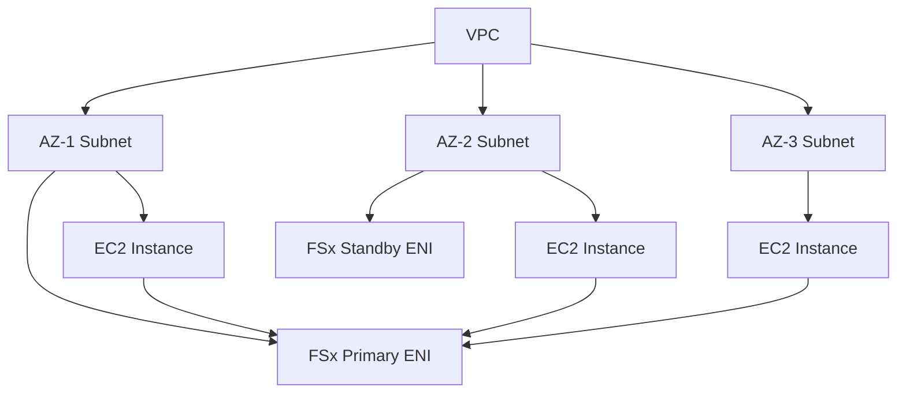

# How to Access FSx Volumes from Multiple Availability Zones

Author: [nawazdhandala](https://github.com/nawazdhandala)

Tags: AWS, FSx, Storage, High Availability, Networking

Description: Learn how to configure Amazon FSx file systems for multi-AZ access, enabling shared storage across availability zones for resilient and performant workloads.

---

Amazon FSx provides fully managed file systems that integrate natively with AWS services. But one question that keeps coming up is: how do you access a single FSx volume from workloads running in different Availability Zones? It's a fair concern - spreading your compute across AZs is a best practice for high availability, and your shared storage needs to keep up.

In this guide, we'll walk through the practical steps to make FSx volumes accessible from multiple AZs, covering both FSx for Windows File Server and FSx for Lustre.

## Understanding FSx and Multi-AZ Architecture

Before diving into configuration, let's clarify what's going on under the hood. FSx file systems are deployed within a VPC, and their network interfaces sit in specific subnets. To reach an FSx volume from another AZ, you need proper routing and security group configuration - but the good news is that AWS handles most of the networking magic for you within a single VPC.



FSx for Windows File Server supports both Single-AZ and Multi-AZ deployment types. The Multi-AZ option automatically provisions network interfaces in two AZs with automatic failover. FSx for Lustre, on the other hand, is inherently single-AZ but can still be accessed from other AZs within the same VPC.

## Setting Up Multi-AZ FSx for Windows File Server

The simplest path to cross-AZ access with high availability is using FSx for Windows File Server's Multi-AZ deployment. Here's how to create one using the AWS CLI.

First, create the file system with the Multi-AZ deployment type:

```bash
# Create a Multi-AZ FSx for Windows file system
aws fsx create-file-system \
  --file-system-type WINDOWS \
  --storage-capacity 300 \
  --storage-type SSD \
  --subnet-ids subnet-0abc1234 subnet-0def5678 \
  --security-group-ids sg-0123456789abcdef0 \
  --windows-configuration '{
    "ThroughputCapacity": 64,
    "DeploymentType": "MULTI_AZ_1",
    "PreferredSubnetId": "subnet-0abc1234",
    "ActiveDirectoryId": "d-1234567890",
    "AutomaticBackupRetentionDays": 30,
    "DailyAutomaticBackupStartTime": "02:00"
  }'
```

Notice the two subnet IDs - they must be in different AZs. The `PreferredSubnetId` tells FSx which AZ to use as the primary location. If the primary AZ has an issue, FSx automatically fails over to the standby.

## Configuring Security Groups for Cross-AZ Access

Your security group needs to allow traffic from all AZs where your clients live. This is where people often trip up.

Create a security group that allows the required ports:

```bash
# Create a security group for FSx access
aws ec2 create-security-group \
  --group-name fsx-multi-az-access \
  --description "Allow FSx access from multiple AZs" \
  --vpc-id vpc-0abc1234

# Allow SMB traffic (Windows File Server)
aws ec2 authorize-security-group-ingress \
  --group-id sg-0123456789abcdef0 \
  --protocol tcp \
  --port 445 \
  --cidr 10.0.0.0/16

# Allow DNS resolution
aws ec2 authorize-security-group-ingress \
  --group-id sg-0123456789abcdef0 \
  --protocol tcp \
  --port 53 \
  --cidr 10.0.0.0/16

aws ec2 authorize-security-group-ingress \
  --group-id sg-0123456789abcdef0 \
  --protocol udp \
  --port 53 \
  --cidr 10.0.0.0/16
```

The CIDR block `10.0.0.0/16` should match your VPC's CIDR range, which covers all subnets across all AZs. If you want tighter controls, you can specify individual subnet CIDRs instead.

## Accessing FSx for Lustre from Multiple AZs

FSx for Lustre doesn't have a native multi-AZ deployment type, but accessing it from different AZs is straightforward since all AZs within a VPC can reach each other by default.

Here's how to create an FSx for Lustre file system and mount it from an instance in a different AZ:

```bash
# Create FSx for Lustre file system in AZ-1
aws fsx create-file-system \
  --file-system-type LUSTRE \
  --storage-capacity 1200 \
  --storage-type SSD \
  --subnet-ids subnet-0abc1234 \
  --security-group-ids sg-0123456789abcdef0 \
  --lustre-configuration '{
    "DeploymentType": "PERSISTENT_2",
    "PerUnitStorageThroughput": 250
  }'
```

Then on any EC2 instance in the same VPC - regardless of AZ - install the Lustre client and mount:

```bash
# Install the Lustre client on Amazon Linux 2
sudo amazon-linux-extras install -y lustre

# Create the mount point
sudo mkdir -p /mnt/fsx

# Mount the FSx for Lustre file system
# The mount target DNS name works from any AZ in the VPC
sudo mount -t lustre \
  fs-0123456789abcdef0.fsx.us-east-1.amazonaws.com@tcp:/fsx \
  /mnt/fsx
```

One thing to keep in mind - cross-AZ data transfer does incur AWS data transfer charges. If you're moving large amounts of data between AZs, those costs can add up. For latency-sensitive workloads, try to keep your compute in the same AZ as the FSx file system when possible.

## Setting Up DNS for Multi-AZ Access

For FSx for Windows File Server with Multi-AZ, AWS automatically manages DNS entries that point to the active file server. You'll want to make sure your instances can resolve the FSx DNS name properly.

If you're using AWS Managed Microsoft AD, this is handled automatically. For self-managed AD, you need to configure DNS forwarding:

```bash
# Check the DNS name of your FSx file system
aws fsx describe-file-systems \
  --file-system-ids fs-0123456789abcdef0 \
  --query 'FileSystems[0].DNSName' \
  --output text

# Verify connectivity from an EC2 instance in a different AZ
nslookup fs-0123456789abcdef0.your-domain.com
```

## Monitoring Cross-AZ FSx Performance

When accessing FSx from multiple AZs, you should keep an eye on latency and throughput. Cross-AZ requests will naturally have slightly higher latency than same-AZ requests.

Set up CloudWatch alarms to track performance:

```bash
# Create a CloudWatch alarm for high latency
aws cloudwatch put-metric-alarm \
  --alarm-name "FSx-CrossAZ-Latency" \
  --metric-name "DataReadOperationLatency" \
  --namespace "AWS/FSx" \
  --statistic Average \
  --period 300 \
  --threshold 5 \
  --comparison-operator GreaterThanThreshold \
  --evaluation-periods 3 \
  --dimensions Name=FileSystemId,Value=fs-0123456789abcdef0 \
  --alarm-actions arn:aws:sns:us-east-1:123456789012:fsx-alerts
```

You might also want to monitor your cross-AZ data transfer costs using AWS Cost Explorer, filtering by the "Data Transfer" service and looking at inter-AZ transfer charges.

For comprehensive monitoring of your AWS infrastructure including FSx file systems, consider setting up [centralized monitoring](https://oneuptime.com/blog/post/2026-02-12-use-aws-backup-centralized-backup-management/view) to get alerts before small issues become outages.

## Performance Considerations

There are a few things worth knowing about cross-AZ FSx performance:

- **Latency**: Cross-AZ adds roughly 1-2ms of additional latency compared to same-AZ access. For most workloads this is negligible, but it matters for things like databases.
- **Throughput**: Your throughput isn't impacted by cross-AZ access per se, but the FSx throughput tier you selected still applies as a ceiling.
- **Cost**: AWS charges for cross-AZ data transfer (currently around $0.01/GB in each direction). Plan accordingly if you're dealing with terabytes.

A solid approach is to run your primary workload in the same AZ as the FSx primary ENI and use the cross-AZ capability for failover scenarios or secondary readers.

## Automating with CloudFormation

If you want to automate the whole setup, here's a CloudFormation snippet that creates a Multi-AZ FSx for Windows file system:

```yaml
Resources:
  FSxFileSystem:
    Type: AWS::FSx::FileSystem
    Properties:
      FileSystemType: WINDOWS
      StorageCapacity: 300
      StorageType: SSD
      SubnetIds:
        - !Ref PrimarySubnet
        - !Ref StandbySubnet
      SecurityGroupIds:
        - !Ref FSxSecurityGroup
      WindowsConfiguration:
        ThroughputCapacity: 64
        DeploymentType: MULTI_AZ_1
        PreferredSubnetId: !Ref PrimarySubnet
        ActiveDirectoryId: !Ref ManagedAD
        AutomaticBackupRetentionDays: 30
```

## Wrapping Up

Getting FSx volumes accessible from multiple Availability Zones isn't complicated, but it does require attention to a few details - correct security group rules, proper DNS resolution, and awareness of the performance and cost trade-offs. For Windows workloads, the Multi-AZ deployment type gives you built-in failover. For Lustre, standard VPC routing handles cross-AZ connectivity out of the box.

The key takeaway is this: plan your subnet layout and security groups upfront, test connectivity from each AZ before deploying production workloads, and monitor both performance and costs once you're running. That way, you get the resilience benefits of multi-AZ without any surprises on your bill.
