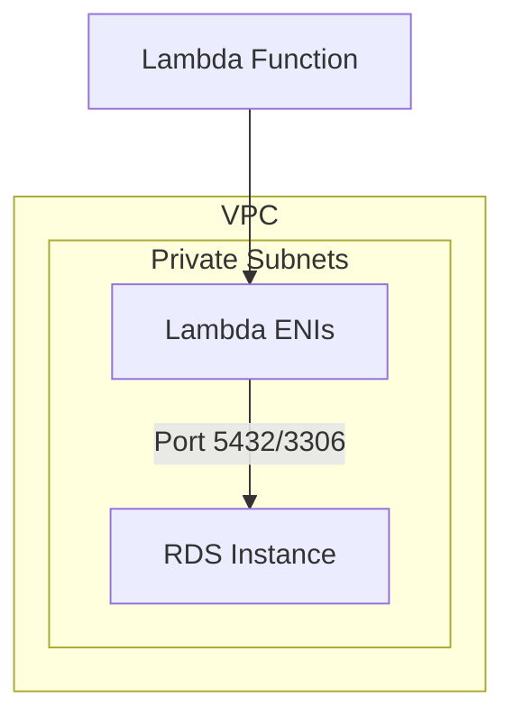

# How to Access RDS from Lambda Functions in a VPC

Author: [nawazdhandala](https://github.com/nawazdhandala)

Tags: AWS, Lambda, RDS, VPC, Database

Description: Step-by-step guide to connecting AWS Lambda functions to Amazon RDS databases within a VPC, covering networking, security groups, and connection management.

---

One of the most common serverless patterns is using AWS Lambda to query a relational database. But connecting Lambda to RDS isn't as simple as passing in a connection string. Your RDS instance sits in a private subnet, Lambda needs VPC access to reach it, and you've got to manage database connections carefully to avoid exhausting your connection pool.

Let's go through everything you need to get Lambda talking to RDS reliably.

## Prerequisites

Before you start, you'll need:

- An RDS instance running in a VPC (any engine - MySQL, PostgreSQL, Aurora, etc.)
- A Lambda function with an execution role that has VPC permissions
- The RDS instance should be in private subnets (it shouldn't be publicly accessible)

If you haven't configured VPC access for Lambda yet, check out our guide on [connecting Lambda functions to a VPC](https://oneuptime.com/blog/post/connect-lambda-functions-to-a-vpc/view).

## Network Architecture

The architecture is straightforward. Lambda and RDS both live in private subnets within the same VPC. Lambda creates ENIs in those subnets to establish connectivity, and security groups control the traffic flow.



## Step 1: Configure the Lambda Function for VPC Access

Your Lambda needs to be in the same VPC as your RDS instance. Configure it to use the same private subnets (or subnets that can route to the RDS subnets).

Here's a Terraform example that sets up the VPC configuration:

```hcl
# Lambda function configured to access RDS in the same VPC
resource "aws_lambda_function" "api" {
  function_name = "rds-query-handler"
  runtime       = "nodejs20.x"
  handler       = "index.handler"
  role          = aws_iam_role.lambda_exec.arn
  filename      = "function.zip"
  timeout       = 30

  vpc_config {
    # Use the same private subnets where RDS runs
    subnet_ids         = [aws_subnet.private_a.id, aws_subnet.private_b.id]
    security_group_ids = [aws_security_group.lambda_sg.id]
  }

  environment {
    variables = {
      DB_HOST     = aws_db_instance.main.address
      DB_PORT     = "5432"
      DB_NAME     = "myapp"
      DB_USER     = "lambda_user"
      # Never hardcode passwords - use Secrets Manager instead
    }
  }
}
```

## Step 2: Set Up Security Groups

You need two security groups - one for Lambda and one for RDS. The Lambda security group needs to allow outbound traffic to the RDS port, and the RDS security group needs to allow inbound traffic from the Lambda security group.

```hcl
# Security group for the Lambda function
resource "aws_security_group" "lambda_sg" {
  name        = "lambda-rds-access"
  description = "Allows Lambda to connect to RDS"
  vpc_id      = aws_vpc.main.id

  # Allow outbound to RDS on PostgreSQL port
  egress {
    from_port       = 5432
    to_port         = 5432
    protocol        = "tcp"
    security_groups = [aws_security_group.rds_sg.id]
  }

  # Allow outbound HTTPS for AWS API calls (if needed)
  egress {
    from_port   = 443
    to_port     = 443
    protocol    = "tcp"
    cidr_blocks = ["0.0.0.0/0"]
  }
}

# Security group for the RDS instance
resource "aws_security_group" "rds_sg" {
  name        = "rds-from-lambda"
  description = "Allows inbound from Lambda"
  vpc_id      = aws_vpc.main.id

  # Accept connections from Lambda's security group
  ingress {
    from_port       = 5432
    to_port         = 5432
    protocol        = "tcp"
    security_groups = [aws_security_group.lambda_sg.id]
  }
}
```

Notice we're referencing security groups instead of CIDR blocks. This is cleaner because Lambda's IP addresses within the VPC are dynamic.

## Step 3: Store Database Credentials Securely

Never hardcode database passwords in your Lambda function or environment variables. Use AWS Secrets Manager instead.

First, create a secret:

```bash
# Store the database credentials in Secrets Manager
aws secretsmanager create-secret \
  --name "myapp/db-credentials" \
  --secret-string '{"username":"lambda_user","password":"your-secure-password","host":"mydb.cluster-xyz.us-east-1.rds.amazonaws.com","port":"5432","dbname":"myapp"}'
```

Then retrieve it in your Lambda function:

```javascript
// Fetch database credentials from Secrets Manager
const { SecretsManagerClient, GetSecretValueCommand } = require('@aws-sdk/client-secrets-manager');

const client = new SecretsManagerClient({ region: 'us-east-1' });

let cachedCredentials = null;

async function getDbCredentials() {
  // Cache credentials to avoid calling Secrets Manager on every invocation
  if (cachedCredentials) return cachedCredentials;

  const command = new GetSecretValueCommand({ SecretId: 'myapp/db-credentials' });
  const response = await client.send(command);
  cachedCredentials = JSON.parse(response.SecretString);
  return cachedCredentials;
}
```

For more on this pattern, see our post on [using Lambda with Secrets Manager](https://oneuptime.com/blog/post/use-lambda-with-secrets-manager-for-secure-credentials/view).

## Step 4: Write the Database Connection Code

Here's a complete example using Node.js with PostgreSQL:

```javascript
// Lambda function that queries RDS PostgreSQL
const { Client } = require('pg');

let dbClient = null;

async function getConnection() {
  // Reuse the connection across warm invocations
  if (dbClient) return dbClient;

  const creds = await getDbCredentials();

  dbClient = new Client({
    host: creds.host,
    port: parseInt(creds.port),
    database: creds.dbname,
    user: creds.username,
    password: creds.password,
    // Set a connection timeout so Lambda doesn't hang
    connectionTimeoutMillis: 5000,
    // Set a query timeout as a safety net
    query_timeout: 10000,
  });

  await dbClient.connect();
  return dbClient;
}

exports.handler = async (event) => {
  try {
    const client = await getConnection();

    const result = await client.query(
      'SELECT id, name, email FROM users WHERE active = $1 LIMIT $2',
      [true, 50]
    );

    return {
      statusCode: 200,
      body: JSON.stringify(result.rows),
    };
  } catch (error) {
    console.error('Database query failed:', error.message);

    // Reset the connection on error so the next invocation creates a fresh one
    dbClient = null;

    return {
      statusCode: 500,
      body: JSON.stringify({ error: 'Internal server error' }),
    };
  }
};
```

For Python with MySQL, it looks like this:

```python
# Lambda function that queries RDS MySQL
import json
import pymysql
import boto3

connection = None

def get_connection():
    global connection
    if connection and connection.open:
        return connection

    # Fetch credentials from Secrets Manager
    sm = boto3.client('secretsmanager')
    secret = json.loads(
        sm.get_secret_value(SecretId='myapp/db-credentials')['SecretString']
    )

    connection = pymysql.connect(
        host=secret['host'],
        user=secret['username'],
        password=secret['password'],
        database=secret['dbname'],
        connect_timeout=5,
        read_timeout=10,
        cursorclass=pymysql.cursors.DictCursor
    )
    return connection

def handler(event, context):
    try:
        conn = get_connection()
        with conn.cursor() as cursor:
            cursor.execute("SELECT id, name FROM products WHERE in_stock = %s", (True,))
            rows = cursor.fetchall()

        return {'statusCode': 200, 'body': json.dumps(rows, default=str)}

    except Exception as e:
        # Reset connection on failure
        connection = None
        return {'statusCode': 500, 'body': json.dumps({'error': str(e)})}
```

## The Connection Pool Problem

Here's where things get tricky. Every Lambda execution environment maintains its own database connection. If your function scales to 100 concurrent invocations, that's 100 database connections. RDS instances have connection limits - a db.t3.micro allows about 66 connections, while a db.r5.large supports around 1000.

If Lambda scales beyond what your database can handle, new connections will fail and your application breaks.

The solutions:

1. **RDS Proxy** - AWS's purpose-built solution. It pools and shares database connections across Lambda invocations. Check our detailed guide on [using RDS Proxy with Lambda](https://oneuptime.com/blog/post/use-rds-proxy-with-lambda-for-database-connections/view).

2. **Reserved concurrency** - Limit how many concurrent Lambda invocations can run:

```bash
# Cap concurrent executions at 50 to protect the database
aws lambda put-function-concurrency \
  --function-name rds-query-handler \
  --reserved-concurrent-executions 50
```

3. **Connection reuse** - Always reuse connections across invocations within the same execution environment (as shown in the code examples above).

## Timeout Configuration

Set your Lambda timeout to be longer than your database connection timeout. If your connection timeout is 5 seconds and your query timeout is 10 seconds, set the Lambda timeout to at least 30 seconds to account for retries and overhead.

```yaml
# Make sure Lambda timeout exceeds DB timeouts
MyFunction:
  Type: AWS::Lambda::Function
  Properties:
    Timeout: 30  # 30 seconds - gives room for connection + query + overhead
```

## Testing the Connection

After deploying, test the function to verify connectivity:

```bash
# Invoke the function and check the response
aws lambda invoke \
  --function-name rds-query-handler \
  --payload '{}' \
  response.json && cat response.json
```

If you get a timeout error, check:
- The Lambda function is in the right VPC and subnets
- Security groups allow traffic on the correct port
- The RDS instance is running and accepting connections
- The database credentials are correct

## Common Issues and Fixes

**"Task timed out"** - Lambda can't reach RDS. Check VPC subnets and security groups.

**"Too many connections"** - Your Lambda is creating more connections than RDS allows. Use RDS Proxy or set reserved concurrency.

**"Connection refused"** - Verify the RDS endpoint, port, and that the instance is running.

**Intermittent failures** - The database connection might be stale. Add error handling that resets the connection and retries.

## Wrapping Up

Connecting Lambda to RDS requires getting the VPC networking right, configuring security groups correctly, managing credentials securely, and being thoughtful about connection management. The biggest pitfall is connection exhaustion at scale - if you're expecting high concurrency, look into RDS Proxy before you hit production. With these pieces in place, Lambda and RDS make a solid combination for serverless database access.
