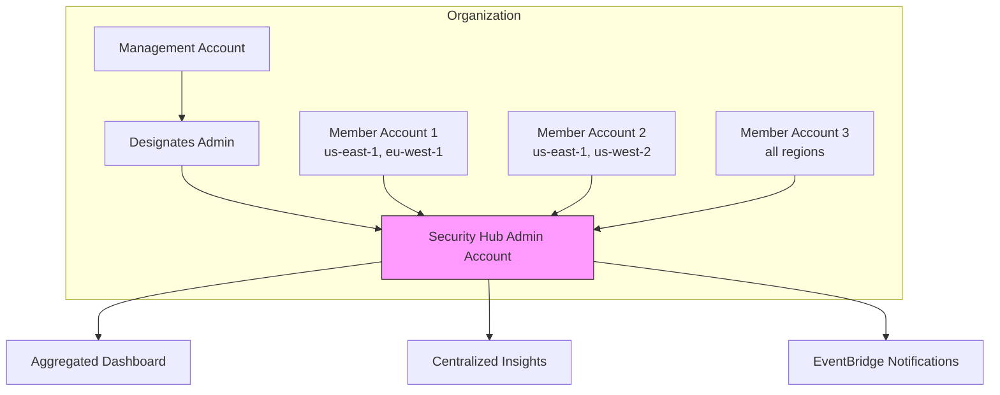

# How to Aggregate Security Hub Findings Across Accounts

Author: [nawazdhandala](https://github.com/nawazdhandala)

Tags: AWS, Security Hub, Multi-Account, Organizations, Security

Description: Learn how to set up cross-account and cross-region aggregation in AWS Security Hub to view all security findings from your entire organization in a single account.

---

If you're running Security Hub in 50 accounts across 10 regions, that's 500 separate places to check for security findings. Nobody's doing that. You need a single aggregation point where all findings flow together, giving your security team one dashboard for the entire organization.

Security Hub cross-account aggregation (also called the "finding aggregation" or "administrator-member" model) lets you designate one account as the central hub. Findings from all member accounts are automatically replicated to the administrator, including findings from GuardDuty, Config, Inspector, and Security Hub's own compliance checks.

## Architecture



## Step 1: Designate the Delegated Administrator

In the Organizations management account, designate a security account as the Security Hub delegated administrator.

```bash
# In the management account
aws securityhub enable-organization-admin-account \
  --admin-account-id 555555555555
```

Verify the designation.

```bash
aws securityhub list-organization-admin-accounts
```

## Step 2: Enable Cross-Region Aggregation

By default, Security Hub only aggregates findings from the same region. To get cross-region aggregation, create a finding aggregator in the administrator account.

```bash
# In the admin account - enable cross-region aggregation
aws securityhub create-finding-aggregator \
  --region-linking-mode ALL_REGIONS
```

If you only want specific regions, use `SPECIFIED_REGIONS`.

```bash
aws securityhub create-finding-aggregator \
  --region-linking-mode SPECIFIED_REGIONS \
  --regions '["us-east-1", "us-west-2", "eu-west-1", "eu-central-1"]'
```

Check the aggregator status.

```bash
aws securityhub list-finding-aggregators
```

## Step 3: Auto-Enable Members

Configure Security Hub to automatically enable in all organization member accounts.

```bash
# Auto-enable Security Hub for all existing and new accounts
aws securityhub update-organization-configuration \
  --auto-enable \
  --organization-configuration '{
    "ConfigurationType": "CENTRAL"
  }'
```

The `CENTRAL` configuration type means the administrator account controls the configuration for all members. Members can't disable Security Hub or change standards settings.

You can also use `LOCAL` if you want member accounts to manage their own configuration.

## Step 4: Enable Standards Across the Organization

Push compliance standards to all member accounts from the administrator.

```bash
# Enable CIS Benchmark across the organization
aws securityhub batch-enable-standards \
  --standards-subscription-requests '[{
    "StandardsArn": "arn:aws:securityhub:::ruleset/cis-aws-foundations-benchmark/v/1.4.0"
  }]'

# Enable AWS Foundational Security Best Practices
aws securityhub batch-enable-standards \
  --standards-subscription-requests '[{
    "StandardsArn": "arn:aws:securityhub:us-east-1::standards/aws-foundational-security-best-practices/v/1.0.0"
  }]'
```

## Viewing Aggregated Findings

From the administrator account, you now see findings from all members.

```bash
# Get critical findings across all accounts
aws securityhub get-findings \
  --filters '{
    "SeverityLabel": [{"Value": "CRITICAL", "Comparison": "EQUALS"}],
    "RecordState": [{"Value": "ACTIVE", "Comparison": "EQUALS"}],
    "WorkflowStatus": [{"Value": "NEW", "Comparison": "EQUALS"}]
  }' \
  --max-items 20

# Get findings for a specific member account
aws securityhub get-findings \
  --filters '{
    "AwsAccountId": [{"Value": "222222222222", "Comparison": "EQUALS"}],
    "SeverityLabel": [{"Value": "HIGH", "Comparison": "EQUALS"}]
  }'

# Get compliance failures across all accounts
aws securityhub get-findings \
  --filters '{
    "ComplianceStatus": [{"Value": "FAILED", "Comparison": "EQUALS"}],
    "ProductName": [{"Value": "Security Hub", "Comparison": "EQUALS"}],
    "SeverityLabel": [{"Value": "CRITICAL", "Comparison": "EQUALS"}]
  }' \
  --sort-criteria '{"Field": "AwsAccountId", "SortOrder": "asc"}'
```

## Cross-Account Insights

Create insights that aggregate data across all accounts. These are the most valuable views for security leadership.

```bash
# Which accounts have the worst compliance scores
aws securityhub create-insight \
  --name "Accounts by Compliance Failures" \
  --filters '{
    "ComplianceStatus": [{"Value": "FAILED", "Comparison": "EQUALS"}],
    "RecordState": [{"Value": "ACTIVE", "Comparison": "EQUALS"}]
  }' \
  --group-by-attribute "AwsAccountId"

# Which accounts have active GuardDuty threats
aws securityhub create-insight \
  --name "Accounts with Active Threats" \
  --filters '{
    "ProductName": [{"Value": "GuardDuty", "Comparison": "EQUALS"}],
    "SeverityLabel": [
      {"Value": "HIGH", "Comparison": "EQUALS"},
      {"Value": "CRITICAL", "Comparison": "EQUALS"}
    ],
    "WorkflowStatus": [{"Value": "NEW", "Comparison": "EQUALS"}]
  }' \
  --group-by-attribute "AwsAccountId"

# Which compliance controls fail most across the organization
aws securityhub create-insight \
  --name "Most Common Compliance Failures Org-Wide" \
  --filters '{
    "ComplianceStatus": [{"Value": "FAILED", "Comparison": "EQUALS"}],
    "ProductName": [{"Value": "Security Hub", "Comparison": "EQUALS"}],
    "RecordState": [{"Value": "ACTIVE", "Comparison": "EQUALS"}]
  }' \
  --group-by-attribute "GeneratorId"
```

## Centralized Notifications

Set up EventBridge rules in the administrator account to capture aggregated findings.

```bash
# Alert on critical findings from any account
aws events put-rule \
  --name org-security-hub-critical \
  --event-pattern '{
    "source": ["aws.securityhub"],
    "detail-type": ["Security Hub Findings - Imported"],
    "detail": {
      "findings": {
        "Severity": {
          "Label": ["CRITICAL"]
        },
        "Workflow": {
          "Status": ["NEW"]
        }
      }
    }
  }'

aws events put-targets \
  --rule org-security-hub-critical \
  --targets "Id"="1","Arn"="arn:aws:sns:us-east-1:555555555555:security-critical"
```

For richer notifications, use a Lambda function that includes account context.

```python
import json
import boto3

sns = boto3.client('sns')
organizations = boto3.client('organizations')

# Cache account names
account_cache = {}

def get_account_name(account_id):
    if account_id not in account_cache:
        try:
            response = organizations.describe_account(AccountId=account_id)
            account_cache[account_id] = response['Account']['Name']
        except Exception:
            account_cache[account_id] = account_id
    return account_cache[account_id]

def handler(event, context):
    findings = event['detail']['findings']

    for finding in findings:
        account_id = finding['AwsAccountId']
        account_name = get_account_name(account_id)
        severity = finding['Severity']['Label']
        title = finding['Title']
        product = finding.get('ProductName', 'Unknown')
        region = finding.get('Region', 'Unknown')

        message = f"""
Security Finding Alert
======================
Account: {account_name} ({account_id})
Region: {region}
Product: {product}
Severity: {severity}
Title: {title}

Description:
{finding.get('Description', 'No description')[:500]}
"""

        sns.publish(
            TopicArn='arn:aws:sns:us-east-1:555555555555:security-critical',
            Subject=f'[{severity}] {account_name}: {title[:60]}',
            Message=message
        )
```

## Terraform Configuration

```hcl
# In the management account
resource "aws_securityhub_organization_admin_account" "admin" {
  admin_account_id = "555555555555"
}

# In the admin account
resource "aws_securityhub_account" "admin" {}

resource "aws_securityhub_finding_aggregator" "all_regions" {
  linking_mode = "ALL_REGIONS"
  depends_on   = [aws_securityhub_account.admin]
}

resource "aws_securityhub_organization_configuration" "org" {
  auto_enable           = true
  auto_enable_standards = "DEFAULT"
  depends_on            = [aws_securityhub_account.admin]

  organization_configuration {
    configuration_type = "CENTRAL"
  }
}

# Cross-account insights
resource "aws_securityhub_insight" "accounts_compliance" {
  name               = "Accounts by Compliance Failures"
  group_by_attribute = "AwsAccountId"

  filters {
    compliance_status {
      comparison = "EQUALS"
      value      = "FAILED"
    }
    record_state {
      comparison = "EQUALS"
      value      = "ACTIVE"
    }
  }

  depends_on = [aws_securityhub_account.admin]
}
```

## Managing Member Accounts

Check the status of member accounts.

```bash
# List all member accounts
aws securityhub list-members --only-associated

# Get details for specific members
aws securityhub get-members \
  --account-ids '["222222222222", "333333333333"]'

# Disassociate an account (e.g., being decommissioned)
aws securityhub disassociate-members \
  --account-ids '["999999999999"]'
```

## Handling Scale

With many accounts, the volume of findings can be substantial. Here are some strategies:

1. **Use batch operations** - Update finding status in bulk rather than one at a time
2. **Automate triage** - Use Lambda functions to automatically suppress known non-issues
3. **Focus on new findings** - Filter on `WorkflowStatus: NEW` to see only unaddressed findings
4. **Use insights aggressively** - [Custom insights](https://oneuptime.com/blog/post/custom-security-hub-insights/view) help you focus on what matters

```bash
# Batch update findings to mark as notified
aws securityhub batch-update-findings \
  --finding-identifiers '[
    {"Id": "finding-1-arn", "ProductArn": "product-arn"},
    {"Id": "finding-2-arn", "ProductArn": "product-arn"}
  ]' \
  --workflow '{"Status": "NOTIFIED"}'
```

## Prerequisites Checklist

Before setting up aggregation, make sure:

- AWS Organizations is enabled with "all features"
- Security Hub is enabled in the admin account
- [GuardDuty is enabled](https://oneuptime.com/blog/post/enable-guardduty-threat-detection/view) in member accounts
- [AWS Config is enabled](https://oneuptime.com/blog/post/enable-aws-config-resource-compliance/view) in member accounts (required for compliance checks)
- [Compliance standards are enabled](https://oneuptime.com/blog/post/security-hub-compliance-standards-cis-pci/view) to generate compliance findings

With all of this in place, your security team has a single dashboard showing threats, compliance violations, and vulnerabilities across every account and region in your organization.
