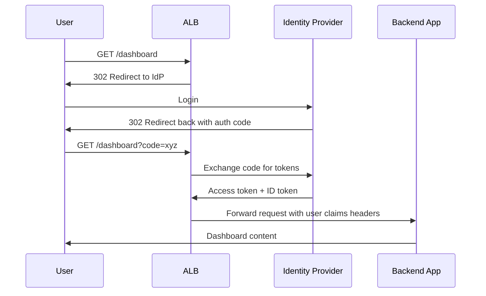

# How to Configure ALB Authentication with Cognito and OIDC

Author: [nawazdhandala](https://github.com/nawazdhandala)

Tags: AWS, ALB, Cognito, OIDC, Authentication

Description: Step-by-step guide to configuring Application Load Balancer built-in authentication using Amazon Cognito and OIDC identity providers like Okta and Google.

---

Adding authentication to a web application usually means integrating an auth library, handling callbacks, managing sessions, and dealing with token validation. It's a lot of code that has nothing to do with your actual application logic. ALB authentication offloads all of this to the load balancer itself.

With ALB's built-in authentication, the load balancer intercepts unauthenticated requests, redirects users to your identity provider (Cognito, Okta, Google, or any OIDC-compatible provider), handles the OAuth 2.0 flow, validates tokens, and then forwards the authenticated request to your application with user claims in HTTP headers. Your backend just reads the headers - no auth libraries needed.

## Architecture Overview



## Option 1: ALB with Cognito

Cognito is the easiest path since it's AWS-native and requires no external dependencies.

Create a Cognito User Pool:

```bash
# Create the user pool
aws cognito-idp create-user-pool \
  --pool-name "app-users" \
  --auto-verified-attributes email \
  --username-attributes email \
  --mfa-configuration OFF \
  --policies '{
    "PasswordPolicy": {
      "MinimumLength": 12,
      "RequireUppercase": true,
      "RequireLowercase": true,
      "RequireNumbers": true,
      "RequireSymbols": false
    }
  }'

USER_POOL_ID="us-east-1_abc123"

# Create an app client for the ALB
aws cognito-idp create-user-pool-client \
  --user-pool-id $USER_POOL_ID \
  --client-name "alb-auth" \
  --generate-secret \
  --supported-identity-providers COGNITO \
  --callback-urls "https://app.example.com/oauth2/idpresponse" \
  --allowed-o-auth-flows code \
  --allowed-o-auth-scopes openid email profile \
  --allowed-o-auth-flows-user-pool-client

# Create a domain for the Cognito hosted UI
aws cognito-idp create-user-pool-domain \
  --domain "app-auth-example" \
  --user-pool-id $USER_POOL_ID
```

The callback URL `https://app.example.com/oauth2/idpresponse` is where ALB receives the authorization code. This must exactly match your ALB's domain name followed by `/oauth2/idpresponse`.

Now configure the ALB listener rule with Cognito authentication.

Configure ALB authentication with Cognito:

```bash
# Modify the default listener rule to require authentication
aws elbv2 modify-listener \
  --listener-arn arn:aws:elasticloadbalancing:us-east-1:123456789012:listener/app/my-alb/abc123/def456 \
  --default-actions '[
    {
      "Type": "authenticate-cognito",
      "Order": 1,
      "AuthenticateCognitoConfig": {
        "UserPoolArn": "arn:aws:cognito-idp:us-east-1:123456789012:userpool/us-east-1_abc123",
        "UserPoolClientId": "client123abc",
        "UserPoolDomain": "app-auth-example",
        "SessionCookieName": "AWSELBAuthSessionCookie",
        "Scope": "openid email profile",
        "SessionTimeout": 3600,
        "OnUnauthenticatedRequest": "authenticate"
      }
    },
    {
      "Type": "forward",
      "Order": 2,
      "TargetGroupArn": "arn:aws:elasticloadbalancing:us-east-1:123456789012:targetgroup/app-targets/abc123"
    }
  ]'
```

## Option 2: ALB with OIDC (Okta, Google, etc.)

For external identity providers, use the OIDC action type. Here's how to set it up with Okta.

Configure ALB with an OIDC provider:

```bash
aws elbv2 modify-listener \
  --listener-arn arn:aws:elasticloadbalancing:us-east-1:123456789012:listener/app/my-alb/abc123/def456 \
  --default-actions '[
    {
      "Type": "authenticate-oidc",
      "Order": 1,
      "AuthenticateOidcConfig": {
        "Issuer": "https://dev-123456.okta.com",
        "AuthorizationEndpoint": "https://dev-123456.okta.com/oauth2/v1/authorize",
        "TokenEndpoint": "https://dev-123456.okta.com/oauth2/v1/token",
        "UserInfoEndpoint": "https://dev-123456.okta.com/oauth2/v1/userinfo",
        "ClientId": "0oa1234567abcdef",
        "ClientSecret": "your-client-secret",
        "SessionCookieName": "AWSELBAuthSessionCookie",
        "Scope": "openid email profile",
        "SessionTimeout": 3600,
        "OnUnauthenticatedRequest": "authenticate"
      }
    },
    {
      "Type": "forward",
      "Order": 2,
      "TargetGroupArn": "arn:aws:elasticloadbalancing:us-east-1:123456789012:targetgroup/app-targets/abc123"
    }
  ]'
```

For Google as the OIDC provider, the endpoints are:

```
Issuer: https://accounts.google.com
AuthorizationEndpoint: https://accounts.google.com/o/oauth2/v2/auth
TokenEndpoint: https://oauth2.googleapis.com/token
UserInfoEndpoint: https://openidconnect.googleapis.com/v1/userinfo
```

## CloudFormation Template

Here's a complete CloudFormation setup.

CloudFormation template with Cognito authentication:

```yaml
AWSTemplateFormatVersion: '2010-09-09'
Description: ALB with Cognito Authentication

Parameters:
  VpcId:
    Type: AWS::EC2::VPC::Id
  SubnetIds:
    Type: List<AWS::EC2::Subnet::Id>
  DomainName:
    Type: String
  CertificateArn:
    Type: String

Resources:
  UserPool:
    Type: AWS::Cognito::UserPool
    Properties:
      UserPoolName: app-users
      AutoVerifiedAttributes:
        - email
      UsernameAttributes:
        - email
      Policies:
        PasswordPolicy:
          MinimumLength: 12
          RequireUppercase: true
          RequireLowercase: true
          RequireNumbers: true
          RequireSymbols: false

  UserPoolClient:
    Type: AWS::Cognito::UserPoolClient
    Properties:
      UserPoolId: !Ref UserPool
      ClientName: alb-auth
      GenerateSecret: true
      SupportedIdentityProviders:
        - COGNITO
      CallbackURLs:
        - !Sub "https://${DomainName}/oauth2/idpresponse"
      AllowedOAuthFlows:
        - code
      AllowedOAuthScopes:
        - openid
        - email
        - profile
      AllowedOAuthFlowsUserPoolClient: true

  UserPoolDomain:
    Type: AWS::Cognito::UserPoolDomain
    Properties:
      Domain: !Sub "auth-${AWS::StackName}"
      UserPoolId: !Ref UserPool

  ALB:
    Type: AWS::ElasticLoadBalancingV2::LoadBalancer
    Properties:
      Type: application
      Subnets: !Ref SubnetIds
      SecurityGroups:
        - !Ref ALBSecurityGroup

  ALBSecurityGroup:
    Type: AWS::EC2::SecurityGroup
    Properties:
      GroupDescription: ALB Security Group
      VpcId: !Ref VpcId
      SecurityGroupIngress:
        - IpProtocol: tcp
          FromPort: 443
          ToPort: 443
          CidrIp: 0.0.0.0/0

  HTTPSListener:
    Type: AWS::ElasticLoadBalancingV2::Listener
    Properties:
      LoadBalancerArn: !Ref ALB
      Port: 443
      Protocol: HTTPS
      Certificates:
        - CertificateArn: !Ref CertificateArn
      DefaultActions:
        - Type: authenticate-cognito
          Order: 1
          AuthenticateCognitoConfig:
            UserPoolArn: !GetAtt UserPool.Arn
            UserPoolClientId: !Ref UserPoolClient
            UserPoolDomain: !Ref UserPoolDomain
            OnUnauthenticatedRequest: authenticate
            Scope: openid email profile
            SessionTimeout: 3600
        - Type: forward
          Order: 2
          TargetGroupArn: !Ref AppTargetGroup

  AppTargetGroup:
    Type: AWS::ElasticLoadBalancingV2::TargetGroup
    Properties:
      Port: 8080
      Protocol: HTTP
      VpcId: !Ref VpcId
      HealthCheckPath: /health
      TargetType: instance
```

## Reading User Claims in Your Application

After authentication, ALB forwards several headers containing user information. Your backend reads these instead of implementing its own auth.

Example headers ALB sends to your backend:

```
x-amzn-oidc-accesstoken: eyJraWQ...  (the actual access token)
x-amzn-oidc-identity: user@example.com  (the subject claim)
x-amzn-oidc-data: eyJ0eX...  (JWT with user claims)
```

Reading these headers in a Node.js Express application:

```javascript
const jwt = require('jsonwebtoken');
const jwksClient = require('jwks-rsa');

// ALB signs the claims JWT with its own key
const client = jwksClient({
  jwksUri: `https://public-keys.auth.elb.us-east-1.amazonaws.com`
});

function getKey(header, callback) {
  client.getSigningKey(header.kid, (err, key) => {
    const signingKey = key.publicKey || key.rsaPublicKey;
    callback(null, signingKey);
  });
}

app.get('/dashboard', (req, res) => {
  const encodedToken = req.headers['x-amzn-oidc-data'];

  if (!encodedToken) {
    return res.status(401).json({ error: 'No auth token' });
  }

  // Verify the ALB-signed JWT
  jwt.verify(encodedToken, getKey, { algorithms: ['ES256'] }, (err, decoded) => {
    if (err) {
      return res.status(401).json({ error: 'Invalid token' });
    }

    // Use the decoded claims
    const userEmail = decoded.email;
    const userName = decoded.name;
    const userId = decoded.sub;

    res.json({
      message: `Welcome ${userName}`,
      email: userEmail
    });
  });
});
```

Always verify the JWT signature. The `x-amzn-oidc-data` header is signed by ALB, so verifying it ensures the claims weren't tampered with by an attacker who bypassed the load balancer.

## Mixed Authentication Rules

You can have different authentication requirements for different paths.

```bash
# Public health check - no auth needed
aws elbv2 create-rule \
  --listener-arn $LISTENER_ARN \
  --priority 10 \
  --conditions '[{"Field": "path-pattern", "Values": ["/health"]}]' \
  --actions '[{"Type": "forward", "TargetGroupArn": "'$TARGET_GROUP_ARN'"}]'

# API endpoints - require auth but allow programmatic access
aws elbv2 create-rule \
  --listener-arn $LISTENER_ARN \
  --priority 20 \
  --conditions '[{"Field": "path-pattern", "Values": ["/api/*"]}]' \
  --actions '[
    {"Type": "authenticate-cognito", "Order": 1, "AuthenticateCognitoConfig": {"UserPoolArn": "'$USER_POOL_ARN'", "UserPoolClientId": "'$CLIENT_ID'", "UserPoolDomain": "'$DOMAIN'", "OnUnauthenticatedRequest": "deny"}},
    {"Type": "forward", "Order": 2, "TargetGroupArn": "'$TARGET_GROUP_ARN'"}
  ]'
```

The `OnUnauthenticatedRequest` setting is key:
- `authenticate`: Redirect to login page (for browser-based access)
- `deny`: Return 401 (for API access)
- `allow`: Pass through without auth (for public endpoints)

ALB authentication is one of the most underused AWS features. It removes significant complexity from your application while providing enterprise-grade authentication. For more on load balancer configuration, check out [NLB with TLS termination](https://oneuptime.com/blog/post/nlb-tls-termination/view).
