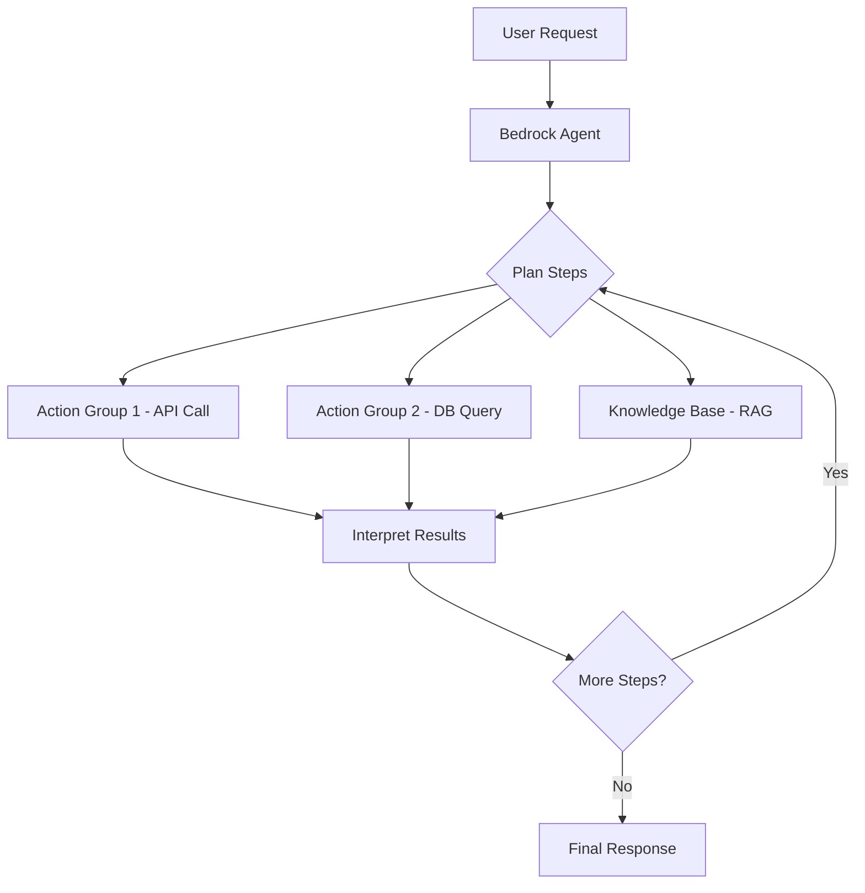

# How to Use Amazon Bedrock Agents for Task Automation

Author: [nawazdhandala](https://github.com/nawazdhandala)

Tags: AWS, Amazon Bedrock, AI Agents, Automation, Serverless

Description: Learn how to build and deploy Amazon Bedrock Agents that automate complex tasks by orchestrating foundation models with APIs, databases, and external services.

---

If you've been building with foundation models through Amazon Bedrock, you've probably noticed a gap between what a model can do in a single prompt and what you actually need it to do in production. Models are great at generating text, but real-world tasks usually require calling APIs, querying databases, and chaining multiple steps together. That's exactly where Bedrock Agents come in.

Amazon Bedrock Agents let you build autonomous AI agents that can plan and execute multi-step tasks. They connect foundation models with your company's data sources and APIs so the model can actually do things - not just talk about them. Let's walk through how to set this up from scratch.

## What Are Bedrock Agents?

A Bedrock Agent is essentially an orchestration layer on top of a foundation model. You define the agent's purpose, give it access to action groups (which are basically API endpoints), and optionally connect knowledge bases for RAG (retrieval-augmented generation). When a user sends a request, the agent figures out the right sequence of steps, calls the necessary APIs, and returns a coherent response.

The agent handles the reasoning loop internally. It decides when to call an action, interprets the result, and determines whether more steps are needed. You don't have to write the orchestration logic yourself.



## Setting Up Your First Agent

Before you start, make sure you have the AWS SDK configured and access to Bedrock enabled in your region. You'll need an IAM role with the right permissions too.

Here's how to create a basic agent using the AWS SDK for Python (boto3).

```python
import boto3
import json

# Initialize the Bedrock Agent client
bedrock_agent = boto3.client('bedrock-agent', region_name='us-east-1')

# Create the agent with a foundation model and instructions
response = bedrock_agent.create_agent(
    agentName='order-management-agent',
    foundationModel='anthropic.claude-3-sonnet-20240229-v1:0',
    instruction="""You are a helpful order management assistant.
    You can look up order status, process returns, and update
    shipping addresses. Always confirm actions before executing them.""",
    agentResourceRoleArn='arn:aws:iam::123456789012:role/BedrockAgentRole',
    idleSessionTTLInSeconds=1800
)

agent_id = response['agent']['agentId']
print(f"Agent created with ID: {agent_id}")
```

## Defining Action Groups

Action groups are what give your agent the ability to actually do things. Each action group maps to a set of API operations, and you define them using an OpenAPI schema. The agent reads this schema to understand what actions are available and what parameters they need.

Here's an example OpenAPI schema for an order management action group.

```json
{
  "openapi": "3.0.0",
  "info": {
    "title": "Order Management API",
    "version": "1.0.0"
  },
  "paths": {
    "/orders/{orderId}": {
      "get": {
        "summary": "Get order details and status",
        "operationId": "getOrderStatus",
        "parameters": [
          {
            "name": "orderId",
            "in": "path",
            "required": true,
            "schema": { "type": "string" }
          }
        ],
        "responses": {
          "200": {
            "description": "Order details retrieved successfully"
          }
        }
      }
    },
    "/orders/{orderId}/return": {
      "post": {
        "summary": "Initiate a return for an order",
        "operationId": "initiateReturn",
        "parameters": [
          {
            "name": "orderId",
            "in": "path",
            "required": true,
            "schema": { "type": "string" }
          }
        ],
        "requestBody": {
          "content": {
            "application/json": {
              "schema": {
                "type": "object",
                "properties": {
                  "reason": { "type": "string" }
                }
              }
            }
          }
        },
        "responses": {
          "200": {
            "description": "Return initiated successfully"
          }
        }
      }
    }
  }
}
```

Now attach this action group to your agent with a Lambda function that handles the actual API logic.

```python
# Create the action group and link it to a Lambda function
bedrock_agent.create_agent_action_group(
    agentId=agent_id,
    agentVersion='DRAFT',
    actionGroupName='OrderManagement',
    actionGroupExecutor={
        'lambda': 'arn:aws:lambda:us-east-1:123456789012:function:order-management'
    },
    apiSchema={
        's3': {
            's3BucketName': 'my-agent-schemas',
            's3ObjectKey': 'order-management-api.json'
        }
    },
    description='Actions for managing customer orders'
)
```

## The Lambda Function Behind the Action Group

Your Lambda function receives the agent's action request and returns the result. The function needs to parse the action name and parameters, then do the actual work.

```python
import json

def lambda_handler(event, context):
    # Extract the action and parameters from the agent's request
    action = event['actionGroup']
    api_path = event['apiPath']
    http_method = event['httpMethod']
    parameters = event.get('parameters', [])

    # Route to the right handler based on the API path
    if api_path == '/orders/{orderId}' and http_method == 'GET':
        order_id = next(p['value'] for p in parameters if p['name'] == 'orderId')
        result = get_order_status(order_id)
    elif api_path == '/orders/{orderId}/return' and http_method == 'POST':
        order_id = next(p['value'] for p in parameters if p['name'] == 'orderId')
        body = json.loads(event.get('requestBody', {}).get('content', '{}'))
        result = initiate_return(order_id, body.get('reason', ''))
    else:
        result = {'error': 'Unknown action'}

    # Return the response in the format Bedrock expects
    return {
        'messageVersion': '1.0',
        'response': {
            'actionGroup': action,
            'apiPath': api_path,
            'httpMethod': http_method,
            'httpStatusCode': 200,
            'responseBody': {
                'application/json': {
                    'body': json.dumps(result)
                }
            }
        }
    }

def get_order_status(order_id):
    # Your actual database query logic here
    return {'orderId': order_id, 'status': 'shipped', 'eta': '2026-02-15'}

def initiate_return(order_id, reason):
    # Your actual return processing logic here
    return {'orderId': order_id, 'returnId': 'RET-001', 'status': 'initiated'}
```

## Adding a Knowledge Base

If your agent needs to answer questions from documents - product manuals, FAQs, policy documents - you can attach a knowledge base. The agent will automatically decide when to search the knowledge base versus when to call an action group.

```python
# Associate an existing knowledge base with the agent
bedrock_agent.associate_agent_knowledge_base(
    agentId=agent_id,
    agentVersion='DRAFT',
    knowledgeBaseId='KB-12345',
    description='Product catalog and return policy documents',
    knowledgeBaseState='ENABLED'
)
```

## Preparing and Testing the Agent

Before you can invoke the agent, you need to prepare it. This step validates your configuration and creates an executable version.

```python
# Prepare the agent for use
bedrock_agent.prepare_agent(agentId=agent_id)

# Create an alias for stable invocation
alias_response = bedrock_agent.create_agent_alias(
    agentId=agent_id,
    agentAliasName='production'
)
alias_id = alias_response['agentAlias']['agentAliasId']
```

Now you can invoke the agent through the runtime client.

```python
# Use the runtime client to invoke the agent
bedrock_runtime = boto3.client('bedrock-agent-runtime', region_name='us-east-1')

response = bedrock_runtime.invoke_agent(
    agentId=agent_id,
    agentAliasId=alias_id,
    sessionId='user-session-123',
    inputText='What is the status of order ORD-456?'
)

# Stream the response
for event in response['completion']:
    if 'chunk' in event:
        print(event['chunk']['bytes'].decode('utf-8'), end='')
```

## Monitoring Your Agent

Once your agent is running in production, you'll want to keep an eye on its behavior. Bedrock provides traces that show you exactly what the agent decided at each step - which actions it called, what the reasoning was, and where things went wrong if they did. You can enable trace logging when invoking the agent by setting `enableTrace=True`.

For broader monitoring across your AWS services, having a solid observability stack makes a huge difference. Check out our post on [monitoring AWS infrastructure](https://oneuptime.com/blog/post/monitor-aws-infrastructure/view) for strategies that work well alongside Bedrock Agents.

## Tips for Production Use

There are a few things I've learned the hard way. First, keep your agent instructions specific. Vague instructions lead to unpredictable behavior. Tell the agent exactly what it should and shouldn't do.

Second, validate inputs in your Lambda functions. The agent might pass unexpected parameters, and you don't want that crashing your backend.

Third, set reasonable session timeouts. Long-running sessions consume resources, and most conversations don't need to stay active for hours.

Finally, test edge cases thoroughly. What happens when an API call fails? What if the user asks something completely outside the agent's scope? Build guardrails for these scenarios - and speaking of guardrails, you might want to look into [Amazon Bedrock Guardrails](https://oneuptime.com/blog/post/2026-02-12-amazon-bedrock-guardrails-safe-ai/view) for content filtering and safety controls.

Bedrock Agents are a solid way to bridge the gap between conversational AI and actual task execution. The setup takes some work, but once it's running, you've got an autonomous system that can handle real workflows without constant human intervention.
