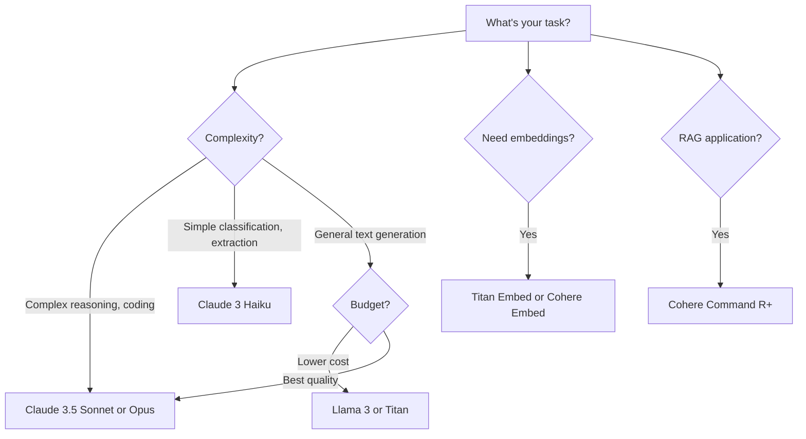

# How to Use Amazon Bedrock Foundation Models (Claude, Titan, Llama)

Author: [nawazdhandala](https://github.com/nawazdhandala)

Tags: AWS, Amazon Bedrock, Foundation Models, LLM, Generative AI

Description: Compare and use Amazon Bedrock's foundation models including Anthropic Claude, Amazon Titan, and Meta Llama for different generative AI use cases.

---

Amazon Bedrock gives you access to foundation models from multiple providers, and choosing the right one matters. Each model has different strengths, pricing, and ideal use cases. Claude excels at nuanced reasoning, Llama is great for open-ended generation, and Titan provides tight AWS integration at competitive pricing.

This guide compares the major foundation models on Bedrock and shows you how to use each one effectively.

## Available Model Families

Bedrock currently offers models from these providers:

| Provider | Models | Strengths |
|----------|--------|-----------|
| Anthropic | Claude 3.5 Sonnet, Claude 3 Haiku, Claude 3 Opus | Reasoning, analysis, coding, safety |
| Meta | Llama 3 8B, Llama 3 70B | Open-ended generation, multilingual |
| Amazon | Titan Text, Titan Embeddings, Titan Image | AWS integration, embeddings, cost |
| Cohere | Command R, Command R+, Embed | Search, RAG, enterprise text |
| Stability AI | Stable Diffusion | Image generation |
| Mistral | Mistral 7B, Mixtral 8x7B | Fast inference, multilingual |

## Anthropic Claude Models

Claude is widely considered one of the strongest reasoning models available. It's particularly good at complex analysis, coding tasks, and following nuanced instructions.

```python
import boto3
import json

bedrock_runtime = boto3.client('bedrock-runtime', region_name='us-east-1')

# Claude 3.5 Sonnet - Best balance of speed and intelligence
response = bedrock_runtime.converse(
    modelId='anthropic.claude-3-5-sonnet-20240620-v1:0',
    messages=[{
        'role': 'user',
        'content': [{
            'text': '''Analyze this Python function and suggest improvements:

def process_data(data):
    result = []
    for i in range(len(data)):
        if data[i] != None:
            result.append(data[i] * 2)
    return result'''
        }]
    }],
    inferenceConfig={
        'maxTokens': 1000,
        'temperature': 0.3  # Low temperature for analytical tasks
    }
)

print(response['output']['message']['content'][0]['text'])
```

Claude's model tiers serve different needs.

```python
# Claude 3 Haiku - Fastest and cheapest, great for simple tasks
response = bedrock_runtime.converse(
    modelId='anthropic.claude-3-haiku-20240307-v1:0',
    messages=[{
        'role': 'user',
        'content': [{'text': 'Classify this support ticket: "My account is locked and I need to reset my password"'}]
    }],
    inferenceConfig={'maxTokens': 100}
)

haiku_response = response['output']['message']['content'][0]['text']
haiku_usage = response['usage']
print(f"Haiku: {haiku_response}")
print(f"Tokens: {haiku_usage['inputTokens']}in, {haiku_usage['outputTokens']}out")

# Claude 3 Opus - Most capable, use for complex tasks
response = bedrock_runtime.converse(
    modelId='anthropic.claude-3-opus-20240229-v1:0',
    messages=[{
        'role': 'user',
        'content': [{'text': 'Design a microservices architecture for an e-commerce platform with high availability requirements. Include service boundaries, communication patterns, and data management strategy.'}]
    }],
    inferenceConfig={'maxTokens': 2000}
)

opus_response = response['output']['message']['content'][0]['text']
print(f"\nOpus: {opus_response[:500]}...")
```

**When to use Claude:**
- Complex reasoning and analysis
- Code generation and review
- Long document processing
- Tasks requiring careful instruction following

## Amazon Titan Models

Titan is Amazon's own model family. It offers competitive pricing and tight integration with other AWS services.

```python
# Titan Text Express - Good general-purpose model
response = bedrock_runtime.converse(
    modelId='amazon.titan-text-express-v1',
    messages=[{
        'role': 'user',
        'content': [{'text': 'Write a product description for a wireless noise-canceling headphone.'}]
    }],
    inferenceConfig={
        'maxTokens': 300,
        'temperature': 0.7
    }
)

print("Titan Text:", response['output']['message']['content'][0]['text'])
```

Titan Embeddings is particularly useful for search and RAG applications.

```python
# Titan Embeddings V2 - Great for search and similarity
response = bedrock_runtime.invoke_model(
    modelId='amazon.titan-embed-text-v2:0',
    contentType='application/json',
    body=json.dumps({
        'inputText': 'How to monitor Kubernetes clusters',
        'dimensions': 512,      # Choose embedding size
        'normalize': True       # Normalize the output vector
    })
)

result = json.loads(response['body'].read())
embedding = result['embedding']
print(f"Titan Embedding: {len(embedding)} dimensions")

# Titan also supports image embeddings
# Useful for multi-modal search
response = bedrock_runtime.invoke_model(
    modelId='amazon.titan-embed-image-v1',
    contentType='application/json',
    body=json.dumps({
        'inputText': 'A photo of a sunset over the ocean'
    })
)

image_embedding = json.loads(response['body'].read())['embedding']
print(f"Image embedding: {len(image_embedding)} dimensions")
```

**When to use Titan:**
- Cost-sensitive applications
- Embedding generation for search
- When you want native AWS integration
- Simple text generation tasks

## Meta Llama Models

Llama models are open-weight models from Meta. They're available on Bedrock with the same serverless experience as other models.

```python
# Llama 3 70B Instruct - Strong open model
response = bedrock_runtime.converse(
    modelId='meta.llama3-70b-instruct-v1:0',
    messages=[{
        'role': 'user',
        'content': [{'text': 'Explain the differences between SQL and NoSQL databases. When should I use each one?'}]
    }],
    inferenceConfig={
        'maxTokens': 500,
        'temperature': 0.6
    }
)

print("Llama 70B:", response['output']['message']['content'][0]['text'])

# Llama 3 8B Instruct - Lighter, faster version
response = bedrock_runtime.converse(
    modelId='meta.llama3-8b-instruct-v1:0',
    messages=[{
        'role': 'user',
        'content': [{'text': 'Summarize the key benefits of containerization in 3 bullet points.'}]
    }],
    inferenceConfig={
        'maxTokens': 200,
        'temperature': 0.5
    }
)

print("\nLlama 8B:", response['output']['message']['content'][0]['text'])
```

**When to use Llama:**
- Creative writing and open-ended generation
- Multilingual tasks
- When you want good performance at lower cost than premium models
- Tasks where you might eventually move to self-hosted

## Cohere Models

Cohere's models are optimized for enterprise search and RAG applications.

```python
# Cohere Command R+ - Optimized for RAG
response = bedrock_runtime.converse(
    modelId='cohere.command-r-plus-v1:0',
    messages=[{
        'role': 'user',
        'content': [{'text': 'Based on the following context, answer the question.\n\nContext: OneUptime is an open-source monitoring platform that provides uptime monitoring, incident management, and status pages. It supports multiple notification channels including email, SMS, and Slack.\n\nQuestion: What notification channels does OneUptime support?'}]
    }],
    inferenceConfig={
        'maxTokens': 200,
        'temperature': 0.3
    }
)

print("Cohere:", response['output']['message']['content'][0]['text'])

# Cohere Embed - High-quality embeddings for search
response = bedrock_runtime.invoke_model(
    modelId='cohere.embed-english-v3',
    contentType='application/json',
    body=json.dumps({
        'texts': [
            'How to set up monitoring alerts',
            'Configure Kubernetes probes',
            'Best Italian restaurants nearby'
        ],
        'input_type': 'search_document',
        'truncate': 'END'
    })
)

result = json.loads(response['body'].read())
print(f"Cohere embeddings: {len(result['embeddings'])} vectors of {len(result['embeddings'][0])} dims")
```

## Comparing Models Head-to-Head

Let's benchmark the models on the same task to see how they compare.

```python
import time

models = [
    ('anthropic.claude-3-5-sonnet-20240620-v1:0', 'Claude Sonnet'),
    ('meta.llama3-70b-instruct-v1:0', 'Llama 70B'),
    ('amazon.titan-text-express-v1', 'Titan Express'),
    ('anthropic.claude-3-haiku-20240307-v1:0', 'Claude Haiku'),
]

prompt = 'Write a concise explanation of how load balancers distribute traffic across servers.'

results = []
for model_id, model_name in models:
    try:
        start = time.time()
        response = bedrock_runtime.converse(
            modelId=model_id,
            messages=[{'role': 'user', 'content': [{'text': prompt}]}],
            inferenceConfig={'maxTokens': 300, 'temperature': 0.5}
        )
        elapsed = time.time() - start

        text = response['output']['message']['content'][0]['text']
        usage = response['usage']

        results.append({
            'model': model_name,
            'time': elapsed,
            'input_tokens': usage['inputTokens'],
            'output_tokens': usage['outputTokens'],
            'response_preview': text[:100]
        })

    except Exception as e:
        results.append({
            'model': model_name,
            'error': str(e)
        })

# Print comparison
print(f"{'Model':<20} {'Time':>8} {'In Tokens':>10} {'Out Tokens':>11}")
print('-' * 55)
for r in results:
    if 'error' not in r:
        print(f"{r['model']:<20} {r['time']:>7.2f}s {r['input_tokens']:>10} {r['output_tokens']:>11}")
    else:
        print(f"{r['model']:<20} ERROR: {r['error'][:30]}")
```

## Choosing the Right Model

Here's a practical decision framework:



## Cost Comparison

Pricing varies significantly across models. Here's a rough comparison per 1000 tokens.

```python
# Approximate Bedrock pricing (check AWS for current rates)
pricing = {
    'Claude 3.5 Sonnet': {'input': 0.003, 'output': 0.015},
    'Claude 3 Haiku': {'input': 0.00025, 'output': 0.00125},
    'Claude 3 Opus': {'input': 0.015, 'output': 0.075},
    'Llama 3 70B': {'input': 0.00265, 'output': 0.0035},
    'Llama 3 8B': {'input': 0.0003, 'output': 0.0006},
    'Titan Text Express': {'input': 0.0002, 'output': 0.0006},
}

# Estimate cost for 1M tokens in, 500K tokens out
for model, prices in pricing.items():
    input_cost = 1000 * prices['input']
    output_cost = 500 * prices['output']
    total = input_cost + output_cost
    print(f"{model:<25} ${total:.2f} per (1M in + 500K out)")
```

## Building a Model Router

For production applications, you might want to route requests to different models based on the task complexity. Use a fast, cheap model for simple tasks and a powerful model for complex ones.

```python
class BedrockModelRouter:
    """Route requests to the appropriate model based on task complexity."""

    def __init__(self, bedrock_client):
        self.client = bedrock_client
        self.models = {
            'simple': 'anthropic.claude-3-haiku-20240307-v1:0',
            'medium': 'anthropic.claude-3-5-sonnet-20240620-v1:0',
            'complex': 'anthropic.claude-3-opus-20240229-v1:0',
            'embedding': 'amazon.titan-embed-text-v2:0'
        }

    def classify_complexity(self, prompt):
        """Simple heuristic to classify task complexity."""
        word_count = len(prompt.split())

        # Simple classification keywords
        simple_keywords = ['classify', 'extract', 'summarize briefly', 'yes or no']
        complex_keywords = ['analyze', 'design', 'architect', 'compare and contrast', 'debug']

        prompt_lower = prompt.lower()

        if any(kw in prompt_lower for kw in simple_keywords) or word_count < 20:
            return 'simple'
        elif any(kw in prompt_lower for kw in complex_keywords) or word_count > 200:
            return 'complex'
        else:
            return 'medium'

    def invoke(self, prompt, **kwargs):
        complexity = self.classify_complexity(prompt)
        model_id = self.models[complexity]

        print(f"Routing to {model_id} (complexity: {complexity})")

        response = self.client.converse(
            modelId=model_id,
            messages=[{'role': 'user', 'content': [{'text': prompt}]}],
            inferenceConfig=kwargs.get('inferenceConfig', {'maxTokens': 500})
        )

        return response

# Usage
router = BedrockModelRouter(bedrock_runtime)

# This gets routed to Haiku (simple)
response = router.invoke("Classify this as positive or negative: 'Great product!'")

# This gets routed to Sonnet (medium)
response = router.invoke("Explain the pros and cons of using serverless architecture for a web application.")

# This gets routed to Opus (complex)
response = router.invoke("Design a complete CI/CD pipeline architecture for a microservices application...")
```

## Monitoring Model Usage

Track your Bedrock usage across models with CloudWatch and [OneUptime](https://oneuptime.com/blog/post/2026-02-13-aws-cloudwatch-alerting-best-practices/view) for full observability.

```python
import boto3

cloudwatch = boto3.client('cloudwatch')

# Check Bedrock invocation metrics
response = cloudwatch.get_metric_statistics(
    Namespace='AWS/Bedrock',
    MetricName='Invocations',
    Dimensions=[
        {'Name': 'ModelId', 'Value': 'anthropic.claude-3-5-sonnet-20240620-v1:0'}
    ],
    StartTime='2026-02-11T00:00:00Z',
    EndTime='2026-02-12T00:00:00Z',
    Period=3600,
    Statistics=['Sum']
)

for dp in sorted(response['Datapoints'], key=lambda x: x['Timestamp']):
    print(f"{dp['Timestamp'].strftime('%H:%M')}: {int(dp['Sum'])} invocations")
```

## Wrapping Up

Bedrock's multi-model approach gives you flexibility to pick the right tool for each job. Use Claude for complex reasoning, Titan for cost-effective embeddings, Llama for general generation, and Cohere for RAG-optimized workflows. The unified Converse API makes it easy to switch between models and even build routing logic that automatically picks the best model for each request. For deeper integration with your knowledge base, check out our guide on [Bedrock Knowledge Bases for RAG](https://oneuptime.com/blog/post/2026-02-12-amazon-bedrock-knowledge-bases-rag/view).
